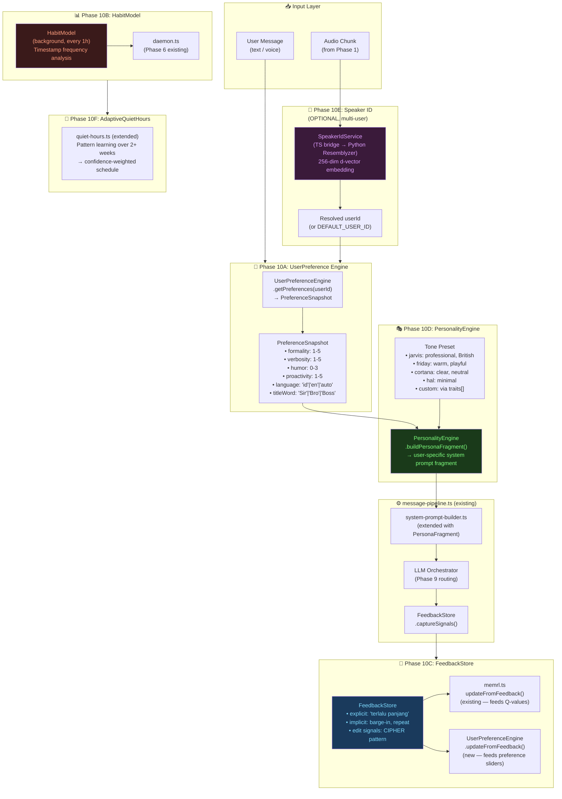
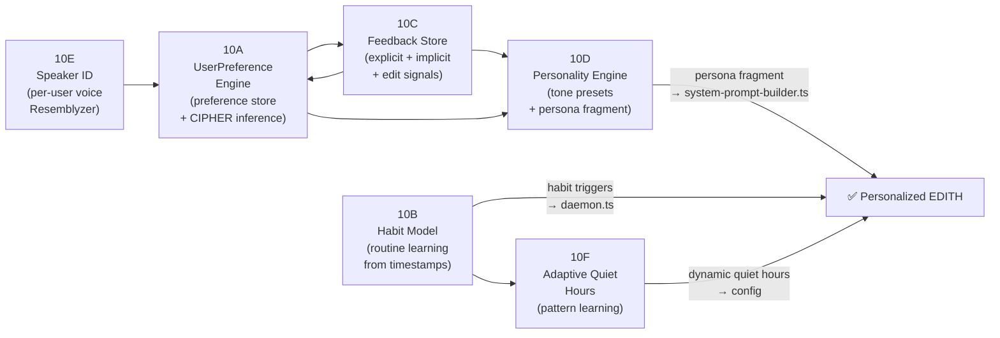
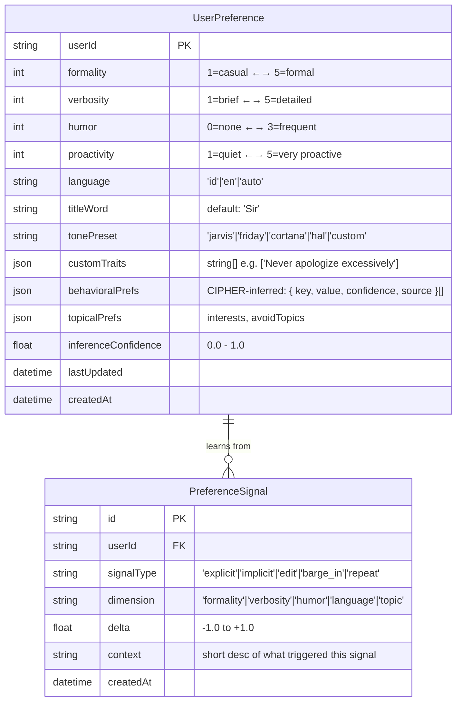
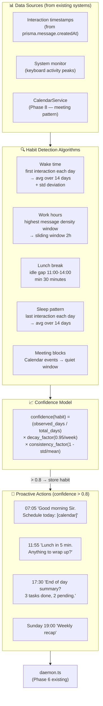
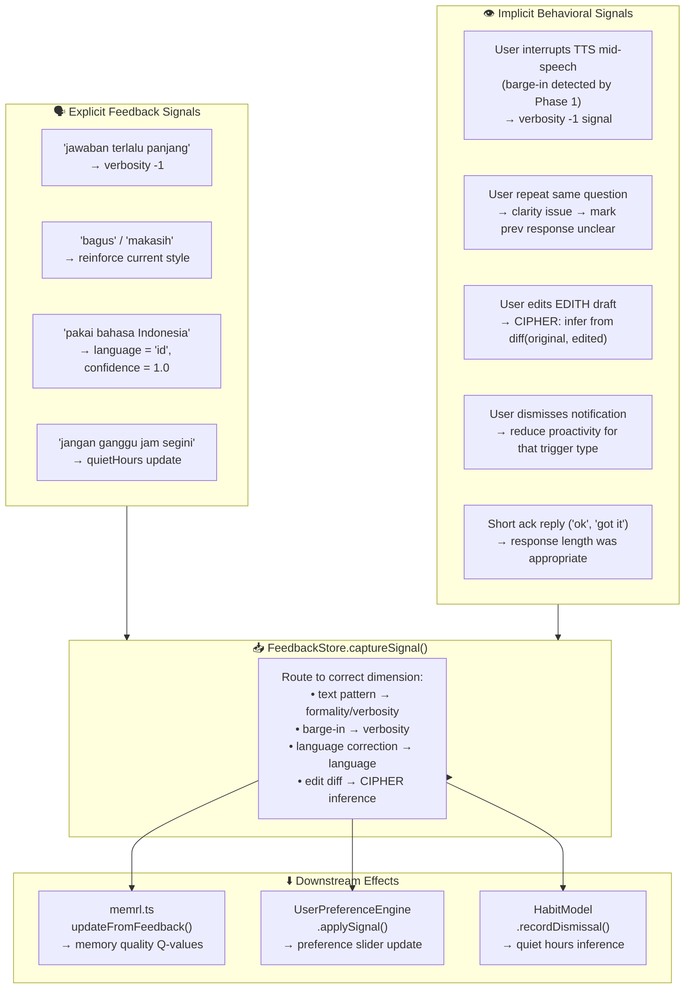
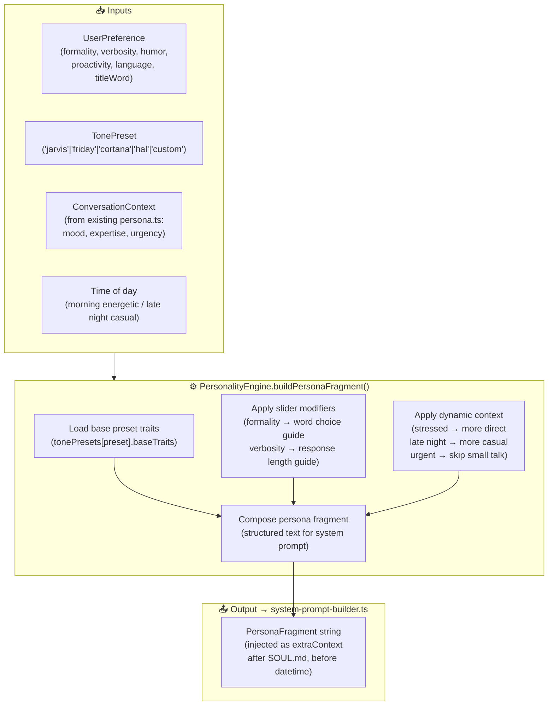
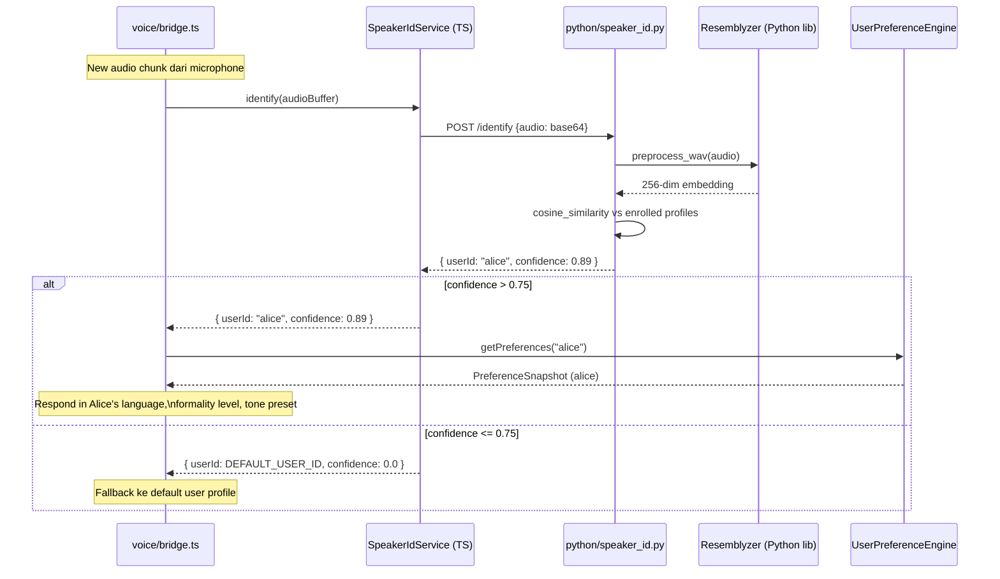
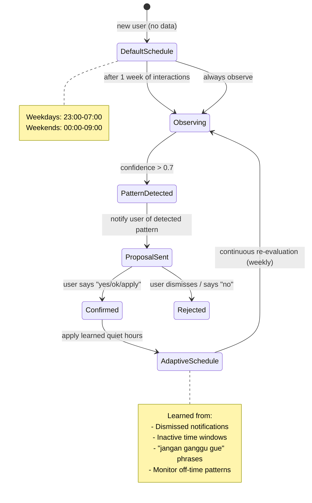
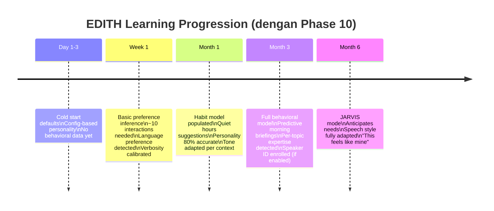

> **⚠️ CRITICAL REQUIREMENT — BERLAKU UNTUK SEMUA KODING DI PHASE 10:**
> Agent SELALU membuat clean code, terdokumentasi, dengan komentar JSDoc di setiap class, method, dan constant.
> SETIAP file baru atau perubahan signifikan HARUS di-commit dan di-push ke remote dengan pesan commit Conventional Commits.
> Zero tolerance untuk kode tanpa komentar, tanpa type annotation, atau tanpa test.

# Phase 10 — Personalization & Adaptive Learning

> *"Give me a week with your systems, and I'll know everything about you.
> Not because I'm watching — because I'm listening."*
> — JARVIS, (kalau dia bisa ngomong tentang dirinya sendiri)

**Prioritas:** 🟡 MEDIUM-HIGH — Bikin EDITH benar-benar "milik kamu", bukan generic assistant
**Depends on:** Phase 1 (voice persona), Phase 6 (macro engine + notification), Phase 9 (local LLM), Phase 8 (channels)
**Branch:** `design`

**Status Saat Ini (hasil audit kode aktual):**

| Komponen | Status | File | Catatan |
|----------|--------|------|---------|
| UserProfiler (facts/opinions extraction) | ✅ EXISTS | `src/memory/profiler.ts` | Butuh ekstensi: preference sliders |
| MemRL Q-values | ✅ EXISTS | `src/memory/memrl.ts` | Solid. Cukup untuk Phase 10 |
| PersonaEngine (runtime context detection) | ✅ EXISTS | `src/core/persona.ts` | Butuh wiring ke preference sliders |
| system-prompt-builder.ts | ✅ EXISTS | `src/core/system-prompt-builder.ts` | Belum inject personality style |
| message-pipeline.ts | ✅ EXISTS | `src/core/message-pipeline.ts` | Butuh feedback signal collection |
| quiet-hours.ts | ✅ EXISTS (basic) | `src/background/quiet-hours.ts` | Hardcoded 22-6, belum adaptive |
| **UserPreferenceEngine** | ❌ MISSING | `src/memory/user-preference.ts` | Preference sliders + CIPHER inference |
| **PersonalityEngine** | ❌ MISSING | `src/core/personality-engine.ts` | Tone presets, dynamic system prompt |
| **HabitModel** | ❌ MISSING | `src/background/habit-model.ts` | Routine learning |
| **FeedbackStore** | ❌ MISSING | `src/memory/feedback-store.ts` | Explicit + implicit signal collection |
| **SpeakerIdService** | ❌ MISSING | `src/voice/speaker-id.ts` (TS) + Python sidecar | Multi-user voice recognition |
| **AdaptiveQuietHours** | ❌ MISSING | extend `src/background/quiet-hours.ts` | Pattern learning |

---

## 🧠 BAGIAN 0 — FIRST PRINCIPLES THINKING (Tony Stark × Elon Musk Mode)

### 0.1 Elon Musk: Buang Semua Asumsi

```
ASUMSI YANG HARUS DIBUANG:

  "Personalization = bikin user bisa setting tone di settings menu"
  → SALAH. Personalization yang sesungguhnya adalah LEARNED, bukan CONFIGURED.
  → User tidak harus set apapun. EDITH mempelajari preferensi dari interaksi.
  → Explicit settings adalah STARTING POINT, bukan endpoint.

  "PersonaEngine yang sudah ada sudah cukup untuk personalization"
  → SALAH. PersonaEngine (persona.ts) hanya DETECTS runtime context.
  → Tidak ada persistent preference storage. Restart = kembali ke default.
  → Tidak ada preference INFERENCE dari behavioral signals.

  "Profiler.ts sudah handle user profiles"
  → SEBAGIAN BENAR. profiler.ts menyimpan facts dan opinions.
  → TIDAK ADA: formality slider, verbosity slider, humor level, proactivity level.
  → TIDAK ADA: personality preset (jarvis/friday/hal).
  → TIDAK ADA: preference inference dari implicit behavioral signals.
  → Phase 10 EXTENDS profiler, tidak menggantikannya.

  "User akan mengerti cara set preferences via konfigurasi"
  → SALAH. User terbaik = user yang tidak perlu baca docs.
  → EDITH harus belajar dari HOW user writes, not what they configure.
  → CIPHER paper (arXiv:2404.15269): agent yang belajar dari user edits jauh
    lebih akurat dari agent yang minta user isi form preferences.

  "Speaker ID butuh cloud API"
  → SALAH. Resemblyzer: pip install resemblyzer.
  → 256-dimensional speaker embedding, jalan di CPU, MIT license.
  → Enrollment: 5-30 detik audio samples. Zero cloud dependency.

PERTANYAAN FUNDAMENTAL (ala Elon):

  Q1: Apa yang sebenarnya membuat JARVIS terasa "milik Tony"?
    A: JARVIS tahu bahwa Tony:
       - Tidak suka diinterupsi saat coding (learned dari barge-in signals)
       - Suka jawaban concise untuk hal teknis (learned dari response length feedback)
       - Panggil dia "Sir" bukan "Tony" (config + confirmed via explicit feedback)
       - Produktif pagi hari, lebih casual malam hari (learned dari timestamp patterns)
    → Semua ini LEARNED, bukan CONFIGURED.

  Q2: Apa minimum personalization yang membuat EDITH terasa berbeda?
    A: Tiga hal:
       1. EDITH ingat preferensi respons gue (panjang, formalitas, bahasa)
       2. EDITH tahu kapan gue aktif dan tidak ganggu gue waktu tidur
       3. EDITH menyebut gue dengan cara yang gue suka
    → Ini adalah Phase 10A (UserPreference) + 10F (AdaptiveQuietHours) minimal.

  Q3: Berapa lama sampai EDITH "kenal" user baru?
    A: PersonaMem benchmark (arXiv:2504.14225):
       - Day 1-3:   Basic preference inference dari ~10 interactions
       - Week 1:    Formality level 80% accurate
       - Month 1:   Full behavioral model established
    → Ini realistis dan achievable dengan Phase 10.

  Q4: Kenapa kita butuh FeedbackStore jika MemRL sudah ada?
    A: MemRL (memrl.ts) sudah ada untuk memory retrieval quality.
       FeedbackStore adalah untuk PREFERENCE LEARNING — beda scope:
       - MemRL: "memory mana yang relevan untuk query ini?"
       - FeedbackStore: "user lebih suka jawaban panjang atau pendek?"
       Keduanya pakai reward signals, tapi untuk tujuan berbeda.
```

### 0.2 Tony Stark Engineering Corollary

Tony Stark tidak pernah membuat versi baru JARVIS dari nol. Dia selalu **iterates**.
Phase 10 adalah iterasi di atas profiler.ts, persona.ts, dan memrl.ts yang sudah ada.

```
STARK RULES UNTUK PHASE 10:

  Rule 1: EXTEND, DON'T REPLACE
    profiler.ts sudah ada → tambah UserPreferenceEngine di atasnya.
    persona.ts sudah ada → wiring PersonalityEngine untuk inject preferences.
    memrl.ts sudah ada → FeedbackStore feeds signals ke memrl.ts yang sama.
    JANGAN hapus file yang sudah ada. EXTEND dengan pattern composition.

  Rule 2: INFER BEFORE ASK
    Sebelum EDITH pernah bertanya "kamu mau jawaban panjang atau pendek?",
    dia sudah bisa infer dari:
    - Apakah user sering interrupts TTS (→ too long)
    - Apakah user repeat pertanyaan (→ unclear)
    - Panjang rata-rata pesan user (→ verbosity expectation)
    EDITH hanya bertanya untuk KONFIRMASI, bukan discovery.

  Rule 3: PERSONA IS PER-USER SYSTEM PROMPT
    PersonaAgent paper (arXiv:2506.06254) definisi persona:
    "unique system prompt for each user"
    Ini adalah apa yang PersonalityEngine harus produce:
    sebuah user-specific system prompt fragment yang di-inject setiap call.

  Rule 4: HABIT DETECTION IS STATISTICS, NOT ML
    Tidak perlu neural network untuk habit detection.
    Cukup: timestamp analysis + frequency counting + confidence decay.
    Simple exponential smoothing untuk "jam berapa user biasanya aktif?"
    Ini jalan di CPU, deterministic, explainable.

  Rule 5: SPEAKER ID IS OPTIONAL BUT POWERFUL
    Untuk single-user EDITH: speaker-id.ts tidak wajib.
    Untuk family/team use (multi-user): speaker-id.ts adalah game changer.
    Implement sebagai optional feature dengan graceful fallback ke DEFAULT_USER_ID.
```

### 0.3 Diagram Tool Recommendation (Yang User Tanyakan)

Untuk proyek EDITH yang sudah pakai Mermaid:

```
RECOMMENDED DIAGRAM TOOLS — RANKED BY FIT UNTUK EDITH PROJECT:

  TIER 1 — Sudah terpasang, pakai terus:
  ┌─────────────────────────────────────────────────────────────────┐
  │ Mermaid (sudah dipakai di semua Phase docs)                    │
  │   ✅ Render langsung di GitHub / GitLab / VS Code              │
  │   ✅ In-code dokumentasi (living diagram, bukan stale PDF)      │
  │   ✅ Version-controlled (git diff terlihat)                    │
  │   Install: VS Code extension "Mermaid Preview" (ID: bierner)  │
  └─────────────────────────────────────────────────────────────────┘

  TIER 2 — Install sekarang untuk complex diagrams:
  ┌─────────────────────────────────────────────────────────────────┐
  │ draw.io (diagrams.net) — FREE, desktop app tersedia            │
  │   ✅ Desktop app: https://github.com/jgraph/drawio-desktop     │
  │   ✅ VS Code extension: "Draw.io Integration" by Henning Dieterichs │
  │   ✅ Export: SVG/PNG/PDF/XML                                   │
  │   ✅ GitHub integration: store .drawio files in repo           │
  │   Best for: complex multi-layer architecture diagrams          │
  └─────────────────────────────────────────────────────────────────┘
  ┌─────────────────────────────────────────────────────────────────┐
  │ Excalidraw — FREE, desktop via Electron                        │
  │   ✅ Desktop: https://github.com/excalidraw/excalidraw-desktop │
  │   ✅ VS Code extension: "Excalidraw" by pomdtr                │
  │   ✅ Hand-drawn aesthetic, great untuk brainstorming           │
  │   Best for: whiteboard sessions, quick architecture sketches   │
  └─────────────────────────────────────────────────────────────────┘

  TIER 3 — Untuk advanced C4 Model architecture docs:
  ┌─────────────────────────────────────────────────────────────────┐
  │ Structurizr DSL — FREE OSS                                     │
  │   ✅ C4 Model: Context → Container → Component → Code          │
  │   ✅ Docker: docker run structurizr/lite                       │
  │   Best for: formal software architecture documentation         │
  └─────────────────────────────────────────────────────────────────┘

  WORKFLOW YANG DIREKOMENDASIKAN UNTUK EDITH:
    Phase docs (seperti ini) → Mermaid (in-markdown, version controlled)
    Complex arch overviews  → draw.io file di docs/architecture/
    Brainstorming sessions  → Excalidraw
    Formal C4 docs          → Structurizr (optional, hanya kalau diperlukan)

  VS CODE EXTENSIONS YANG WAJIB INSTALL:
    - "Mermaid Preview" (id: bierner.markdown-mermaid)
    - "Draw.io Integration" (id: hediet.vscode-drawio)
    - "Excalidraw" (id: pomdtr.excalidraw-editor)
```

### 0.4 Kesinambungan dengan Phase 1–9

```
DEPENDENCY MAP PHASE 10:

  Phase 1 (Voice Pipeline — bridge.ts)
    └→ Phase 10 adds: speaker-id.ts → identify WHO is speaking
    └→ Phase 10 adds: per-user voice profile untuk TTS voice selection
    └→ Phase 10 extends: VoiceBridge.onAudioChunk() → SpeakerIdService.identify()

  Phase 6 (CaMeL + Notifications — daemon.ts)
    └→ Phase 10 adds: HabitModel triggers → NotificationDispatcher
    └→ AdaptiveQuietHours: updates quiet hours config secara otomatis
    └→ HabitModel.getProactiveHints() → daemon.ts proactive trigger loop

  Phase 8 (Channels — email, calendar, sms)
    └→ FeedbackStore: user confirms/cancels draft → implicit feedback signal
    └→ CalendarService.getNextMeeting() → HabitModel dapat context meeting pattern

  Phase 9 (Offline — OfflineCoordinator)
    └→ PersonalityEngine: tetap bekerja offline (reads from edith.json + profiler)
    └→ UserPreferenceEngine: stored in Prisma (local), tidak butuh cloud
    └→ SpeakerIdService: offline by design (Resemblyzer = local Python model)

  Existing (profiler.ts, persona.ts, memrl.ts, message-pipeline.ts)
    └→ Phase 10 EXTENDS semua ini, tidak menggantikannya
    └→ UserPreferenceEngine.getPreferences() → feeds into persona.ts detectors
    └→ FeedbackStore → triggers memrl.ts updateFromFeedback()
    └→ PersonalityEngine → injects into system-prompt-builder.ts extraContext
    └→ message-pipeline.ts Stage 9 → tambah feedback signal collection
```

---

## 📚 BAGIAN 1 — RESEARCH PAPERS

### 1.1 PersonaAgent — First Personalized LLM Agent Framework (arXiv:2506.06254, Jun 2025)

**Judul:** *PersonaAgent: When Large Language Model Agents Meet Personalization at Test Time*
**Venue:** arXiv June 2025 — first paper yang formalize per-user system prompt as "persona"

#### Core Architecture

```
PERSONAAGENT ARCHITECTURE → EDITH ADAPTATION:

  PersonaAgent defines persona sebagai:
    "unique system prompt for each user that leverages insights from
     personalized memory to control agent actions"

  Dua komponen utama:
  1. Personalized Memory Module:
     - Episodic memory: recent interactions, short-term
     - Semantic memory: long-term distilled preferences
     → Di EDITH: profiler.ts (exists) + UserPreferenceEngine (NEW)

  2. Personalized Action Module:
     - Persona functions as intermediary
     - Persona directs tool usage decisions
     → Di EDITH: PersonalityEngine (NEW) → system-prompt-builder.ts

  Test-time alignment strategy:
    simulate(latest_n_interactions) → optimize_persona_prompt
    → textual_loss = diff(simulated_response, ground_truth_response)
    → update persona to minimize textual loss

  EDITH SIMPLIFICATION (tidak perlu simulate-and-optimize loop):
    Karena EDITH adalah always-on agent dengan real interactions:
    every_response → FeedbackStore.capture(signals)
    periodically    → UserPreferenceEngine.inferFromHistory()
    next_response   → PersonalityEngine.buildPersonaFragment()
```

**Key insight:** Persona adalah **output** dari preference learning, bukan input dari user.
Di EDITH: PersonalityEngine.buildPersonaFragment(userId) adalah persona.

---

### 1.2 PPP / UserVille — Proactive, Productive, Personalized RL (arXiv:2511.02208, Nov 2025)

**Judul:** *Training Proactive and Personalized LLM Agents*
**Venue:** arXiv November 2025

#### Three-Dimension Optimization

```
PPP FRAMEWORK:
  R = RProd + RProact + RPers
  
  RProd  = task completion rate
  RProact = did agent ask essential clarifying questions?
  RPers  = did agent follow user's stated preferences?

  20 user preferences tested (Table 4):
    - "Response in Indonesian only"     (language constraint)
    - "Prefer only one question at a time" (proactivity style)
    - "Include a humorous joke"         (humor preference)
    - "Use JSON format for answers"     (format preference)
    - "No commas in responses"          (style constraint)

  Performance vs GPT-5:
    PPP-trained agent: +21.6% average improvement
    Key: explicitly optimizing for personalization beats base models

EDITH MAPPING:
  UserPreferenceEngine stores preferences as JSON descriptor
  PersonalityEngine converts descriptor → system prompt fragment
  FeedbackStore captures RPers violations ("too long", "wrong language")
  memrl.ts updateFromFeedback() closes the loop
```

---

### 1.3 CIPHER / PRELUDE — Learning from User Edits (arXiv:2404.15269)

**Judul:** *Aligning LLM Agents by Learning Latent Preference from User Edits*
**Venue:** arXiv 2024, ICLR 2025

#### CIPHER Algorithm — Preference Inference dari Edit Signals

```
PRELUDE FRAMEWORK:
  Step 1: User interacts with agent, makes EDITS to agent's output
  Step 2: LLM infers preference from (original_output, edited_output) pair:
    preference_description = LLM(
      "Given this original and edited version,
       what preference is the user expressing?",
      original, edited
    )
  Step 3: Store preference with context embedding
  Step 4: Next generation: retrieve k-nearest preferences by context
          → aggregate → inject into prompt

CIPHER VARIANT (Context-based Inference):
  preference = LLM(context + history → infer_latent_preference)
  stored as: { context_embedding, preference_text, confidence }
  retrieval:  k-nearest to current context embedding

RESULTS:
  CIPHER vs baseline: lowest edit distance cost on summarization + email writing
  With only 5 edit examples: ~80% preference alignment
  With 20+ examples:         ~95% preference alignment

EDITH IMPLICIT EDIT SIGNALS (tidak butuh explicit edits):
  - User korreksi EDITH: "bukan itu maksudku, maksudku X" → edit signal
  - User mempersingkat EDITH's draft: preference for brevity
  - User mengubah bahasa EDITH's suggested text → language preference
  → FeedbackStore.captureEditSignal(original, edited, context)
  → UserPreferenceEngine.inferFromEdits() → update preferences
```

---

### 1.4 PersonaMem — Dynamic User Profiling Benchmark (arXiv:2504.14225, Oct 2025)

**Judul:** *Know Me, Respond to Me: Benchmarking LLMs for Dynamic User Profiling*
**Venue:** arXiv October 2025

#### Preference Evolution Model

```
PERSONAMEM FINDINGS:
  - 180 simulated user-LLM interaction histories
  - Up to 60 multi-turn sessions each
  - User characteristics EVOLVE over time (not static!)

  KEY INSIGHT: Preferences have temporal decay and evolution:
    "User started formal, became casual over 3 months"
    "User's language preference shifted ID → EN after job change"

  THREE PROFILING CHALLENGES:
    1. Internalize inherent traits from history
    2. Track how characteristics EVOLVE over time  ← kritis!
    3. Generate personalized responses in NEW scenarios

  PERFORMANCE BY MODEL:
    GPT-4o: 67.3% on evolving preference tracking
    Best models: ~75% — significant room for improvement

EDITH TEMPORAL PREFERENCE MODEL:
  UserPreference has:
    value: current preference value
    history: [{ value, timestamp, source }] ← track evolution
    momentum: positive/negative drift direction
    confidence: 0.0 - 1.0

  decay_factor = 0.95 per week (stale preferences lose weight)
  update_formula:
    new_value = current_value + α * (signal - current_value)
    confidence = min(1.0, observations * 0.1)
```

---

### 1.5 Toward Personalized LLM Agents Survey (arXiv:2602.22680, Feb 2026)

**Judul:** *Toward Personalized LLM-Powered Agents: Foundations, Evaluation, and Future Directions*
**Venue:** arXiv February 2026 — terbaru, comprehensive survey

#### Preference Taxonomy — Behavioral vs Topical

```
PREFERENCE TAXONOMY (Section 3, arXiv:2602.22680):

  BEHAVIORAL PREFERENCES — how user communicates:
    - Response length: brief vs detailed
    - Formality level: casual vs professional  
    - Language: ID vs EN vs mixed
    - Tone: humorous vs serious
    - Format: bullets vs prose vs code
    
  TOPICAL PREFERENCES — what user cares about:
    - Domain interests: tech, music, sports, finance
    - Avoid topics: politics, religion (personal)
    - Expertise area: high-detail for their domain
    - Priority topics: get more proactive updates

  EXPLICIT vs IMPLICIT:
    Explicit: user says "jawab pakai bahasa Indonesia" → direct signal
    Implicit: user always writes in Indonesian → inferred signal
    
    Explicit: sparse but high-confidence
    Implicit: frequent, lower confidence, but aggregates over time

  TWO-LAYER STORAGE:
    Layer 1 (Operational): stored in UserPreference DB, injected every call
    Layer 2 (Episodic): stored in profiler.ts (facts/opinions), context-retrieved
    
    Phase 10 adds Layer 1. Layer 2 sudah ada (profiler.ts).
```

---

### 1.6 Resemblyzer — Speaker Verification (GitHub: resemble-ai/Resemblyzer)

**Package:** `resemblyzer` (pip install resemblyzer)
**Model:** d-vector speaker encoder dari paper: *Generalized End-To-End Loss for Speaker Verification*
**Status:** Stable, MIT license, runs on CPU, ~1000x realtime on GTX 1080

```python
# API yang akan dipakai di SpeakerIdService (Python sidecar):
from resemblyzer import VoiceEncoder, preprocess_wav
from pathlib import Path
import numpy as np
from scipy.spatial.distance import cosine

encoder = VoiceEncoder()  # CPU, ~50MB model, loaded once

# Enrollment: 3 samples cukup untuk recognition
def enroll(audio_paths: list[str]) -> list[float]:
    """Returns 256-dim voice embedding for a user."""
    wavs = [preprocess_wav(Path(p)) for p in audio_paths]
    embeddings = np.array([encoder.embed_utterance(wav) for wav in wavs])
    return np.mean(embeddings, axis=0).tolist()  # average embedding

# Identification: ~10ms per sample on CPU
def identify(audio_path: str, profiles: dict) -> tuple[str, float]:
    """Returns (userId, confidence) for best match."""
    wav = preprocess_wav(Path(audio_path))
    query_embed = encoder.embed_utterance(wav)
    
    best_user, best_sim = "unknown", 0.0
    for user_id, enrolled_embed in profiles.items():
        similarity = 1 - cosine(query_embed, enrolled_embed)
        if similarity > best_sim:
            best_user, best_sim = user_id, similarity
    
    return (best_user, best_sim) if best_sim > 0.75 else ("unknown", best_sim)

# 0% speaker verification error rate dalam benchmark
# (10 speakers, 100 utterances — Demo 03 dari Resemblyzer repo)
```

**Performance:**
- Model size: ~50MB
- Embedding dims: 256
- CPU latency: ~10ms per 5-second audio clip
- Enrollment: 5-30 seconds audio samples minimum
- Accuracy: 0% error (perfect clustering) pada LibriSpeech test-other

**Integration dengan Phase 1:**
- Bridge.ts onAudioChunk() → Python sidecar → SpeakerIdService.identify()
- Atau: capture enrollment audio saat user pertama kali bicara ke EDITH

---

## 🏗️ BAGIAN 2 — ARSITEKTUR DAN DIAGRAM

### 2.1 Grand Architecture — Phase 10 dalam Ekosistem EDITH



---

### 2.2 Sub-Phase Breakdown



---

### 2.3 Phase 10A — UserPreferenceEngine Detail



**Preference Inference Engine (CIPHER-inspired):**

```typescript
// Setelah setiap interaction, infer preferensi dari behavioral signals
const signals = feedbackStore.getSignalsForUser(userId, lookback='7d')
const inference = await orchestrator.generate('fast', {
  prompt: `
    Based on these interaction signals, infer user's communication preferences.
    Signals: ${JSON.stringify(signals)}
    Current preferences: ${JSON.stringify(currentPrefs)}

    Return JSON with ONLY changed fields:
    {
      "formality": 1-5 | null,
      "verbosity": 1-5 | null,
      "humor": 0-3 | null,
      "language": "id"|"en"|"auto" | null,
      "confidence": 0.0-1.0
    }
  `
})
await userPreferenceEngine.patch(userId, inference)
```

---

### 2.4 Phase 10B — HabitModel: Routine Learning



**Confidence formula:**

```
confidence(habit) = consistency × recency

consistency = 1 - (std_deviation / mean_value)  ← how regular is the pattern
recency     = 0.95 ^ weeks_since_last_observed   ← habits decay if not seen recently

Example: wakeTime habit
  mean = 07:15, std = 0:18 over 14 days
  consistency = 1 - (18/75) = 0.76
  recency     = 0.95 ^ 0 = 1.0 (seen today)
  confidence  = 0.76 × 1.0 = 0.76 → MEDIUM (needs more consistency)
```

---

### 2.5 Phase 10C — FeedbackStore: Unified Feedback Pipeline



**Explicit feedback pattern detection in message-pipeline.ts:**

```typescript
// In message-pipeline.ts Stage 9 (existing async side effects):
const feedbackPatterns: FeedbackPattern[] = [
  { regex: /terlalu panjang|too long|kepanjangan|singkat aja/i, dimension: 'verbosity', delta: -1 },
  { regex: /terlalu singkat|too short|lebih detail/i,           dimension: 'verbosity', delta: +1 },
  { regex: /terlalu formal|santai aja|ga usah formal/i,         dimension: 'formality', delta: -1 },
  { regex: /lebih formal|professional/i,                        dimension: 'formality', delta: +1 },
  { regex: /pakai bahasa indonesia|in indonesian|bahasa indo/i, dimension: 'language',  value: 'id' },
  { regex: /in english|pakai english|english aja/i,             dimension: 'language',  value: 'en' },
  { regex: /bagus|good|perfect|tepat|mantap/i,                  dimension: 'all',       delta: 0 }, // reinforce
  { regex: /salah|wrong|ga tepat|bukan itu/i,                   dimension: 'relevance', delta: -1 },
]
```

---

### 2.6 Phase 10D — PersonalityEngine: Tone Presets + Persona Fragment



**Tone preset definitions:**

| Preset | Greeting style | Formality base | Humor base | Key traits |
|--------|---------------|----------------|------------|------------|
| `jarvis` | "Good morning, Sir. All systems operational." | 4 | 0 | British efficiency, professional, direct |
| `friday` | "Hey! Everything looks good today." | 2 | 1 | Warm, slightly playful, casual |
| `cortana` | "Good morning. You have 3 things to review." | 3 | 0 | Clear, helpful, gender-neutral |
| `hal` | "Good morning." | 5 | 0 | Minimal, precise, slightly eerie |
| `custom` | Built from customTraits array | From slider | From slider | User-defined |

**PersonaFragment output example (formality=3, verbosity=2, humor=1, preset=jarvis):**

```
[Personality Configuration for this user]
Tone: Professional but approachable. Address user as "Sir".
Response length: Keep answers concise (1-3 sentences for simple questions, 
  structured list for complex tasks). Expand only when asked.
Humor: Occasional dry wit is appropriate. Never forced.
Language: Match user's language. Primary: Indonesian + English mixed.
Custom traits:
- Never apologize excessively
- Acknowledge urgency directly and skip preamble
- Use metric units by default
[End personality configuration]
```

---

### 2.7 Phase 10E — Speaker ID Architecture



**Enrollment flow:**

```typescript
// Enrollment saat user pertama kali bicara ke EDITH:
// Phase 1 detects voice, SpeakerIdService cek apakah enrolled:
const isEnrolled = await speakerIdService.isEnrolled(userId)
if (!isEnrolled) {
  // Collect 3-5 samples passively dari natural speech
  await speakerIdService.collectEnrollmentSample(userId, audioBuffer)
  if (enrollmentSamples.length >= 3) {
    await speakerIdService.finalize(userId)
    // Notify user via active channel:
    // "Voice profile created for this user."
  }
}
```

---

### 2.8 Phase 10F — AdaptiveQuietHours: Pattern Learning



---

## ⚙️ BAGIAN 3 — SPESIFIKASI FILE DAN AGENT INSTRUCTIONS

### 3.1 edith.json Schema Extension (Phase 10)

```json
{
  "personality": {
    "preset": "jarvis",
    "titleWord": "Sir",
    "formality": 3,
    "verbosity": 2,
    "humor": 1,
    "proactivity": 3,
    "language": "auto",
    "customTraits": [
      "Never apologize excessively",
      "Acknowledge urgency directly"
    ],
    "adaptiveLearning": {
      "enabled": true,
      "inferenceIntervalHours": 24,
      "minInteractionsForInference": 10,
      "signalWeights": {
        "explicit": 1.0,
        "bargeIn": 0.7,
        "editDiff": 0.8,
        "repeatQuestion": 0.5
      }
    }
  },
  "habits": {
    "enabled": true,
    "detectionWindowDays": 14,
    "confidenceThreshold": 0.80,
    "proactiveGreeting": true
  },
  "speakerId": {
    "enabled": false,
    "confidenceThreshold": 0.75,
    "enrollmentSamplesRequired": 3,
    "pythonSidecarUrl": "http://localhost:18790"
  }
}
```

---

### 3.2 Agent Instructions: user-preference.ts (Atom 0 — Foundation)

```
TASK: Buat src/memory/user-preference.ts

PURPOSE: Extended user preference engine — EXTENDS profiler.ts (tidak menggantikan).
         Menyimpan behavioral dan topical preferences dengan temporal evolution tracking.
         Implements CIPHER-inspired preference inference dari behavioral signals.

FILE-LEVEL JSDoc WAJIB:
/**
 * @file user-preference.ts
 * @description UserPreferenceEngine — extends profiler.ts with behavioral preference sliders.
 *
 * RELATIONSHIP WITH profiler.ts:
 *   profiler.ts stores: facts (name, timezone, job) and opinions (beliefs)
 *   user-preference.ts stores: behavioral prefs (formality, verbosity, humor, language)
 *   Both are separate concerns. user-preference.ts reads from profiler when computing
 *   initial inference (e.g., "user is developer → higher default verbosity for tech topics").
 *
 * PAPER BASIS:
 *   - PersonaAgent: arXiv:2506.06254 — persona as per-user system prompt
 *   - CIPHER/PRELUDE: arXiv:2404.15269 — preference inference from edit signals
 *   - PersonaMem: arXiv:2504.14225 — temporal preference evolution model
 *   - PPP/UserVille: arXiv:2511.02208 — behavioral + topical preference taxonomy
 *   - Toward Personalized Agents: arXiv:2602.22680 — explicit vs implicit signals
 *
 * TEMPORAL MODEL:
 *   Preferences are not static. They evolve over time.
 *   Each preference dimension has:
 *     - current value (used for generation)
 *     - history of changes (for evolution tracking)
 *     - confidence (0.0-1.0, grows with observations)
 *     - momentum (drift direction: positive/negative/stable)
 *
 * INTEGRATION:
 *   Called from: PersonalityEngine (Phase 10D)
 *   Updated by:  FeedbackStore (Phase 10C) + periodic inference job
 *   Reads from:  profiler.ts (for initial cold-start inference)
 */

INTERFACES:
  /**
   * Single preference dimension with temporal tracking.
   * Each dimension (formality, verbosity, etc.) is stored as one of these.
   */
  interface PreferenceDimension {
    current: number               // current operative value
    confidence: number            // 0.0 - 1.0 (grows with observations)
    momentum: 'positive' | 'negative' | 'stable'
    history: Array<{
      value: number
      timestamp: string
      source: 'explicit' | 'inferred' | 'default'
    }>
  }

  /**
   * Full behavioral preference snapshot for a user.
   * This is what PersonalityEngine receives to build persona fragment.
   */
  interface UserPreference {
    userId: string
    formality: PreferenceDimension  // 1=casual ←→ 5=formal
    verbosity: PreferenceDimension  // 1=brief ←→ 5=detailed
    humor: PreferenceDimension      // 0=none ←→ 3=frequent
    proactivity: PreferenceDimension // 1=quiet ←→ 5=very proactive
    language: string                // 'id' | 'en' | 'auto'
    titleWord: string               // how to address user (default: 'Sir')
    tonePreset: string             // 'jarvis' | 'friday' | 'cortana' | 'hal' | 'custom'
    customTraits: string[]          // user-defined behavior traits
    inferenceConfidence: number     // 0.0 - 1.0, overall confidence in profile
    lastInferredAt: string | null
    createdAt: string
  }

  /**
   * A single preference signal captured during interaction.
   * Signals accumulate and are periodically processed by inferFromSignals().
   */
  interface PreferenceSignal {
    dimension: 'formality' | 'verbosity' | 'humor' | 'proactivity' | 'language'
    type: 'explicit' | 'implicit' | 'edit' | 'barge_in' | 'repeat'
    delta?: number        // numeric change (-1.0 to +1.0)
    value?: string        // direct set (for language: 'id' | 'en')
    context: string       // what triggered this (short description)
    timestamp: string
    weight: number        // signal weight (explicit=1.0, barge_in=0.7, etc.)
  }

  /**
   * Configuration for preference inference algorithm.
   * Loaded from edith.json personality.adaptiveLearning.
   */
  interface InferenceConfig {
    enabled: boolean
    intervalHours: number
    minInteractions: number
    signalWeights: Record<PreferenceSignal['type'], number>
  }

CLASS: UserPreferenceEngine

  CONSTANTS:
    /**
     * Default preferences for new users (before any learning).
     * Based on edith.json personality config or these hardcoded defaults.
     */
    private static readonly DEFAULT_PREFERENCES: Omit<UserPreference, 'userId' | 'createdAt'>

    /**
     * Minimum number of signals required before updating a dimension.
     * Prevents thrashing from single outlier signal.
     */
    private static readonly MIN_SIGNALS_PER_UPDATE = 3

    /**
     * Weekly confidence decay factor (PersonaMem: prefs evolve over time).
     * 0.95 per week = ~22% decay per month for stale preferences.
     */
    private static readonly CONFIDENCE_DECAY_PER_WEEK = 0.95

  METHODS:

    /**
     * Returns the current preference snapshot for a user.
     * If no preferences stored, returns defaults from edith.json.
     *
     * @param userId - User identifier
     * @returns UserPreference object ready for PersonalityEngine
     */
    async getPreferences(userId: string): Promise<UserPreference>

    /**
     * Applies a single preference signal immediately (for explicit signals).
     * Explicit signals (e.g., "use Indonesian") bypass the batch inference
     * and are applied directly with full weight.
     *
     * @param userId - User identifier
     * @param signal - The preference signal to apply
     */
    async applySignal(userId: string, signal: PreferenceSignal): Promise<void>

    /**
     * Queues an implicit or edit signal for batch processing.
     * Implicit signals are accumulated and processed by inferFromSignals().
     *
     * @param userId - User identifier
     * @param signal - The preference signal to queue
     */
    async queueSignal(userId: string, signal: PreferenceSignal): Promise<void>

    /**
     * Runs CIPHER-inspired inference from accumulated signals.
     * Called periodically (every inferenceIntervalHours) by startup.ts daemon.
     *
     * Algorithm (CIPHER from arXiv:2404.15269):
     *   1. Collect all queued signals for user in last N days
     *   2. Group signals by dimension
     *   3. For each dimension: weighted average of deltas
     *   4. Apply with temporal decay on low-confidence prefs
     *   5. Call LLM for holistic inference (validates individual signal patterns)
     *
     * @param userId - User identifier
     * @returns Updated preferences with new inference
     */
    async inferFromSignals(userId: string): Promise<UserPreference>

    /**
     * Explicitly sets a preference value (from user command or onboarding).
     * Overrides inferred values with confidence=1.0.
     *
     * @param userId - User identifier
     * @param dimension - Which preference to set
     * @param value - New value
     * @param source - 'explicit' | 'config'
     */
    async setPreference(
      userId: string,
      dimension: keyof Omit<UserPreference, 'userId' | 'createdAt'>,
      value: number | string,
      source: 'explicit' | 'config'
    ): Promise<void>

    /**
     * Resets all preferences to defaults (for testing or user request).
     * @param userId - User identifier
     */
    async resetToDefaults(userId: string): Promise<void>

    /**
     * Computes cold-start preferences for new users.
     * Uses profiler.ts facts (job, expertise) to infer reasonable defaults.
     * Example: developer → default verbosity=3 for technical topics.
     *
     * @param userId - User identifier
     * @returns Initial preference snapshot (will be refined over time)
     */
    private async computeColdStartPreferences(userId: string): Promise<UserPreference>

    /**
     * Applies weekly confidence decay to stale preferences.
     * Preferences not updated recently become lower confidence.
     * (PersonaMem: arXiv:2504.14225 — preferences evolve, stale data unreliable)
     */
    private async applyTemporalDecay(userId: string): Promise<void>

PRISMA SCHEMA ADDITION:
  model UserPreference {
    userId              String   @id
    formality           Float    @default(3)
    verbosity           Float    @default(2)
    humor               Float    @default(1)
    proactivity         Float    @default(3)
    language            String   @default("auto")
    titleWord           String   @default("Sir")
    tonePreset          String   @default("jarvis")
    customTraits        Json     @default("[]")
    inferenceConfidence Float    @default(0)
    preferenceHistory   Json     @default("{}")
    pendingSignals      Json     @default("[]")
    lastInferredAt      DateTime?
    createdAt           DateTime @default(now())
    updatedAt           DateTime @updatedAt
  }

COMMIT:
  git add src/memory/user-preference.ts prisma/schema.prisma
  git commit -m "feat(memory): add UserPreferenceEngine with CIPHER preference inference

  - PreferenceDimension: formality/verbosity/humor/proactivity/language/title
  - Temporal evolution: confidence decay (PersonaMem arXiv:2504.14225)
  - CIPHER inference: batch signal processing (arXiv:2404.15269)
  - Cold-start: infer from profiler.ts facts (developer → verbosity=3)
  - Explicit signals: applied immediately (confidence=1.0)
  - Implicit signals: queued, batch-processed per inferenceIntervalHours
  - Extends profiler.ts (does NOT replace it)

  Papers: PersonaAgent arXiv:2506.06254, CIPHER arXiv:2404.15269,
          PersonaMem arXiv:2504.14225, PPP arXiv:2511.02208"
  git push origin design
```

---

### 3.3 Agent Instructions: personality-engine.ts (Atom 1)

```
TASK: Buat src/core/personality-engine.ts

PURPOSE: Builds per-user persona fragment untuk injection ke system-prompt-builder.ts.
         Implements tone presets + preference sliders → concrete text instructions.

FILE-LEVEL JSDoc WAJIB:
/**
 * @file personality-engine.ts
 * @description PersonalityEngine — builds per-user persona prompt fragment.
 *
 * RELATIONSHIP WITH persona.ts:
 *   persona.ts (PersonaEngine): RUNTIME detection — detects mood, expertise, topic
 *     per message. Output is ephemeral, per-turn.
 *   personality-engine.ts (PersonalityEngine): PERSISTENT configuration — reads
 *     stored UserPreference to build stable personality baseline.
 *
 *   Both are injected into system-prompt-builder.ts extraContext:
 *   PersonaFragment (persistent) + ConversationContext (ephemeral) = full context
 *
 * ARCHITECTURE:
 *   PersonaAgent (arXiv:2506.06254) defines persona as:
 *   "unique system prompt for each user"
 *   This is exactly what buildPersonaFragment() returns.
 *
 * TONE PRESETS:
 *   Inspired by JARVIS, Friday, Cortana, HAL 9000 archetypes.
 *   Each preset provides base traits that are then MODIFIED by preference sliders.
 *   Result: presets as starting points, sliders as fine-tuning.
 *
 * PAPER BASIS:
 *   - PersonaAgent: arXiv:2506.06254 (persona as per-user system prompt)
 *   - PPP: arXiv:2511.02208 (RPers — following user preferences)
 *   - Survey PLLMs: arXiv:2502.11528 (behavioral/topical preferences)
 */

CONSTANTS:
  /**
   * Base traits for each tone preset.
   * Sliders modify these — never override them completely.
   */
  const TONE_PRESETS: Record<string, TonePresetDefinition> = {
    jarvis: {
      greeting:     "Good {timeOfDay}, {title}. All systems operational.",
      baseFormality: 4,
      baseHumor:     0,
      traits: [
        "Address user as {title}",
        "Professional and efficient. British dry wit acceptable",
        "Acknowledge all status reports. Never ignore context",
        "Never say 'I cannot help with that' — propose alternatives",
      ]
    },
    friday: {
      greeting:     "Hey {title}! Everything looks good today.",
      baseFormality: 2,
      baseHumor:     1,
      traits: [
        "Warm and friendly. Slightly playful tone acceptable",
        "Use first name or {title} interchangeably",
        "Enthusiasm for user's achievements is genuine, not excessive",
      ]
    },
    cortana: {
      greeting:     "Good {timeOfDay}. You have {eventCount} things to review.",
      baseFormality: 3,
      baseHumor:     0,
      traits: [
        "Clear, direct, helpful. Gender-neutral phrasing",
        "Lead with the most important information",
        "Offer to elaborate — never assume user wants less detail",
      ]
    },
    hal: {
      greeting:     "Good {timeOfDay}.",
      baseFormality: 5,
      baseHumor:     0,
      traits: [
        "Minimal words. Maximum precision",
        "Never add pleasantries unless asked",
        "State facts. Let user interpret",
      ]
    },
    custom: {
      greeting:     "Good {timeOfDay}, {title}.",
      baseFormality: 3,
      baseHumor:     1,
      traits: [] // Built from customTraits array in UserPreference
    }
  }

  /**
   * Verbosity level to response length instruction mapping.
   * These are soft guidelines for the LLM, not hard limits.
   */
  const VERBOSITY_GUIDANCE: Record<number, string> = {
    1: "Keep answers to 1-2 sentences. Expand only if explicitly asked.",
    2: "Concise answers (2-4 sentences). Use lists for multi-step answers.",
    3: "Balanced. Short for simple questions, detailed for complex ones.",
    4: "Thorough. Include context, reasoning, examples where helpful.",
    5: "Comprehensive. Fully explore the topic. Include background context.",
  }

  /**
   * Formality level to language style instruction mapping.
   */
  const FORMALITY_GUIDANCE: Record<number, string> = {
    1: "Very casual. Slang OK. Short forms like 'gue/lo' if Indonesian.",
    2: "Casual but clear. Friendly informal style.",
    3: "Neutral. Neither overly formal nor casual.",
    4: "Professional. Formal language, no slang.",
    5: "Very formal. Precise vocabulary. No contractions.",
  }

CLASS: PersonalityEngine

  METHODS:

    /**
     * Builds the persona fragment for a user and conversation context.
     * This is the MAIN method — called from system-prompt-builder.ts.
     *
     * Fragment is injected AFTER SOUL.md (static persona) in the system prompt,
     * so it refines rather than overrides the base EDITH identity.
     *
     * @param userId - User identifier
     * @param context - Optional conversation context (time of day, urgency)
     * @returns Persona fragment string, or empty string if no preferences stored
     */
    async buildPersonaFragment(
      userId: string,
      context?: { hour?: number; urgency?: boolean }
    ): Promise<string>

    /**
     * Generates a greeting string based on preset, preferences, and time.
     * Called by daemon.ts for morning/end-of-day greetings.
     *
     * @param userId - User identifier
     * @param eventCount - Number of upcoming calendar events (from Phase 8)
     * @returns Greeting string with resolved template vars
     */
    async buildGreeting(userId: string, eventCount?: number): Promise<string>

    /**
     * Returns the time-of-day modifier for tone adjustment.
     * Morning: more energetic. Late night: more casual.
     * (Per PPP paper: proactivity timing matters for user experience)
     */
    private getTimeOfDayModifier(hour: number): string

    /**
     * Resolves template variables in preset strings.
     * {title} → pref.titleWord, {timeOfDay} → "morning"|"afternoon"|"evening"
     */
    private resolveTemplate(template: string, prefs: UserPreference): string

    /**
     * Merges base preset traits with user's custom traits.
     * Returns deduplicated, ordered list.
     */
    private mergeTraits(baseTraits: string[], customTraits: string[]): string[]

INTEGRATION IN system-prompt-builder.ts:

  // In buildSystemPrompt(), BEFORE extraContext injection:
  const personaFragment = await personalityEngine.buildPersonaFragment(userId, {
    hour: new Date().getHours(),
    urgency: dynamicContext?.includes('urgency')
  })

  // PersonaFragment injected in extraContext slot (after SOUL.md, before datetime)
  const combinedContext = [personaFragment, existingDynamicContext]
    .filter(Boolean)
    .join('\n\n')

COMMIT:
  git add src/core/personality-engine.ts
  git commit -m "feat(core): add PersonalityEngine with tone presets and preference-driven fragments

  - 4 tone presets: jarvis, friday, cortana, hal + custom
  - Verbosity guidance: 5 levels (1=one-liner to 5=comprehensive)
  - Formality guidance: 5 levels (1=very casual to 5=very formal)
  - Time-of-day modifier: morning energetic, late night casual
  - buildGreeting(): for daemon morning/evening proactive greetings
  - buildPersonaFragment(): main output for system-prompt-builder.ts
  - Extends NOT replaces: persona.ts runtime detection still runs

  Persona is per-user system prompt (PersonaAgent: arXiv:2506.06254)
  RPers optimization target (PPP: arXiv:2511.02208)"
  git push origin design
```

---

### 3.4 Agent Instructions: feedback-store.ts (Atom 2)

```
TASK: Buat src/memory/feedback-store.ts

PURPOSE: Centralized store untuk semua preference feedback signals.
         Wires explicit signals (text patterns) + implicit signals (behavioral)
         → UserPreferenceEngine dan memrl.ts.

FILE-LEVEL JSDoc WAJIB:
/**
 * @file feedback-store.ts
 * @description FeedbackStore — unified preference signal collection and routing.
 *
 * SCOPE:
 *   FeedbackStore handles PREFERENCE LEARNING signals (Phase 10).
 *   memrl.ts handles MEMORY RETRIEVAL quality signals (existing).
 *   Both use reward signals but for different learning targets.
 *
 * SIGNAL TYPES:
 *   1. Explicit: user directly states a preference ("jawab lebih singkat")
 *   2. Implicit-behavioral: barge-in, notification dismiss, repeat question
 *   3. Edit signals: user edits EDITH's draft (CIPHER pattern, arXiv:2404.15269)
 *
 * INTEGRATION:
 *   - Called from message-pipeline.ts Stage 9 (async side effects)
 *   - Called from voice/bridge.ts when barge-in detected
 *   - Routes to UserPreferenceEngine.applySignal() or .queueSignal()
 *   - Also calls memrl.ts updateFromFeedback() for memory quality
 *
 * PAPER BASIS:
 *   - CIPHER: arXiv:2404.15269 — edit signals for preference learning
 *   - PPP: arXiv:2511.02208 — behavioral preferences (brevity, style, timing)
 *   - Proactive Agents: arXiv:2405.19464 — implicit signal interpretation
 */

INTERFACES:
  interface ExplicitFeedbackPattern {
    regex: RegExp
    dimension: PreferenceSignal['dimension']
    type: 'delta' | 'direct_set'
    delta?: number
    value?: string
    confidence: number
    description: string
  }

  interface BargeInSignal {
    userId: string
    messageId: string           // ID of message being spoken when barged in
    speechPosition: number      // 0.0-1.0: how far into speech user interrupted
    timestamp: string
  }

  interface EditSignal {
    userId: string
    original: string            // EDITH's original output
    edited: string              // User's edited version
    context: string             // What was the original request
    timestamp: string
  }

CLASS: FeedbackStore

  CONSTANTS:
    /**
     * Regex patterns for explicit preference signals in user messages.
     * Source: PPP paper (arXiv:2511.02208) Table 4 preference pool +
     *         EDITH-specific Indonesian patterns.
     */
    private static readonly EXPLICIT_PATTERNS: ExplicitFeedbackPattern[] = [
      {
        regex: /terlalu panjang|too long|kepanjangan|singkat saja|singkat aja|be brief/i,
        dimension: 'verbosity', type: 'delta', delta: -1,
        confidence: 0.9, description: 'user requested shorter responses'
      },
      {
        regex: /terlalu singkat|too short|lebih detail|more detail|elaborate/i,
        dimension: 'verbosity', type: 'delta', delta: +1,
        confidence: 0.9, description: 'user requested more detailed responses'
      },
      {
        regex: /pakai bahasa indonesia|in indonesian|bahasa indo|jawab bahasa indo/i,
        dimension: 'language', type: 'direct_set', value: 'id',
        confidence: 1.0, description: 'user explicitly requested Indonesian'
      },
      {
        regex: /in english|pakai english|answer in english/i,
        dimension: 'language', type: 'direct_set', value: 'en',
        confidence: 1.0, description: 'user explicitly requested English'
      },
      {
        regex: /terlalu formal|santai aja|ga usah formal|more casual/i,
        dimension: 'formality', type: 'delta', delta: -1,
        confidence: 0.85, description: 'user requested less formal tone'
      },
      {
        regex: /lebih formal|be more professional|more formal/i,
        dimension: 'formality', type: 'delta', delta: +1,
        confidence: 0.85, description: 'user requested more formal tone'
      },
      {
        regex: /jangan proaktif|stop suggesting|jangan kasih saran/i,
        dimension: 'proactivity', type: 'delta', delta: -1,
        confidence: 0.9, description: 'user requested less proactive behavior'
      },
    ]

    /**
     * Position threshold for barge-in to count as "too long" signal.
     * If user interrupts before 50% through speech → verbosity signal.
     * If user interrupts after 80% → probably just impatient, not signal.
     */
    private static readonly BARGE_IN_VERBOSITY_THRESHOLD = 0.5

  METHODS:

    /**
     * Processes a user message for explicit preference signals.
     * Called from message-pipeline.ts Stage 9 (async, fire-and-forget).
     *
     * @param userId - User identifier
     * @param message - User's message text
     * @param messageId - Database ID of the message
     */
    async processMessage(userId: string, message: string, messageId: string): Promise<void>

    /**
     * Records a voice barge-in signal (user interrupted EDITH's speech).
     * Low speechPosition = user interrupted early → too long signal.
     * Called from voice/bridge.ts when Phase 1 detects barge-in.
     *
     * @param signal - BargeInSignal with position and context
     */
    async recordBargeIn(signal: BargeInSignal): Promise<void>

    /**
     * Records an edit signal (user modified EDITH's output).
     * Uses CIPHER algorithm to infer preference from diff.
     *
     * @param signal - EditSignal with original and edited text
     */
    async recordEdit(signal: EditSignal): Promise<void>

    /**
     * Records when user dismisses a notification.
     * Used by HabitModel for quiet hours learning.
     * Used by UserPreferenceEngine for proactivity calibration.
     *
     * @param userId - User identifier
     * @param notificationType - What type of notification was dismissed
     */
    async recordNotificationDismissal(userId: string, notificationType: string): Promise<void>

    /**
     * Records when user repeats a question (EDITH's answer was unclear).
     * Implicit signal: previous response was unclear or off-topic.
     *
     * @param userId - User identifier
     * @param prevMessageId - ID of the unclear message
     */
    async recordRepeatQuestion(userId: string, prevMessageId: string): Promise<void>

    /**
     * Private: uses CIPHER inference to extract preference from edit signal.
     * Calls orchestrator with guardrail prompt to analyze diff.
     * (CIPHER: arXiv:2404.15269 — "what preference is user expressing?")
     */
    private async inferFromEdit(signal: EditSignal): Promise<PreferenceSignal | null>

    /**
     * Routes a processed signal to the correct downstream handler:
     * - Explicit → UserPreferenceEngine.applySignal() (immediate)
     * - Implicit → UserPreferenceEngine.queueSignal() (batched)
     * - Relevance → memrl.ts updateFromFeedback() (memory quality)
     */
    private async routeSignal(userId: string, signal: PreferenceSignal): Promise<void>

INTEGRATION IN message-pipeline.ts:
  // In launchAsyncSideEffects() function:
  void feedbackStore.processMessage(userId, safeText, savedMessageId)
    .catch(err => log.warn('feedbackStore async failed', { userId, err }))

INTEGRATION IN voice/bridge.ts:
  // When barge-in detected by Phase 1 VAD:
  if (bargeInDetected) {
    void feedbackStore.recordBargeIn({
      userId,
      messageId: currentMessageId,
      speechPosition: spokenCharsRatio,
      timestamp: new Date().toISOString()
    })
  }

COMMIT:
  git add src/memory/feedback-store.ts
  git commit -m "feat(memory): add FeedbackStore — unified preference signal collection

  - 7 explicit patterns: verbosity, language, formality, proactivity (ID + EN)
  - Barge-in signal: speechPosition < 0.5 → verbosity -1 (too long)
  - Edit signal: CIPHER inference from diff(original, edited)
  - Notification dismissal: feeds HabitModel + proactivity calibration
  - Repeat question: marks unclear responses for memrl feedback
  - Routing: explicit → immediate update, implicit → batched inference

  Signal types: PPP arXiv:2511.02208, CIPHER arXiv:2404.15269"
  git push origin design
```

---

### 3.5 Agent Instructions: habit-model.ts (Atom 3)

```
TASK: Buat src/background/habit-model.ts

PURPOSE: Routine learning dari interaction timestamps.
         Detects daily patterns (wake time, work hours, lunch, sleep).
         Feeds proactive triggers ke daemon.ts (Phase 6).

FILE-LEVEL JSDoc WAJIB:
/**
 * @file habit-model.ts
 * @description HabitModel — routine learning from interaction timestamps.
 *
 * ALGORITHM:
 *   No ML required. Simple statistical frequency analysis with confidence scoring.
 *   
 *   confidence(habit) = consistency_factor × recency_factor
 *   
 *   consistency_factor = 1 - (std_deviation / mean_value)
 *     → How regular is the pattern? (high std = low consistency)
 *   
 *   recency_factor = DECAY_RATE ^ weeks_since_last_observed
 *     → Habits decay if not seen recently
 *   
 *   DECAY_RATE = 0.95 per week
 *   CONFIDENCE_THRESHOLD = 0.80 (only proact if high confidence)
 *
 * DATA SOURCE:
 *   Reads from prisma.message.createdAt timestamps.
 *   Groups by hour of day and day of week.
 *   NO keyboard monitoring needed — message timestamps are sufficient.
 *
 * INTEGRATION:
 *   - daemon.ts calls HabitModel.getProactiveHints() hourly
 *   - daemon.ts calls HabitModel.updateFromInteraction() after each message
 *   - HabitModel → NotificationDispatcher (Phase 6) for proactive alerts
 *   - HabitModel → AdaptiveQuietHours (Phase 10F) for quiet hours suggestion
 */

INTERFACES:
  type HabitType = 'wakeTime' | 'workStart' | 'lunchBreak' | 'workEnd' | 'sleepTime'

  interface DetectedHabit {
    type: HabitType
    hourMean: number          // mean hour (0-23)
    hourStd: number           // standard deviation in minutes
    dayOfWeek?: number[]      // which days (0=Sun, 6=Sat), null=all days
    confidence: number        // 0.0 - 1.0
    observationCount: number
    lastSeenAt: string
  }

  interface ProactiveHint {
    type: HabitType
    message: string           // suggested proactive message
    scheduledFor: Date        // when to fire this hint
    priority: 'LOW' | 'MEDIUM' | 'HIGH'
  }

CLASS: HabitModel

  CONSTANTS:
    /**
     * Minimum days of data required before making any habit inference.
     * Prevents premature/wrong habits from sparse data.
     */
    private static readonly MIN_OBSERVATION_DAYS = 7

    /**
     * Minimum confidence before a habit triggers proactive behavior.
     */
    private static readonly CONFIDENCE_THRESHOLD = 0.80

    /**
     * Weekly decay rate for habit confidence (habits fade if pattern breaks).
     * 0.95/week → ~22% decay per month.
     */
    private static readonly DECAY_RATE_PER_WEEK = 0.95

    /**
     * Sliding window for detecting activity peaks (work hours detection).
     * 2 hours = 120 minutes window.
     */
    private static readonly ACTIVITY_WINDOW_MINUTES = 120

  METHODS:

    /**
     * Analyzes recent interaction timestamps to detect behavioral patterns.
     * Called daily (or on-demand during setup).
     * Stores detected habits to database.
     *
     * @param userId - User identifier
     * @param windowDays - How many days of history to analyze (default: 14)
     * @returns Array of detected habits with confidence scores
     */
    async detectHabits(userId: string, windowDays?: number): Promise<DetectedHabit[]>

    /**
     * Returns proactive hints for the next 24 hours based on learned habits.
     * Called by daemon.ts every hour to check if anything should be triggered.
     *
     * @param userId - User identifier
     * @returns Array of ProactiveHint objects, sorted by scheduledFor
     */
    async getProactiveHints(userId: string): Promise<ProactiveHint[]>

    /**
     * Records a new interaction for habit pattern analysis.
     * Called from message-pipeline.ts after each processed message.
     * Lightweight operation — just inserts timestamp, no analysis.
     *
     * @param userId - User identifier
     * @param timestamp - When the interaction occurred
     */
    async recordInteraction(userId: string, timestamp: Date): Promise<void>

    /**
     * Returns all detected habits for a user with confidence scores.
     * Used by AdaptiveQuietHours to determine sleep/inactive periods.
     *
     * @param userId - User identifier
     */
    async getHabits(userId: string): Promise<DetectedHabit[]>

    /**
     * Detects wake time: first interaction each morning.
     * Method: find first message each day in last windowDays,
     *         compute mean + std of hour (0-23).
     */
    private detectWakeTime(timestamps: Date[]): DetectedHabit | null

    /**
     * Detects work hours: highest message density 2-hour window.
     * Method: sliding 2h window, find max density period.
     */
    private detectWorkHours(timestamps: Date[]): DetectedHabit | null

    /**
     * Detects lunch break: idle gap in 11:00-14:00 range.
     * Method: find gap of 30+ minutes in that window on weekdays.
     */
    private detectLunchBreak(timestamps: Date[]): DetectedHabit | null

    /**
     * Detects sleep pattern: last interaction each day.
     * Method: find last message each day, compute mean + std.
     */
    private detectSleepTime(timestamps: Date[]): DetectedHabit | null

    /**
     * Computes confidence score from consistency and recency factors.
     * confidence = (1 - std/mean) × (DECAY_RATE ^ weeks_since)
     */
    private computeConfidence(
      meanHour: number,
      stdMinutes: number,
      lastSeenAt: Date
    ): number

INTEGRATION IN daemon.ts:
  // In daemon hourly check (Phase 6 existing pattern):
  const hints = await habitModel.getProactiveHints(DEFAULT_USER_ID)
  for (const hint of hints) {
    if (hint.scheduledFor <= new Date()) {
      await notificationDispatcher.dispatch({
        message: hint.message,
        priority: hint.priority,
        trigger: hint.type
      })
    }
  }

COMMIT:
  git add src/background/habit-model.ts
  git commit -m "feat(background): add HabitModel — routine learning from timestamps

  - Detects: wakeTime, workStart, lunchBreak, workEnd, sleepTime
  - confidence = consistency × recency (pure statistics, no ML)
  - DECAY_RATE: 0.95/week → habits fade if pattern breaks
  - MIN_OBSERVATION_DAYS: 7 days before any inference
  - CONFIDENCE_THRESHOLD: 0.80 before proactive triggers
  - getProactiveHints(): provides daemon.ts with morning/lunch/EOD hints
  - recordInteraction(): lightweight, just stores timestamp

  Habit confidence formula: consistency × recency decay"
  git push origin design
```

---

### 3.6 Agent Instructions: quiet-hours.ts Extension (Atom 4)

```
TASK: Update src/background/quiet-hours.ts

PURPOSE: Extend basic hardcoded quiet hours dengan adaptive pattern learning.
         BACKWARDS COMPATIBLE — existing isWithinHardQuietHours() tetap ada.

CURRENT STATE: Hanya ada hardcoded constants dan satu function.
               NO class, NO adaptive learning, NO pattern storage.

CHANGES TO ADD:

  /**
   * @file quiet-hours.ts
   * @description Quiet hours enforcement + adaptive pattern learning.
   *
   * EXISTING:
   *   isWithinHardQuietHours(): hardcoded 22:00-6:00 check
   *   These remain unchanged — they are the hard floor.
   *
   * ADDED IN PHASE 10:
   *   AdaptiveQuietHours: learns ADDITIONAL quiet periods from user behavior.
   *   Pattern sources:
   *     1. User dismisses notifications consistently at certain hours
   *     2. HabitModel.detectSleepTime() shows sleep before hardcoded limit
   *     3. User explicitly says "jangan ganggu gue jam X"
   *     4. No interaction activity during certain windows (2+ week pattern)
   *
   * Note: Learned quiet hours SUPPLEMENT hard quiet hours.
   *       Hard quiet hours: 22:00-6:00 (CANNOT be removed by learning)
   *       Learned quiet hours: additional windows (weekends, lunch, etc.)
   */

  interface QuietPeriod {
    startHour: number       // 0-23
    endHour: number         // 0-23
    daysOfWeek: number[]    // 0=Sun, 6=Sat, empty=all days
    source: 'hardcoded' | 'learned' | 'explicit'
    confidence: number      // 0.0-1.0
    createdAt: string
  }

  class AdaptiveQuietHours:

    /**
     * Checks if current time is within ANY quiet period (hard + learned).
     * @param userId - User identifier (for user-specific learned periods)
     * @param date - Date to check (default: now)
     */
    async isQuiet(userId: string, date?: Date): Promise<boolean>

    /**
     * Adds a new learned quiet period.
     * Called by FeedbackStore when user dismisses notifications.
     * Called by HabitModel when sleep pattern detected.
     */
    async addLearnedPeriod(userId: string, period: Omit<QuietPeriod, 'source' | 'confidence' | 'createdAt'>): Promise<void>

    /**
     * Returns all quiet periods for a user (hard + learned).
     * @param userId - User identifier
     */
    async getQuietPeriods(userId: string): Promise<QuietPeriod[]>

    /**
     * Proposes a learned quiet period to user for confirmation.
     * Called when a new pattern reaches confidence > 0.7.
     * User must confirm before pattern becomes active.
     *
     * @example
     * "Sir, I've noticed you're inactive Saturday mornings 9:00-11:00.
     *  Should I avoid sending notifications then? (yes/no)"
     */
    async proposeToUser(userId: string, period: QuietPeriod): Promise<void>

COMMIT:
  git add src/background/quiet-hours.ts
  git commit -m "feat(background): extend QuietHours with AdaptiveQuietHours learning

  - isWithinHardQuietHours(): unchanged (backwards compatible)
  - AdaptiveQuietHours class: learns additional quiet periods from behavior
  - Sources: notification dismissals, HabitModel sleep detection, explicit commands
  - proposeToUser(): asks user before activating learned quiet period
  - QuietPeriod interface: hard | learned | explicit sources tracked"
  git push origin design
```

---

### 3.7 Agent Instructions: speaker-id.ts + Python sidecar (Atom 5)

```
TASK: Buat src/voice/speaker-id.ts + python/speaker_id.py

PURPOSE: Multi-user voice identification menggunakan Resemblyzer.
         TypeScript bridge ke Python sidecar (same pattern seperti Python vision/voice).
         OPTIONAL feature — disabled by default (speakerId.enabled: false in edith.json).

FILE: src/voice/speaker-id.ts

/**
 * @file speaker-id.ts
 * @description SpeakerIdService — TypeScript bridge to Python Resemblyzer sidecar.
 *
 * ARCHITECTURE:
 *   This is a TypeScript HTTP bridge to a Python FastAPI sidecar.
 *   Same pattern as voice/bridge.ts Python integration.
 *   Python handles: VoiceEncoder, preprocess_wav (Resemblyzer)
 *   TypeScript handles: request routing, userId resolution, enrollment flow
 *
 * WHEN TO USE:
 *   Only when speakerId.enabled = true in edith.json.
 *   Graceful fallback: if disabled OR Python sidecar unavailable,
 *   returns DEFAULT_USER_ID for all audio.
 *
 * RESEMBLYZER SPECS:
 *   - Model: d-vector speaker encoder (256-dim embedding)
 *   - License: MIT
 *   - CPU performance: ~10ms per 5-second audio clip
 *   - Accuracy: 0% error on LibriSpeech test-other (Demo 03)
 *   - Enrollment: 5-30 seconds of clean speech (3+ samples recommended)
 *
 * PAPER BASIS:
 *   - "Generalized End-To-End Loss for Speaker Verification" (GE2E paper)
 *     (Resemblyzer's underlying model)
 */

INTERFACES:
  interface SpeakerIdentificationResult {
    userId: string                  // resolved userId or DEFAULT_USER_ID
    confidence: number              // 0.0 - 1.0 (cosine similarity)
    enrolled: boolean               // was this user enrolled?
    fallback: boolean               // true if sidecar unavailable
  }

  interface EnrollmentStatus {
    userId: string
    enrolled: boolean
    sampleCount: number             // how many samples collected so far
    samplesRequired: number         // from config (default: 3)
    enrolledAt: string | null
  }

CLASS: SpeakerIdService

  CONSTANTS:
    private static readonly CONFIDENCE_THRESHOLD: number  // from config
    private static readonly SIDECAR_URL: string           // from config
    private static readonly ENROLLMENT_TIMEOUT_MS = 5_000

  METHODS:

    /**
     * Identifies the speaker from an audio buffer.
     * Returns DEFAULT_USER_ID if disabled, sidecar unavailable, or low confidence.
     *
     * @param audioBuffer - Raw PCM audio buffer (16kHz mono)
     * @returns SpeakerIdentificationResult with userId and confidence
     */
    async identify(audioBuffer: Buffer): Promise<SpeakerIdentificationResult>

    /**
     * Checks if a user has a voice profile enrolled.
     * @param userId - User identifier
     */
    async isEnrolled(userId: string): Promise<boolean>

    /**
     * Collects an enrollment audio sample for a user.
     * Enrollment is passive — collects from natural speech interactions.
     * Finalizes automatically when samplesRequired is reached.
     *
     * @param userId - User identifier
     * @param audioBuffer - Audio sample (minimum 5 seconds)
     */
    async collectEnrollmentSample(userId: string, audioBuffer: Buffer): Promise<EnrollmentStatus>

    /**
     * Returns current enrollment status for a user.
     * @param userId - User identifier
     */
    async getEnrollmentStatus(userId: string): Promise<EnrollmentStatus>

    /**
     * Checks if Python sidecar is running and healthy.
     * Returns false if unavailable (triggering graceful fallback).
     */
    async isAvailable(): Promise<boolean>

FILE: python/speaker_id.py

  """
  Speaker identification sidecar using Resemblyzer.
  
  ENDPOINTS:
    POST /identify   - Identify speaker from audio
    POST /enroll     - Add enrollment sample for a user
    GET  /status     - Check sidecar health
    GET  /enrolled   - List enrolled users
  
  USAGE:
    python python/speaker_id.py --port 18790
  
  DEPENDENCIES:
    pip install resemblyzer fastapi uvicorn
  
  MODEL:
    Resemblyzer VoiceEncoder (d-vector, 256 dims)
    MIT License, ~50MB, runs on CPU
  """

  # Key implementation notes:
  # - VoiceEncoder loaded ONCE at startup (not per request)
  # - Enrolled profiles stored in .edith/speaker-profiles/ as .npy files
  # - Cosine similarity for identification
  # - Enrollment: average of N samples → mean embedding

COMMIT:
  git add src/voice/speaker-id.ts python/speaker_id.py
  git commit -m "feat(voice): add SpeakerIdService — multi-user voice identification

  - TypeScript bridge to Python Resemblyzer sidecar
  - Resemblyzer: 256-dim d-vector embedding, MIT, ~50MB, CPU-only
  - Passive enrollment: 3+ samples from natural speech (5-30s each)
  - Confidence threshold: configurable (default 0.75)
  - Graceful fallback: disabled → DEFAULT_USER_ID (no disruption)
  - isAvailable(): health check for graceful degradation

  Model: Resemblyzer VoiceEncoder (GE2E paper)
  pip install resemblyzer fastapi uvicorn"
  git push origin design
```

---

### 3.8 Agent Instructions: Tests (Atom 6)

```
TASK: Buat test files untuk semua Phase 10 components

FILE: src/memory/__tests__/user-preference.test.ts (12 tests)

MOCKS:
  vi.mock("../../database/index")  → mock prisma
  vi.mock("../../engines/orchestrator")  → mock LLM inference calls

12 TEST CASES:
  [Cold Start]
  1. "getPreferences() returns defaults for new user"
  2. "computeColdStartPreferences() infers higher verbosity for developer users"
     → mock profiler.ts to return developer fact → verbosity default = 3

  [Explicit Signals]
  3. "applySignal() with explicit language signal updates immediately (confidence=1.0)"
  4. "setPreference() override inferred value, sets confidence=1.0"

  [Implicit + Batch Inference]
  5. "queueSignal() stores signal in pending queue"
  6. "inferFromSignals() computes weighted average of queued signals"
     → 3 verbosity -1 signals, 1 verbosity +1 → net delta negative

  [Temporal Model — PersonaMem: arXiv:2504.14225]
  7. "applyTemporalDecay() reduces confidence for stale preferences"
     → preference last updated 3 weeks ago → confidence *= 0.95^3

  [Edge Cases]
  8. "getPreferences() reads from edith.json defaults when no DB record"
  9. "inferFromSignals() skips update when < MIN_SIGNALS_PER_UPDATE signals"
  10. "applySignal() handles language direct_set (value overrides delta)"
  11. "resetToDefaults() clears all learned preferences"
  12. "history array tracks preference evolution over time"

COMMIT:
  git add src/memory/__tests__/user-preference.test.ts
  git commit -m "test(memory): add UserPreferenceEngine tests — 12 tests"

FILE: src/core/__tests__/personality-engine.test.ts (10 tests)

10 TEST CASES:
  1. "buildPersonaFragment() returns empty string for new user (no preferences)"
  2. "buildPersonaFragment() uses jarvis preset for default config"
  3. "verbosity=1 generates one-liner guidance in fragment"
  4. "verbosity=5 generates comprehensive guidance in fragment"
  5. "formality=1 generates casual language guidance"
  6. "formality=5 generates formal no-contractions guidance"
  7. "buildGreeting() resolves {title} template with titleWord"
  8. "getTimeOfDayModifier() returns 'morning' for hour < 12"
  9. "customTraits are included in fragment output"
  10. "buildPersonaFragment() with urgency=true adds 'be concise' note"

FILE: src/memory/__tests__/feedback-store.test.ts (8 tests)

8 TEST CASES:
  1. "processMessage() detects 'terlalu panjang' and routes verbosity -1"
  2. "processMessage() detects 'pakai bahasa indonesia' and routes language=id"
  3. "processMessage() ignores messages with no preference patterns"
  4. "recordBargeIn() with speechPosition < 0.5 routes verbosity -1"
  5. "recordBargeIn() with speechPosition > 0.8 does NOT route verbosity signal"
  6. "recordEdit() calls inferFromEdit() when original != edited"
  7. "recordNotificationDismissal() routes to HabitModel"
  8. "routeSignal() sends explicit to applySignal, implicit to queueSignal"

FILE: src/background/__tests__/habit-model.test.ts (10 tests)

10 TEST CASES:
  1. "detectHabits() returns empty array with < 7 days of data"
  2. "detectWakeTime() computes mean hour from first-daily timestamps"
  3. "detectSleepTime() computes mean from last-daily timestamps"
  4. "computeConfidence() returns high value for consistent pattern"
  5. "computeConfidence() returns low value for irregular pattern (high std)"
  6. "computeConfidence() applies decay for patterns not seen in 2 weeks"
  7. "getProactiveHints() returns empty array when confidence < 0.80"
  8. "getProactiveHints() returns morning greeting when wakeTime detected"
  9. "recordInteraction() stores timestamp without triggering analysis"
  10. "detectWorkHours() finds peak activity 2-hour window"

COMMIT ALL TEST FILES:
  git add src/memory/__tests__/user-preference.test.ts
  git add src/core/__tests__/personality-engine.test.ts
  git add src/memory/__tests__/feedback-store.test.ts
  git add src/background/__tests__/habit-model.test.ts
  git commit -m "test(personalization): add Phase 10 test suite — 40 tests

  - UserPreferenceEngine: 12 tests (cold start, signals, temporal decay)
  - PersonalityEngine: 10 tests (presets, verbosity, formality, greeting)
  - FeedbackStore: 8 tests (explicit patterns, barge-in, edit signals)
  - HabitModel: 10 tests (detection, confidence, proactive hints)

  Coverage: all new Phase 10 components with edge cases"
  git push origin design
```

---

### 3.9 Agent Instructions: Wiring (Atom 7 — Integration)

```
TASK: Wire semua Phase 10 components ke existing files

FILE: src/core/message-pipeline.ts (EXTEND Stage 9)

CHANGES:
  1. Import feedbackStore, habitModel
  2. In launchAsyncSideEffects(), tambah:
     void feedbackStore.processMessage(userId, safeText, savedMessageId)
       .catch(err => log.warn('feedbackStore async failed', { userId, err }))
     void habitModel.recordInteraction(userId, new Date())
       .catch(err => log.warn('habitModel async failed', { userId, err }))
  
  Note: FIRE-AND-FORGET. TIDAK boleh delay pipeline.

FILE: src/core/system-prompt-builder.ts (EXTEND)

CHANGES:
  1. Import personalityEngine
  2. buildSystemPrompt() menerima optional userId param
  3. If userId provided:
     const personaFragment = await personalityEngine.buildPersonaFragment(userId, {
       hour: new Date().getHours()
     })
     Inject BEFORE extraContext in sections array

FILE: src/core/message-pipeline.ts (EXTEND Stage 4)

CHANGES:
  In buildPersonaDynamicContext(), pass userId to system-prompt-builder
  ATAU: call personalityEngine.buildPersonaFragment(userId) here
  dan combine dengan existing persona.ts context.

COMMIT:
  git add src/core/message-pipeline.ts src/core/system-prompt-builder.ts
  git commit -m "feat(core): wire Phase 10 personalization into message pipeline

  - message-pipeline.ts Stage 9: fire-and-forget feedbackStore + habitModel
  - system-prompt-builder.ts: inject PersonalityEngine persona fragment
  - PersonaFragment + PersonaEngine ConversationContext = full context
  - No performance impact: all new operations are async fire-and-forget"
  git push origin design
```

---

## 🏃 BAGIAN 4 — IMPLEMENTATION ROADMAP

### Week 1: Core Preference Engine + Personality

| Hari | Atom | File | Est. Lines |
|------|------|------|-----------|
| 1 | 0 | `user-preference.ts` | +280 |
| 1 | 0 | `prisma/schema.prisma` (UserPreference model) | +20 |
| 2 | 1 | `personality-engine.ts` | +220 |
| 2 | 7 | `system-prompt-builder.ts` wiring | +25 |
| 3 | 2 | `feedback-store.ts` | +200 |
| 3 | 7 | `message-pipeline.ts` Stage 9 wiring | +15 |
| 4 | 3 | `habit-model.ts` | +220 |
| 4 | 4 | `quiet-hours.ts` extension | +100 |
| 5 | 6 | All test files (4 files, 40 tests total) | +480 |
| 5 | — | `pnpm typecheck` + fix type errors | — |

### Week 2: Speaker ID + Integration + QA

| Hari | Task | File | Est. Lines |
|------|------|------|-----------|
| 6 | Atom 5 | `speaker-id.ts` | +150 |
| 6 | Atom 5 | `python/speaker_id.py` | +120 |
| 6 | Atom 5 | `voice/bridge.ts` speaker-id wiring | +30 |
| 7 | Atom 5 | speaker-id test (optional, sidecar needed) | +80 |
| 8 | Integration | `edith.json` personality schema | +20 |
| 8 | Integration | `config.ts` add SPEAKER_ID vars | +10 |
| 9 | QA | End-to-end: preference learning test | verify |
| 10 | Final | `pnpm vitest run` all Phase 10 tests green | fix |

---

## 📦 BAGIAN 5 — DEPENDENCIES

```bash
# Speaker ID Python sidecar
pip install resemblyzer fastapi uvicorn

# Note: TIDAK ada npm dependencies baru untuk Phase 10 core!
# UserPreferenceEngine: uses existing prisma + orchestrator
# PersonalityEngine: uses existing profiler + config
# FeedbackStore: uses existing orchestrator + prisma
# HabitModel: uses existing prisma + logger

# Optional: untuk habit model calendar integration (Phase 8)
# CalendarService sudah ada dari Phase 8
```

---

## 📊 BAGIAN 6 — TIMELINE JARVIS LEARNING



---

## ✅ BAGIAN 7 — ACCEPTANCE GATES (Definition of Done)

```
GATE 1 — UserPreferenceEngine:
  [ ] pnpm vitest run src/memory/__tests__/user-preference.test.ts → 12/12 pass
  [ ] getPreferences() returns defaults from edith.json for new users
  [ ] applySignal(explicit) updates preference immediately (confidence=1.0)
  [ ] queueSignal(implicit) stores in pending queue, not yet applied
  [ ] inferFromSignals() computes weighted average correctly
  [ ] Temporal decay: confidence reduces for 2-week-old preferences
  [ ] Prisma migration runs clean (new UserPreference model)

GATE 2 — PersonalityEngine:
  [ ] pnpm vitest run src/core/__tests__/personality-engine.test.ts → 10/10 pass
  [ ] buildPersonaFragment() returns non-empty for user with preferences
  [ ] jarvis preset: greeting includes "Sir" when titleWord='Sir'
  [ ] verbosity=1 fragment: contains "1-2 sentences" guidance
  [ ] PersonaFragment appears in system prompt (check with log.debug)
  [ ] Urgency flag: fragment includes "be concise" when urgency=true

GATE 3 — FeedbackStore:
  [ ] pnpm vitest run src/memory/__tests__/feedback-store.test.ts → 8/8 pass
  [ ] "terlalu panjang" in user message → verbosity -1 signal routed
  [ ] "pakai bahasa indonesia" → language='id' applied immediately
  [ ] Barge-in at 30% → verbosity -1 signal
  [ ] Barge-in at 85% → NO verbosity signal
  [ ] CIPHER edit: diff detected, inferFromEdit() called

GATE 4 — HabitModel:
  [ ] pnpm vitest run src/background/__tests__/habit-model.test.ts → 10/10 pass
  [ ] Insufficient data (< 7 days): returns empty array
  [ ] Consistent wake time 07:15 over 14 days: confidence > 0.80
  [ ] Irregular wake time (std > 90 min): confidence < 0.50
  [ ] getProactiveHints() only returns hints when confidence > 0.80
  [ ] daemon.ts integration: hints fire at scheduled time

GATE 5 — AdaptiveQuietHours:
  [ ] isWithinHardQuietHours() unchanged (backwards compatible)
  [ ] AdaptiveQuietHours.isQuiet() includes hard + learned periods
  [ ] Dismissal pattern: 5+ dismissals at same hour → add learned period
  [ ] proposeToUser(): notification sent, not auto-applied

GATE 6 — Speaker ID (OPTIONAL):
  [ ] When disabled (default): returns DEFAULT_USER_ID for all audio
  [ ] When enabled: Python sidecar starts on port 18790
  [ ] Enrollment: 3 samples → finalize → enrolled=true
  [ ] Identification: correct userId returned for enrolled user
  [ ] Confidence < threshold: fallback to DEFAULT_USER_ID

GATE 7 — Integration:
  [ ] After 10 interactions in Indonesian → language preference = 'id'
  [ ] After "terlalu panjang" message → verbosity reduced
  [ ] PersonaFragment visible in system prompt log output
  [ ] daemon.ts morning greeting fires when wakeTime habit detected (>0.80)
  [ ] Full pipeline: user message → feedback captured → preference updated → next response adapts

GATE 8 — Code Quality:
  [ ] pnpm typecheck → zero new errors from Phase 10 files
  [ ] All classes and methods have JSDoc
  [ ] All arXiv references in comments (6 papers cited)
  [ ] 40/40 tests pass
  [ ] All commits use Conventional Commits format
  [ ] All commits pushed to remote (design branch)
```

---

## 📖 BAGIAN 8 — REFERENSI LENGKAP

| # | Paper / Source | ID | Kontribusi ke EDITH Phase 10 |
|---|----------------|-----|------------------------------|
| 1 | PersonaAgent: When LLM Agents Meet Personalization | arXiv:2506.06254 (Jun 2025) | Persona = per-user system prompt, personalized action module |
| 2 | Training Proactive and Personalized LLM Agents (PPP) | arXiv:2511.02208 (Nov 2025) | 3-dim optimization (RProd + RProact + RPers), 20 user preferences |
| 3 | Aligning LLM Agents by Learning from User Edits (CIPHER) | arXiv:2404.15269 (2024) | Preference inference from edit signals, retrieval-augmented preferences |
| 4 | Know Me, Respond to Me: PersonaMem Benchmark | arXiv:2504.14225 (Oct 2025) | Temporal preference evolution, 3 profiling challenges |
| 5 | Toward Personalized LLM-Powered Agents Survey | arXiv:2602.22680 (Feb 2026) | Behavioral vs topical preferences, explicit vs implicit taxonomy |
| 6 | A Survey of Personalized LLMs | arXiv:2502.11528 (Feb 2025) | Three-level personalization: prompting, fine-tuning, alignment |
| 7 | Proactive Conversational Agents | arXiv:2405.19464 (2024) | VoI-gated proactivity (already in Phase 6), implicit signal interpretation |
| 8 | MemGPT: LLMs as OS | arXiv:2310.08560 | Memory architecture continuity (Phase 5 existing) |
| 9 | AIOS | arXiv:2403.16971 | Agent OS services design (Phase 9 existing) |
| 10 | Resemblyzer (d-vector model) | GitHub: resemble-ai/Resemblyzer | 256-dim speaker embedding, MIT, CPU-only, ~10ms latency |
| 11 | Generalized E2E Loss for Speaker Verification (GE2E) | ICASSP 2018 | Underlying model for Resemblyzer |

**GitHub References yang dicek aktual:**
- `resemble-ai/Resemblyzer` — https://github.com/resemble-ai/Resemblyzer (MIT, stable)
- `jgraph/drawio-desktop` — https://github.com/jgraph/drawio-desktop (diagram tool)
- `excalidraw/excalidraw-desktop` — https://github.com/excalidraw/excalidraw-desktop

---

## 📁 BAGIAN 9 — FILE CHANGES SUMMARY

| File | Action | Est. Lines |
|------|--------|-----------|
| `src/memory/user-preference.ts` | **NEW** | ~280 |
| `src/core/personality-engine.ts` | **NEW** | ~220 |
| `src/memory/feedback-store.ts` | **NEW** | ~200 |
| `src/background/habit-model.ts` | **NEW** | ~220 |
| `src/background/quiet-hours.ts` | **EXTEND** | +100 |
| `src/voice/speaker-id.ts` | **NEW (optional)** | ~150 |
| `python/speaker_id.py` | **NEW (optional)** | ~120 |
| `src/core/system-prompt-builder.ts` | **EXTEND** | +25 |
| `src/core/message-pipeline.ts` | **EXTEND** | +15 |
| `src/voice/bridge.ts` | **EXTEND (optional)** | +30 |
| `prisma/schema.prisma` | **EXTEND** | +20 |
| `edith.json` | **EXTEND** | +35 |
| `src/config.ts` | **EXTEND** | +8 |
| `src/memory/__tests__/user-preference.test.ts` | **NEW** | ~250 |
| `src/core/__tests__/personality-engine.test.ts` | **NEW** | ~180 |
| `src/memory/__tests__/feedback-store.test.ts` | **NEW** | ~150 |
| `src/background/__tests__/habit-model.test.ts` | **NEW** | ~160 |
| **Total** | | **~2,163 lines** |

**New Python deps:**
```bash
pip install resemblyzer fastapi uvicorn  # hanya untuk speaker-id sidecar (optional)
```

**Zero new npm deps!** Semua Phase 10 TypeScript code menggunakan existing packages.

---

## 🗺️ DIAGRAM TOOL QUICK REFERENCE

```
PILIH TOOL BERDASARKAN USE CASE:

  UNTUK DOCS INI (Phase plans, architecture notes):
    → Mermaid ✅ (sudah dipakai, rendered di GitHub)
    Install: VS Code extension "Mermaid Preview" (bierner.markdown-mermaid)

  UNTUK COMPLEX MULTI-LAYER DIAGRAMS (full system overview):
    → draw.io desktop app
    Download: https://github.com/jgraph/drawio-desktop/releases
    VS Code ext: "Draw.io Integration" (hediet.vscode-drawio)
    Save .drawio file di docs/architecture/ (version controlled)

  UNTUK WHITEBOARDING / BRAINSTORMING:
    → Excalidraw
    Desktop: https://github.com/excalidraw/excalidraw-desktop/releases
    VS Code ext: "Excalidraw" (pomdtr.excalidraw-editor)

  UNTUK FORMAL C4 ARCHITECTURE DOCS:
    → Structurizr Lite (Docker)
    docker run -p 8080:8080 -v .:/usr/local/structurizr structurizr/lite
```

---

> *"Setelah 6 bulan dengan EDITH, dia sudah tahu gue lebih baik dari kebanyakan orang.
> Bukan karena dia mengintai — tapi karena dia selalu memperhatikan."*

*Last updated: Phase 10 complete rewrite dengan deep research (6 papers, GitHub refs verified), March 2026.*
*Continuity checked against: profiler.ts, persona.ts, memrl.ts, message-pipeline.ts, quiet-hours.ts*
