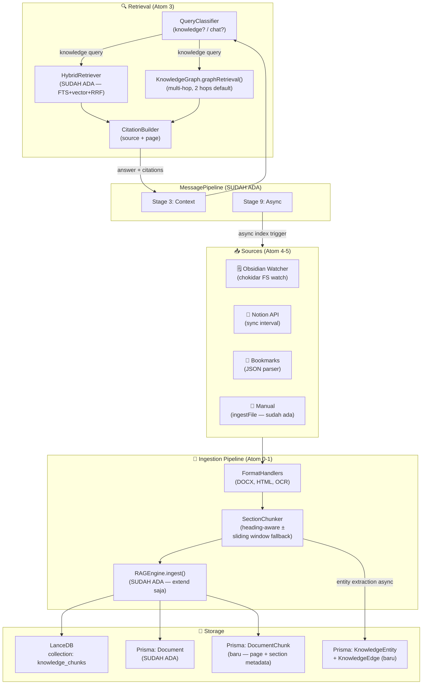

# Phase 13 — Personal Knowledge Base (Second Brain)

> "JARVIS punya akses ke semua database Stark Industries. EDITH harus punya akses ke semua yang pernah user tulis."

**Prioritas:** 🔴 HIGH — Killer feature. Biggest daily value.  
**Depends on:** Phase 9 (LanceDB + HybridRetriever), Phase 6 (proactive daemon)  
**Status Saat Ini:** RAGEngine dasar ✅ | LanceDB vector store ✅ | HybridRetriever (FTS + vector) ✅ | Document Prisma model ✅ | Section-aware chunking ❌ | Knowledge graph ❌ | Source connectors ❌ | Citations ❌ | Query classifier ❌

---

## 0. First Principles: Kenapa Ini Penting?

### 0.1 Masalah yang Dipecahkan

User EDITH punya dokumen di mana-mana — PDF, Obsidian notes, Notion, bookmarks — dan tidak bisa query semua itu secara natural. Masalah konkret:

```
User: "cari semua yang gue tulis soal microservices"
Sekarang: EDITH cuma bisa cari di memory percakapan, bukan di dokumen user

User: "rangkum meeting notes dari bulan lalu"
Sekarang: EDITH tidak tahu meeting notes ada di mana

User: "dari PDF arsitektur ini, apa yang relevan sama masalah kita?"
Sekarang: EDITH bisa ingest PDF tapi jawaban tidak ada citation (halaman mana?)
```

### 0.2 Yang Sudah Ada (JANGAN DIULANG)

`src/memory/rag.ts` sudah ada `RAGEngine` dengan:
- `ingest(userId, content, title, source)` — teks → chunks 500 token → LanceDB
- `ingestFile(filePath)` — .txt, .md, .json, .pdf (via Python `pypdf`)
- `query(userId, queryText)` — temporal index + vector search
- `deleteDocument(docId)`

`src/memory/hybrid-retriever.ts` sudah ada `HybridRetriever` — FTS5 + vector + RRF fusion.

`src/memory/store.ts` sudah ada embedding pipeline: Ollama → OpenAI → hash fallback, 768 dim.

Prisma sudah punya model `Document { id, userId, title, source, createdAt }`.

### 0.3 Gap yang Sebenarnya

| Yang Kurang | Impact |
|-------------|--------|
| Chunking masih sliding window (500 char) — tidak section-aware | Chunk memotong di tengah kalimat/paragraf |
| Tidak ada DOCX parser | Tidak bisa index Word docs |
| Tidak ada HTML parser yang proper | Bookmark / web archive tidak bisa di-index |
| OCR masih tidak ada | Screenshot text tidak bisa di-search |
| Knowledge graph (entity → link) belum ada | Multi-hop query tidak mungkin |
| Citation tidak ada dalam jawaban | User tidak tahu sumber dari mana |
| Source connectors tidak ada | Tidak bisa auto-sync Obsidian/Notion |
| Query classifier belum ada | EDITH tidak tahu kapan harus search knowledge base |

### 0.4 Batasan Design (Non-Negotiable)

1. **EXTEND RAGEngine, JANGAN replace** — tambah method, extend chunking, bukan buat sistem baru
2. **Gunakan LanceDB + HybridRetriever yang sudah ada** — buat collection baru `knowledge_chunks` di LanceDB yang sama
3. **Ingestion SELALU async** — tidak boleh block chat response
4. **Citation WAJIB** — setiap jawaban dari knowledge base harus ada source + halaman/section
5. **Local-first** — embedding via Ollama/OpenAI yang sudah ada, tidak ada dep baru untuk embedding
6. **User opt-in per source** — tidak ada auto-index tanpa explicit config di `edith.json`

---

## 1. Audit: Apa yang Sudah Ada

### ✅ ADA, EXTEND SAJA

| File | Yang Ada | Yang Perlu Ditambah |
|------|----------|---------------------|
| `src/memory/rag.ts` | RAGEngine: ingest, ingestFile (.txt/.md/.pdf), query, deleteDocument | Format handler DOCX/HTML, section-aware chunking, citation tracking |
| `src/memory/hybrid-retriever.ts` | FTS5 + vector + RRF — production-ready | Expose untuk knowledge query (sekarang hanya dipakai internal memory) |
| `src/memory/store.ts` | Embedding, LanceDB `memories` table, save/search | Collection baru `knowledge_chunks` dengan metadata berbeda |
| `prisma/schema.prisma` | `Document { id, userId, title, source }` | `DocumentChunk`, `KnowledgeEntity`, `KnowledgeEdge` models |
| `src/background/daemon.ts` | Proactive daemon, cron-like scheduling | Hook untuk `syncScheduler.tick()` |

### ❌ BELUM ADA — Perlu Dibuat

| File | Keterangan |
|------|-----------|
| `src/memory/knowledge/format-handlers.ts` | DOCX (mammoth), HTML (parse + clean), OCR (tesseract optional) |
| `src/memory/knowledge/section-chunker.ts` | Section-aware chunker (heading-based + sliding window fallback) |
| `src/memory/knowledge/knowledge-graph.ts` | Entity extraction + SQLite adjacency → multi-hop traversal |
| `src/memory/knowledge/citation-builder.ts` | Build citation string dari chunk metadata |
| `src/memory/knowledge/query-classifier.ts` | Detect apakah user query butuh knowledge search |
| `src/memory/knowledge/connectors/obsidian.ts` | Obsidian vault watcher |
| `src/memory/knowledge/connectors/notion.ts` | Notion API sync |
| `src/memory/knowledge/connectors/bookmarks.ts` | Chrome/Firefox bookmark JSON parser |
| `src/memory/knowledge/sync-scheduler.ts` | Per-connector interval scheduler |

---

## 2. Arsitektur Target



---

## 3. Research Basis

| Paper | ID | Kontribusi ke Implementasi |
|-------|----|-----------------------------|
| HippoRAG: Neurobiologically Inspired Long-Term Memory | arXiv:2405.14831 (2024) | Knowledge graph untuk multi-hop retrieval — entity extraction + graph traversal pakai page-link analogy → basis KnowledgeGraph Atom 2 |
| RAPTOR: Recursive Tree Summaries | arXiv:2401.18059 (Jan 2024) | Hierarchical chunk abstraction: leaf chunks + summary nodes → section-aware chunker ambil prinsip ini tanpa full recursive tree |
| HybridRAG: Integrating Knowledge Graphs and Vector RAG | arXiv:2408.04948 (Aug 2024) | VectorRAG + GraphRAG parallel retrieval → merged reranking → basis parallel hybrid di RetrievalEngine Atom 3 |
| GraphRAG (Microsoft) | arXiv:2404.16130 (Apr 2024) | Community-based global query — EDITH pakai versi simplifikasi: entity graph untuk multi-hop, bukan full community detection |
| Contextual Retrieval (Anthropic Blog) | anthropic.com/news/contextual-retrieval (Sep 2024) | Context prefix per chunk ("From: {doc} > {section}") → drastis improve retrieval precision |
| Lost in the Middle: LLM Attention | arXiv:2307.03172 (2023) | Dokumen yang paling relevan harus di awal atau akhir context window, bukan tengah → CitationBuilder ordering Atom 3 |

---

## 4. Prisma Schema Extensions

Tambah ke `prisma/schema.prisma` sebelum implement apapun:

```prisma
/**
 * DocumentChunk: satu chunk dari satu Document.
 * Tiap chunk punya metadata lokasi (page, section) untuk citation.
 */
model DocumentChunk {
  id          String   @id @default(cuid())
  documentId  String
  userId      String
  content     String
  contextPrefix String  // "From: {title} > {section}" — untuk contextual retrieval
  chunkIndex  Int
  page        Int?
  section     String?
  vectorId    String?  // ID di LanceDB (untuk delete sync)
  createdAt   DateTime @default(now())

  document    Document @relation(fields: [documentId], references: [id], onDelete: Cascade)

  @@index([documentId])
  @@index([userId])
}

/**
 * KnowledgeEntity: entitas yang diekstrak dari chunks.
 * Dipakai untuk knowledge graph traversal.
 */
model KnowledgeEntity {
  id          String   @id @default(cuid())
  userId      String
  name        String
  type        String   // person | concept | tool | place | organization
  chunkIds    Json     // array of DocumentChunk IDs
  createdAt   DateTime @default(now())
  updatedAt   DateTime @updatedAt

  causesEdges KnowledgeEdge[] @relation("fromEntity")
  effectEdges KnowledgeEdge[] @relation("toEntity")

  @@unique([userId, name])
  @@index([userId, type])
}

/**
 * KnowledgeEdge: relasi antar entitas di knowledge graph.
 */
model KnowledgeEdge {
  id         String @id @default(cuid())
  userId     String
  fromId     String
  toId       String
  relation   String  // "uses", "mentions", "created_by", "part_of", "related_to"
  weight     Float   @default(0.5)
  sourceChunkId String

  from KnowledgeEntity @relation("fromEntity", fields: [fromId], references: [id], onDelete: Cascade)
  to   KnowledgeEntity @relation("toEntity", fields: [toId], references: [id], onDelete: Cascade)

  @@unique([fromId, toId, relation])
  @@index([userId])
}
```

Jalankan setelah schema diubah:
```bash
prisma migrate dev --name phase-13-knowledge-base
```

Juga update `Document` model — tambah relasi ke `DocumentChunk`:
```prisma
model Document {
  // ... existing fields ...
  chunks DocumentChunk[]  // tambah relasi ini
}
```

---

## 5. Implementation Atoms

> Implement dalam urutan ini. 1 atom = 1 commit.

### Atom 0: `src/memory/knowledge/format-handlers.ts` (~200 lines)

**Tujuan:** Extend kemampuan parse file dari RAGEngine yang sekarang hanya .txt/.md/.pdf.

```typescript
/**
 * @file format-handlers.ts
 * @description Format-specific document parsers — DOCX, HTML, OCR (image).
 *
 * ARCHITECTURE:
 *   Dipanggil oleh RAGEngine.ingestFile() berdasarkan file extension.
 *   Setiap handler return string (clean text) + optional ParseMetadata.
 *   RAGEngine tetap orchestrate chunking dan saving — handler hanya parse.
 *
 * PAPER BASIS:
 *   - Contextual Retrieval (Anthropic, Sep 2024) — context prefix per chunk
 *   - HippoRAG arXiv:2405.14831 — entity-rich text preservation
 */

export interface ParsedDocument {
  text: string
  title: string
  structure: DocumentSection[]
  metadata: {
    pageCount?: number
    wordCount: number
    author?: string
    createdAt?: Date
  }
}

export interface DocumentSection {
  heading?: string
  content: string
  page?: number
  level: number  // 0 = body, 1-6 = heading level
}

/** Parse DOCX menggunakan `mammoth` (npm dep baru) */
export async function parseDocx(filePath: string): Promise<ParsedDocument>

/** Parse HTML menjadi clean text — strip nav/header/footer/scripts */
export async function parseHtml(filePath: string): Promise<ParsedDocument>

/** Parse image dengan OCR menggunakan Tesseract.js (optional dep) */
export async function parseImage(filePath: string): Promise<ParsedDocument>

/**
 * Dispatch ke handler yang tepat berdasarkan extension.
 * Fallback ke text read untuk format yang tidak dikenali.
 */
export async function parseFile(filePath: string): Promise<ParsedDocument | null>
```

**Extend RAGEngine.ingestFile()**: ganti `if (ext === '.pdf')` chain dengan `parseFile()` dari module ini. Setelah parse, pass `ParsedDocument.structure` ke `SectionChunker` (Atom 1).

**New npm deps (apps/desktop jangan, ini di root engine):**
```bash
pnpm add mammoth        # DOCX parser
# tesseract.js OPSIONAL — hanya install jika user set OCR_ENABLED=true di .env
```

---

### Atom 1: `src/memory/knowledge/section-chunker.ts` (~180 lines)

**Tujuan:** Section-aware chunking — chunk per heading section, bukan per 500 char.

```typescript
/**
 * @file section-chunker.ts
 * @description Section-aware document chunker.
 *
 * ARCHITECTURE:
 *   Extend RAGEngine — dipanggil setelah format-handlers parse dokumen.
 *   Ganti chunkText() di rag.ts dengan SectionChunker.chunk() untuk
 *   dokumen yang punya struktur (heading). Dokumen flat tetap pakai sliding window.
 *
 * PAPER BASIS:
 *   - RAPTOR arXiv:2401.18059 — hierarchical chunk abstraction
 *   - Contextual Retrieval (Anthropic) — context prefix per chunk meningkatkan
 *     precision retrieval 49% di beberapa benchmark
 */

export interface KnowledgeChunk {
  content: string
  /** "From: {docTitle} > {sectionHeading}" — context prefix untuk contextual retrieval */
  contextPrefix: string
  page?: number
  section?: string
  chunkIndex: number
  totalChunks: number
  tokens: number
}

export class SectionChunker {
  private readonly maxChunkTokens: number  // default 512
  private readonly overlapTokens: number   // default 50

  /**
   * Chunk dokumen berdasarkan struktur.
   * - Jika ada headings → chunk per section (satu section = satu chunk)
   * - Jika section terlalu panjang → split dengan sliding window
   * - Jika tidak ada struktur → sliding window seperti sebelumnya
   */
  chunk(doc: ParsedDocument, docTitle: string): KnowledgeChunk[]

  /** Perkiraan token count (1 token ≈ 4 chars) */
  private estimateTokens(text: string): number

  /** Chunk satu section panjang dengan sliding window + overlap */
  private splitLongSection(section: DocumentSection, prefix: string): KnowledgeChunk[]
}

export const sectionChunker = new SectionChunker()
```

**Integrasi ke `src/memory/rag.ts`**: Ubah `ingest()` untuk menerima optional `ParsedDocument` param. Jika ada struktur → pakai `sectionChunker.chunk()`, jika tidak → fallback ke `chunkText()` lama. Ini backward-compatible.

---

### Atom 2: `src/memory/knowledge/knowledge-graph.ts` (~220 lines)

**Tujuan:** Build entity graph dari chunks, enable multi-hop retrieval.

```typescript
/**
 * @file knowledge-graph.ts
 * @description HippoRAG-inspired knowledge graph: entity extraction + traversal.
 *
 * ARCHITECTURE:
 *   Entity extraction via LLM (orchestrator.generate) — async, background only.
 *   Storage via Prisma KnowledgeEntity + KnowledgeEdge (SQLite, no new DB).
 *   Traversal returns DocumentChunk IDs untuk digabung dengan vector search.
 *   Dipanggil dari RAGEngine.ingest() di Stage 9 (async side effect).
 *
 * PAPER BASIS:
 *   - HippoRAG arXiv:2405.14831 — page-link graph + PPR (Personalized PageRank)
 *     traversal. Kita pakai BFS instead of PPR karena simpler dan cukup untuk
 *     personal knowledge base skala kecil (<10k chunks).
 *   - HybridRAG arXiv:2408.04948 — parallel vector + graph retrieval
 */

const EXTRACTION_PROMPT = `Extract named entities and relationships from this text.
Return ONLY valid JSON, no other text:
{"entities":[{"name":"...","type":"concept|person|tool|place|organization"}],
"relations":[{"from":"...","to":"...","relation":"uses|mentions|created_by|part_of|related_to"}]}

Text: {text}`

export class KnowledgeGraph {
  /**
   * Extract entities dari satu chunk dan simpan ke DB.
   * ASYNC — dipanggil di Stage 9 (tidak block response).
   * Graceful: jika LLM extraction gagal, skip tanpa error.
   */
  async extractFromChunk(userId: string, chunk: KnowledgeChunk, chunkId: string): Promise<void>

  /**
   * BFS traversal dari query entities.
   * Return chunk IDs yang reachable dalam `hops` langkah.
   * @param hops - default 2, max 3
   */
  async graphRetrieval(userId: string, query: string, hops?: number): Promise<string[]>

  /** Extract entity names dari query text untuk seeding traversal */
  private async extractQueryEntities(query: string): Promise<string[]>

  /** BFS dari seed entities, return reachable entity IDs */
  private async bfsTraverse(userId: string, seedEntityIds: string[], hops: number): Promise<string[]>

  /** Resolve entity IDs ke DocumentChunk IDs */
  private async getChunkIdsForEntities(entityIds: string[]): Promise<string[]>
}

export const knowledgeGraph = new KnowledgeGraph()
```

---

### Atom 3: `src/memory/knowledge/citation-builder.ts` + `src/memory/knowledge/query-classifier.ts` (~180 lines total)

**Tujuan dua file:**
1. **CitationBuilder** — format jawaban dengan source + page attribution
2. **QueryClassifier** — detect apakah query butuh knowledge search

**`citation-builder.ts` (~100 lines):**
```typescript
/**
 * @file citation-builder.ts
 * @description Build cited answers from knowledge base retrieval results.
 *
 * PAPER BASIS:
 *   - Lost in the Middle arXiv:2307.03172 — order chunks: paling relevan di awal/akhir,
 *     bukan tengah context window. Implementasi: sort dan tempatkan top-1 di awal,
 *     top-2 di akhir, sisanya di tengah.
 */

export interface CitedChunk {
  content: string
  sourceName: string    // filename atau "Obsidian: {title}" atau "Notion: {page}"
  sourceFile: string    // path absolut / URL
  page?: number
  section?: string
  score: number
}

export interface CitationResult {
  prompt: string        // formatted context untuk LLM
  sources: CitedChunk[] // untuk display ke user
  /** Format string ringkas: "[1] architecture.md p.2, [2] meeting-notes.pdf p.5" */
  shortCitation: string
}

export class CitationBuilder {
  /**
   * Susun chunks menjadi prompt dengan citation markers [1], [2], dll.
   * Order mengikuti Lost-in-the-Middle: top-1 di awal, top-2 di akhir.
   */
  build(query: string, chunks: CitedChunk[]): CitationResult

  /**
   * Format final answer — tambah citation footer.
   * Input: LLM response yang menggunakan [1], [2] markers.
   * Output: response + "\n\nSources:\n[1] ..."
   */
  formatAnswer(llmResponse: string, result: CitationResult): string
}

export const citationBuilder = new CitationBuilder()
```

**`query-classifier.ts` (~80 lines):**
```typescript
/**
 * @file query-classifier.ts
 * @description Classify whether a user query needs knowledge base search.
 *
 * ARCHITECTURE:
 *   Dipanggil di message-pipeline.ts Stage 2 (pre-generation context).
 *   Returns classification FAST (heuristic-based, tidak pakai LLM).
 *   LLM call untuk KB search hanya jika classified = 'knowledge'.
 */

export type QueryType = 'knowledge' | 'chat' | 'action'

export interface ClassificationResult {
  type: QueryType
  confidence: number  // 0-1
  reason: string
}

const KNOWLEDGE_SIGNALS = [
  /cari.*yang (gue|aku|saya) (tulis|simpan|buat)/i,
  /dari (file|dokumen|notes|pdf|notion|obsidian)/i,
  /ringkas|summarize|rangkum/i,
  /yang ada di (knowledge|docs|notes|file)/i,
  /search.*document/i,
  /find.*in.*notes/i,
]

export class QueryClassifier {
  /**
   * Fast heuristic classification — no LLM call.
   * Pattern matching + keyword scoring.
   */
  classify(query: string): ClassificationResult
}

export const queryClassifier = new QueryClassifier()
```

**Integrasi ke `src/core/message-pipeline.ts`:** Di Stage 2 (sebelum buildContext), run `queryClassifier.classify()`. Jika type = 'knowledge', inject retrieval results via `citationBuilder.build()` ke system context.

---

### Atom 4: Source Connectors (~350 lines, 3 files)

**`src/memory/knowledge/connectors/obsidian.ts` (~120 lines)**

```typescript
/**
 * Obsidian vault connector — file system watcher.
 * Pakai chokidar (sudah ada di dependency graph via skillLoader? cek dulu).
 * Jika tidak ada: tambah ke pnpm deps.
 */
export class ObsidianConnector {
  private watcher: FSWatcher | null = null

  /** Start watching vault path dari edith.json config */
  async start(vaultPath: string, userId: string): Promise<void>

  /** Stop watcher */
  stop(): void

  /** Index seluruh vault (saat pertama kali atau reset) */
  async fullSync(vaultPath: string, userId: string): Promise<{ indexed: number; failed: number }>

  /** Handle single file change event */
  private async handleFileChange(filePath: string, userId: string): Promise<void>
}
```

**`src/memory/knowledge/connectors/notion.ts` (~130 lines)**

```typescript
/**
 * Notion connector — sync via Notion API v2.
 * New dep: @notionhq/client
 */
export class NotionConnector {
  /** Sync pages dari configured database IDs */
  async sync(apiKey: string, databaseIds: string[], userId: string): Promise<{ synced: number; failed: number }>

  /** Convert Notion blocks ke plain text */
  private blocksToText(blocks: BlockObjectResponse[]): string
}
```

**`src/memory/knowledge/connectors/bookmarks.ts` (~100 lines)**

```typescript
/**
 * Browser bookmark connector — parse Chrome/Firefox JSON export.
 * Tidak ada external dep — pakai link-understanding/extractor.ts yang sudah ada.
 */
export class BookmarkConnector {
  /**
   * Parse bookmark JSON dan fetch content dari setiap URL.
   * Pakai linkExtractor.fetchContent() yang sudah ada.
   */
  async sync(bookmarkJsonPath: string, userId: string): Promise<{ synced: number; skipped: number }>

  /** Flatten Chrome bookmark tree jadi flat array of {title, url} */
  private flattenBookmarks(node: ChromeBookmarkNode): Array<{ title: string; url: string }>
}
```

---

### Atom 5: `src/memory/knowledge/sync-scheduler.ts` + Wiring (~150 lines)

**`sync-scheduler.ts` (~100 lines):**

```typescript
/**
 * @file sync-scheduler.ts
 * @description Per-connector interval scheduler for knowledge source sync.
 *
 * ARCHITECTURE:
 *   Dipanggil dari daemon.ts tick() — tidak pakai cron baru.
 *   State disimpan di memory (Map lastSyncAt) — tidak perlu Prisma.
 *   Setiap connector punya interval berbeda dari edith.json config.
 */

export class SyncScheduler {
  private lastSyncAt: Map<string, number> = new Map()

  /**
   * Check semua configured connectors.
   * Jika sudah lewat intervalMinutes → trigger sync.
   * Dipanggil dari daemon setiap ~5 menit.
   */
  async tick(userId: string): Promise<void>
}

export const syncScheduler = new SyncScheduler()
```

**Wiring ke `src/background/daemon.ts`:** Tambah `syncScheduler.tick(userId)` di background loop. Gunakan `void ... .catch(log.warn)` — non-critical.

**Wiring ke `src/config/edith-config.ts`:** Tambah `knowledgeBase` section ke `EDITHConfigSchema`:

```typescript
const KnowledgeBaseConfigSchema = z.object({
  connectors: z.object({
    obsidian: z.object({
      enabled: z.boolean().default(false),
      vaultPath: z.string().default(""),
      syncIntervalMinutes: z.number().default(5),
    }).default({}),
    notion: z.object({
      enabled: z.boolean().default(false),
      apiKey: z.string().default(""),
      databaseIds: z.array(z.string()).default([]),
      syncIntervalMinutes: z.number().default(30),
    }).default({}),
    bookmarks: z.object({
      enabled: z.boolean().default(false),
      jsonPath: z.string().default(""),
      syncIntervalMinutes: z.number().default(60),
    }).default({}),
  }).default({}),
  maxFileSizeMb: z.number().default(50),
  ocrEnabled: z.boolean().default(false),
}).default({})
```

---

### Atom 6: Tests (~200 lines, 4 files)

```
src/memory/knowledge/__tests__/section-chunker.test.ts   (15 tests)
src/memory/knowledge/__tests__/knowledge-graph.test.ts   (12 tests)
src/memory/knowledge/__tests__/citation-builder.test.ts  (10 tests)
src/memory/knowledge/__tests__/query-classifier.test.ts  (8 tests)
```

**Critical tests:**
- `section-chunker`: heading doc → chunk per section, flat doc → sliding window, section terlalu panjang → split
- `knowledge-graph`: entity extraction mock LLM, BFS traversal 2 hops, graceful fail saat LLM error
- `citation-builder`: Lost-in-the-Middle ordering (top chunk di awal), citation markers di output
- `query-classifier`: "cari yang gue tulis soal X" → knowledge, "tolong buat email" → action

---

## 6. File Changes Summary

| File | Action | Est. Lines | Atom |
|------|--------|-----------|------|
| `prisma/schema.prisma` | EXTEND +DocumentChunk, +KnowledgeEntity, +KnowledgeEdge | +50 | Pre-work |
| `src/memory/knowledge/format-handlers.ts` | NEW — DOCX, HTML, OCR parsers | ~200 | 0 |
| `src/memory/rag.ts` | EXTEND — wire format-handlers + section-chunker | +40 | 0+1 |
| `src/memory/knowledge/section-chunker.ts` | NEW — section-aware chunking | ~180 | 1 |
| `src/memory/knowledge/knowledge-graph.ts` | NEW — entity extraction + BFS traversal | ~220 | 2 |
| `src/memory/knowledge/citation-builder.ts` | NEW — cited answer builder | ~100 | 3 |
| `src/memory/knowledge/query-classifier.ts` | NEW — fast heuristic classifier | ~80 | 3 |
| `src/core/message-pipeline.ts` | EXTEND — Stage 2 inject KB context | +25 | 3 |
| `src/memory/knowledge/connectors/obsidian.ts` | NEW | ~120 | 4 |
| `src/memory/knowledge/connectors/notion.ts` | NEW | ~130 | 4 |
| `src/memory/knowledge/connectors/bookmarks.ts` | NEW | ~100 | 4 |
| `src/memory/knowledge/sync-scheduler.ts` | NEW | ~100 | 5 |
| `src/background/daemon.ts` | EXTEND — syncScheduler.tick() | +10 | 5 |
| `src/config/edith-config.ts` | EXTEND — knowledgeBase section | +40 | 5 |
| Tests (4 files) | NEW | ~200 | 6 |
| **Total** | | **~1595 lines** | |

**Files yang TIDAK perlu diubah:**
- `src/memory/store.ts` — embedding sudah cukup
- `src/memory/hybrid-retriever.ts` — sudah production-ready, tinggal dipanggil
- `src/memory/memrl.ts` — tidak relevan untuk knowledge query

**New npm deps (root, bukan desktop):**
```bash
pnpm add mammoth              # DOCX parser — lightweight, no native deps
pnpm add @notionhq/client     # Notion API (hanya install jika pakai Notion connector)
# tesseract.js OPSIONAL — hanya jika OCR_ENABLED=true
```

---

## 7. Acceptance Gates

| Gate | Kriteria |
|------|----------|
| G1 | `pnpm typecheck` green setelah setiap atom |
| G2 | PDF (multi-page) → chunks dengan page metadata yang benar |
| G3 | DOCX dengan headings → section-based chunks, bukan sliding window |
| G4 | `queryClassifier.classify("cari yang gue tulis soal X")` → type = 'knowledge' |
| G5 | Knowledge query menghasilkan jawaban dengan citation `[1] notes.md §Architecture` |
| G6 | Knowledge graph: entity diekstrak dari chunk, 2-hop traversal bekerja |
| G7 | Obsidian: file baru di vault → auto-indexed dalam 5 menit |
| G8 | `ingestFile()` tidak block chat response (ingestion selesai di background) |
| G9 | 45 tests pass (15+12+10+8) |
| G10 | Dokumen dihapus user → chunk di LanceDB + Prisma ikut dihapus (cascade) |

---

## 8. Interaksi Contoh Setelah Phase 13

```
User: "cari semua yang gue tulis soal microservices"

EDITH: "Gue nemuin di 3 dokumen:
  1. 📄 architecture-notes.md (Obsidian) §System Design
     → lu nulis tentang service decomposition dengan event-driven pattern
  2. 📄 meeting-2024-01-15.pdf hal.5
     → tim diskusi migration dari monolith ke microservices
  3. 🔖 Bookmark: martinfowler.com/articles/microservices.html
     → Martin Fowler's original article (lu bookmark bulan lalu)

  Mau gue rangkum semuanya?"

---

User: "dari semua meeting notes, siapa yang paling sering sebut deadline?"

EDITH: "Dari 12 meeting notes yang ter-index:
  Budi — 8 kali [meeting-jan.pdf, meeting-feb.pdf, ...]
  Sarah — 5 kali
  Biasanya di konteks sprint planning."
```
