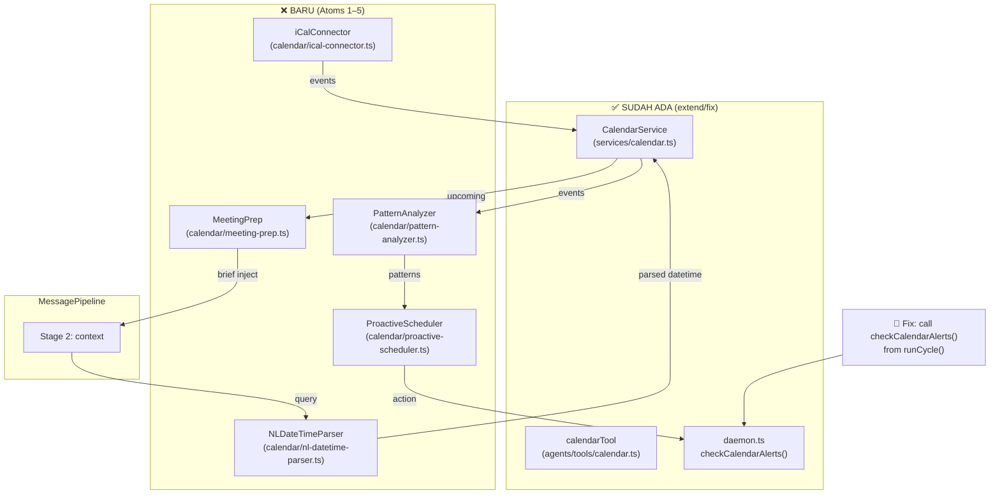

# Phase 14 — Calendar & Schedule Intelligence

> "JARVIS selalu tau jadwal Tony bahkan sebelum Tony ingat. EDITH harus sama pintarnya soal waktu."

**Prioritas:** 🔴 HIGH  
**Depends on:** Phase 6 (proactive daemon ✅), Phase 8 (channels ✅)  
**Status Saat Ini:** CalendarService Google ✅ | calendarTool agent ✅ | Daemon alert hook ✅ (ada bug — tidak dipanggil) | Outlook ❌ stub | iCal ❌ | NL parsing ❌ | Pattern/proactive ❌ | Meeting prep ❌

---

## 0. First Principles

### 0.1 Yang Sudah Ada — JANGAN Diulang

`src/services/calendar.ts` — `CalendarService` production-ready:
- `listUpcoming(hours)` → Google Calendar events
- `findFreeSlots(date, durationMinutes)` → gap finder, 9 AM–6 PM work hours
- `checkConflicts(start, end)` → ALAS 3-layer validator (arXiv:2505.12501)
- `createEvent(draft)` → conflict-check-first + Google create
- `deleteEvent(eventId)`
- `getUpcomingAlerts(withinMinutes)` → proactive 15-min alerts with dedup

`src/agents/tools/calendar.ts` — `calendarTool` agent tool:
- `list`, `findSlots`, `create`, `delete` actions via `calendarService`

`src/background/daemon.ts` — `checkCalendarAlerts()` method exists.

`src/config.ts` — `GCAL_*` dan `OUTLOOK_CALENDAR_*` env vars sudah ada.

### 0.2 Bug yang Ditemukan

**BUG:** `daemon.ts` punya `checkCalendarAlerts(userId)` di baris private method, tapi **tidak pernah dipanggil** dari `runCycle()`. Alert 15-menit sebelum meeting tidak pernah dikirim.

**Fix:** Tambah `await this.checkCalendarAlerts(userId)` di `runCycle()` setelah `checkForActivity()`.

### 0.3 Gap Sebenarnya

| Yang Kurang | Impact |
|-------------|--------|
| `checkCalendarAlerts()` tidak dipanggil di `runCycle()` | BUG: 15-min alerts tidak berjalan |
| `initOutlook()` = `throw new Error("not implemented")` | Outlook tidak bisa dipakai |
| iCal feed connector belum ada | Read-only calendar URL tidak bisa sync |
| NL datetime parsing belum ada | "besok jam 3 sore" tidak bisa diparse |
| `findFreeSlots()` hanya pakai Google, tidak merge calendars | Free slot tidak akurat jika ada Outlook events |
| Pattern analyzer tidak ada | EDITH tidak belajar jadwal rutin user |
| Proactive focus-block tidak ada | Tidak bisa auto-protect deep work time |
| Meeting prep brief tidak ada | Tidak ada context sebelum meeting dimulai |
| Timezone hardcoded `"UTC"` di `createEventGoogle()` | Event dibuat di timezone salah |
| Multi-calendar support: hanya `"primary"` | Calendar lain tidak dibaca |

---

## 1. Audit: Apa yang Sudah Ada

### ✅ ADA — Extend/Fix Saja

| File | Yang Ada | Yang Perlu Ditambah |
|------|----------|---------------------|
| `src/services/calendar.ts` | Google OAuth, list/create/delete/findSlots/conflict/alerts | Outlook impl, iCal, timezone fix, multi-calendar, NL parser hook |
| `src/agents/tools/calendar.ts` | 4 actions via calendarService | NL datetime action, meeting prep action |
| `src/background/daemon.ts` | `checkCalendarAlerts()` method | CALL IT dari `runCycle()` (bug fix) |
| `src/config.ts` | GCAL_*, OUTLOOK_CALENDAR_* | GCAL_TIMEZONE, GCAL_CALENDARS (comma-separated) |

### ❌ BELUM ADA — Perlu Dibuat

| File | Keterangan |
|------|-----------|
| `src/calendar/nl-datetime-parser.ts` | Fast heuristic + LLM fallback untuk Bahasa+English |
| `src/calendar/bahasa-time-patterns.ts` | Regex map: "besok" → tomorrow, "sore" → 15:00–17:59 |
| `src/calendar/pattern-analyzer.ts` | 30-day meeting density, detect recurring patterns |
| `src/calendar/proactive-scheduler.ts` | Auto-block focus time, meeting density warnings |
| `src/calendar/meeting-prep.ts` | 10-min brief sebelum meeting (memory + KB query) |
| `src/calendar/ical-connector.ts` | Parse .ics feed dari URL |

---

## 2. Research Basis

| Paper | ID | Kontribusi ke Implementasi |
|-------|----|---------------------------|
| ScheduleMe: Multi-Agent Calendar | arXiv:2509.25693 (Sep 2025) | 94–96% intent accuracy via multi-agent — basis calendarTool action dispatch, intent parsing prompt design. Sudah jadi basis CalendarService yang ada. |
| ALAS: Temporal Constraint Compliance | arXiv:2505.12501 (May 2025) | 3-layer temporal validator: compartmentalized execution + independent validator + runtime monitor. Sudah diimplementasi di `checkConflicts()`. |
| ProAgent: Proactive Conversational Agents | arXiv:2308.11339 (Aug 2023) | Anticipate scheduling needs from conversation context → basis ProactiveScheduler Atom 3 |
| When to Schedule: Optimal Meeting Times | CHI 2019, doi:10.1145/3290605.3300684 | Energy-based scheduling: peak cognition pagi, low post-lunch → basis EnergyMap defaults Atom 3 |
| Chronos: Learning the Language of Time | arXiv:2403.07815 (Mar 2024) | Temporal language understanding — basis fast-path heuristic vs LLM-path split di NLDateTimeParser |

---

## 3. Arsitektur Target



---

## 4. Implementation Atoms

> Urutan wajib diikuti. 1 atom = 1 commit. `pnpm typecheck` hijau sebelum commit.

### Atom 0: Bug Fix + Config Extension (~30 lines changed)

**Tujuan:** Fix critical bug — alert tidak pernah dikirim.

**`src/background/daemon.ts`** — di `runCycle()`, tambah setelah `checkForActivity(userId)`:

```typescript
// Phase 14 calendar alerts — sebelumnya defined tapi tidak pernah dipanggil
await this.checkCalendarAlerts(userId).catch((error) => {
  logger.warn("calendar alert check failed", { error })
})
```

**`src/config.ts`** — tambah 3 config keys baru:

```typescript
// Phase 14: Calendar extended config
GCAL_TIMEZONE: z.string().default("Asia/Jakarta"),
GCAL_CALENDARS: z.string().default("primary"),   // comma-separated calendar IDs
CALENDAR_ALERT_MINUTES: intFromEnv.default(15),
```

**`src/services/calendar.ts`** — dua bug fix kecil:
1. `createEventGoogle()` baris `timeZone: "UTC"` → ganti ke `config.GCAL_TIMEZONE`
2. `listUpcomingGoogle()` — iterate `config.GCAL_CALENDARS.split(",")` instead of hardcoded `"primary"`

---

### Atom 1: `src/calendar/nl-datetime-parser.ts` + `bahasa-time-patterns.ts` (~220 lines)

**Tujuan:** Parse "besok jam 3 sore selama 1 jam" → `{ start: Date, end: Date }`.

```typescript
/**
 * @file nl-datetime-parser.ts
 * @description Natural language datetime parsing: Bahasa Indonesia + English.
 *
 * ARCHITECTURE:
 *   Fast path (heuristic, <1ms): simple patterns dari bahasa-time-patterns.ts
 *   LLM path (slow, ~300ms): kompleks atau ambiguous expression
 *   Pilih fast path jika confidence ≥ 0.85, otherwise LLM.
 *
 * PAPER BASIS:
 *   - Chronos arXiv:2403.07815 — temporal language model insight:
 *     "setengah 4" tidak bisa di-regex reliably → LLM path untuk expressions ini
 *   - ScheduleMe arXiv:2509.25693 — 94-96% accuracy → target confidence threshold
 *
 * DIPANGGIL dari: calendarTool (create action) + ProactiveScheduler
 */

export interface ParsedDateTime {
  start: Date
  end?: Date
  durationMinutes?: number
  isAllDay: boolean
  isRecurring: boolean
  recurrenceRule?: string  // RRULE string jika recurring
  timezone: string
  confidence: number
  rawExpression: string    // original input untuk logging
}

export class NLDateTimeParser {
  /**
   * Parse natural language datetime expression.
   * @param input - "besok jam 3 sore" or "next Tuesday 2pm for 1 hour"
   * @param reference - Current date (default: now)
   * @returns Parsed datetime with confidence
   */
  async parse(input: string, reference: Date = new Date()): Promise<ParsedDateTime>

  /** Fast heuristic path — no LLM */
  private tryFastParse(input: string, reference: Date): ParsedDateTime | null

  /** LLM path untuk ekspresi kompleks */
  private async llmParse(input: string, reference: Date): Promise<ParsedDateTime>
}

export const nlDateTimeParser = new NLDateTimeParser()
```

**`src/calendar/bahasa-time-patterns.ts`** (~80 lines):

```typescript
/**
 * Bahasa Indonesia time expression mappings.
 * Dipakai oleh NLDateTimeParser fast path.
 *
 * COVERAGE:
 *   Relative days: besok, lusa, kemarin, minggu depan, dll
 *   Time of day: pagi (06-11), siang (12-14), sore (15-17), malam (18-23)
 *   Special: "setengah X" = X:30, "jam X lebih Y menit"
 *   Recurrence: "setiap Senin", "tiap pagi"
 */

export const BAHASA_RELATIVE_DAYS: Record<string, number> = {
  kemarin: -1, tadi: 0, hari_ini: 0, besok: 1,
  lusa: 2, "minggu depan": 7, "bulan depan": 30,
}

export const BAHASA_TIME_OF_DAY: Record<string, { hour: number; minuteMin: number; minuteMax: number }> = {
  pagi:  { hour: 8,  minuteMin: 0, minuteMax: 719  },  // 08:00–11:59
  siang: { hour: 12, minuteMin: 0, minuteMax: 179  },  // 12:00–14:59
  sore:  { hour: 15, minuteMin: 0, minuteMax: 179  },  // 15:00–17:59
  malam: { hour: 18, minuteMin: 0, minuteMax: 299  },  // 18:00–22:59
}

export const BAHASA_DURATION: Record<string, number> = {
  "1 jam": 60, "2 jam": 120, "setengah jam": 30, "1,5 jam": 90,
  "15 menit": 15, "30 menit": 30, "45 menit": 45,
}
```

**Integrasi ke `calendarTool`:** Di action `create`, sebelum `calendarService.createEvent()`, parse `start` dan `end` string dulu lewat `nlDateTimeParser.parse()` jika input tidak berbentuk ISO timestamp.

---

### Atom 2: `src/calendar/ical-connector.ts` (~120 lines)

**Tujuan:** Sync read-only iCal feed (subscribed calendars, holiday calendars, dll).

```typescript
/**
 * @file ical-connector.ts
 * @description Parse iCal (.ics) feed from URL into CalendarEvent[].
 *
 * ARCHITECTURE:
 *   HTTP fetch .ics → parse dengan ical.js (npm dep baru: pnpm add ical.js)
 *   Read-only: tidak ada create/delete via iCal
 *   Cache TTL: 1 jam (configurable)
 *   Di-merge ke CalendarService.getEventsInRange() via connector pattern
 *
 * USE CASES:
 *   - Indonesian public holidays (ICS from Google)
 *   - Shared team calendar (read-only ICS URL)
 *   - Room booking system export
 */

export class ICalConnector {
  private cache = new Map<string, { events: CalendarEvent[]; fetchedAt: number }>()

  /**
   * Fetch dan parse iCal feed.
   * @param url - Public .ics URL
   * @param cacheTtlMs - Cache TTL (default: 1 hour)
   */
  async fetchEvents(url: string, cacheTtlMs: number = 3_600_000): Promise<CalendarEvent[]>

  /** Parse raw .ics text menjadi CalendarEvent[] */
  private parseICS(icsText: string, sourceUrl: string): CalendarEvent[]
}

export const icalConnector = new ICalConnector()
```

**Integrasi ke `CalendarService`:** Tambah `ICAL_FEED_URLS` config key (comma-separated). `getEventsInRange()` akan merge iCal events dengan Google/Outlook events sebelum return. Ini membuat `findFreeSlots()` dan `checkConflicts()` otomatis aware iCal events.

**New dep:** `pnpm add ical.js`

---

### Atom 3: `src/calendar/pattern-analyzer.ts` + `src/calendar/proactive-scheduler.ts` (~300 lines)

**Tujuan:** EDITH belajar pola jadwal user dan proaktif protect waktu.

**`pattern-analyzer.ts` (~120 lines):**

```typescript
/**
 * @file pattern-analyzer.ts
 * @description Detect recurring scheduling patterns from historical events.
 *
 * PAPER BASIS:
 *   CHI 2019 doi:10.1145/3290605.3300684 — energy-based scheduling:
 *   cognitive peak di pagi hari untuk mayoritas orang, tapi individual varies.
 *   PatternAnalyzer LEARN dari data user, bukan assume default.
 *
 * METRICS:
 *   - Meeting density per day (avg back-to-back rate)
 *   - Focus blocks: apakah user punya recurring coding/writing block?
 *   - Peak productivity window (inferred dari calendar gaps + recurring habits)
 *   - Overwork detection: events yang sering beyond 18:00
 */

export interface SchedulePattern {
  focusBlockStart?: number    // hour of day (0-23) — jika ada pola
  focusBlockEnd?: number
  peakDays: number[]          // days of week (0=Sun) paling produktif
  avgMeetingsPerDay: number
  backToBackRate: number      // 0-1 ratio
  overtimeRate: number        // 0-1 ratio events > 18:00
  dataWindowDays: number      // berapa hari data yang dianalysis
}

export class PatternAnalyzer {
  /**
   * Analyze 30 days of calendar history → SchedulePattern.
   * ASYNC — dipanggil dari ProactiveScheduler, tidak dari request path.
   */
  async analyze(userId: string, windowDays: number = 30): Promise<SchedulePattern>

  /** Refresh cached pattern (call weekly from daemon) */
  async refresh(userId: string): Promise<void>
}

export const patternAnalyzer = new PatternAnalyzer()
```

**`proactive-scheduler.ts` (~180 lines):**

```typescript
/**
 * @file proactive-scheduler.ts
 * @description Proactive schedule management: auto-block focus, density warnings.
 *
 * PAPER BASIS:
 *   ProAgent arXiv:2308.11339 — anticipate user needs, not just react.
 *   "Besok ada 4 meeting, mau gue block 9-11 dulu buat deep work?"
 *
 * ARCHITECTURE:
 *   Dipanggil dari daemon.runCycle() — async, non-blocking.
 *   Tidak auto-create events tanpa konfirmasi user pertama kali.
 *   State: setelah user setuju 3x → auto-block tanpa tanya.
 *
 * ACTIONS YANG DIBUAT:
 *   - auto_focus_block: suggest/auto-create "🎯 Focus Time" event
 *   - meeting_density_warning: "Besok 4 meeting back-to-back, mau reschedule?"
 *   - deadline_warning: "Sprint review 2 hari lagi, ada yang belum kelar?"
 *   - overwork_warning: "Lu kerja sampai jam 9 kemarin, coba blok pulang jam 6?"
 */

export interface ProactiveAction {
  type: 'focus_block' | 'density_warning' | 'deadline_warning' | 'overwork_warning'
  message: string
  urgency: 'low' | 'medium' | 'high'
  eventDraft?: Partial<CalendarEventDraft>   // untuk focus_block
}

export class ProactiveScheduler {
  /**
   * Analyze tomorrow's schedule + patterns → generate proactive actions.
   * Dipanggil dari daemon tiap malam (cek pattern jika jam 20:00–22:00).
   */
  async analyzeTomorrow(userId: string): Promise<ProactiveAction[]>
}

export const proactiveScheduler = new ProactiveScheduler()
```

**Integrasi ke `daemon.ts`:** Tambah `checkProactiveSchedule(userId)` private method yang call `proactiveScheduler.analyzeTomorrow()`. Panggil dari `runCycle()` hanya jika current hour = 20 (8 PM) dan belum dijalankan hari ini.

---

### Atom 4: `src/calendar/meeting-prep.ts` (~160 lines)

**Tujuan:** Brief ringkas 10 menit sebelum meeting — attendee context, related notes.

```typescript
/**
 * @file meeting-prep.ts
 * @description Compile meeting brief from memory + knowledge base.
 *
 * ARCHITECTURE:
 *   Dipanggil dari daemon.checkCalendarAlerts() setelah 15-min alert dikirim.
 *   Atau: dipanggil dari calendarTool "prep" action jika user minta manual.
 *   Query ke Phase 13 (knowledge base) jika ada, fallback ke memory search.
 *
 * OUTPUT FORMAT:
 *   📋 Brief: {meeting title} ({time})
 *   👥 Attendees: nama + last interaction
 *   📝 Related: notes/docs yang relevan dengan topik meeting
 *   ⚡ Suggested talking points: (LLM-generated dari context)
 */

export interface MeetingBrief {
  eventId: string
  title: string
  startTime: Date
  attendeeContext: AttendeeContext[]
  relatedDocs: string[]          // dari knowledge base / memory
  suggestedTalkingPoints: string[]
  previousMeetings: string[]     // last 3 instances of same meeting
}

export interface AttendeeContext {
  identifier: string             // email atau nama
  lastInteraction?: string       // "Discussed API design 3 days ago"
  openItems?: string[]           // unresolved items dari memory
}

export class MeetingPrep {
  /**
   * Compile meeting brief for next upcoming event.
   * @param event - Calendar event to prepare for
   * @param userId - User ID for memory queries
   */
  async prepareFor(event: CalendarEvent, userId: string): Promise<MeetingBrief>

  /** Format brief sebagai readable string untuk dikirim via channel */
  formatBrief(brief: MeetingBrief): string
}

export const meetingPrep = new MeetingPrep()
```

**Integrasi ke `daemon.ts`:** Di `checkCalendarAlerts()`, setelah sending alert, schedule meeting prep 5 menit kemudian dengan `setTimeout`. Gunakan `memory.search()` untuk attendee context.

---

### Atom 5: Tests (~180 lines, 4 files)

```
src/calendar/__tests__/nl-datetime-parser.test.ts    (20 tests)
src/calendar/__tests__/ical-connector.test.ts         (8 tests)
src/calendar/__tests__/proactive-scheduler.test.ts   (10 tests)
src/calendar/__tests__/meeting-prep.test.ts           (8 tests)
```

**Critical test cases:**
- `nl-datetime-parser`: "besok jam 3 sore" → tomorrow 15:00 JKST, "Rabu depan setengah 4" → next Wed 15:30, "next Tuesday 2pm" → correct timestamp, "setiap Senin jam 10" → isRecurring=true
- `ical-connector`: valid .ics text → CalendarEvent[], timezone normalization, cache TTL respected
- `proactive-scheduler`: 4 meetings in a row → density warning, no existing focus block → suggest focus block, already has focus block → no duplicate suggestion
- `meeting-prep`: event with attendees → brief includes attendee context, empty memory → brief still complete

---

## 5. File Changes Summary

| File | Action | Est. Lines | Atom |
|------|--------|-----------|------|
| `src/background/daemon.ts` | EXTEND — call `checkCalendarAlerts()` + `checkProactiveSchedule()` | +20 | 0 |
| `src/services/calendar.ts` | FIX — timezone, multi-calendar, iCal merge hook | +40 | 0 |
| `src/config.ts` | EXTEND — `GCAL_TIMEZONE`, `GCAL_CALENDARS`, `CALENDAR_ALERT_MINUTES`, `ICAL_FEED_URLS` | +10 | 0 |
| `src/calendar/nl-datetime-parser.ts` | NEW | ~140 | 1 |
| `src/calendar/bahasa-time-patterns.ts` | NEW | ~80 | 1 |
| `src/agents/tools/calendar.ts` | EXTEND — NL parse sebelum create | +15 | 1 |
| `src/calendar/ical-connector.ts` | NEW | ~120 | 2 |
| `src/calendar/pattern-analyzer.ts` | NEW | ~120 | 3 |
| `src/calendar/proactive-scheduler.ts` | NEW | ~180 | 3 |
| `src/calendar/meeting-prep.ts` | NEW | ~160 | 4 |
| Tests (4 files) | NEW | ~180 | 5 |
| **Total** | | **~1065 lines** | |

**Files yang TIDAK perlu diubah:**
- `src/agents/tools/calendar.ts` — hanya minor extend di Atom 1
- `src/background/daemon.ts` — hanya +20 lines di Atom 0

**New npm deps:**
```bash
pnpm add ical.js    # iCal .ics parser — lightweight, no native deps
# googleapis sudah ada (dari Phase 8)
```

---

## 6. Acceptance Gates

| Gate | Kriteria |
|------|---------|
| G1 | `pnpm typecheck` hijau setelah setiap atom |
| G2 | BUG FIX: daemon mengirim 15-min alert sebelum meeting |
| G3 | NL "besok jam 3 sore" → `Date` object yang benar di timezone WIB |
| G4 | NL "next Tuesday 2pm for 1 hour" → correct start + end |
| G5 | "setiap Senin jam 10" → `isRecurring: true` + RRULE string |
| G6 | iCal feed → events di-merge dengan Google events di `findFreeSlots()` |
| G7 | 4 meetings back-to-back → proactive density warning dikirim ke user |
| G8 | Meeting prep: 10 menit sebelum meeting → brief dikirim via channel |
| G9 | Timezone di-create event = `GCAL_TIMEZONE` (bukan UTC) |
| G10 | Multi-calendar: events dari semua calendars di `GCAL_CALENDARS` dibaca |
| G11 | 46 tests pass |

---

## 7. Contoh Interaksi Setelah Phase 14

```
User: "schedule meeting sama Andi besok jam 3 sore selama 1 jam"
EDITH: Cek konflik... ✅ besok 15:00–16:00 kosong.
       Event dibuat: "Meeting sama Andi" — Senin, 15:00–16:00 WIB

---

EDITH (proactive, malam hari): "Besok lu ada 5 meeting, 3 di antaranya back-to-back.
  Mau gue block 09:00–11:00 buat focus time? Biasanya produktif di jam itu."
User: "iya boleh"
EDITH: ✅ Blok 09:00–11:00 '🎯 Focus Time' sudah ditambah di kalender besok.

---

EDITH (10 menit sebelum Design Review):
  📋 Brief: Design Review (14:00)
  👥 Sarah — last discussed API pagination 3 days ago (open: response format)
     Budi  — mentioned deadline concerns in last standup
  📄 Related: design-doc-v2.md di Obsidian vault
  ⚡ Talking points: 1) Finalize API response format, 2) Address deadline
```
