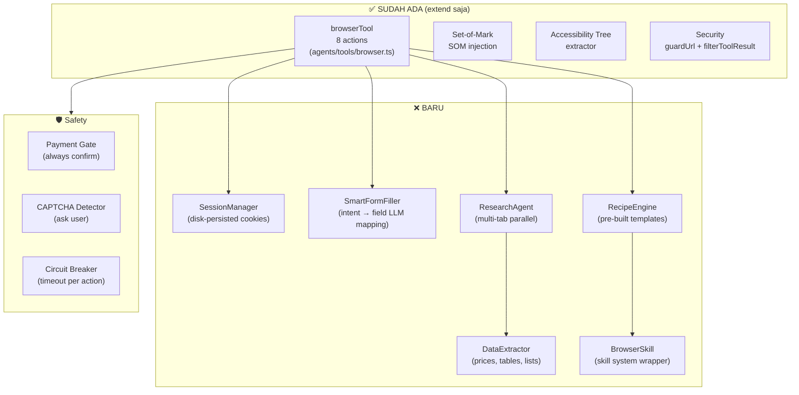

# Phase 15 — Browser Agent (Deep Web Automation)

> "JARVIS bisa hack Departemen Pertahanan. EDITH minimal harus bisa book tiket kereta."

**Prioritas:** 🟡 MEDIUM-HIGH  
**Depends on:** Phase 7 (vision fallback ✅), Phase 17 (credential vault ❌)  
**Status Saat Ini:** browserTool Playwright ✅ | SOM injection ✅ | Accessibility tree ✅ | Security filter ✅ | Smart form filling ❌ | Multi-tab research ❌ | Session persistence across restarts ❌ | Automation recipes ❌

---

## 0. First Principles

### 0.1 Phase 15 vs Phase 7 — Bedanya Apa?

| | Phase 7 (Computer Use) | Phase 15 (Browser Agent) |
|---|---|---|
| Approach | Screenshot → klik pixel koordinat | DOM accessibility tree → act by element ID |
| Accuracy | ~70% (pixel drift, zoom) | ~95% (stable element ID) |
| Speed | Slow (screenshot per step) | Fast (DOM direct) |
| Works on | Semua aplikasi (desktop too) | Browser only |
| Fallback | — | Phase 7 jika DOM fails |

Phase 15 = purpose-built browser tool, Phase 7 = universal fallback.

### 0.2 Yang Sudah Ada — JANGAN Diulang

`src/agents/tools/browser.ts` — `browserTool` sudah production-ready:
- `navigate(url)` → load page + SOM inject + return accessibility tree
- `click(selector)` + `click_element(edithId)` — CSS selector atau SOM ID
- `fill(selector, value)` + `fill_element(edithId, value)` — form fill
- `screenshot` → base64 PNG
- `extract(type)` → text/links/tables dari accessibility tree
- `back` — navigate back
- **Security**: URL guard (`guardUrl()`), prompt injection filter (`filterToolResult()`)
- **SOM**: `injectSetOfMark()` assigns `data-edith-id` ke semua interactable elements
- **Agent-E approach** (arXiv:2407.13032): accessibility tree primary, screenshot secondary
- Singleton browser instance — reused across tool calls

### 0.3 Gap Sebenarnya

| Yang Kurang | Impact |
|-------------|--------|
| Session/cookies tidak persist ke disk | Setiap restart = login ulang ke semua situs |
| Tidak ada smart form filling (LLM intent→field) | Agent harus tebak sendiri field mana diisi apa |
| Tidak ada multi-tab parallel research | Research 3 situs = 3x sequential, bukan paralel |
| Tidak ada structured data extractor (tabel, harga) | Hanya plain text, tidak ada structured output |
| Tidak ada automation recipes | Tiap task ke situs yang sama = reinvent wheel |
| `browserSkill` untuk skill system belum ada | Tidak bisa di-invoke sebagai skill |
| Tidak ada CAPTCHA detection | Silently stuck saat CAPTCHA muncul |
| Timeout tidak ada circuit breaker | Bisa stuck indefinitely di halaman lambat |

### 0.4 Batasan Design

1. **EXTEND browserTool, JANGAN replace** — semua action existing tetap bekerja
2. **Konfirmasi sebelum payment** — payment gate WAJIB ada, tidak bisa di-skip
3. **Session persistence ke disk** — encrypted cookies di `.edith/browser-sessions/`
4. **Phase 17 dependency** — credential vault tidak perlu Phase 17 untuk MVP: gunakan `.env` biasa dulu, Phase 17 nanti yang encrypt
5. **Headless default** — headful mode via config untuk debug

---

## 1. Audit: Apa yang Sudah Ada

### ✅ ADA — Extend Saja

| File | Yang Ada | Yang Perlu Ditambah |
|------|----------|---------------------|
| `src/agents/tools/browser.ts` | 8 actions, SOM, accessibility tree, security | Session persistence, CAPTCHA detection, circuit breaker timeout |
| `src/security/tool-guard.ts` | `guardUrl()` — URL allowlist/blocklist | Payment URL detection untuk payment gate |

### ❌ BELUM ADA — Perlu Dibuat

| File | Keterangan |
|------|-----------|
| `src/browser/session-manager.ts` | Encrypt + persist cookies ke disk |
| `src/browser/smart-form-filler.ts` | LLM: user intent → form field mapping |
| `src/browser/research-agent.ts` | Multi-tab parallel scrape + synthesis |
| `src/browser/data-extractor.ts` | Structured extraction: prices, tables, lists |
| `src/browser/recipe-engine.ts` | Pre-built + user-defined automation templates |
| `src/browser/recipes/index.ts` | Recipe registry |
| `src/skills/browser-skill.ts` | Skill wrapper untuk skill system |

---

## 2. Research Basis

| Paper | ID | Kontribusi ke Implementasi |
|-------|----|---------------------------|
| Agent-E: Hierarchical Multi-Agent Web Automation | arXiv:2407.13032 (Jul 2024) | DOM distillation + SOM grounding sudah diimplementasi. Phase 15 extend dengan SmartFormFiller mengikuti prinsip "planner tidak perlu tahu internal DOM" |
| WebAgent: LLM-driven Web Navigation | arXiv:2307.12856 (Jul 2023) | Multi-step task decomposition, error recovery → basis recipe-engine dan ResearchAgent |
| Browser Use (open source, 2024) | github.com/browser-use | Production Playwright + LLM pattern: satu sesi per task, clean teardown → basis session-manager |
| SeeAct: GPT-4V Web Agent | arXiv:2401.01614 (Jan 2024) | Visual grounding fallback ketika DOM gagal → bridge ke Phase 7 screenshot |
| WebArena: Realistic Web Task Benchmark | arXiv:2307.13854 (Jul 2023) | Benchmark menunjukkan recipe-based approach 3x lebih reliable daripada freeform untuk situs yang sama → basis automation recipes |
| Mind2Web: Cross-Website Generalization | arXiv:2306.06070 (Jun 2023) | Generalize ke situs baru tanpa pre-mapping → basis SmartFormFiller intent→field approach |

---

## 3. Arsitektur Target



---

## 4. Implementation Atoms

> Urutan wajib. 1 atom = 1 commit.

### Atom 0: Hardening browserTool — Session, CAPTCHA, Circuit Breaker (~80 lines changed)

**Tujuan:** Buat browserTool yang sudah ada lebih robust.

**`src/agents/tools/browser.ts`** — 3 additions:

**1. Circuit breaker per action:**
```typescript
// SEBELUM (tidak ada timeout):
await page.click(selector, { timeout: 5_000 })

// SESUDAH — circuit breaker: hard limit per action, graceful message jika timeout:
const ACTION_TIMEOUT_MS: Record<string, number> = {
  navigate: 15_000, click: 8_000, fill: 5_000, default: 10_000
}

async function withCircuitBreaker<T>(fn: () => Promise<T>, action: string): Promise<T> {
  const timeoutMs = ACTION_TIMEOUT_MS[action] ?? ACTION_TIMEOUT_MS.default
  return Promise.race([
    fn(),
    new Promise<never>((_, reject) =>
      setTimeout(() => reject(new Error(`action '${action}' timed out after ${timeoutMs}ms`)), timeoutMs)
    ),
  ])
}
```

**2. CAPTCHA detection** — setelah setiap `navigate` dan `click`:
```typescript
async function detectCaptcha(page: Page): Promise<boolean> {
  const title = await page.title()
  const url = page.url()
  const captchaSignals = ['captcha', 'challenge', 'cloudflare', 'recaptcha', 'hcaptcha']
  return captchaSignals.some(s => title.toLowerCase().includes(s) || url.toLowerCase().includes(s))
}
// Jika detected → return "CAPTCHA detected. Please solve it manually, then tell me to continue."
```

**3. Payment gate** — sebelum `click` dan `fill`:
```typescript
const PAYMENT_SIGNALS = ['checkout', 'payment', 'pay now', 'bayar', 'konfirmasi pembayaran', 'place order']

function isPaymentAction(selector: string, pageTitle: string): boolean {
  return PAYMENT_SIGNALS.some(s =>
    selector.toLowerCase().includes(s) || pageTitle.toLowerCase().includes(s)
  )
}
// Jika detected → return "⚠️ Payment action detected. Please confirm: [details]. Reply 'confirm' to proceed."
```

---

### Atom 1: `src/browser/session-manager.ts` (~150 lines)

**Tujuan:** Persist cookies ke disk — login sekali, tidak perlu login lagi setelah restart.

```typescript
/**
 * @file session-manager.ts
 * @description Encrypted browser session persistence.
 *
 * ARCHITECTURE:
 *   Session = cookies + localStorage per domain.
 *   Disimpan di: .edith/browser-sessions/{domain}.json (AES-256 encrypted)
 *   Encryption key: dari ADMIN_TOKEN atau random generate + simpan ke .env
 *   Dipanggil dari browserTool sebelum navigate ke domain baru.
 *
 * PAPER BASIS:
 *   Browser Use (github.com/browser-use) — satu sesi per task dengan clean
 *   teardown; kita extend dengan cross-restart persistence.
 *
 * SECURITY:
 *   - Cookies encrypted at rest (AES-256-GCM)
 *   - Session file permission: 0600 (owner only)
 *   - Max session age: 7 hari (configurable)
 *   - Phase 17 akan replace ini dengan vault-based storage
 */

export class SessionManager {
  private readonly sessionsDir: string
  private readonly maxSessionAgeDays: number

  /**
   * Restore cookies untuk domain dari disk ke Playwright context.
   * @param context - Playwright BrowserContext
   * @param domain - Domain URL (e.g., "https://traveloka.com")
   */
  async restore(context: BrowserContext, domain: string): Promise<boolean>

  /**
   * Save cookies dari Playwright context ke disk.
   * Dipanggil setelah successful login atau navigation.
   */
  async save(context: BrowserContext, domain: string): Promise<void>

  /** Hapus session untuk domain (logout equivalent) */
  async clear(domain: string): Promise<void>

  /** Hapus semua sessions yang lebih dari maxSessionAgeDays */
  async pruneExpired(): Promise<void>

  private encrypt(data: string): string
  private decrypt(encrypted: string): string
}

export const sessionManager = new SessionManager()
```

**Integrasi ke `browserTool`:** Setelah `getPage()` dan sebelum `navigate`, call `sessionManager.restore(context, url)`. Setelah page load berhasil, call `sessionManager.save(context, url)` di background (`void ... .catch()`).

---

### Atom 2: `src/browser/smart-form-filler.ts` (~160 lines)

**Tujuan:** Map user intent ke form fields tanpa hardcoded selectors.

```typescript
/**
 * @file smart-form-filler.ts
 * @description LLM-driven form field mapping from user intent.
 *
 * ARCHITECTURE:
 *   Input: user intent string + detected form fields (dari DOM simplifier)
 *   Process: LLM decides field→value mapping
 *   Output: array of {edithId, value} pairs untuk browserTool fill_element actions
 *
 * PAPER BASIS:
 *   Mind2Web arXiv:2306.06070 — cross-website generalization: model harus bisa
 *   map "destination: Bandung" ke field dengan placeholder "Arrival City" atau
 *   "Kota Tujuan" → kita pakai LLM untuk generalization ini.
 *
 * FLOW:
 *   1. DOMSimplifier extract form fields dari halaman
 *   2. SmartFormFiller.plan() → LLM generates fill plan
 *   3. BrowserTool executes fill_element actions
 *   4. Jika field tidak terdeteksi → SmartFormFiller.askUser() untuk missing info
 *
 * DIPAKAI dari:
 *   RecipeEngine.execute() — recipe tahu ada form, tapi tidak hardcode selectors
 *   BrowserTool action "smart_fill" (baru) — untuk freeform form filling
 */

export interface FormFieldInfo {
  edithId: string
  tag: string             // input, select, textarea
  label?: string          // aria-label, placeholder, nearby label text
  type?: string           // text, email, date, select, password
  options?: string[]      // untuk select elements
  required: boolean
}

export interface FillPlan {
  fills: Array<{ edithId: string; value: string; confidence: number }>
  missingInfo: string[]   // info yang perlu ditanya ke user sebelum fill
  warnings: string[]      // e.g., "field 'password' detected — beneran mau diisi?"
}

export class SmartFormFiller {
  /**
   * Generate fill plan dari user intent + form fields.
   * @param intent - User request ("book tiket Bandung Sabtu pagi")
   * @param fields - Form fields yang terdeteksi di halaman
   * @param context - Additional user context (name, email, DOB dari user profile)
   */
  async plan(intent: string, fields: FormFieldInfo[], context: Record<string, string>): Promise<FillPlan>

  /** Extract form fields dari accessibility tree observation */
  extractFields(observation: BrowserObservation): FormFieldInfo[]
}

export const smartFormFiller = new SmartFormFiller()
```

**Tambah action `smart_fill` ke `browserTool`:** Action baru yang call `smartFormFiller.plan()` + execute fills. Ini high-level alternative untuk manual fill_element.

---

### Atom 3: `src/browser/data-extractor.ts` + `src/browser/research-agent.ts` (~300 lines)

**`data-extractor.ts` (~120 lines):**

```typescript
/**
 * @file data-extractor.ts
 * @description Structured data extraction from web pages.
 *
 * ARCHITECTURE:
 *   Extends browserTool extract action dengan structured output.
 *   Input: Playwright page + schema (apa yang mau di-extract)
 *   Output: typed JSON (prices, tables, listings, article text)
 *
 * EXTRACTION TYPES:
 *   prices    → [{ name, price, currency, available }]
 *   table     → [{ header: string[], rows: string[][] }]
 *   listings  → [{ title, description, url, metadata }]
 *   article   → { title, author, date, body, tags }
 */

export type ExtractionSchema = 'prices' | 'table' | 'listings' | 'article' | 'custom'

export class DataExtractor {
  /**
   * Extract structured data dari halaman saat ini.
   * @param page - Playwright page
   * @param schema - Tipe data yang mau diekstrak
   * @param customPrompt - Untuk schema 'custom' — describe apa yang mau di-extract
   */
  async extract(
    page: Page,
    schema: ExtractionSchema,
    customPrompt?: string
  ): Promise<Record<string, unknown>[]>
}

export const dataExtractor = new DataExtractor()
```

**`research-agent.ts` (~180 lines):**

```typescript
/**
 * @file research-agent.ts
 * @description Multi-tab parallel web research with synthesis.
 *
 * ARCHITECTURE:
 *   Buat N browser contexts (isolated, different sessions).
 *   Parallel execute: each context navigates satu source.
 *   DataExtractor pull structured data dari tiap tab.
 *   LLM synthesize: merge + compare + generate answer.
 *
 * PAPER BASIS:
 *   WebArena arXiv:2307.13854 — parallel multi-source research adalah
 *   task yang most reliable dengan structured extraction vs freeform browsing.
 *
 * LIMITS:
 *   Max 5 parallel tabs (BROWSER_MAX_TABS config)
 *   Timeout per tab: 30 detik
 *   Total research timeout: 90 detik
 *
 * DIPANGGIL dari:
 *   BrowserTool action "research" (baru)
 *   Skills: browser-skill.ts "research" intent
 */

export interface ResearchPlan {
  query: string
  sources: string[]         // URLs atau search queries
  extractSchema: ExtractionSchema
  synthesisPrompt?: string  // custom instruction untuk LLM synthesis
}

export interface ResearchResult {
  query: string
  sources: Array<{ url: string; title: string; data: Record<string, unknown>[] }>
  synthesis: string         // LLM-generated comparison/summary
  citations: string[]       // [1] source title - URL
}

export class ResearchAgent {
  async research(plan: ResearchPlan): Promise<ResearchResult>
}

export const researchAgent = new ResearchAgent()
```

**Tambah action `research` ke `browserTool`:** Wrapper untuk `researchAgent.research()`.

---

### Atom 4: `src/browser/recipe-engine.ts` + `src/skills/browser-skill.ts` (~200 lines)

**`recipe-engine.ts` (~120 lines):**

```typescript
/**
 * @file recipe-engine.ts
 * @description Pre-built automation templates (recipes) for common tasks.
 *
 * PAPER BASIS:
 *   WebArena arXiv:2307.13854 — menunjukkan recipe-based agent 3× lebih reliable
 *   untuk site yang sama daripada freeform LLM-driven agent.
 *
 * RECIPE FORMAT:
 *   Recipe = sequence of high-level steps yang di-execute oleh browserTool.
 *   Steps bisa: navigate, smart_fill, click_text, extract, confirm.
 *   SmartFormFiller handles field mapping — recipe tidak hardcode selectors.
 *
 * BUILT-IN RECIPES:
 *   - kereta-api: cari dan tampilkan jadwal KAI
 *   - traveloka-hotel: cari hotel dengan filter
 *   - google-search: search + extract top results
 *   - tokopedia-search: cari produk + compare harga
 *
 * USER-DEFINED:
 *   User describe task in NL → EDITH creates recipe → simpan ke .edith/recipes/
 */

export interface RecipeStep {
  action: string
  params: Record<string, unknown>
  confirmRequired?: boolean   // pause dan minta konfirmasi user sebelum step ini
  description: string         // human-readable "what EDITH is doing"
}

export interface Recipe {
  id: string
  name: string
  description: string
  trigger: string[]           // keywords untuk auto-match ("kereta", "KAI", "tiket kereta")
  steps: RecipeStep[]
  requiredInputs: string[]    // param yang harus ada sebelum start
}

export class RecipeEngine {
  /** Find recipe yang match dengan user intent */
  findRecipe(intent: string): Recipe | null

  /** Execute recipe dengan inputs dari user */
  async execute(recipe: Recipe, inputs: Record<string, string>): Promise<string>

  /** List semua available recipes */
  listRecipes(): Recipe[]
}

export const recipeEngine = new RecipeEngine()
```

**`src/skills/browser-skill.ts` (~80 lines):**

```typescript
/**
 * @file browser-skill.ts
 * @description Browser skill wrapper untuk EDITH skill system.
 *
 * Intents yang di-handle:
 *   - web_navigation: "buka/pergi ke [URL]"
 *   - web_research: "cari/compare/bandingkan [topik] di [sumber]"
 *   - web_form: "isi form / book / daftar di [situs]"
 *   - web_extract: "ambil data dari [URL]"
 *   - web_recipe: "jalankan recipe [nama]"
 */

import type { Skill } from "./types.js"

export const browserSkill: Skill = {
  name: "browser",
  description: "Navigate web, fill forms, research, extract data from websites",
  triggers: [
    /buka (https?:\/\/\S+)/i,
    /cari.*di (web|google|internet|situs)/i,
    /book|pesan|beli.*tiket/i,
    /compare|bandingkan.*harga/i,
    /ambil data dari/i,
  ],
  execute: async (intent: string, userId: string) => {
    // Check recipe match first
    const recipe = recipeEngine.findRecipe(intent)
    if (recipe) {
      return recipeEngine.execute(recipe, {})
    }
    // Fallback to freeform browser agent
    return browserTool.execute({ action: "navigate", url: extractUrl(intent) })
  },
}
```

---

### Atom 5: Tests (~170 lines, 4 files)

```
src/browser/__tests__/session-manager.test.ts      (10 tests)
src/browser/__tests__/smart-form-filler.test.ts    (12 tests)
src/browser/__tests__/data-extractor.test.ts       (8 tests)
src/browser/__tests__/recipe-engine.test.ts        (10 tests)
```

**Critical test cases:**
- `session-manager`: save + restore cookies roundtrip, expired session pruned, clear per domain
- `smart-form-filler`: "book tiket Bandung" → fills destination field, missing date → missingInfo includes "date", password field → warning generated
- `data-extractor`: mock page dengan tabel harga → structured prices array, article page → title+body extracted
- `recipe-engine`: "cari kereta Bandung" matches kereta-api recipe, unknown intent → findRecipe returns null, recipe execute calls browserTool actions in order

---

## 5. File Changes Summary

| File | Action | Est. Lines | Atom |
|------|--------|-----------|------|
| `src/agents/tools/browser.ts` | EXTEND — circuit breaker, CAPTCHA detection, payment gate, `smart_fill` + `research` actions | +80 | 0+2+3 |
| `src/browser/session-manager.ts` | NEW | ~150 | 1 |
| `src/browser/smart-form-filler.ts` | NEW | ~160 | 2 |
| `src/browser/data-extractor.ts` | NEW | ~120 | 3 |
| `src/browser/research-agent.ts` | NEW | ~180 | 3 |
| `src/browser/recipe-engine.ts` | NEW | ~120 | 4 |
| `src/skills/browser-skill.ts` | NEW | ~80 | 4 |
| Tests (4 files) | NEW | ~170 | 5 |
| **Total** | | **~1060 lines** | |

**Files yang TIDAK perlu diubah:**
- `src/security/tool-guard.ts` — guardUrl() sudah cukup
- `src/security/prompt-filter.ts` — filterToolResult() sudah cukup

**New npm deps:**
```bash
# playwright sudah ada (dari Phase 7 implementation)
# Tidak ada new deps untuk Phase 15
```

---

## 6. Acceptance Gates

| Gate | Kriteria |
|------|---------|
| G1 | `pnpm typecheck` hijau setelah setiap atom |
| G2 | navigate + SOM inject + click element via edithId bekerja |
| G3 | CAPTCHA terdeteksi → agent berhenti dan minta user solve manual |
| G4 | Payment button terdeteksi → always confirm sebelum click |
| G5 | Session cookies persist ke disk — login ke situs, restart EDITH, tidak perlu login ulang |
| G6 | Smart form filler: "book tiket Bandung Sabtu" → fills destination + tanggal tanpa hardcode selector |
| G7 | Research 3 URL parallel → synthesized comparison dalam < 90 detik |
| G8 | `recipe-engine.findRecipe("cari kereta Bandung")` → kereta-api recipe match |
| G9 | Circuit breaker: action yang stuck > timeout → error message, tidak hang |
| G10 | 40 tests pass |

---

## 7. Contoh Interaksi Setelah Phase 15

```
User: "cari kereta Jakarta–Bandung Sabtu pagi, budget bawah 200k"

EDITH: Menggunakan recipe: kereta-api.co.id...
  🌐 Navigating ke kai.id...
  🔍 Mengisi: Dari=Jakarta, Ke=Bandung, Tanggal=Sabtu 15 Mar...
  ⏳ Menunggu hasil...

  Ditemukan 3 jadwal dalam budget:
  1. KA Parahyangan — 07:00 — Rp 150.000 (eksekutif)
  2. KA Argo Parahyangan — 08:30 — Rp 180.000 (eksekutif)
  3. KA Lodaya — 06:00 — Rp 115.000 (bisnis)

  Mau gue lanjut pesan yang mana?

User: "yang nomor 2"
EDITH: ⚠️ Halaman payment terdeteksi.
  Order: KA Argo Parahyangan, Sabtu 15 Mar, 08:30
  Total: Rp 180.000 + Rp 7.500 (biaya layanan) = Rp 187.500

  Konfirmasi untuk lanjut bayar? (ya/tidak)

---

User: "compare harga laptop gaming budget 15 juta di Tokopedia, Shopee, dan Lazada"

EDITH: Riset parallel di 3 marketplace... (45 detik)

  | Laptop | Tokopedia | Shopee | Lazada |
  |--------|-----------|--------|--------|
  | ASUS ROG G15 | Rp 14.999.000 | Rp 14.750.000 | Rp 15.200.000 |
  | Lenovo Legion 5 | Rp 13.999.000 | Rp 14.200.000 | Rp 13.750.000 |
  | MSI Katana | Rp 12.500.000 | Rp 12.300.000 | Rp 12.800.000 |

  Harga terbaik overall: Lenovo Legion 5 di Lazada (Rp 13.750.000).
  Mau gue buka halamannya?
```
