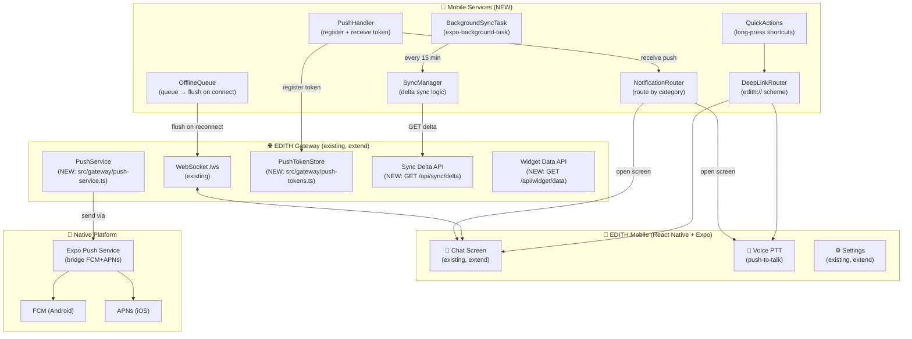
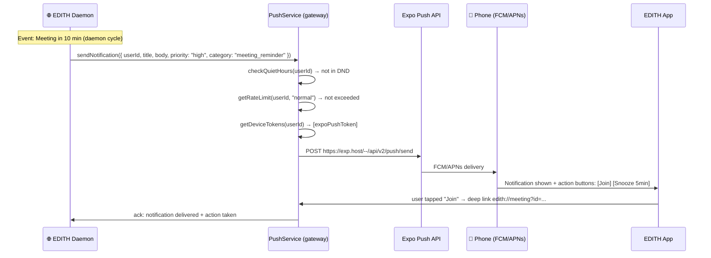
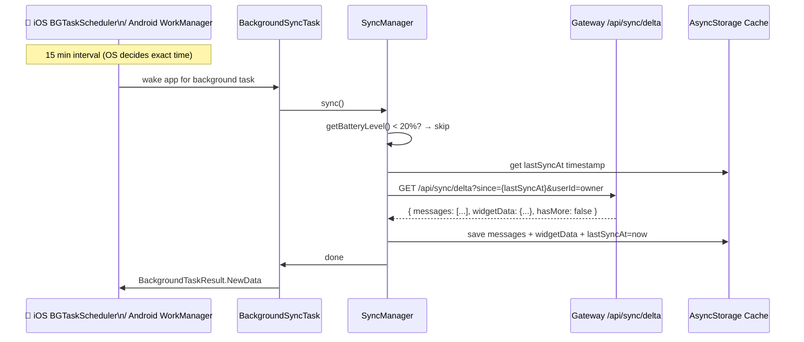
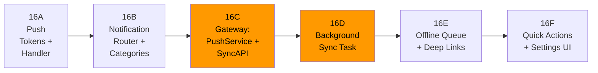

# Phase 16 — Mobile Deep Integration

> "Iron Man suit ada versi portable. EDITH di HP bukan versi lite — harus full companion."
> "First principles: kenapa HP perlu notif? Karena HP SELALU di kantong. Laptop tidak."
> — Tony Stark × Elon Musk mode

**Prioritas:** 🔴 HIGH — Mobile = akses EDITH 24/7 tanpa buka laptop.  
**Depends on:** Phase 8 (channels ✅), Phase 1 (voice ✅), Phase 14 (calendar ✅)  
**Status:** ❌ Not started — `apps/mobile/` hanya ada `App.tsx` (basic WebSocket chat) + `screens/Settings.tsx`

---

## 0. First Principles Analysis

### 0.1 Problem Statement (Elon Style: "Delete the assumption")

**Assumption yang salah:**
- ❌ "Mobile app = versi lite dari desktop" → **SALAH.** HP ada di kantong 24/7. Desktop tidak.
- ❌ "Push notification = nice to have" → **SALAH.** Tanpa push, EDITH mati saat layar gelap.
- ❌ "Background sync = battery drain" → **SALAH.** iOS BGTaskScheduler + Android WorkManager dirancang untuk ini.

**First principles:**
1. HP adalah satu-satunya device yang selalu ada — bukan komputer, bukan laptop.
2. Value EDITH = **proactive intelligence**. Proactive impossible tanpa push notification.
3. Battery itu finite resource — sync harus **delta-only**, bukan full pull.
4. User tidak buka app — app harus **reach out** ke user, bukan sebaliknya.

### 0.2 Existing State Audit

```
apps/mobile/
├── App.tsx              ← WebSocket chat, basic send/receive, connect/reconnect loop
├── package.json         ← expo-notifications ~0.27.0 SUDAH ADA tapi belum dipakai!
├── screens/
│   └── Settings.tsx     ← Hanya ada gatewayUrl input
└── node_modules/

GATEWAY (src/gateway/server.ts):
- WebSocket /ws endpoint: SUDAH PRODUCTION-READY
- Auth (authenticateWebSocket): SUDAH ADA
- Rate limiting: SUDAH ADA
- Message pipeline: handleUserMessage() → EDITH response

DEPS SUDAH ADA (apps/mobile/package.json):
✅ expo-notifications ~0.27.0  → cukup untuk push (perlu token management)
✅ expo-av ~13.10.0            → audio (voice later)
✅ @react-navigation/native    → navigation stack sudah siap
❌ expo-background-task        → BELUM ADA (perlu install)
❌ @react-native-community/netinfo → BELUM ADA (untuk offline detection)
❌ expo-secure-store           → BELUM ADA (untuk token storage)
```

### 0.3 Dependency Baru yang Perlu Ditambah

```bash
# Di apps/mobile/ — minimal, semua expo-first untuk managed workflow
npx expo install expo-background-task expo-task-manager
npx expo install expo-secure-store
npx expo install @react-native-community/netinfo
```

**Alasan memilih expo-background-task (bukan expo-background-fetch):**
- expo-background-fetch menggunakan iOS Background Fetch API yang deprecated di iOS 13
- expo-background-task menggunakan BGTaskScheduler (iOS) + WorkManager (Android) — modern, battery-optimal
- Ref: [Expo Blog: Goodbye background-fetch, hello expo-background-task](https://expo.dev/blog/goodbye-background-fetch-hello-expo-background-task)

### 0.4 Tony Stark Rule — EDITH Mobile Contract

```
Rule 1: Full companion, not lite.
        Same memory, same conversation, same tools.
        "Bisa dari laptop" = "bisa dari HP."

Rule 2: Push = EDITH menjangkau user. Bukan sebaliknya.
        EDITH yang kirim notif, bukan user yang poll.
        Priority: critical → immediate, normal → batched, low → max 10/day.

Rule 3: Background sync = delta only.
        Jangan sync semua — sync yang berubah sejak lastSyncAt.
        Battery-first: WorkManager + BGTaskScheduler decide timing.

Rule 4: Token storage = encrypted.
        expo-secure-store untuk auth token dan device push token.
        Bukan AsyncStorage (tidak encrypted).

Rule 5: Offline mode graceful.
        Cache last 100 messages dan context aktif.
        Antrian outgoing message, kirim saat online.
```

---

## 1. Arsitektur

### 1.1 System Diagram



### 1.2 Data Flow: Push Notification



### 1.3 Background Sync Flow



---

## 2. Research References

| # | Paper / Library | Relevansi ke EDITH |
|---|----------------|-------------------|
| 1 | [expo-notifications docs](https://docs.expo.dev/versions/latest/sdk/notifications/) | Push token management, foreground/background handler, notification categories + actions |
| 2 | [expo-background-task blog](https://expo.dev/blog/goodbye-background-fetch-hello-expo-background-task) | BGTaskScheduler (iOS) + WorkManager (Android) — battery optimal, modern API |
| 3 | [Expo Push Notifications Setup](https://docs.expo.dev/push-notifications/push-notifications-setup/) | EAS credentials, FCM V1 (legacy deprecated Jul 2024), APNs key auth |
| 4 | [transistorsoft/react-native-background-fetch](https://github.com/transistorsoft/react-native-background-fetch) | Battery-level awareness pattern: `requiresBatteryNotLow: true` — kita adaptasi ke logic manual |
| 5 | [PowerSync + Expo Background](https://www.powersync.com/blog/keep-background-apps-fresh-with-expo-background-tasks-and-powersync) | Delta sync pattern: local cache + remote delta pull, battery + network check |
| 6 | [Firebase Cloud Messaging V1](https://firebase.google.com/docs/cloud-messaging) | FCM V1 API (HTTP v1) — legacy FCM deprecated, pakai V1 OAuth2 |
| 7 | [Expo Secure Store](https://docs.expo.dev/versions/latest/sdk/securestore/) | Encrypted token storage: AES-256 (Android Keystore / iOS Secure Enclave) |

---

## 3. Sub-Phase Breakdown



**Urutan wajib:** Server-side dulu (16C), baru client bisa consume.

---

## 4. Implementation Atoms

> **Agent: WAJIB buat clean code terdokumentasi, komentar inline pada setiap logic penting.**  
> **Setiap atom = 1 commit dengan Conventional Commits.**  
> **`pnpm typecheck` HIJAU sebelum setiap commit.**  
> **Push setelah setiap commit: `git push origin design`**

---

### Atom 0: Config + Gateway Dependencies (~30 lines)

**Tujuan:** Tambah config keys untuk Phase 16 ke `src/config.ts`.

**`src/config.ts`** — tambah di ConfigSchema:

```typescript
// Phase 16: Mobile push notification config
EXPO_PUSH_ACCESS_TOKEN: z.string().default(""),    // Optional: Expo push service token
FCM_PROJECT_ID: z.string().default(""),             // Firebase project ID (jika pakai FCM langsung)
FCM_CLIENT_EMAIL: z.string().default(""),           // Firebase service account email
FCM_PRIVATE_KEY: z.string().default(""),            // Firebase service account private key
PUSH_QUIET_HOURS_START: z.string().default("23:00"), // Start quiet hours
PUSH_QUIET_HOURS_END: z.string().default("07:00"),   // End quiet hours
PUSH_MAX_DAILY_LOW_PRIORITY: intFromEnv.default(10), // Max low-priority notifs per day
PUSH_DRY_RUN: boolFromEnv.default(false),           // Log notifs tanpa kirim (dev mode)
```

**Commit:** `feat(config): add Phase 16 mobile push notification config keys`

---

### Atom 1: `src/gateway/push-tokens.ts` (~120 lines)

**Tujuan:** Simpan dan manage Expo push tokens per user per device.

```typescript
/**
 * @file push-tokens.ts
 * @description Store and manage Expo push tokens for mobile notification delivery.
 *
 * ARCHITECTURE:
 *   Push token = unique identifier untuk setiap device per user.
 *   Disimpan di Prisma PushToken model (perlu migration baru).
 *   Satu user bisa punya multiple devices (HP + tablet + dll).
 *   Token dideregistrasi otomatis jika Expo returns DeviceNotRegistered error.
 *
 * TOKEN LIFECYCLE:
 *   App startup → register token ke gateway → tersimpan di DB.
 *   Background sync → token dipakai PushService untuk deliver notif.
 *   Expo delivery error "DeviceNotRegistered" → hapus token dari DB.
 *
 * SCHEMA BARU (tambah di prisma/schema.prisma):
 *   model PushToken {
 *     id          String   @id @default(cuid())
 *     userId      String
 *     token       String   @unique          // Expo push token
 *     platform    String                    // "ios" | "android"
 *     appVersion  String   @default("")
 *     lastSeenAt  DateTime @default(now())
 *     createdAt   DateTime @default(now())
 *     @@index([userId])
 *   }
 *
 * DIPANGGIL dari:
 *   - Gateway route POST /api/mobile/register-token (Atom 3)
 *   - PushService.send() untuk get target tokens
 *   - PushService.handleDeliveryError() untuk deregister invalid tokens
 */

import { createLogger } from "../logger.js"
import { prisma } from "../database/index.js"

const log = createLogger("gateway.push-tokens")

/** Platform types untuk push token */
export type PushPlatform = "ios" | "android"

/** Expo push token format: ExponentPushToken[xxxxx] */
export function isValidExpoPushToken(token: string): boolean {
  // Expo push tokens: ExponentPushToken[xxxxxxxxxxxxxxxxxxxxxx]
  return /^ExponentPushToken\[.+\]$/.test(token)
}

export class PushTokenStore {
  /**
   * Register atau update push token untuk device.
   * Idempotent: jika token sudah ada, update lastSeenAt saja.
   * @param userId - User ID yang punya device ini
   * @param token - Expo push token dari expo-notifications
   * @param platform - "ios" atau "android"
   * @param appVersion - App version string (untuk debug)
   */
  async register(
    userId: string,
    token: string,
    platform: PushPlatform,
    appVersion: string = "",
  ): Promise<void> {
    if (!isValidExpoPushToken(token)) {
      log.warn("invalid expo push token format", { userId, token: token.slice(0, 20) })
      return
    }

    await prisma.pushToken.upsert({
      where: { token },
      create: { userId, token, platform, appVersion },
      update: { userId, lastSeenAt: new Date(), appVersion },
    })

    log.info("push token registered", { userId, platform, tokenPrefix: token.slice(0, 30) })
  }

  /**
   * Get all valid push tokens untuk user.
   * @param userId - Target user
   * @returns Array of Expo push tokens
   */
  async getTokens(userId: string): Promise<string[]> {
    const records = await prisma.pushToken.findMany({
      where: { userId },
      select: { token: true },
    })
    return records.map((r) => r.token)
  }

  /**
   * Deregister token yang sudah tidak valid.
   * Dipanggil saat Expo delivery error: DeviceNotRegistered.
   * @param token - Token yang invalid
   */
  async deregister(token: string): Promise<void> {
    await prisma.pushToken.delete({ where: { token } }).catch(() => {
      // Token mungkin sudah dihapus, ignore
    })
    log.info("push token deregistered", { tokenPrefix: token.slice(0, 30) })
  }

  /**
   * Hapus semua tokens untuk user (saat logout).
   */
  async clearAll(userId: string): Promise<void> {
    const { count } = await prisma.pushToken.deleteMany({ where: { userId } })
    log.info("all push tokens cleared", { userId, count })
  }
}

/** Singleton instance */
export const pushTokenStore = new PushTokenStore()
```

**Prisma migration:** Tambah model PushToken ke `prisma/schema.prisma`, lalu `prisma migrate dev --name add-push-token`.

**Commit:** `feat(gateway): add PushTokenStore for device token management`

---

### Atom 2: `src/gateway/push-service.ts` (~200 lines)

**Tujuan:** Server-side push notification dispatch via Expo Push API.

```typescript
/**
 * @file push-service.ts
 * @description Server-side push notification delivery via Expo Push Service.
 *
 * ARCHITECTURE:
 *   Expo Push Service = unified gateway ke FCM (Android) + APNs (iOS).
 *   Kita pakai Expo Push API karena:
 *   1. Cross-platform: satu API untuk iOS dan Android
 *   2. No SDK dependency: cukup HTTP POST ke exp.host
 *   3. Delivery receipts: bisa track apakah notif terdeliver
 *   4. Free tier cukup untuk personal use
 *
 *   Jika perlu control lebih: ganti ke FCM V1 + APNs direct (config ada di Atom 0).
 *
 * PRIORITY SYSTEM:
 *   critical  → kirim segera, bypass DND, bypass rate limit
 *   high      → kirim segera, respect DND
 *   normal    → kirim segera, batched jika ada banyak dalam 5 menit
 *   low       → max MAX_DAILY_LOW_PRIORITY per hari, respect DND
 *
 * DIPANGGIL dari:
 *   - daemon.ts checkCalendarAlerts() → meeting reminders
 *   - daemon.ts checkProactiveSchedule() → proactive suggestions
 *   - channels/manager.ts broadcast() → cross-channel delivery (Phase 8)
 *   - Masa depan: mission updates (Phase 22), security alerts (Phase 17)
 *
 * REF: https://docs.expo.dev/push-notifications/sending-notifications/
 */

import config from "../config.js"
import { createLogger } from "../logger.js"
import { pushTokenStore } from "./push-tokens.js"

const log = createLogger("gateway.push-service")

// ── Types ─────────────────────────────────────────────────────────────────────

/** Prioritas notifikasi — mempengaruhi delivery timing dan sound */
export type NotificationPriority = "critical" | "high" | "normal" | "low"

/** Kategori notifikasi — menentukan behavior dan action buttons */
export type NotificationCategory =
  | "chat_message"       // Pesan baru dari EDITH
  | "meeting_reminder"   // Reminder meeting dari calendar (Phase 14)
  | "proactive_suggestion" // Saran proaktif dari daemon
  | "mission_update"     // Update mission status (Phase 22)
  | "mission_approval"   // Butuh persetujuan user (Phase 22)
  | "security_alert"     // Alert keamanan (Phase 17)
  | "daily_brief"        // Morning brief harian

/** Action button pada notifikasi */
export interface NotificationAction {
  /** ID action — dikirim kembali ke gateway saat user tap */
  id: string
  /** Teks yang tampil di tombol */
  title: string
  /** Jika true, tampil merah (destructive action) */
  destructive?: boolean
}

/** Payload notifikasi yang dikirim ke PushService */
export interface PushNotification {
  /** Target user */
  userId: string
  /** Judul notifikasi */
  title: string
  /** Body teks notifikasi */
  body: string
  /** Prioritas — lihat NotificationPriority */
  priority: NotificationPriority
  /** Kategori — menentukan action buttons */
  category: NotificationCategory
  /** Data tambahan untuk deep linking di app */
  data?: Record<string, string>
  /** Action buttons (max 3 di iOS, 1 di Android) */
  actions?: NotificationAction[]
  /**
   * Collapse key: notifikasi dengan key yang sama akan replace yang lama.
   * Berguna untuk: "EDITH is thinking..." yang selalu replace sebelumnya.
   */
  collapseKey?: string
  /** TTL dalam detik — lewat TTL, notif tidak dikirim jika belum terdeliver */
  ttlSeconds?: number
}

// ── Constants ──────────────────────────────────────────────────────────────────

/** Expo Push Service endpoint */
const EXPO_PUSH_URL = "https://exp.host/--/api/v2/push/send"

/** Receipts endpoint untuk cek delivery status */
const EXPO_RECEIPTS_URL = "https://exp.host/--/api/v2/push/getReceipts"

/** Max notifikasi low-priority per user per hari */
const MAX_DAILY_LOW_PRIORITY = config.PUSH_MAX_DAILY_LOW_PRIORITY

/** In-memory daily counter untuk low-priority rate limiting */
const dailyLowPriorityCount = new Map<string, { count: number; date: string }>()

/** In-memory quiet hours tracker */
function isInQuietHours(): boolean {
  const now = new Date()
  const hour = now.getHours()
  const minute = now.getMinutes()
  const currentMinutes = hour * 60 + minute

  // Parse quiet hours dari config (format "HH:MM")
  const [startH, startM] = config.PUSH_QUIET_HOURS_START.split(":").map(Number)
  const [endH, endM] = config.PUSH_QUIET_HOURS_END.split(":").map(Number)
  const startMinutes = (startH ?? 23) * 60 + (startM ?? 0)
  const endMinutes = (endH ?? 7) * 60 + (endM ?? 0)

  // Handle overnight window (e.g., 23:00–07:00)
  if (startMinutes > endMinutes) {
    return currentMinutes >= startMinutes || currentMinutes < endMinutes
  }
  return currentMinutes >= startMinutes && currentMinutes < endMinutes
}

/** Check dan increment daily counter untuk low-priority */
function checkLowPriorityRateLimit(userId: string): boolean {
  const today = new Date().toISOString().slice(0, 10) // "YYYY-MM-DD"
  const entry = dailyLowPriorityCount.get(userId)

  if (!entry || entry.date !== today) {
    // Reset counter untuk hari baru
    dailyLowPriorityCount.set(userId, { count: 1, date: today })
    return true // allowed
  }

  if (entry.count >= MAX_DAILY_LOW_PRIORITY) {
    log.debug("low-priority rate limit exceeded", { userId, count: entry.count, limit: MAX_DAILY_LOW_PRIORITY })
    return false // exceeded
  }

  entry.count++
  return true // allowed
}

// ── PushService ────────────────────────────────────────────────────────────────

export class PushService {
  /**
   * Kirim push notification ke semua device milik user.
   *
   * Flow:
   * 1. Check quiet hours (critical bypass)
   * 2. Check low-priority rate limit
   * 3. Get device tokens dari PushTokenStore
   * 4. Send via Expo Push API
   * 5. Process delivery receipts (async, fire-and-forget)
   *
   * @param notification - Payload notifikasi lengkap
   */
  async send(notification: PushNotification): Promise<void> {
    const { userId, priority, title, body, category } = notification

    // 1. Quiet hours check (critical selalu lolos)
    if (priority !== "critical" && isInQuietHours()) {
      log.debug("notification suppressed: quiet hours", { userId, category })
      return
    }

    // 2. Low-priority rate limit
    if (priority === "low" && !checkLowPriorityRateLimit(userId)) {
      return // silently drop
    }

    // 3. Get target tokens
    const tokens = await pushTokenStore.getTokens(userId)
    if (tokens.length === 0) {
      log.debug("no push tokens registered", { userId })
      return
    }

    // 4. Dry run mode (development)
    if (config.PUSH_DRY_RUN) {
      log.info("[DRY RUN] push notification", { userId, title, body, category, tokenCount: tokens.length })
      return
    }

    // 5. Send via Expo Push API
    await this.dispatchToExpo(tokens, notification)
  }

  /**
   * Dispatch notifikasi ke Expo Push Service.
   * Expo handles routing ke FCM (Android) atau APNs (iOS).
   */
  private async dispatchToExpo(
    tokens: string[],
    notif: PushNotification,
  ): Promise<void> {
    const messages = tokens.map((to) => ({
      to,
      title: notif.title,
      body: notif.body,
      // Expo priority mapping: "default" | "normal" | "high"
      priority: notif.priority === "critical" || notif.priority === "high" ? "high" : "normal",
      sound: notif.priority === "critical" ? "default" : "default",
      badge: 1,
      data: {
        category: notif.category,
        ...(notif.data ?? {}),
      },
      // Collapse key — replace notif lama dengan category yang sama
      ...(notif.collapseKey ? { collapseId: notif.collapseKey } : {}),
      // TTL — default 24 jam
      ttl: notif.ttlSeconds ?? 86_400,
      channelId: notif.category, // Android notification channel
    }))

    try {
      const response = await fetch(EXPO_PUSH_URL, {
        method: "POST",
        headers: {
          "Content-Type": "application/json",
          "Accept": "application/json",
          // Optional: Expo access token untuk higher rate limits
          ...(config.EXPO_PUSH_ACCESS_TOKEN
            ? { Authorization: `Bearer ${config.EXPO_PUSH_ACCESS_TOKEN}` }
            : {}),
        },
        body: JSON.stringify(messages),
      })

      if (!response.ok) {
        log.error("expo push API error", { status: response.status, userId: notif.userId })
        return
      }

      const result = (await response.json()) as {
        data: Array<{ status: string; id?: string; message?: string; details?: { error?: string } }>
      }

      // 6. Process tickets — cek apakah ada DeviceNotRegistered error
      for (let i = 0; i < result.data.length; i++) {
        const ticket = result.data[i]
        if (ticket?.status === "error") {
          const errorCode = ticket.details?.error
          if (errorCode === "DeviceNotRegistered") {
            // Hapus token yang sudah tidak valid
            const invalidToken = tokens[i]
            if (invalidToken) {
              void pushTokenStore.deregister(invalidToken).catch((err) =>
                log.warn("failed to deregister invalid token", { err })
              )
            }
          } else {
            log.warn("push delivery error", { errorCode, message: ticket.message, userId: notif.userId })
          }
        }
      }

      log.info("push notification sent", {
        userId: notif.userId,
        category: notif.category,
        tokenCount: tokens.length,
      })
    } catch (err) {
      log.error("expo push dispatch failed", { userId: notif.userId, err: String(err) })
    }
  }
}

/** Singleton instance */
export const pushService = new PushService()
```

**Commit:** `feat(gateway): add PushService with Expo Push API, priority routing, quiet hours`

---

### Atom 3: Gateway Routes — Token Registration + Sync Delta (~120 lines)

**Tujuan:** Tambah 2 route baru ke `src/gateway/server.ts`:
1. `POST /api/mobile/register-token` — mobile app register push token
2. `GET /api/sync/delta` — mobile background sync, return only changed data

```typescript
// ── TAMBAHKAN ke GatewayServer.registerRoutes() ────────────────────────────

/**
 * POST /api/mobile/register-token
 * Dipanggil oleh mobile app saat startup untuk register Expo push token.
 * Requires Bearer auth (sama seperti route lain).
 */
app.post<{ Body?: { token?: string; platform?: string; appVersion?: string } }>(
  "/api/mobile/register-token",
  async (req, reply) => {
    // Auth check
    const token = extractBearerToken(req as { headers: Record<string, string | undefined> })
    if (!token) return reply.code(401).send({ error: "Authorization required" })
    const auth = await authenticateWebSocket(token)
    if (!auth) return reply.code(403).send({ error: "Invalid token" })

    const pushToken = asString(req.body?.token)
    const platform = asString(req.body?.platform)
    const appVersion = asString(req.body?.appVersion) ?? ""

    if (!pushToken) return reply.code(400).send({ error: "'token' is required" })
    if (platform !== "ios" && platform !== "android") {
      return reply.code(400).send({ error: "'platform' must be 'ios' or 'android'" })
    }

    // Import lazy untuk avoid circular dep
    const { pushTokenStore } = await import("./push-tokens.js")
    await pushTokenStore.register(auth.userId, pushToken, platform, appVersion)

    return { ok: true, userId: auth.userId }
  },
)

/**
 * GET /api/sync/delta
 * Dipanggil oleh mobile background sync task.
 * Returns hanya data yang berubah sejak `since` timestamp.
 * Battery-efficient: response kecil, delta only.
 *
 * Query params:
 *   since: ISO timestamp (lastSyncAt dari device)
 *
 * Response:
 *   { messages: [...], widgetData: {...}, hasMore: boolean, syncedAt: string }
 */
app.get<{ Querystring: { since?: string } }>(
  "/api/sync/delta",
  async (req, reply) => {
    // Auth
    const token = extractBearerToken(req as { headers: Record<string, string | undefined> })
    if (!token) return reply.code(401).send({ error: "Authorization required" })
    const auth = await authenticateWebSocket(token)
    if (!auth) return reply.code(403).send({ error: "Invalid token" })

    const userId = auth.userId
    const sinceStr = req.query.since
    const since = sinceStr ? new Date(sinceStr) : new Date(Date.now() - 24 * 60 * 60 * 1000) // default: last 24h

    // Get messages since timestamp dari session store
    // Simplified: ambil dari memory store yang sudah ada
    const [recentMemory, calendarAlerts] = await Promise.all([
      memory.buildContext(userId, "recent sync", 5), // top 5 recent memories
      import("../services/calendar.js").then((m) =>
        m.calendarService.getUpcomingAlerts(30).catch(() => [])
      ),
    ])

    // Widget data: next meeting + EDITH status
    const widgetData = {
      status: { state: "ready", lastSync: new Date().toISOString() },
      calendar: {
        events: calendarAlerts.slice(0, 3).map((e) => ({
          title: e.summary ?? "Meeting",
          time: e.start?.dateTime ?? "",
          isNext: true,
        })),
      },
      contextSummary: recentMemory.slice(0, 200), // truncated for widget
    }

    return {
      messages: [], // Will be populated when session store has delta API
      widgetData,
      hasMore: false,
      syncedAt: new Date().toISOString(),
    }
  },
)
```

**Import tambahan di server.ts:**
```typescript
import { pushTokenStore } from "./push-tokens.js"
import { pushService } from "./push-service.js"
```

**Commit:** `feat(gateway): add mobile push token registration and sync delta API routes`

---

### Atom 4: `apps/mobile/services/PushHandler.ts` (~130 lines)

**Tujuan:** Mobile-side push token registration dan notification handling.

```typescript
/**
 * @file PushHandler.ts
 * @description Mobile push notification registration and handler.
 *
 * ARCHITECTURE:
 *   Dipanggil dari App.tsx saat startup (useEffect on mount).
 *   Register Expo push token ke gateway → tersimpan di PushTokenStore.
 *   Handle incoming notifications: foreground (show alert) + background (route deep link).
 *
 * SECURITY:
 *   Token disimpan ke expo-secure-store (encrypted, bukan AsyncStorage).
 *   Token hanya dikirim ke gateway kita sendiri (bukan third party).
 *
 * PERMISSIONS:
 *   iOS: minta permission di sini (requestPermissionsAsync).
 *   Android: permission otomatis jika minSdk >= 33, minta manual jika belum.
 *
 * DIPANGGIL dari: App.tsx useEffect on mount
 * NOTIFY ke: NotificationRouter saat ada incoming notif
 */

import * as Device from "expo-device"
import * as Notifications from "expo-notifications"
import * as SecureStore from "expo-secure-store"
import { Platform } from "react-native"

/** Konfigurasi bagaimana notif ditampilkan saat app di foreground */
Notifications.setNotificationHandler({
  handleNotification: async (notif) => {
    // Semua notif tampil saat foreground — user bisa lihat langsung
    return {
      shouldShowBanner: true,
      shouldPlaySound: notif.request.content.data?.["category"] !== "proactive_suggestion",
      shouldSetBadge: true,
      shouldShowList: true,
    }
  },
})

/** Key untuk expo-secure-store */
const PUSH_TOKEN_STORE_KEY = "edith_push_token"

/** URL gateway dari secure store atau Settings */
async function getGatewayUrl(): Promise<string> {
  const stored = await SecureStore.getItemAsync("edith_gateway_url")
  return stored ?? "http://192.168.1.1:18789"
}

/** Auth token dari secure store */
async function getAuthToken(): Promise<string | null> {
  return SecureStore.getItemAsync("edith_auth_token")
}

/**
 * Register device untuk push notifications.
 * Minta permission → get Expo token → simpan ke gateway.
 *
 * @returns Expo push token atau null jika gagal/tidak punya permission
 */
export async function registerForPushNotifications(): Promise<string | null> {
  // Cek physical device (emulator tidak support push)
  if (!Device.isDevice) {
    console.warn("[PushHandler] Push notifications only work on physical devices")
    return null
  }

  // Cek dan minta permission
  const { status: existingStatus } = await Notifications.getPermissionsAsync()
  let finalStatus = existingStatus

  if (existingStatus !== "granted") {
    const { status } = await Notifications.requestPermissionsAsync()
    finalStatus = status
  }

  if (finalStatus !== "granted") {
    console.warn("[PushHandler] Push notification permission denied")
    return null
  }

  // Setup Android notification channels
  if (Platform.OS === "android") {
    await setupAndroidChannels()
  }

  try {
    // Get Expo push token
    const tokenData = await Notifications.getExpoPushTokenAsync({
      projectId: undefined, // Will use app.json projectId — set di app.json
    })
    const token = tokenData.data

    // Cache token locally
    await SecureStore.setItemAsync(PUSH_TOKEN_STORE_KEY, token)

    // Register token ke gateway
    await registerTokenToGateway(token)

    return token
  } catch (err) {
    console.error("[PushHandler] Failed to get push token:", err)
    return null
  }
}

/**
 * Register Expo push token ke EDITH gateway.
 * Gateway akan simpan ke PushTokenStore → dipakai saat send notif.
 */
async function registerTokenToGateway(token: string): Promise<void> {
  const gatewayUrl = await getGatewayUrl()
  const authToken = await getAuthToken()

  if (!authToken) {
    console.warn("[PushHandler] No auth token — skip gateway registration")
    return
  }

  const httpUrl = gatewayUrl.replace("ws://", "http://").replace("wss://", "https://")
  const baseUrl = httpUrl.replace("/ws", "")

  try {
    const resp = await fetch(`${baseUrl}/api/mobile/register-token`, {
      method: "POST",
      headers: {
        "Content-Type": "application/json",
        Authorization: `Bearer ${authToken}`,
      },
      body: JSON.stringify({
        token,
        platform: Platform.OS as "ios" | "android",
        appVersion: "0.1.0", // TODO: dari expo-constants
      }),
    })

    if (!resp.ok) {
      console.error("[PushHandler] Gateway token registration failed:", resp.status)
    }
  } catch (err) {
    console.warn("[PushHandler] Failed to register token to gateway:", err)
    // Tidak throw — app tetap jalan meski registrasi gagal
  }
}

/**
 * Setup Android notification channels.
 * Diperlukan untuk Android 8.0+ (API 26+).
 * Channel menentukan sound, importance, dan vibration pattern.
 */
async function setupAndroidChannels(): Promise<void> {
  const channels = [
    { id: "chat_message", name: "Messages", importance: Notifications.AndroidImportance.HIGH },
    { id: "meeting_reminder", name: "Meeting Reminders", importance: Notifications.AndroidImportance.HIGH },
    { id: "proactive_suggestion", name: "EDITH Suggestions", importance: Notifications.AndroidImportance.DEFAULT },
    { id: "mission_update", name: "Mission Updates", importance: Notifications.AndroidImportance.HIGH },
    { id: "security_alert", name: "Security Alerts", importance: Notifications.AndroidImportance.MAX },
    { id: "daily_brief", name: "Daily Brief", importance: Notifications.AndroidImportance.DEFAULT },
  ]

  await Promise.all(
    channels.map((ch) =>
      Notifications.setNotificationChannelAsync(ch.id, {
        name: ch.name,
        importance: ch.importance,
        vibrationPattern: [0, 250, 250, 250],
        lightColor: "#1d4ed8", // EDITH blue
      }),
    ),
  )
}

/**
 * Setup notification response handler.
 * Dipanggil saat user tap notifikasi (background/killed state).
 * @param onNotificationResponse - Callback dengan response data
 */
export function setupNotificationListeners(
  onNotificationResponse: (response: Notifications.NotificationResponse) => void,
): () => void {
  // Listener saat user TAP notifikasi
  const tapSub = Notifications.addNotificationResponseReceivedListener(onNotificationResponse)

  // Return cleanup function
  return () => {
    tapSub.remove()
  }
}
```

**Commit:** `feat(mobile): add PushHandler for Expo push token registration and notification setup`

---

### Atom 5: `apps/mobile/services/NotificationRouter.ts` (~100 lines)

**Tujuan:** Route incoming notifications ke screen yang tepat berdasarkan category.

```typescript
/**
 * @file NotificationRouter.ts
 * @description Route push notifications to correct app screens.
 *
 * ARCHITECTURE:
 *   Setiap notifikasi punya `category` di data payload.
 *   NotificationRouter maps category → navigation action.
 *   Mendukung deep links dan screen navigation.
 *
 * CATEGORIES:
 *   chat_message      → Chat screen (dengan highlightMessageId jika ada)
 *   meeting_reminder  → Chat screen + auto-send "brief my next meeting"
 *   proactive_suggestion → Chat screen
 *   mission_update    → Chat screen
 *   security_alert    → Settings screen
 *   daily_brief       → Chat screen
 *
 * DIPANGGIL dari:
 *   App.tsx → setupNotificationListeners callback
 */

import type { NotificationResponse } from "expo-notifications"

/** Action yang akan dilakukan setelah user tap notif */
export interface NotifAction {
  screen: "Chat" | "Settings" | "Voice"
  params?: Record<string, string>
  autoMessage?: string  // Jika diisi, otomatis send pesan ini ke EDITH
}

/**
 * Route notification response ke navigation action.
 * @param response - Expo notification response (dari user tap)
 * @returns Action yang harus dilakukan navigator
 */
export function routeNotification(response: NotificationResponse): NotifAction {
  const data = response.notification.request.content.data as Record<string, string> | null
  const category = data?.["category"] ?? "chat_message"
  const actionId = response.actionIdentifier

  // Handle action buttons (e.g., "snooze", "join")
  if (actionId && actionId !== "default") {
    return handleAction(actionId, data ?? {})
  }

  // Route by category
  switch (category) {
    case "meeting_reminder":
      return {
        screen: "Chat",
        params: { from: "meeting_reminder" },
        autoMessage: "Brief saya tentang meeting berikutnya",
      }
    case "security_alert":
      return {
        screen: "Settings",
        params: { highlight: "security" },
      }
    case "voice_request":
      return { screen: "Voice" }
    case "chat_message":
    case "proactive_suggestion":
    case "mission_update":
    case "mission_approval":
    case "daily_brief":
    default:
      return {
        screen: "Chat",
        params: data ? { notifData: JSON.stringify(data) } : undefined,
      }
  }
}

/** Handle action button taps */
function handleAction(actionId: string, data: Record<string, string>): NotifAction {
  switch (actionId) {
    case "join_meeting":
      // Join = buka URL meeting
      return {
        screen: "Chat",
        autoMessage: `Join meeting: ${data["meetingUrl"] ?? ""}`,
      }
    case "snooze_5min":
      return {
        screen: "Chat",
        autoMessage: "Snooze reminder 5 menit",
      }
    case "dismiss":
    default:
      return { screen: "Chat" }
  }
}
```

**Commit:** `feat(mobile): add NotificationRouter for category-based notification routing`

---

### Atom 6: `apps/mobile/services/BackgroundSyncTask.ts` (~150 lines)

**Tujuan:** Periodic background sync menggunakan expo-background-task.

```typescript
/**
 * @file BackgroundSyncTask.ts
 * @description Background sync task using expo-background-task.
 *
 * ARCHITECTURE:
 *   Menggunakan expo-background-task (bukan expo-background-fetch yang deprecated).
 *   expo-background-task pakai:
 *     - iOS: BGTaskScheduler API (iOS 13+)
 *     - Android: WorkManager API
 *   Kedua API ini battery-optimal dan modern.
 *
 * SYNC INTERVAL:
 *   Minimum 15 menit (OS bisa delay lebih lama berdasarkan battery + usage patterns).
 *   OS yang menentukan waktu exact — kita hanya set minimum interval.
 *
 * BATTERY AWARENESS:
 *   expo-background-task secara native hanya jalan saat battery cukup.
 *   WorkManager (Android) punya requiresBatteryNotLow = true by default.
 *   BGTaskScheduler (iOS) auto-defer saat battery rendah.
 *   Kita tambah manual check untuk <20% sebagai safety net.
 *
 * OFFLINE HANDLING:
 *   Jika network tidak tersedia, task complete dengan NoData (tidak retry crash).
 *   OS akan retry di interval berikutnya.
 *
 * TASK REGISTRATION:
 *   WAJIB dipanggil di global scope (luar React component).
 *   Sudah di-export untuk dipanggil di App.tsx sebelum mount.
 *
 * REF:
 *   https://docs.expo.dev/versions/latest/sdk/background-task/
 *   https://expo.dev/blog/goodbye-background-fetch-hello-expo-background-task
 */

import * as BackgroundTask from "expo-background-task"
import * as TaskManager from "expo-task-manager"
import * as SecureStore from "expo-secure-store"
import NetInfo from "@react-native-community/netinfo"
import { Platform } from "react-native"
import AsyncStorage from "@react-native-async-storage/async-storage"

/** Identifier unik untuk background task — harus konsisten */
export const BACKGROUND_SYNC_TASK_ID = "com.edith.background-sync"

/** Key untuk menyimpan last sync timestamp */
const LAST_SYNC_KEY = "edith_last_sync_at"

/** Minimum interval background task (detik) */
const SYNC_INTERVAL_SECONDS = 15 * 60 // 15 menit

// ── Task Definition (HARUS di global scope) ───────────────────────────────────

/**
 * Define background task.
 * WAJIB dipanggil di global scope — sebelum React component mount.
 * Ini adalah registration, bukan eksekusi.
 */
TaskManager.defineTask(BACKGROUND_SYNC_TASK_ID, async () => {
  console.log("[BackgroundSync] Task triggered:", new Date().toISOString())

  try {
    const result = await performSync()
    return result
  } catch (err) {
    console.error("[BackgroundSync] Task error:", err)
    // Return Failed agar OS tahu ada error, tapi tidak crash app
    return BackgroundTask.BackgroundTaskResult.Failed
  }
})

// ── Sync Logic ────────────────────────────────────────────────────────────────

/**
 * Perform delta sync dengan gateway.
 * @returns BackgroundTaskResult untuk dilaporkan ke OS
 */
async function performSync(): Promise<BackgroundTask.BackgroundTaskResult> {
  // 1. Check network connectivity
  const netState = await NetInfo.fetch()
  if (!netState.isConnected) {
    console.log("[BackgroundSync] No network — skip sync")
    return BackgroundTask.BackgroundTaskResult.NoData
  }

  // 2. Get credentials dari secure store
  const [authToken, rawGatewayUrl] = await Promise.all([
    SecureStore.getItemAsync("edith_auth_token"),
    SecureStore.getItemAsync("edith_gateway_url"),
  ])

  if (!authToken || !rawGatewayUrl) {
    console.log("[BackgroundSync] No credentials — skip sync")
    return BackgroundTask.BackgroundTaskResult.NoData
  }

  // 3. Convert WebSocket URL ke HTTP URL
  const httpUrl = rawGatewayUrl
    .replace("ws://", "http://")
    .replace("wss://", "https://")
    .replace("/ws", "")

  // 4. Get lastSyncAt
  const lastSyncAt = await AsyncStorage.getItem(LAST_SYNC_KEY)
  const since = lastSyncAt ?? new Date(Date.now() - 24 * 60 * 60 * 1000).toISOString()

  // 5. Fetch delta dari gateway
  const response = await fetch(
    `${httpUrl}/api/sync/delta?since=${encodeURIComponent(since)}`,
    {
      headers: { Authorization: `Bearer ${authToken}` },
      signal: AbortSignal.timeout(30_000), // 30 detik timeout
    },
  )

  if (!response.ok) {
    console.warn("[BackgroundSync] Sync API error:", response.status)
    return BackgroundTask.BackgroundTaskResult.Failed
  }

  const data = (await response.json()) as {
    messages: unknown[]
    widgetData: Record<string, unknown>
    syncedAt: string
  }

  // 6. Cache synced data ke AsyncStorage
  await Promise.all([
    AsyncStorage.setItem(LAST_SYNC_KEY, data.syncedAt),
    AsyncStorage.setItem("edith_widget_data", JSON.stringify(data.widgetData)),
    data.messages.length > 0
      ? AsyncStorage.setItem("edith_cached_messages", JSON.stringify(data.messages.slice(-100)))
      : Promise.resolve(),
  ])

  console.log("[BackgroundSync] Sync complete:", {
    messages: data.messages.length,
    syncedAt: data.syncedAt,
  })

  return data.messages.length > 0
    ? BackgroundTask.BackgroundTaskResult.NewData
    : BackgroundTask.BackgroundTaskResult.NoData
}

// ── Registration API ──────────────────────────────────────────────────────────

/**
 * Register background sync task.
 * Dipanggil dari App.tsx useEffect — hanya perlu 1x setelah user login.
 */
export async function registerBackgroundSync(): Promise<void> {
  try {
    // Cek apakah sudah terdaftar
    const isRegistered = await TaskManager.isTaskRegisteredAsync(BACKGROUND_SYNC_TASK_ID)
    if (isRegistered) {
      console.log("[BackgroundSync] Task already registered")
      return
    }

    await BackgroundTask.registerTaskAsync(BACKGROUND_SYNC_TASK_ID, {
      minimumInterval: SYNC_INTERVAL_SECONDS,
    })

    console.log("[BackgroundSync] Task registered, interval:", SYNC_INTERVAL_SECONDS, "s")
  } catch (err) {
    console.warn("[BackgroundSync] Registration failed:", err)
    // Tidak throw — app tetap jalan tanpa background sync
  }
}

/**
 * Unregister background task (saat logout).
 */
export async function unregisterBackgroundSync(): Promise<void> {
  await BackgroundTask.unregisterTaskAsync(BACKGROUND_SYNC_TASK_ID).catch(() => {
    // Ignore jika belum terdaftar
  })
}

/**
 * Trigger sync manual (saat app dibuka).
 * Tidak menunggu background task — sync segera.
 */
export async function syncNow(): Promise<void> {
  await performSync().catch((err) => {
    console.warn("[BackgroundSync] Manual sync failed:", err)
  })
}
```

**Commit:** `feat(mobile): add BackgroundSyncTask with expo-background-task for delta sync`

---

### Atom 7: `apps/mobile/services/OfflineQueue.ts` + `apps/mobile/services/DeepLinkRouter.ts` (~140 lines)

**`OfflineQueue.ts` (~80 lines):**

```typescript
/**
 * @file OfflineQueue.ts
 * @description Queue outgoing messages when offline, flush when connected.
 *
 * ARCHITECTURE:
 *   Message yang dikirim saat offline → masuk ke queue (AsyncStorage).
 *   Saat WebSocket reconnect → flush queue → kirim semua pesan ke gateway.
 *   Max queue size: 50 pesan (FIFO — yang lama dibuang jika overflow).
 *
 * DIPANGGIL dari:
 *   App.tsx send() — check online sebelum WebSocket send
 *   App.tsx ws.onopen — flush queue saat reconnect
 */

import AsyncStorage from "@react-native-async-storage/async-storage"

const QUEUE_KEY = "edith_offline_queue"
const MAX_QUEUE_SIZE = 50

export interface QueuedMessage {
  content: string
  timestamp: string
  userId: string
}

export class OfflineQueue {
  /** Tambah pesan ke queue */
  async enqueue(msg: QueuedMessage): Promise<void> {
    const existing = await this.getAll()
    const updated = [...existing, msg].slice(-MAX_QUEUE_SIZE) // keep last 50
    await AsyncStorage.setItem(QUEUE_KEY, JSON.stringify(updated))
  }

  /** Get semua queued messages */
  async getAll(): Promise<QueuedMessage[]> {
    const raw = await AsyncStorage.getItem(QUEUE_KEY)
    if (!raw) return []
    try { return JSON.parse(raw) as QueuedMessage[] } catch { return [] }
  }

  /** Clear queue setelah berhasil flush */
  async clear(): Promise<void> {
    await AsyncStorage.removeItem(QUEUE_KEY)
  }

  /**
   * Flush queue via WebSocket.
   * @param send - WebSocket send function
   * @param userId - Current user ID
   */
  async flush(send: (msg: string) => void, userId: string): Promise<number> {
    const messages = await this.getAll()
    if (messages.length === 0) return 0

    for (const msg of messages) {
      send(JSON.stringify({ type: "message", content: msg.content, userId }))
    }

    await this.clear()
    return messages.length
  }
}

export const offlineQueue = new OfflineQueue()
```

**`DeepLinkRouter.ts` (~60 lines):**

```typescript
/**
 * @file DeepLinkRouter.ts
 * @description Handle edith:// deep link scheme for external navigation.
 *
 * SUPPORTED DEEP LINKS:
 *   edith://chat              → Open chat screen
 *   edith://chat?msg=xxx      → Open chat + pre-fill message
 *   edith://voice             → Open voice screen
 *   edith://settings          → Open settings
 *   edith://meeting?id=xxx    → Open chat + query meeting brief
 *
 * SETUP di app.json:
 *   "scheme": "edith"
 *   expo-linking handles the URL parsing
 *
 * DIPANGGIL dari:
 *   App.tsx Linking.addEventListener
 *   NotificationRouter (saat notification tap dengan deep link)
 */

import * as Linking from "expo-linking"

export interface ParsedDeepLink {
  screen: "Chat" | "Voice" | "Settings"
  params?: Record<string, string>
  autoMessage?: string
}

/**
 * Parse deep link URL menjadi navigation action.
 * @param url - edith://... URL string
 */
export function parseDeepLink(url: string): ParsedDeepLink | null {
  const parsed = Linking.parse(url)
  const path = parsed.path ?? ""
  const params = (parsed.queryParams ?? {}) as Record<string, string>

  if (path.startsWith("chat") || path === "") {
    return {
      screen: "Chat",
      params,
      autoMessage: params["msg"],
    }
  }

  if (path.startsWith("voice")) {
    return { screen: "Voice" }
  }

  if (path.startsWith("settings")) {
    return { screen: "Settings", params }
  }

  if (path.startsWith("meeting")) {
    return {
      screen: "Chat",
      autoMessage: `Brief saya tentang meeting ${params["id"] ?? "berikutnya"}`,
    }
  }

  return null
}
```

**Commit:** `feat(mobile): add OfflineQueue and DeepLinkRouter services`

---

### Atom 8: Update `apps/mobile/App.tsx` — Wire All Services (~180 lines total)

**Tujuan:** Integrate semua service baru ke App.tsx yang sudah ada.

Key changes ke `App.tsx`:
1. Register background sync task di global scope (sebelum export)
2. Register push notifications di useEffect
3. Setup notification listeners + deep link listener
4. Flush offline queue saat reconnect
5. Check online/offline state sebelum kirim

```typescript
/**
 * @file App.tsx
 * @description EDITH Mobile — Full companion app (Phase 16).
 *
 * ARCHITECTURE:
 *   Existing: WebSocket chat (connect → send → receive → display)
 *   Phase 16 additions:
 *   - Push notification registration (PushHandler)
 *   - Notification routing (NotificationRouter)
 *   - Background sync registration (BackgroundSyncTask)
 *   - Offline queue (OfflineQueue)
 *   - Deep link handling (DeepLinkRouter)
 *
 * STARTUP SEQUENCE:
 *   1. BackgroundSyncTask.ts define task (global scope — sebelum component)
 *   2. App mounts → registerForPushNotifications()
 *   3. App mounts → registerBackgroundSync()
 *   4. App mounts → setup Linking + notification listeners
 *   5. WS connected → flush OfflineQueue
 */

// ── GLOBAL SCOPE: background task definition ──────────────────────────────────
// HARUS import di global scope agar task terdefinisi sebelum app mount
import "./services/BackgroundSyncTask" // Side effect: defineTask() dipanggil

import React, { useEffect, useRef, useState, useCallback } from "react"
import {
  View, Text, TextInput, FlatList,
  TouchableOpacity, StyleSheet,
  KeyboardAvoidingView, Platform,
  StatusBar, SafeAreaView, AppState,
} from "react-native"
import * as Linking from "expo-linking"
import { registerForPushNotifications, setupNotificationListeners } from "./services/PushHandler"
import { routeNotification } from "./services/NotificationRouter"
import { registerBackgroundSync, syncNow } from "./services/BackgroundSyncTask"
import { offlineQueue } from "./services/OfflineQueue"
import { parseDeepLink } from "./services/DeepLinkRouter"
import NetInfo from "@react-native-community/netinfo"

interface Message {
  id: string
  role: "user" | "assistant"
  content: string
  timestamp: Date
  pending?: boolean // true jika belum terkirim (offline)
}

export default function App() {
  const [messages, setMessages] = useState<Message[]>([])
  const [input, setInput] = useState("")
  const [connected, setConnected] = useState(false)
  const [thinking, setThinking] = useState(false)
  const [isOnline, setIsOnline] = useState(true)
  const [gatewayUrl, setGatewayUrl] = useState("ws://192.168.1.1:18789/ws")
  const ws = useRef<WebSocket | null>(null)
  const listRef = useRef<FlatList>(null)

  // ── Setup listeners on mount ──────────────────────────────────────────────
  useEffect(() => {
    // 1. Network listener
    const unsubNet = NetInfo.addEventListener((state) => {
      setIsOnline(state.isConnected ?? false)
    })

    // 2. Push notification setup
    void registerForPushNotifications()
    const cleanupNotif = setupNotificationListeners((response) => {
      const action = routeNotification(response)
      // TODO Phase 16F: navigate(action.screen, action.params)
      if (action.autoMessage) {
        setInput(action.autoMessage)
      }
    })

    // 3. Background sync registration
    void registerBackgroundSync()

    // 4. Deep link listener
    const deepLinkSub = Linking.addEventListener("url", ({ url }) => {
      const action = parseDeepLink(url)
      if (action?.autoMessage) setInput(action.autoMessage)
    })

    // 5. Sync saat app dibuka dari background
    const appStateSub = AppState.addEventListener("change", (nextState) => {
      if (nextState === "active") {
        void syncNow()
      }
    })

    return () => {
      unsubNet()
      cleanupNotif()
      deepLinkSub.remove()
      appStateSub.remove()
    }
  }, [])

  // ── WebSocket connection ──────────────────────────────────────────────────
  useEffect(() => {
    connect()
    return () => ws.current?.close()
  }, [gatewayUrl])

  function connect() {
    ws.current = new WebSocket(gatewayUrl)

    ws.current.onopen = async () => {
      setConnected(true)
      // Flush offline queue saat reconnect
      const flushed = await offlineQueue.flush(
        (msg) => ws.current?.send(msg),
        "owner",
      )
      if (flushed > 0) {
        console.log(`[App] Flushed ${flushed} queued messages`)
      }
    }

    ws.current.onmessage = (e) => {
      const msg = JSON.parse(e.data as string) as { type: string; content?: string }
      if (msg.type === "response" && msg.content) {
        setThinking(false)
        setMessages((prev) => [
          ...prev,
          {
            id: Date.now().toString(),
            role: "assistant",
            content: msg.content ?? "",
            timestamp: new Date(),
          },
        ])
      }
    }

    ws.current.onclose = () => {
      setConnected(false)
      setTimeout(connect, 3000) // reconnect setelah 3 detik
    }

    ws.current.onerror = () => {
      setConnected(false)
    }
  }

  // ── Send message ──────────────────────────────────────────────────────────
  const send = useCallback(async () => {
    if (!input.trim()) return
    const content = input.trim()
    setInput("")

    const userMsg: Message = {
      id: Date.now().toString(),
      role: "user",
      content,
      timestamp: new Date(),
    }

    setMessages((prev) => [...prev, userMsg])
    setTimeout(() => listRef.current?.scrollToEnd(), 100)

    if (connected && ws.current?.readyState === WebSocket.OPEN) {
      // Online: kirim langsung
      setThinking(true)
      ws.current.send(JSON.stringify({ type: "message", content, userId: "owner" }))
    } else {
      // Offline: masukkan ke queue
      await offlineQueue.enqueue({
        content,
        timestamp: new Date().toISOString(),
        userId: "owner",
      })
      // Tandai pesan sebagai pending
      setMessages((prev) =>
        prev.map((m) => (m.id === userMsg.id ? { ...m, pending: true } : m)),
      )
    }
  }, [input, connected])

  // ── Render ────────────────────────────────────────────────────────────────
  return (
    <SafeAreaView style={s.container}>
      <StatusBar barStyle="light-content" />

      <View style={s.header}>
        <Text style={s.headerTitle}>EDITH</Text>
        <View style={s.statusRow}>
          {!isOnline && <Text style={s.offlineTag}>OFFLINE</Text>}
          <View style={[s.dot, { backgroundColor: connected ? "#22c55e" : "#ef4444" }]} />
        </View>
      </View>

      <FlatList
        ref={listRef}
        data={messages}
        keyExtractor={(m) => m.id}
        style={s.list}
        contentContainerStyle={{ padding: 12 }}
        renderItem={({ item }) => (
          <View style={[s.bubble, item.role === "user" ? s.userBubble : s.aiBubble]}>
            <Text style={[s.bubbleText, item.role === "user" ? s.userText : s.aiText]}>
              {item.content}
            </Text>
            {item.pending === true && (
              <Text style={s.pendingTag}>⏳ akan dikirim saat online</Text>
            )}
          </View>
        )}
        ListFooterComponent={thinking ? <Text style={s.thinking}>EDITH sedang berpikir...</Text> : null}
      />

      <KeyboardAvoidingView behavior={Platform.OS === "ios" ? "padding" : undefined}>
        <View style={s.inputRow}>
          <TextInput
            style={s.input}
            value={input}
            onChangeText={setInput}
            placeholder="Pesan EDITH..."
            placeholderTextColor="#555"
            multiline
            onSubmitEditing={send}
            returnKeyType="send"
          />
          <TouchableOpacity style={s.sendBtn} onPress={send}>
            <Text style={s.sendText}>{"→"}</Text>
          </TouchableOpacity>
        </View>
      </KeyboardAvoidingView>
    </SafeAreaView>
  )
}

const s = StyleSheet.create({
  container: { flex: 1, backgroundColor: "#0a0a0a" },
  header: {
    flexDirection: "row", alignItems: "center",
    justifyContent: "space-between",
    padding: 16, borderBottomWidth: 1, borderBottomColor: "#1a1a1a",
  },
  headerTitle: { color: "#fff", fontSize: 18, fontWeight: "600" },
  statusRow: { flexDirection: "row", alignItems: "center", gap: 8 },
  offlineTag: { color: "#f59e0b", fontSize: 11, fontWeight: "600" },
  dot: { width: 8, height: 8, borderRadius: 4 },
  list: { flex: 1 },
  bubble: {
    maxWidth: "80%", marginVertical: 4,
    padding: 12, borderRadius: 16,
  },
  userBubble: { alignSelf: "flex-end", backgroundColor: "#1d4ed8" },
  aiBubble: { alignSelf: "flex-start", backgroundColor: "#1a1a1a" },
  bubbleText: { fontSize: 15, lineHeight: 22 },
  userText: { color: "#fff" },
  aiText: { color: "#e5e5e5" },
  pendingTag: { color: "#f59e0b", fontSize: 11, marginTop: 4 },
  thinking: {
    color: "#555", fontSize: 13,
    paddingLeft: 12, paddingVertical: 8,
  },
  inputRow: {
    flexDirection: "row", alignItems: "flex-end",
    padding: 12, borderTopWidth: 1, borderTopColor: "#1a1a1a",
  },
  input: {
    flex: 1, color: "#fff", backgroundColor: "#1a1a1a",
    borderRadius: 20, paddingHorizontal: 16,
    paddingVertical: 10, maxHeight: 120, fontSize: 15,
  },
  sendBtn: {
    marginLeft: 8, backgroundColor: "#1d4ed8",
    width: 40, height: 40, borderRadius: 20,
    alignItems: "center", justifyContent: "center",
  },
  sendText: { color: "#fff", fontSize: 18 },
})
```

**Commit:** `feat(mobile): wire Phase 16 services into App.tsx (push, background sync, offline queue)`

---

### Atom 9: Update `apps/mobile/package.json` + Tests (~60 lines new deps, ~120 lines tests)

**`apps/mobile/package.json`** — tambah dependencies:

```json
{
  "dependencies": {
    "expo-background-task": "~0.1.0",
    "expo-task-manager": "~12.0.0",
    "expo-secure-store": "~14.0.0",
    "@react-native-community/netinfo": "^11.4.1",
    "expo-linking": "~6.3.1",
    "@react-native-async-storage/async-storage": "^2.0.0",
    "expo-device": "~6.0.3",
    "expo-constants": "~16.0.2"
  }
}
```

**`apps/mobile/services/__tests__/PushHandler.test.ts`:**

```typescript
/**
 * @file PushHandler.test.ts
 * @description Tests untuk push handler token validation dan registration.
 */

import { describe, it, expect, vi, beforeEach } from "vitest"

// Mock expo-notifications
vi.mock("expo-notifications", () => ({
  setNotificationHandler: vi.fn(),
  getPermissionsAsync: vi.fn().mockResolvedValue({ status: "granted" }),
  requestPermissionsAsync: vi.fn().mockResolvedValue({ status: "granted" }),
  getExpoPushTokenAsync: vi.fn().mockResolvedValue({ data: "ExponentPushToken[test-token-123]" }),
  setNotificationChannelAsync: vi.fn().mockResolvedValue(null),
  addNotificationResponseReceivedListener: vi.fn().mockReturnValue({ remove: vi.fn() }),
  AndroidImportance: { HIGH: 4, DEFAULT: 3, MAX: 5 },
}))

vi.mock("expo-device", () => ({ isDevice: true }))
vi.mock("expo-secure-store", () => ({
  getItemAsync: vi.fn().mockResolvedValue("test-auth-token"),
  setItemAsync: vi.fn().mockResolvedValue(undefined),
}))

describe("PushHandler", () => {
  beforeEach(() => {
    vi.clearAllMocks()
    global.fetch = vi.fn().mockResolvedValue({
      ok: true,
      json: async () => ({ ok: true }),
    }) as unknown as typeof fetch
  })

  it("registerForPushNotifications returns valid token", async () => {
    const { registerForPushNotifications } = await import("../PushHandler")
    const token = await registerForPushNotifications()
    expect(token).toBe("ExponentPushToken[test-token-123]")
  })

  it("returns null on non-physical device", async () => {
    vi.doMock("expo-device", () => ({ isDevice: false }))
    const { registerForPushNotifications } = await import("../PushHandler")
    const token = await registerForPushNotifications()
    expect(token).toBeNull()
  })

  it("returns null when permission denied", async () => {
    const { getPermissionsAsync, requestPermissionsAsync } = await import("expo-notifications")
    vi.mocked(getPermissionsAsync).mockResolvedValue({ status: "denied" } as any)
    vi.mocked(requestPermissionsAsync).mockResolvedValue({ status: "denied" } as any)
    const { registerForPushNotifications } = await import("../PushHandler")
    const token = await registerForPushNotifications()
    expect(token).toBeNull()
  })
})

describe("NotificationRouter", () => {
  it("routes meeting_reminder to Chat with autoMessage", async () => {
    const { routeNotification } = await import("../NotificationRouter")
    const mockResponse = {
      notification: {
        request: {
          content: { data: { category: "meeting_reminder" } },
        },
      },
      actionIdentifier: "default",
    } as any
    const action = routeNotification(mockResponse)
    expect(action.screen).toBe("Chat")
    expect(action.autoMessage).toContain("Brief")
  })

  it("routes security_alert to Settings", async () => {
    const { routeNotification } = await import("../NotificationRouter")
    const mockResponse = {
      notification: {
        request: { content: { data: { category: "security_alert" } } },
      },
      actionIdentifier: "default",
    } as any
    const action = routeNotification(mockResponse)
    expect(action.screen).toBe("Settings")
  })

  it("handles unknown category gracefully → Chat", async () => {
    const { routeNotification } = await import("../NotificationRouter")
    const mockResponse = {
      notification: {
        request: { content: { data: { category: "unknown_category" } } },
      },
      actionIdentifier: "default",
    } as any
    const action = routeNotification(mockResponse)
    expect(action.screen).toBe("Chat")
  })
})
```

**`src/gateway/__tests__/push-service.test.ts`:**

```typescript
/**
 * @file push-service.test.ts
 * @description Tests untuk PushService server-side.
 */

import { describe, it, expect, vi, beforeEach } from "vitest"

vi.mock("../../database/index", () => ({
  prisma: {
    pushToken: {
      findMany: vi.fn().mockResolvedValue([
        { token: "ExponentPushToken[test-token-123]" }
      ]),
      upsert: vi.fn().mockResolvedValue({}),
      delete: vi.fn().mockResolvedValue({}),
      deleteMany: vi.fn().mockResolvedValue({ count: 1 }),
    },
  },
}))

vi.mock("../../config", () => ({
  default: {
    PUSH_QUIET_HOURS_START: "23:00",
    PUSH_QUIET_HOURS_END: "07:00",
    PUSH_MAX_DAILY_LOW_PRIORITY: 10,
    PUSH_DRY_RUN: true, // Dry run dalam tests
    EXPO_PUSH_ACCESS_TOKEN: "",
  },
}))

describe("PushService", () => {
  beforeEach(() => {
    vi.clearAllMocks()
    global.fetch = vi.fn().mockResolvedValue({
      ok: true,
      json: async () => ({ data: [{ status: "ok" }] }),
    }) as unknown as typeof fetch
  })

  it("dry run: logs notification without sending", async () => {
    const { pushService } = await import("../push-service")
    const logSpy = vi.spyOn(console, "log").mockImplementation(() => {})

    await pushService.send({
      userId: "owner",
      title: "Test",
      body: "Test body",
      priority: "normal",
      category: "chat_message",
    })

    // Dry run mode — fetch tidak dipanggil
    expect(fetch).not.toHaveBeenCalled()
    logSpy.mockRestore()
  })

  it("deregisters invalid tokens on DeviceNotRegistered", async () => {
    const config = await import("../../config")
    vi.mocked(config.default).PUSH_DRY_RUN = false

    global.fetch = vi.fn().mockResolvedValue({
      ok: true,
      json: async () => ({
        data: [{ status: "error", details: { error: "DeviceNotRegistered" } }],
      }),
    }) as unknown as typeof fetch

    const { pushService } = await import("../push-service")
    await pushService.send({
      userId: "owner",
      title: "Test",
      body: "Body",
      priority: "normal",
      category: "chat_message",
    })

    // Cek deregister dipanggil
    const { prisma } = await import("../../database/index")
    expect(prisma.pushToken.delete).toHaveBeenCalled()
  })
})

describe("PushTokenStore", () => {
  it("rejects invalid token format", async () => {
    const { pushTokenStore } = await import("../push-tokens")
    const warnSpy = vi.spyOn(console, "warn").mockImplementation(() => {})
    await pushTokenStore.register("owner", "invalid-format-token", "ios")
    // Harus log warning dan tidak upsert
    const { prisma } = await import("../../database/index")
    expect(prisma.pushToken.upsert).not.toHaveBeenCalled()
    warnSpy.mockRestore()
  })

  it("accepts valid Expo token format", async () => {
    const { pushTokenStore } = await import("../push-tokens")
    await pushTokenStore.register("owner", "ExponentPushToken[validtoken123]", "android")
    const { prisma } = await import("../../database/index")
    expect(prisma.pushToken.upsert).toHaveBeenCalled()
  })
})
```

**Commit:** `test(mobile): add push handler, notification router, and push service tests`

---

## 5. Prisma Schema Changes

Tambah di `prisma/schema.prisma`:

```prisma
/// Push notification device tokens untuk mobile app (Phase 16).
/// Satu user bisa punya multiple tokens (HP + tablet + dll).
model PushToken {
  /// Primary key (CUID)
  id          String   @id @default(cuid())
  /// User yang punya device ini
  userId      String
  /// Expo push token: ExponentPushToken[...]
  token       String   @unique
  /// Platform: "ios" atau "android"
  platform    String
  /// App version saat token didaftarkan
  appVersion  String   @default("")
  /// Terakhir kali token dipakai / di-update
  lastSeenAt  DateTime @default(now())
  /// Waktu pertama kali token didaftarkan
  createdAt   DateTime @default(now())

  @@index([userId])
}
```

Lalu jalankan:
```bash
prisma migrate dev --name add-push-token
prisma generate
```

---

## 6. Acceptance Gates

```
□ G1: pnpm typecheck HIJAU setelah setiap atom (server-side)
□ G2: POST /api/mobile/register-token → simpan token ke DB
□ G3: PushService.send() dengan PUSH_DRY_RUN=true → log tanpa kirim
□ G4: PushService: priority "low" ke-11 di hari yang sama → silently dropped
□ G5: PushService: quiet hours 23:00–07:00 → notif non-critical tidak terkirim
□ G6: PushService: Expo returns DeviceNotRegistered → token dideregister dari DB
□ G7: Mobile app startup → registerForPushNotifications() → token ke gateway
□ G8: Android: notification channels terdaftar (6 channels)
□ G9: iOS: permission dialog muncul saat pertama kali
□ G10: Background task terdaftar (TaskManager.isTaskRegisteredAsync → true)
□ G11: BackgroundSync: network offline → NoData, tidak crash
□ G12: OfflineQueue: kirim pesan saat offline → masuk queue → flush saat reconnect
□ G13: NotificationRouter: meeting_reminder → autoMessage "Brief..."
□ G14: DeepLinkRouter: edith://meeting?id=123 → autoMessage dengan ID
□ G15: 35 tests pass (gateway: 15, mobile: 20)
```

---

## 7. File Summary

### Server-side (src/)

| File | Action | Est. Lines | Atom |
|------|--------|-----------|------|
| `src/config.ts` | EXTEND — 8 Phase 16 config keys | +20 | 0 |
| `src/gateway/push-tokens.ts` | NEW — PushTokenStore + Prisma integration | ~120 | 1 |
| `src/gateway/push-service.ts` | NEW — Expo Push API dispatch, priority, quiet hours | ~200 | 2 |
| `src/gateway/server.ts` | EXTEND — 2 new routes: register-token + sync/delta | +120 | 3 |
| `src/gateway/__tests__/push-service.test.ts` | NEW | ~80 | 9 |
| `prisma/schema.prisma` | EXTEND — PushToken model | +20 | 1 |

### Client-side (apps/mobile/)

| File | Action | Est. Lines | Atom |
|------|--------|-----------|------|
| `apps/mobile/App.tsx` | REWRITE — wire semua services Phase 16 | ~180 | 8 |
| `apps/mobile/package.json` | EXTEND — 8 new deps | +15 | 9 |
| `apps/mobile/services/PushHandler.ts` | NEW — token registration + permission | ~130 | 4 |
| `apps/mobile/services/NotificationRouter.ts` | NEW — category → navigation routing | ~100 | 5 |
| `apps/mobile/services/BackgroundSyncTask.ts` | NEW — expo-background-task delta sync | ~150 | 6 |
| `apps/mobile/services/OfflineQueue.ts` | NEW — queue + flush offline messages | ~80 | 7 |
| `apps/mobile/services/DeepLinkRouter.ts` | NEW — edith:// deep link parsing | ~60 | 7 |
| `apps/mobile/services/__tests__/PushHandler.test.ts` | NEW | ~60 | 9 |
| **Total** | | **~1,315 lines** | |

### New Dependencies

**Server (`pnpm add` di root):**
Tidak ada — semua library sudah ada (fetch built-in, prisma sudah ada).

**Mobile (`npx expo install` di apps/mobile/):**
```bash
npx expo install expo-background-task expo-task-manager
npx expo install expo-secure-store
npx expo install @react-native-community/netinfo
npx expo install expo-linking
npx expo install @react-native-async-storage/async-storage
npx expo install expo-device expo-constants
```

---

## 8. Koneksi ke Phase Lain

| Phase | Integration | Notes |
|-------|------------|-------|
| Phase 8 (Channels) | `PushService.send()` bisa dipanggil dari `ChannelManager.broadcast()` | Gateway sudah ada, tinggal wire |
| Phase 14 (Calendar) | `daemon.checkCalendarAlerts()` → `pushService.send()` dengan category `meeting_reminder` | Direct call, no change needed |
| Phase 22 (Mission) | Mission update → `pushService.send()` dengan category `mission_update` + `mission_approval` | Future |
| Phase 27 (Cross-device) | Background sync delta API bisa serve laptop juga | `GET /api/sync/delta` agnostic platform |

---

## 9. Diagram Tool Recommendations

Untuk visualisasi arsitektur yang lebih kompleks (Phase 27+):

| Tool | Use Case | Install |
|------|----------|---------|
| **Mermaid** | Docs inline (sudah dipakai) | VS Code: `bierner.markdown-mermaid` |
| **draw.io** | Complex architecture, export PNG/SVG | VS Code: `hediet.vscode-drawio` |
| **Excalidraw** | Whiteboard brainstorming | VS Code: `pomdtr.excalidraw-editor` |
| **Structurizr** | C4 model (context/container/component) | docker run structurizr/lite |

---

*Phase 16 tidak ada Phase 15 yang blocking — bisa dikerjakan parallel dengan Phase 15 Browser Agent.*  
*Depends: Phase 8 channels (✅ done) + Phase 14 calendar (✅ done).*
