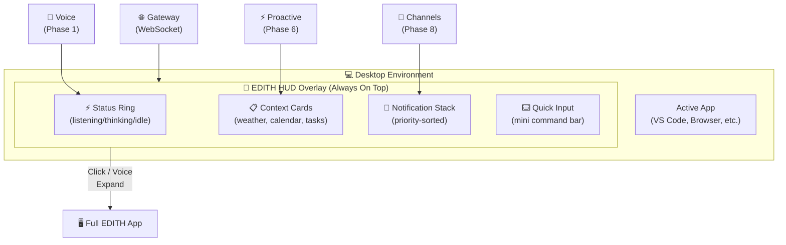
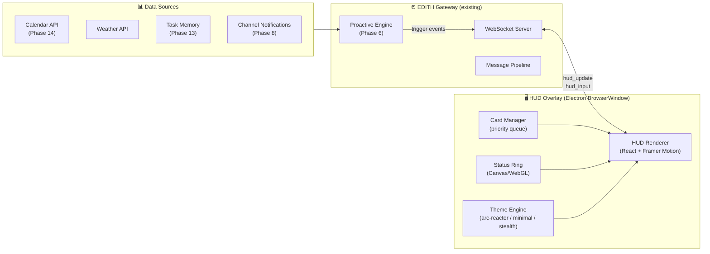
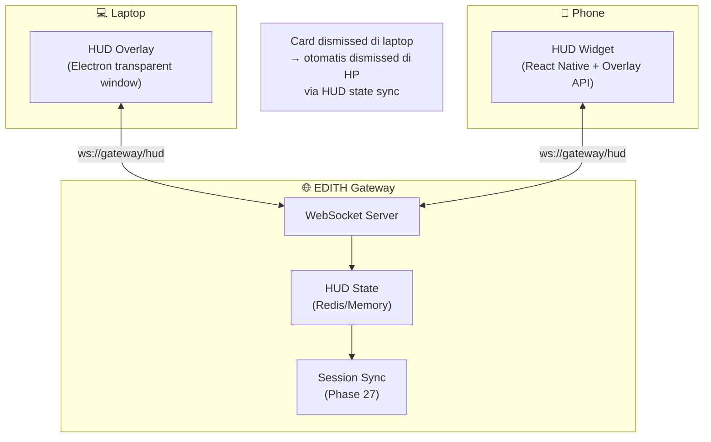
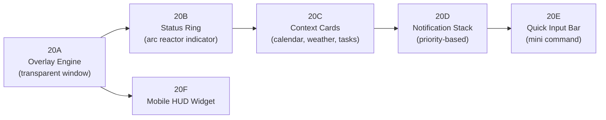
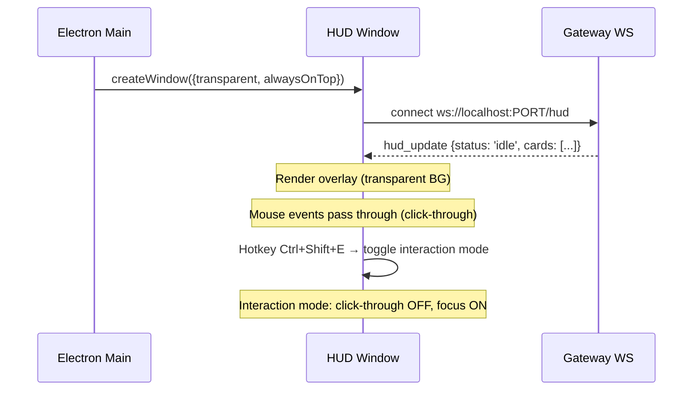
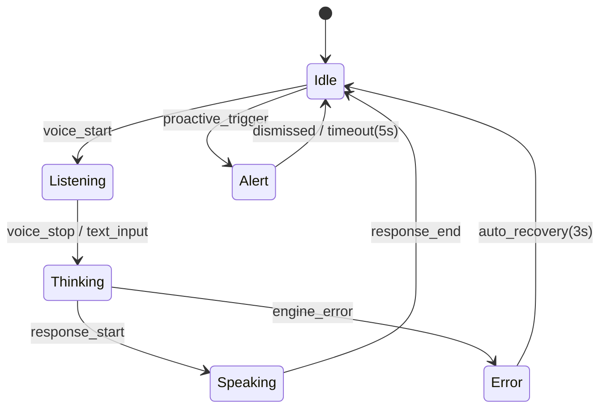
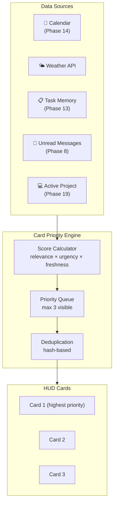
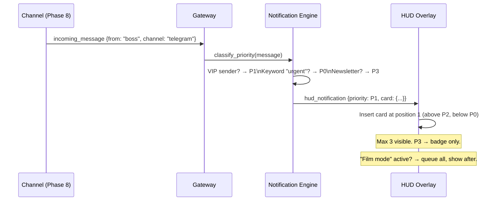
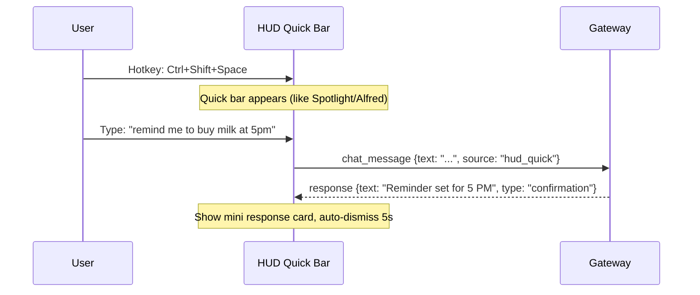
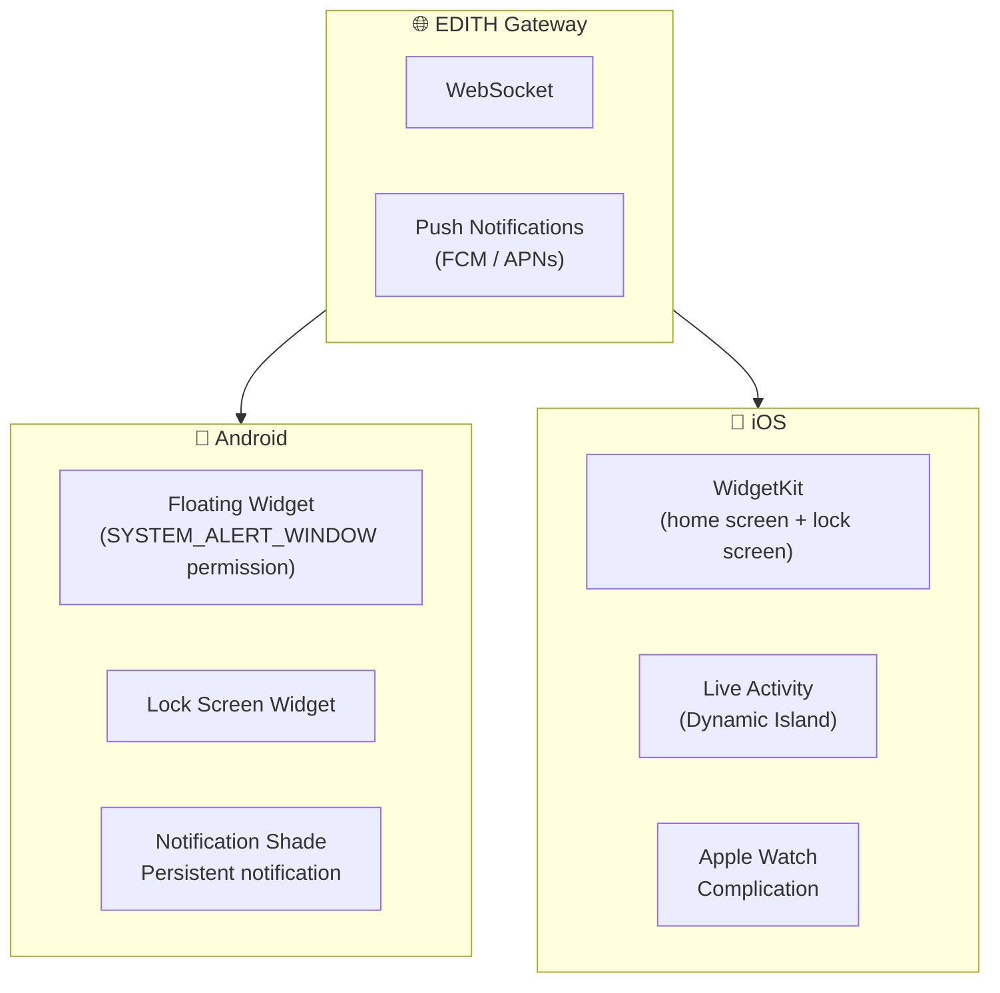

# Phase 20 — HUD Overlay & Ambient Display

> "JARVIS punya layar hologram di mana-mana. EDITH butuh wajah yang selalu terlihat."

**Prioritas:** 🟡 MEDIUM — Memberikan EDITH kehadiran visual yang persistent
**Depends on:** Phase 12 (desktop app), Phase 6 (proactive triggers), Phase 8 (channels)
**Status:** ❌ Not started

---

## 1. Tujuan

EDITH saat ini hanya muncul kalau user buka app Electron. Phase ini membuat EDITH
**selalu hadir** di layar dalam bentuk overlay transparan — minimal, non-intrusive,
tapi selalu siap. Seperti HUD di helm Iron Man: informasi kontekstual tanpa blocking workflow.



---

## 2. Research References

| # | Paper / Project | ID | Kontribusi ke EDITH |
|---|-----------------|-----|---------------------|
| 1 | Ambient Notification Management (Microsoft Research) | MSR-TR-2020-07 | Priority-based notification interruption model — kapan boleh interrupt user |
| 2 | Attention-Aware Systems (CMU HCI) | doi:10.1145/3290605.3300275 | Gaze+activity → attention state → overlay visibility |
| 3 | Electron Transparent Windows (Electron docs) | electron.atom.io | `transparent: true`, `alwaysOnTop`, click-through overlay patterns |
| 4 | Framer Motion (open source) | framer.com/motion | Fluid animation primitives for card reveal/dismiss |
| 5 | The Costs of Interruption (CHI 2004) | doi:10.1145/985692.985715 | "Interupsi di momen yang salah = 23 menit recovery." Basis timing model |
| 6 | Designing Peripheral Displays (Ambient Devices) | doi:10.1145/642611.642695 | Peripheral awareness tanpa conscious attention — arc reactor indicator design |

---

## 3. Arsitektur

### 3.1 Kontrak Arsitektur

```
Rule 1: HUD TIDAK bypass message-pipeline.
        Semua input dari HUD → gateway → message-pipeline → response.
        HUD hanya render output, bukan process sendiri.

Rule 2: HUD = renderer-only process.
        Tidak boleh import src/core/, src/engines/, atau src/memory/.
        Komunikasi via WebSocket ke gateway yang sudah running.

Rule 3: Overlay data flow searah: Gateway → HUD.
        HUD kirim input via gateway WebSocket (sama seperti desktop app).
        HUD terima updates via dedicated 'hud_update' event channel.
```

### 3.2 System Architecture



### 3.3 Cross-Device Architecture (HP + Laptop)



---

## 4. Sub-Phase Breakdown



---

### Phase 20A — Transparent Overlay Engine

**Goal:** Electron BrowserWindow yang transparan, always-on-top, click-through.



**Implementation:**
```typescript
// apps/desktop/hud-window.ts
import { BrowserWindow } from 'electron';

export function createHUDWindow(): BrowserWindow {
  const hud = new BrowserWindow({
    width: 360,
    height: 800,
    transparent: true,
    frame: false,
    alwaysOnTop: true,
    skipTaskbar: true,
    resizable: false,
    // DECISION: click-through by default, toggle via hotkey
    // WHY: User shouldn't be interrupted unless they want to interact
    // ALTERNATIVES: Always interactive (rejected: blocks underlying apps)
    // REVISIT: When gaze tracking available (Phase 3 vision)
    focusable: false,
    webPreferences: {
      preload: path.join(__dirname, 'hud-preload.js'),
      contextIsolation: true,
      nodeIntegration: false,
    },
  });

  // Platform-specific click-through
  hud.setIgnoreMouseEvents(true, { forward: true });
  
  return hud;
}
```

**Config:**
```json
{
  "hud": {
    "enabled": true,
    "position": "top-right",
    "width": 360,
    "opacity": 0.9,
    "clickThroughDefault": true,
    "hotkey": "Ctrl+Shift+E"
  }
}
```

**Files:**
| File | Action | Lines |
|------|--------|-------|
| `apps/desktop/hud-window.ts` | CREATE | ~80 |
| `apps/desktop/hud-preload.js` | CREATE | ~30 |
| `apps/desktop/renderer/hud/` | CREATE | ~200 |
| `EDITH-ts/src/gateway/server.ts` | MODIFY | +40 (hud_update event channel) |

---

### Phase 20B — Status Ring (Arc Reactor Indicator)

**Goal:** Visual indicator animasi yang menunjukkan state EDITH: idle, listening, thinking, speaking.



**Visual Design (CSS/Canvas):**
```
Idle:      Soft blue pulse (2s period)     — "EDITH is here"
Listening: Bright blue, expanding rings    — "I hear you"
Thinking:  Amber rotation, particles       — "Processing"
Speaking:  Green waveform animation         — "Talking"
Alert:     Red flash → amber steady        — "Attention needed"
Error:     Red blink 3x → fade to idle     — "Something went wrong"
```

**Implementation:**
```typescript
// apps/desktop/renderer/hud/StatusRing.tsx
interface StatusRingProps {
  state: 'idle' | 'listening' | 'thinking' | 'speaking' | 'alert' | 'error';
  theme: 'arc-reactor' | 'minimal' | 'stealth';
}

// Canvas-based rendering for 60fps animation
// DECISION: Canvas over CSS animation
// WHY: Need particle effects and smooth state transitions
// ALTERNATIVES: Lottie (heavier), CSS (limited effects)
// REVISIT: If performance issues on low-end machines
```

**Files:**
| File | Action | Lines |
|------|--------|-------|
| `apps/desktop/renderer/hud/StatusRing.tsx` | CREATE | ~150 |
| `apps/desktop/renderer/hud/themes/` | CREATE | ~100 |

---

### Phase 20C — Context Cards

**Goal:** Kartu informasi kontekstual yang muncul berdasarkan waktu, lokasi, dan aktivitas user.



**Card Types:**
| Card | Source | Trigger | Example |
|------|--------|---------|---------|
| Next Meeting | Phase 14 Calendar | 15 min before | "Meeting with Tim in 15m — Room 2B" |
| Weather | Weather API | Morning + before outdoor | "Hujan siang ini, bawa payung" |
| Unread Priority | Phase 8 Channels | Unread from VIP contact | "3 unread dari boss di Telegram" |
| Task Reminder | Phase 13 Knowledge | Approaching deadline | "Deadline PR review: 2 jam lagi" |
| Code Status | Phase 19 Dev Mode | Build fail / test fail | "Build failed: 2 type errors" |

**Files:**
| File | Action | Lines |
|------|--------|-------|
| `apps/desktop/renderer/hud/CardManager.tsx` | CREATE | ~120 |
| `apps/desktop/renderer/hud/cards/` | CREATE | ~200 |
| `EDITH-ts/src/core/hud-data-aggregator.ts` | CREATE | ~100 |

---

### Phase 20D — Notification Stack (Priority-Based)

**Goal:** Notifikasi dari semua channel ditampilkan di HUD dengan priority sorting.

Based on Microsoft Research interruption model:
```
Priority Levels:
  P0 (CRITICAL)  → Center screen, sound, stay until dismissed
  P1 (IMPORTANT) → Full card in HUD, persist 30s
  P2 (NORMAL)    → Small card in HUD, persist 10s, auto-dismiss
  P3 (LOW)       → Badge count only, no card
```



**Film Mode Detection:**
```typescript
// Suppress overlay when user is in fullscreen app (gaming, presentation, movie)
// DECISION: Check foreground window + fullscreen state every 5s
// WHY: Don't interrupt immersive experiences
// ALTERNATIVES: Manual toggle only (rejected: user forgets)
```

**Files:**
| File | Action | Lines |
|------|--------|-------|
| `apps/desktop/renderer/hud/NotificationStack.tsx` | CREATE | ~100 |
| `EDITH-ts/src/core/notification-priority.ts` | CREATE | ~80 |

---

### Phase 20E — Quick Input Bar

**Goal:** Mini command bar di HUD — ketik perintah tanpa buka full app.



**Files:**
| File | Action | Lines |
|------|--------|-------|
| `apps/desktop/renderer/hud/QuickInput.tsx` | CREATE | ~80 |

---

### Phase 20F — Mobile HUD Widget

**Goal:** HUD equivalent di HP — Android overlay widget / iOS widget.



**Cross-Device State Sync:**
- Dismissed card di laptop → sync via gateway → dismissed di HP juga
- State disimpan di gateway memory (bukan per-device)
- Reconnect → full state refresh dari gateway

**Files:**
| File | Action | Lines |
|------|--------|-------|
| `apps/mobile/widgets/HUDWidget.tsx` | CREATE | ~120 |
| `apps/mobile/widgets/StatusIndicator.tsx` | CREATE | ~60 |
| `EDITH-ts/src/gateway/hud-state.ts` | CREATE | ~80 |

---

## 5. Acceptance Gates

```
□ Transparent overlay visible di desktop tanpa blocking app di bawahnya
□ Status ring berubah sesuai EDITH state (idle → listening → thinking → speaking)
□ Context cards muncul berdasarkan waktu dan priority
□ Notification stack sorted by priority, max 3 visible
□ Quick input bar functional: ketik → response → auto-dismiss
□ Film mode: overlay hidden saat fullscreen app
□ Mobile widget menampilkan status + cards
□ Cross-device: dismiss di laptop → dismissed di HP
□ Hotkey Ctrl+Shift+E toggle overlay visibility
□ Performance: overlay < 2% CPU saat idle
```

---

## 6. Koneksi ke Phase Lain

| Phase | Koneksi | Data Flow |
|-------|---------|-----------|
| Phase 1 (Voice) | Status ring reflects voice state | voice_state → StatusRing |
| Phase 6 (Proactive) | Triggers create context cards | proactive_event → CardManager |
| Phase 8 (Channels) | Notifications from all channels | channel_message → NotificationStack |
| Phase 12 (Desktop) | HUD is secondary window in same Electron app | IPC main → hud-window |
| Phase 13 (Knowledge) | Task/deadline cards | knowledge_query → Cards |
| Phase 14 (Calendar) | Meeting cards | calendar_event → Cards |
| Phase 19 (Dev Mode) | Build/test status cards | dev_event → Cards |
| Phase 27 (Cross-Device) | HUD state sync across devices | hud_state → SessionSync |

---

## 7. File Changes Summary

| File | Action | Lines |
|------|--------|-------|
| `apps/desktop/hud-window.ts` | CREATE | ~80 |
| `apps/desktop/hud-preload.js` | CREATE | ~30 |
| `apps/desktop/renderer/hud/StatusRing.tsx` | CREATE | ~150 |
| `apps/desktop/renderer/hud/CardManager.tsx` | CREATE | ~120 |
| `apps/desktop/renderer/hud/NotificationStack.tsx` | CREATE | ~100 |
| `apps/desktop/renderer/hud/QuickInput.tsx` | CREATE | ~80 |
| `apps/desktop/renderer/hud/themes/` | CREATE | ~100 |
| `apps/desktop/renderer/hud/cards/` | CREATE | ~200 |
| `apps/mobile/widgets/HUDWidget.tsx` | CREATE | ~120 |
| `apps/mobile/widgets/StatusIndicator.tsx` | CREATE | ~60 |
| `EDITH-ts/src/gateway/server.ts` | MODIFY | +40 |
| `EDITH-ts/src/gateway/hud-state.ts` | CREATE | ~80 |
| `EDITH-ts/src/core/hud-data-aggregator.ts` | CREATE | ~100 |
| `EDITH-ts/src/core/notification-priority.ts` | CREATE | ~80 |
| **Total** | | **~1340** |

**New dependencies:** `framer-motion`, `@electron/remote` (desktop); WidgetKit (iOS), SYSTEM_ALERT_WINDOW (Android)
