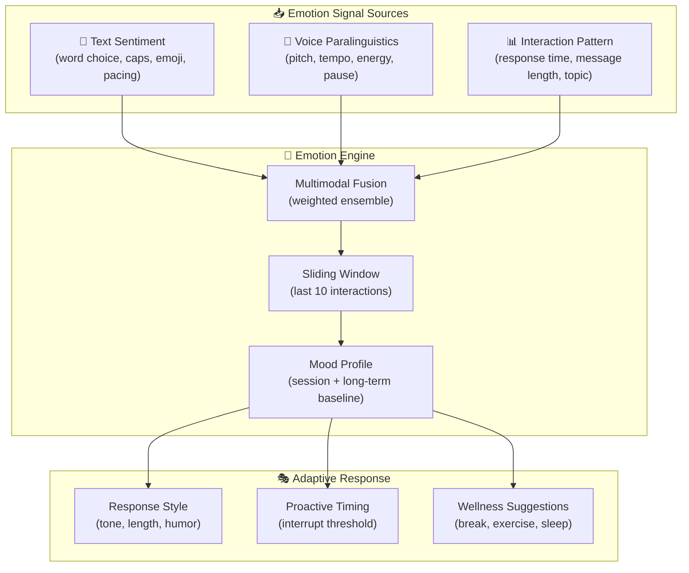
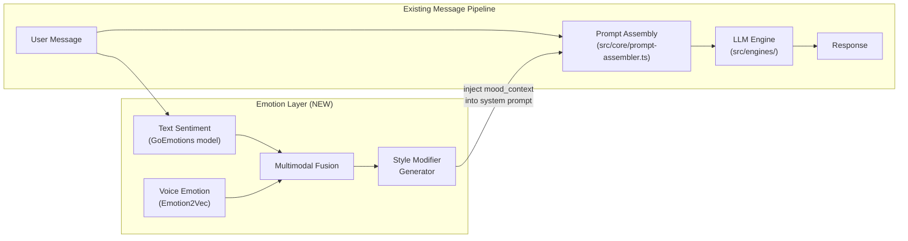
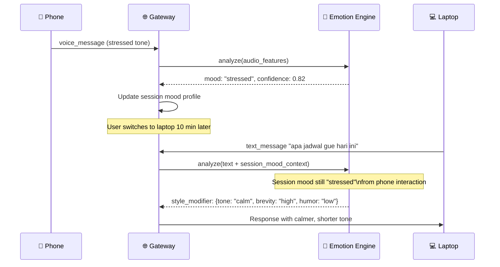
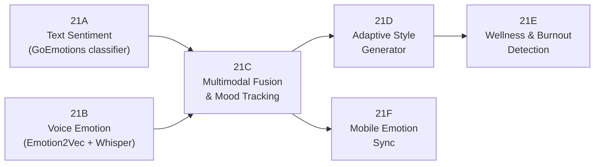
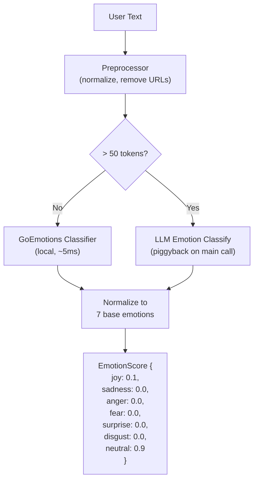
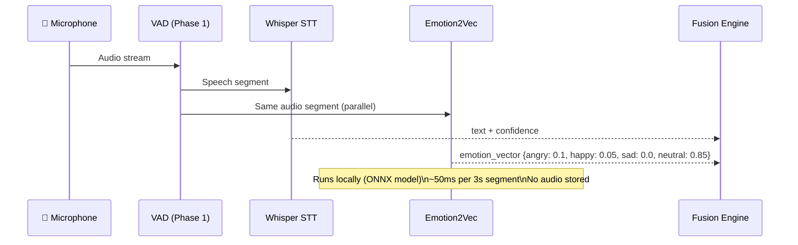
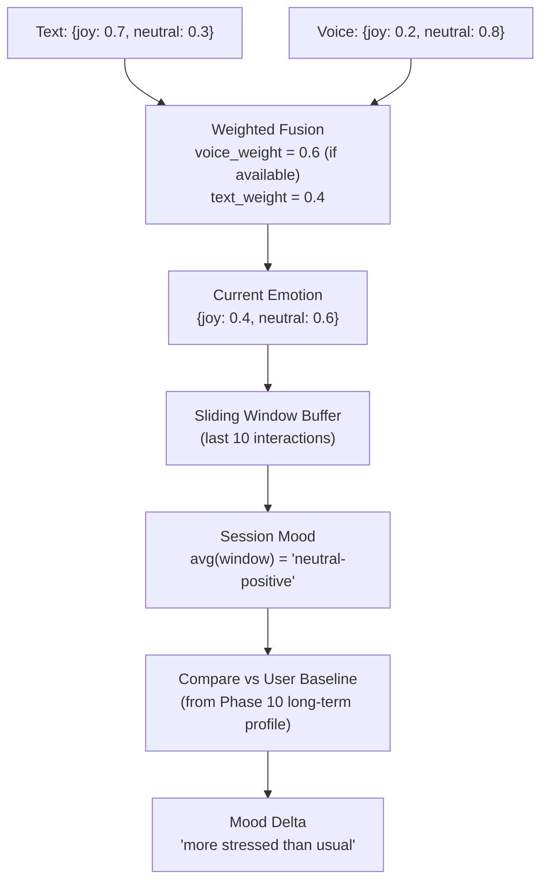
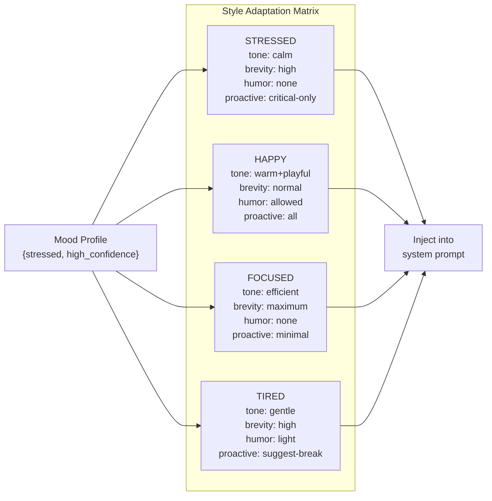
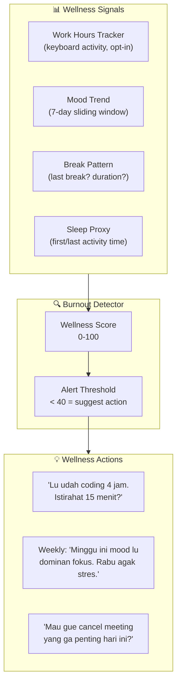
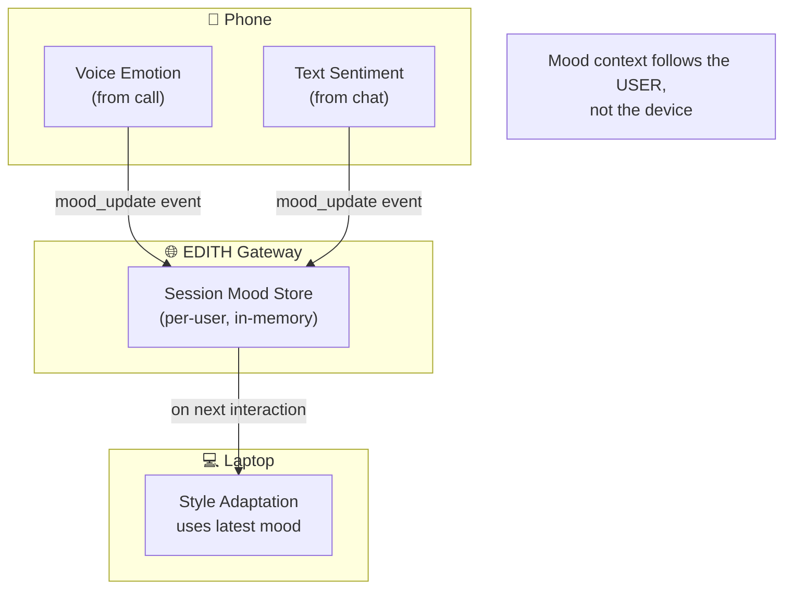

# Phase 21 — Emotional Intelligence & Adaptive Tone

> "JARVIS tahu kapan Tony serius dan kapan bercanda. Respons berubah sesuai mood."

**Prioritas:** 🟡 MEDIUM — Membuat EDITH terasa hidup, bukan sekedar chatbot
**Depends on:** Phase 1 (voice audio features), Phase 6 (proactive triggers), Phase 10 (personalization)
**Status:** ❌ Not started

---

## 1. Tujuan

EDITH saat ini merespons semua pesan dengan gaya yang sama. Phase ini menambahkan
**emotional awareness** — EDITH mendeteksi emosi user dari teks, suara, dan pola
interaksi, lalu menyesuaikan gaya bicara, timing proaktif, dan intensitas interupsi.

Ini bukan sekedar sentiment analysis per-pesan. Ini **behavioral adaptation** yang
track mood dalam sliding window dan menyesuaikan seluruh interaction style.



---

## 2. Research References

| # | Paper | ID | Kontribusi ke EDITH |
|---|-------|-----|---------------------|
| 1 | EmoBench: Evaluating Emotional Intelligence of LLMs | arXiv:2402.12071 | Benchmark untuk evaluasi emotional understanding LLM — baseline test suite |
| 2 | Emotion2Vec: Self-Supervised Pre-Training for Speech Emotion Recognition | arXiv:2312.15185 | State-of-art SER model, pretrained on 40K hours. Bisa detect 9 emotions dari audio |
| 3 | EmotionPrompt: Leveraging Psychology for Large Language Models | arXiv:2307.11760 | Emotional stimuli di prompt → +10.9% performance. Basis adaptive system prompt |
| 4 | PICA: Proactive Conversational Agents with Multimodal Persona | arXiv:2407.00154 | Proactive agent yg emotion-aware — kapan harus interrupt vs diam |
| 5 | AffectGPT: Quantifying Affect with LLMs | arXiv:2403.02378 | Multimodal affect: teks + suara + visual → unified emotion score |
| 6 | Whisper-AT: Noise-Robust Audio Tagging via Whisper | arXiv:2307.07285 | Audio event + emotion detection reusing existing Whisper model |
| 7 | The Empathetic Listener: Detecting Emotions in Dialogue | arXiv:1909.12599 | EmpatheticDialogues dataset — training data untuk empathetic response |
| 8 | GoEmotions: Fine-Grained Emotion Dataset | arXiv:2005.00547 | 58K Reddit comments, 27 emotion labels, basis text sentiment classifier |

---

## 3. Arsitektur

### 3.1 Kontrak Arsitektur

```
Rule 1: Emotion detection TIDAK modify message content.
        Emotion score ditambahkan sebagai metadata di pipeline context,
        bukan mengubah text user.

Rule 2: Emotion data = privacy-sensitive.
        Raw emotion scores TIDAK disimpan permanen.
        Hanya aggregated mood summary (per-session) yang boleh masuk memory.
        User bisa opt-out seluruh emotional tracking.

Rule 3: Adaptive style via system prompt injection.
        Emotion engine menghasilkan style modifier yang diinject ke system prompt.
        Engine/LLM TIDAK di-fine-tune — hanya prompt yang berubah.

Rule 4: Fallback = neutral.
        Kalau emotion detection gagal atau ambiguous, default ke neutral style.
        TIDAK pernah assume negative emotion.
```

### 3.2 Pipeline Integration



### 3.3 Cross-Device Emotion Continuity



---

## 4. Sub-Phase Breakdown



---

### Phase 21A — Text Sentiment Engine

**Goal:** Detect emosi dari teks chat menggunakan GoEmotions + LLM fallback.



**7 Base Emotions (Ekman model):**
```
joy | sadness | anger | fear | surprise | disgust | neutral
```

**GoEmotions 27-label → 7-label mapping:**
```typescript
// DECISION: Map GoEmotions 27 labels to Ekman 7
// WHY: Simpler model for style adaptation, less noise
// ALTERNATIVES: Keep all 27 (too granular), use Plutchik 8 (no neutral)
// REVISIT: If nuanced responses needed (e.g., distinguish embarrassment from sadness)

const EMOTION_MAP: Record<string, string> = {
  admiration: 'joy', amusement: 'joy', approval: 'joy',
  excitement: 'joy', gratitude: 'joy', love: 'joy', optimism: 'joy',
  pride: 'joy', relief: 'joy',
  
  sadness: 'sadness', grief: 'sadness', remorse: 'sadness',
  disappointment: 'sadness',
  
  anger: 'anger', annoyance: 'anger',
  
  fear: 'fear', nervousness: 'fear',
  
  surprise: 'surprise', realization: 'surprise', confusion: 'surprise',
  
  disgust: 'disgust',
  
  neutral: 'neutral', caring: 'neutral', curiosity: 'neutral',
  desire: 'neutral', embarrassment: 'neutral',
};
```

**Files:**
| File | Action | Lines |
|------|--------|-------|
| `EDITH-ts/src/core/emotion/text-analyzer.ts` | CREATE | ~120 |
| `EDITH-ts/src/core/emotion/emotion-map.ts` | CREATE | ~40 |
| `EDITH-ts/src/core/emotion/__tests__/text-analyzer.test.ts` | CREATE | ~80 |

---

### Phase 21B — Voice Emotion Recognition

**Goal:** Extract emotion dari audio features menggunakan Emotion2Vec atau Whisper-AT.



**Paralinguistic Features (extracted alongside STT):**
```
pitch_mean     → higher = excited/stressed
pitch_variance → monotone = bored/tired, high variance = emotional
tempo          → fast = rushed/anxious, slow = calm/tired
energy_rms     → loud = confident/angry, soft = sad/uncertain
pause_ratio    → many pauses = thinking/uncertain
```

**Privacy-first design:**
```typescript
// DECISION: Audio features extracted → raw audio discarded immediately
// WHY: Voice emotion is sensitive biometric data
// ALTERNATIVES: Store audio for reanalysis (rejected: privacy risk)
// REVISIT: If user explicitly opts into audio journaling (Phase 25+)
```

**Files:**
| File | Action | Lines |
|------|--------|-------|
| `EDITH-ts/src/core/emotion/voice-analyzer.ts` | CREATE | ~100 |
| `EDITH-ts/src/voice/emotion-features.ts` | CREATE | ~80 |
| `EDITH-ts/src/core/emotion/__tests__/voice-analyzer.test.ts` | CREATE | ~60 |

---

### Phase 21C — Multimodal Fusion & Mood Tracking

**Goal:** Combine text + voice signals, maintain sliding window mood profile.



**Mood States (derived from emotion window):**
```
focused     — high neutral, consistent tempo, low emotion variance
stressed    — high anger/fear, fast tempo, short messages
happy       — high joy, varied pitch, longer messages
tired       — low energy, slow tempo, more typos
frustrated  — repeated anger spikes, "ugh"/"gila"/"anjir" markers
```

```typescript
interface MoodProfile {
  current: EmotionVector;      // Latest interaction
  session: EmotionVector;      // Sliding window average
  baseline: EmotionVector;     // Long-term average (from Phase 10 memory)
  delta: string;               // "more_stressed" | "more_happy" | "baseline"
  confidence: number;          // 0-1, how confident we are in the mood read
}
```

**Files:**
| File | Action | Lines |
|------|--------|-------|
| `EDITH-ts/src/core/emotion/fusion.ts` | CREATE | ~80 |
| `EDITH-ts/src/core/emotion/mood-tracker.ts` | CREATE | ~100 |
| `EDITH-ts/src/core/emotion/types.ts` | CREATE | ~40 |

---

### Phase 21D — Adaptive Style Generator

**Goal:** Generate system prompt modifier berdasarkan mood profile.



**System Prompt Injection Example:**
```typescript
// When mood = stressed:
const moodContext = `
[Mood Context — auto-generated, not shown to user]
The user appears stressed based on interaction patterns.
Adapt your response:
- Keep responses shorter and more actionable
- Skip pleasantries, get to the point
- Only mention proactive suggestions if truly critical
- Use calming, supportive tone without being patronizing
- If the task seems overwhelming, offer to break it into steps
`;

// Injected into prompt assembly AFTER identity but BEFORE conversation history
```

**Override mechanism:**
```
User: "EDITH, formal mode"    → override all adaptive styles, use formal
User: "EDITH, santai aja"     → override to casual regardless of mood
User: "EDITH, biasa aja"      → clear override, return to adaptive
```

**Files:**
| File | Action | Lines |
|------|--------|-------|
| `EDITH-ts/src/core/emotion/style-generator.ts` | CREATE | ~100 |
| `EDITH-ts/src/core/prompt-assembler.ts` | MODIFY | +30 (mood context injection point) |
| `EDITH-ts/src/core/emotion/__tests__/style-generator.test.ts` | CREATE | ~80 |

---

### Phase 21E — Wellness & Burnout Detection

**Goal:** Pattern detection untuk burnout, overwork, dan wellbeing suggestions.



**Privacy:**
```
- ALL wellness tracking opt-in (default OFF)
- No raw activity data stored — only aggregate scores
- User can request full deletion: "EDITH, hapus data wellness gue"
- No data shared, ever — local processing only
```

**Files:**
| File | Action | Lines |
|------|--------|-------|
| `EDITH-ts/src/core/emotion/wellness-detector.ts` | CREATE | ~80 |
| `EDITH-ts/src/core/emotion/__tests__/wellness-detector.test.ts` | CREATE | ~60 |

---

### Phase 21F — Mobile Emotion Sync

**Goal:** Emotion context berjalan across devices — mulai stres di HP, EDITH di laptop sudah tau.



**Protocol:**
```typescript
// WebSocket event: mood_update
interface MoodUpdateEvent {
  type: 'mood_update';
  userId: string;
  sessionId: string;
  mood: MoodProfile;
  source: 'text' | 'voice' | 'pattern';
  timestamp: number;
}
// Stored in session memory, expires after 2 hours of inactivity
```

**Files:**
| File | Action | Lines |
|------|--------|-------|
| `EDITH-ts/src/gateway/mood-sync.ts` | CREATE | ~60 |

---

## 5. Acceptance Gates

```
□ Text sentiment correctly classifies: happy, sad, angry, neutral (>80% accuracy on test set)
□ Voice emotion extraction runs <100ms per speech segment
□ Multimodal fusion produces consistent mood profile
□ Adaptive style visibly changes EDITH's tone (blind test: users notice difference)
□ System prompt injection does NOT leak mood context to user
□ Wellness detector triggers break suggestion after 4h continuous activity
□ Cross-device: stressed on phone → EDITH on laptop responds with calmer tone
□ Privacy: no raw emotion data in persistent storage
□ Override: "EDITH, formal mode" immediately overrides adaptive style
□ Opt-out: disabling emotional intelligence → EDITH responds in default neutral style
```

---

## 6. Koneksi ke Phase Lain

| Phase | Koneksi | Data Flow |
|-------|---------|-----------|
| Phase 1 (Voice) | Audio features for voice emotion | audio_segment → VoiceAnalyzer |
| Phase 6 (Proactive) | Mood-gated proactive triggers | mood_profile → trigger_threshold |
| Phase 10 (Personalization) | Long-term mood baseline | user_profile.mood_baseline |
| Phase 20 (HUD) | Status ring color reflects mood | mood → StatusRing color hint |
| Phase 22 (Mission) | Pause mission if user is stressed | mood → mission_pacing |
| Phase 27 (Cross-Device) | Mood sync across devices | mood_update → SessionSync |

---

## 7. File Changes Summary

| File | Action | Lines |
|------|--------|-------|
| `EDITH-ts/src/core/emotion/text-analyzer.ts` | CREATE | ~120 |
| `EDITH-ts/src/core/emotion/voice-analyzer.ts` | CREATE | ~100 |
| `EDITH-ts/src/core/emotion/fusion.ts` | CREATE | ~80 |
| `EDITH-ts/src/core/emotion/mood-tracker.ts` | CREATE | ~100 |
| `EDITH-ts/src/core/emotion/style-generator.ts` | CREATE | ~100 |
| `EDITH-ts/src/core/emotion/wellness-detector.ts` | CREATE | ~80 |
| `EDITH-ts/src/core/emotion/emotion-map.ts` | CREATE | ~40 |
| `EDITH-ts/src/core/emotion/types.ts` | CREATE | ~40 |
| `EDITH-ts/src/voice/emotion-features.ts` | CREATE | ~80 |
| `EDITH-ts/src/gateway/mood-sync.ts` | CREATE | ~60 |
| `EDITH-ts/src/core/prompt-assembler.ts` | MODIFY | +30 |
| `EDITH-ts/src/core/emotion/__tests__/*.test.ts` | CREATE | ~280 |
| **Total** | | **~1110** |

**New dependencies:** `@xenova/transformers` (GoEmotions ONNX), `emotion2vec` (ONNX runtime)
