# Phase 22 — Autonomous Mission Mode

> "Autopilot, JARVIS." — Tony Stark mulai tidur di suit sambil JARVIS terbang sendiri.

**Prioritas:** 🟡 MEDIUM — "Handle it while I sleep" = ultimate AI companion feature
**Depends on:** Phase 11 (multi-agent orchestration), Phase 6 (proactive), Phase 7 (computer use)
**Status:** ❌ Not started

---

## 1. Tujuan

User assign EDITH sebuah **mission** — goal besar multi-step — dan EDITH kerjakan
secara autonomous selama berjam-jam tanpa intervensi manusia. User bisa pergi tidur,
dan besok pagi dapat laporan lengkap.

Bedanya dengan Phase 11 (Multi-Agent): Phase 11 = user monitor, EDITH execute.
Phase 22 = **user PERGI**, EDITH plan + execute + recover + report sendiri.

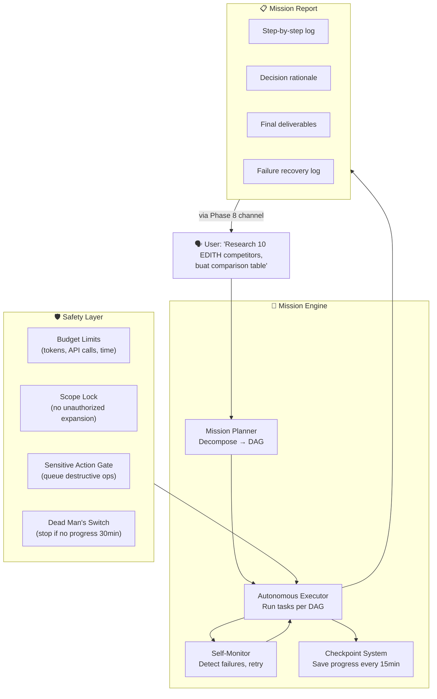

---

## 2. Research References

| # | Paper | ID | Kontribusi ke EDITH |
|---|-------|-----|---------------------|
| 1 | AutoGen: Enabling Next-Gen LLM Applications (Microsoft) | arXiv:2308.08155 | Multi-agent autonomous conversation loops — basis executor pattern |
| 2 | SWE-agent: Agent-Computer Interfaces for Software Engineering | arXiv:2405.15793 | Autonomous SW engineering agent — longest-running autonomous AI |
| 3 | ADAS: Automated Design of Agentic Systems | arXiv:2408.13231 | Self-improving agent design — mission evolves approach |
| 4 | Voyager: An Open-Ended Embodied Agent with LLMs | arXiv:2305.16291 | Lifelong learning: discover skills, build library, reuse across missions |
| 5 | Language Agent Tree Search (LATS) | arXiv:2310.04406 | Tree search for planning — optimal path through task graph |
| 6 | Reflexion: Language Agents with Verbal Reinforcement | arXiv:2303.11366 | Self-reflection after failure → learn and retry differently |
| 7 | Plan-and-Solve Prompting | arXiv:2305.04091 | Structured decomposition of complex tasks → sub-task DAG |
| 8 | TaskWeaver: A Code-First Agent Framework (Microsoft) | arXiv:2311.17541 | Code-centric execution + stateful session for long-running tasks |

---

## 3. Arsitektur

### 3.1 Kontrak Arsitektur

```
Rule 1: Missions run THROUGH message-pipeline, not around it.
        Every sub-task = internal message to pipeline with mission context.
        Pipeline security, rate limits, and permissions still apply.

Rule 2: User authority > mission goals.
        "EDITH abort mission" = immediate stop, no questions.
        Sensitive actions (file delete, git push, send email) → queued for approval.
        If user unreachable + action is destructive → skip, log, continue.

Rule 3: Budget is HARD limit.
        Token budget, API call budget, time budget — all hard caps.
        Hit any limit → graceful wind-down → partial report.
        NEVER exceed budget "to finish one more step."

Rule 4: Every decision is logged with reasoning.
        No black-box execution. User should be able to audit
        WHY EDITH made every choice during the mission.
```

### 3.2 Mission Lifecycle

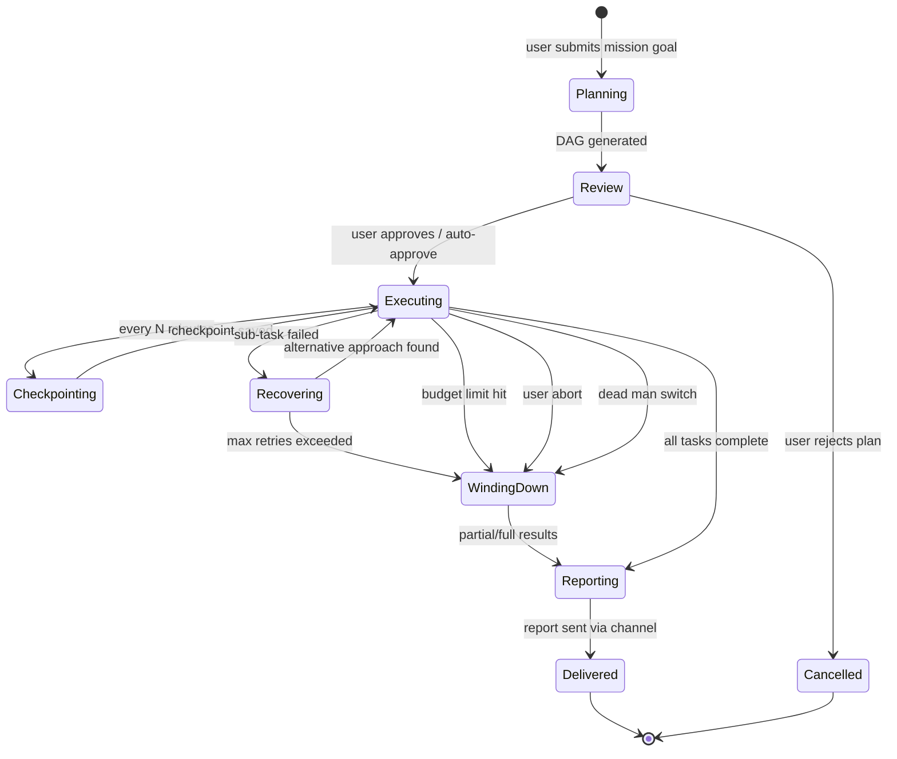

### 3.3 DAG Task Decomposition

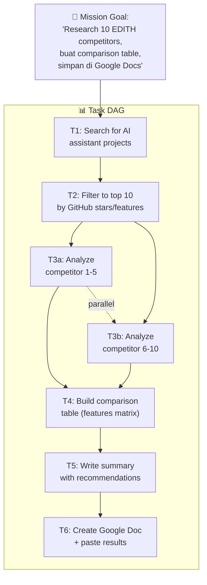

### 3.4 Cross-Device Mission Control

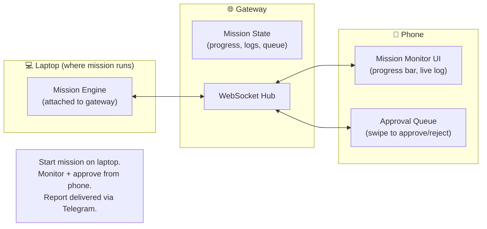

---

## 4. Sub-Phase Breakdown

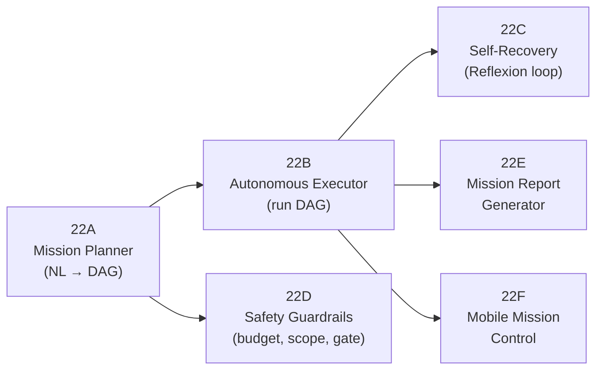

---

### Phase 22A — Mission Planner

**Goal:** Natural language goal → structured DAG of sub-tasks.

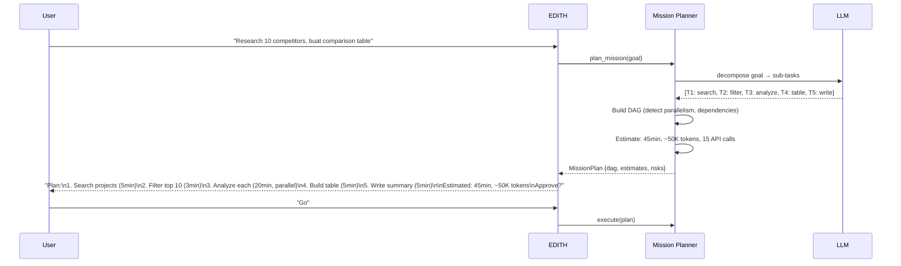

**Implementation:**
```typescript
interface MissionPlan {
  id: string;
  goal: string;
  dag: TaskNode[];
  estimatedDuration: number;    // minutes
  estimatedTokens: number;
  estimatedApiCalls: number;
  risks: string[];
  status: 'planning' | 'approved' | 'executing' | 'completed' | 'aborted';
}

interface TaskNode {
  id: string;
  description: string;
  dependencies: string[];       // task IDs that must complete first
  parallelGroup?: string;       // tasks in same group can run in parallel
  tools: string[];              // which tools/skills this task needs
  estimatedMinutes: number;
  status: 'pending' | 'running' | 'completed' | 'failed' | 'skipped';
  result?: unknown;
  retryCount: number;
}
```

**Files:**
| File | Action | Lines |
|------|--------|-------|
| `EDITH-ts/src/agents/mission-planner.ts` | CREATE | ~150 |
| `EDITH-ts/src/agents/mission-types.ts` | CREATE | ~60 |

---

### Phase 22B — Autonomous Executor

**Goal:** Execute DAG tasks sequentially/parallel, with checkpointing.

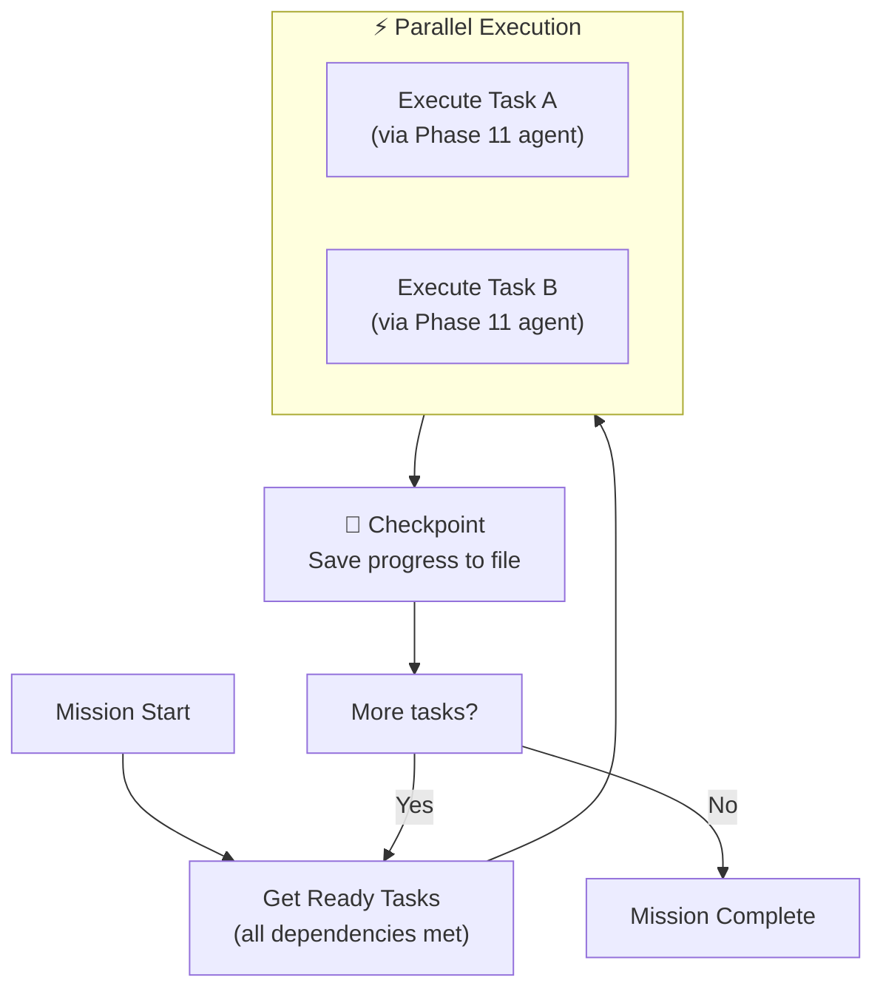

```typescript
// DECISION: Checkpoint every task completion + every 15 minutes
// WHY: If EDITH crashes mid-mission, can resume from last checkpoint
// ALTERNATIVES: Checkpoint only on task complete (gaps during long tasks)
// REVISIT: If checkpoint I/O becomes bottleneck

interface MissionCheckpoint {
  missionId: string;
  timestamp: number;
  completedTasks: string[];
  runningTasks: string[];
  pendingTasks: string[];
  tokensBurned: number;
  apiCallsMade: number;
  partialResults: Record<string, unknown>;
}
```

**Files:**
| File | Action | Lines |
|------|--------|-------|
| `EDITH-ts/src/agents/mission-executor.ts` | CREATE | ~200 |
| `EDITH-ts/src/agents/mission-checkpoint.ts` | CREATE | ~80 |

---

### Phase 22C — Self-Recovery (Reflexion Loop)

**Goal:** When a task fails, reflect on why and try a different approach.

Based on Reflexion (arXiv:2303.11366):
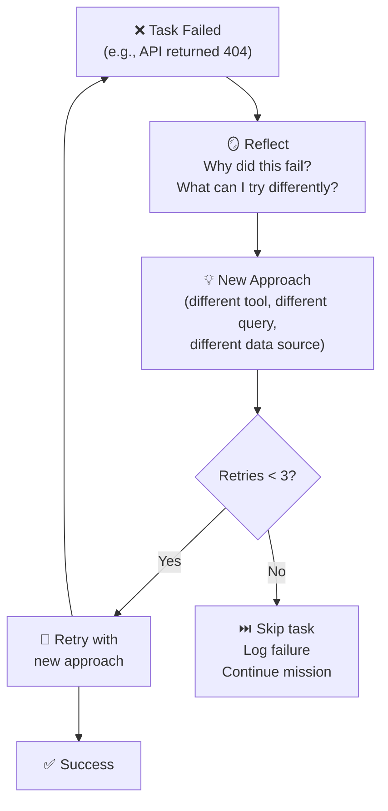

```typescript
interface ReflectionEntry {
  taskId: string;
  attempt: number;
  error: string;
  reflection: string;        // LLM-generated analysis of what went wrong
  newApproach: string;        // LLM-generated alternative strategy
  outcome: 'success' | 'failed_again';
}
```

**Files:**
| File | Action | Lines |
|------|--------|-------|
| `EDITH-ts/src/agents/mission-recovery.ts` | CREATE | ~100 |

---

### Phase 22D — Safety Guardrails

**Goal:** Hard limits on budget, scope, and destructive actions.

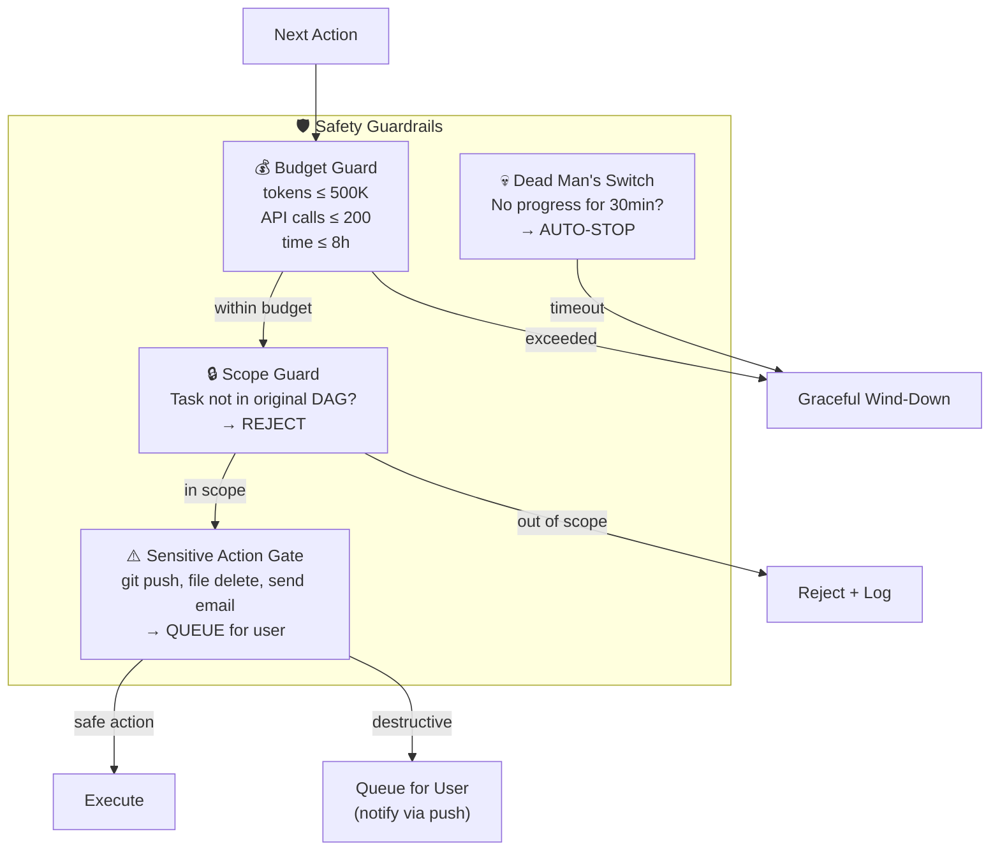

**Sensitive Action Whitelist/Blacklist:**
```typescript
const SENSITIVE_ACTIONS = [
  'git_push', 'git_force_push',
  'file_delete', 'file_overwrite',
  'email_send', 'message_send',
  'api_call_with_write',         // POST/PUT/DELETE to external APIs
  'payment_action',
  'credential_access',
];

// Auto-approved (safe during missions):
const SAFE_ACTIONS = [
  'file_read', 'web_search', 'api_call_read_only',
  'file_create_in_workspace', 'memory_write',
  'llm_query', 'tool_call_internal',
];
```

**Files:**
| File | Action | Lines |
|------|--------|-------|
| `EDITH-ts/src/agents/mission-safety.ts` | CREATE | ~120 |
| `EDITH-ts/src/agents/__tests__/mission-safety.test.ts` | CREATE | ~100 |

---

### Phase 22E — Mission Report Generator

**Goal:** Generate detailed report setelah mission selesai.

```mermaid
flowchart LR
    subgraph MissionData["📊 Mission Data"]
        Plan["Original Plan"]
        Logs["Execution Logs\n(every step + timestamp)"]
        Decisions["Decision Log\n(every choice + reasoning)"]
        Results["Task Results\n(files, data, summaries)"]
        Failures["Failure + Recovery Log"]
    end

    Template["📝 Report Template"]
    LLM["🧠 LLM: Summarize\n+ format naturally"]

    subgraph Report["📋 Mission Report"]
        Exec["Executive Summary"]
        Detail["Step-by-Step Detail"]
        Deliverable["Deliverables"]
        Audit["Decision Audit Trail"]
        Stats["Stats: time, tokens, cost"]
    end

    MissionData --> Template --> LLM --> Report

    Report -->|"Phase 8 channel"| Delivery["📧 Email / 📱 Telegram\n/ 🔔 Push Notification"]
```

**Report Format:**
```markdown
# Mission Report: Research EDITH Competitors

**Started:** 2026-03-08 23:00
**Completed:** 2026-03-09 00:15
**Duration:** 1h 15m
**Tokens Used:** 42,500 / 500,000
**API Calls:** 23 / 200
**Status:** ✅ COMPLETED

## Executive Summary
Researched 10 AI assistant projects, created comparison table...

## Steps Completed
1. ✅ [23:00] Searched GitHub for AI assistant projects (found 47)
2. ✅ [23:05] Filtered to top 10 by stars + features
3. ✅ [23:08] Analyzed competitors 1-5 (parallel)
   ...

## Decisions Made
- Chose GitHub stars as primary ranking metric because...
- Excluded project X because it's archived since 2024...

## Deliverables
- Google Doc: [link]
- Local copy: workspace/missions/competitors-2026-03-09.md

## Failures & Recoveries
- T3b attempt 1: GitHub API rate limit → waited 60s → retry OK
```

**Files:**
| File | Action | Lines |
|------|--------|-------|
| `EDITH-ts/src/agents/mission-report.ts` | CREATE | ~120 |

---

### Phase 22F — Mobile Mission Control

**Goal:** Monitor dan approve missions dari HP saat jauh dari laptop.

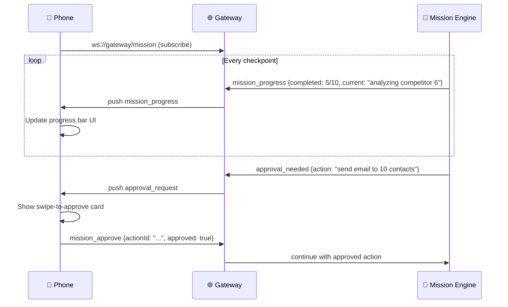

**Mobile UI Components:**
```
Mission Dashboard:
  ┌─ Active Mission ─────────────────┐
  │ "Research EDITH Competitors"      │
  │ ██████████░░░░░░░░░░ 50%          │
  │ Step 5/10: Analyzing competitor 6 │
  │ 42min elapsed | ~30min remaining  │
  │                                   │
  │ [Pause]  [View Log]  [Abort]     │
  └───────────────────────────────────┘

  ┌─ Approval Queue ──────────────────┐
  │ ⚠️ Send email to 10 contacts      │
  │ Subject: "Comparison results..."  │
  │                                   │
  │ ← Swipe left: Reject             │
  │ → Swipe right: Approve           │
  └───────────────────────────────────┘
```

**Files:**
| File | Action | Lines |
|------|--------|-------|
| `apps/mobile/screens/MissionScreen.tsx` | CREATE | ~150 |
| `apps/mobile/components/MissionProgress.tsx` | CREATE | ~80 |
| `apps/mobile/components/ApprovalCard.tsx` | CREATE | ~60 |
| `EDITH-ts/src/gateway/mission-ws.ts` | CREATE | ~80 |

---

## 5. Acceptance Gates

```
□ User can describe mission in natural language → EDITH generates DAG plan
□ User can approve/reject plan before execution starts
□ Parallel tasks execute concurrently (measurably faster than sequential)
□ Checkpoint saves every 15min + on every task completion
□ Mission resumes from checkpoint after EDITH restart
□ Self-recovery: at least 1 retry with different approach before skipping
□ Budget hard stop: mission stops when token/time limit hit
□ Scope lock: EDITH cannot add unplanned tasks without approval
□ Sensitive actions queued for user (never auto-executed)
□ Dead man's switch: auto-stop after 30min no progress
□ Report delivered via configured channel (email/telegram/push)
□ Mobile: progress visible + approval possible from phone
□ "EDITH abort mission" → immediate stop + partial report
```

---

## 6. Koneksi ke Phase Lain

| Phase | Koneksi | Data Flow |
|-------|---------|-----------|
| Phase 6 (Proactive) | Mission can be triggered by proactive suggestion | proactive → suggest_mission |
| Phase 7 (Computer Use) | Mission tasks can use computer (browse, fill, click) | task → computer_use_agent |
| Phase 8 (Channels) | Report delivery via email/telegram/push | report → channel |
| Phase 11 (Multi-Agent) | Sub-tasks executed by Phase 11 agents | task → spawn_agent |
| Phase 13 (Knowledge) | Mission results saved to knowledge base | deliverables → knowledge_ingest |
| Phase 17 (Privacy) | Sensitive data handling within missions | data → privacy_check |
| Phase 20 (HUD) | Mission progress card in HUD overlay | progress → hud_card |
| Phase 21 (Emotional) | Pause/slow mission if user is stressed | mood → mission_pacing |
| Phase 27 (Cross-Device) | Start on laptop, monitor from phone | mission_state → device_sync |

---

## 7. File Changes Summary

| File | Action | Lines |
|------|--------|-------|
| `EDITH-ts/src/agents/mission-planner.ts` | CREATE | ~150 |
| `EDITH-ts/src/agents/mission-executor.ts` | CREATE | ~200 |
| `EDITH-ts/src/agents/mission-checkpoint.ts` | CREATE | ~80 |
| `EDITH-ts/src/agents/mission-recovery.ts` | CREATE | ~100 |
| `EDITH-ts/src/agents/mission-safety.ts` | CREATE | ~120 |
| `EDITH-ts/src/agents/mission-report.ts` | CREATE | ~120 |
| `EDITH-ts/src/agents/mission-types.ts` | CREATE | ~60 |
| `EDITH-ts/src/gateway/mission-ws.ts` | CREATE | ~80 |
| `EDITH-ts/src/agents/__tests__/mission-safety.test.ts` | CREATE | ~100 |
| `apps/mobile/screens/MissionScreen.tsx` | CREATE | ~150 |
| `apps/mobile/components/MissionProgress.tsx` | CREATE | ~80 |
| `apps/mobile/components/ApprovalCard.tsx` | CREATE | ~60 |
| **Total** | | **~1300** |

**New dependencies:** None beyond Phase 11 multi-agent infrastructure
