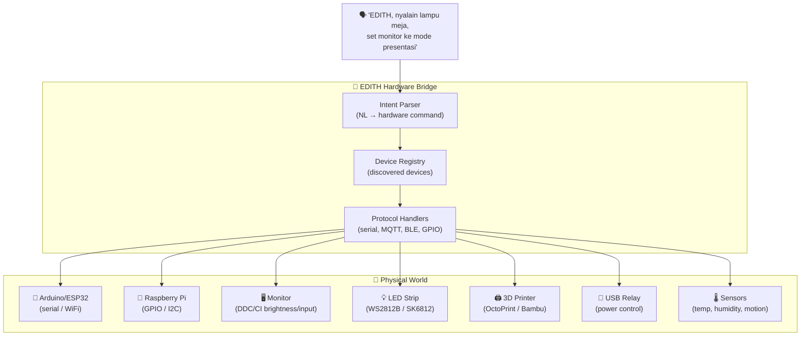
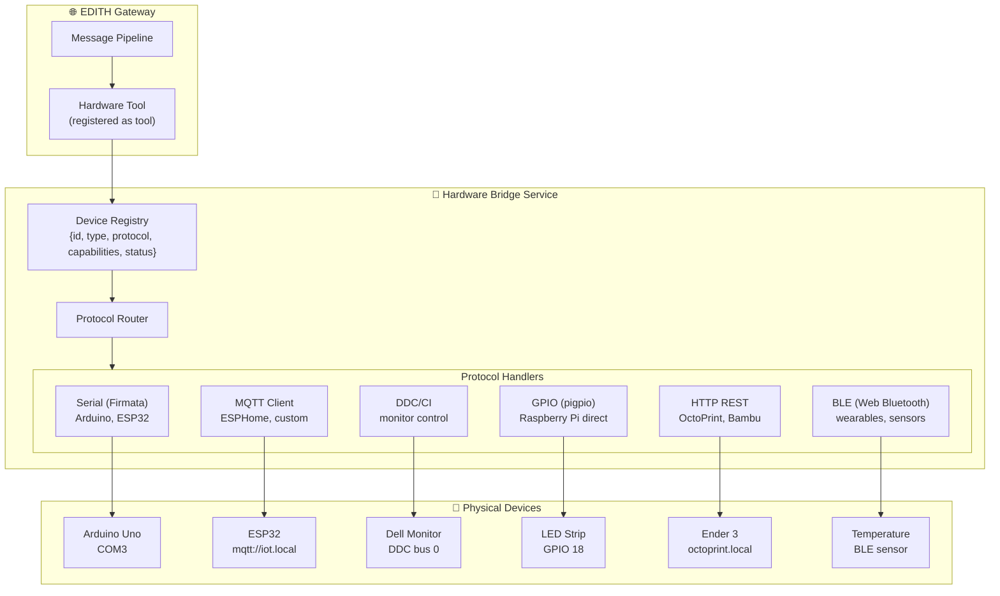
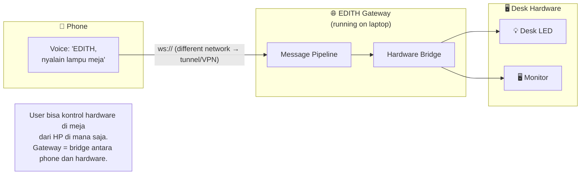
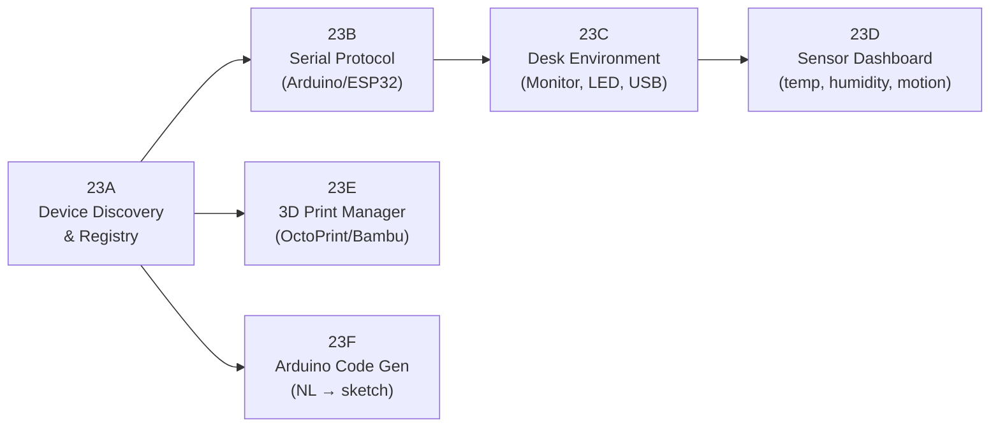
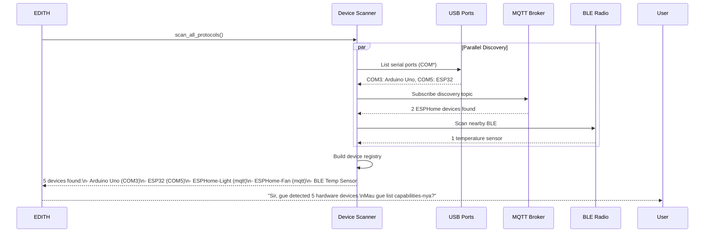
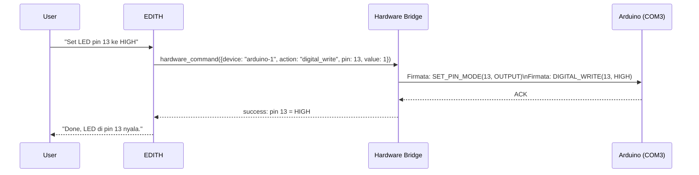
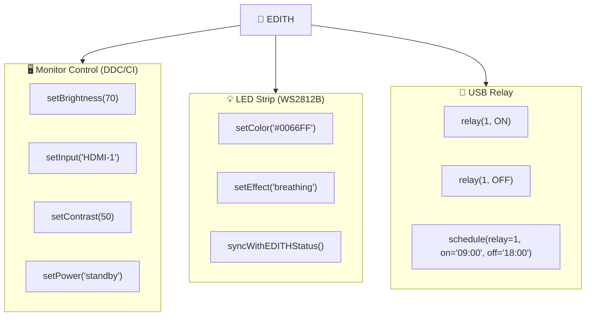
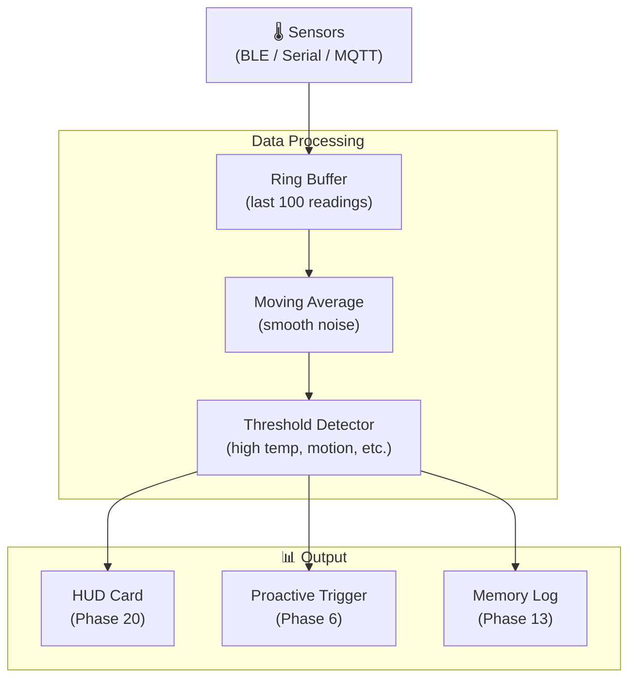
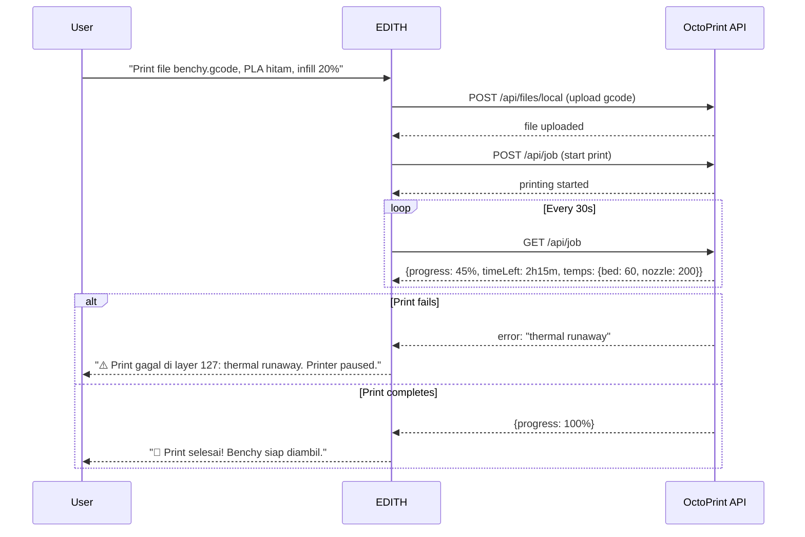
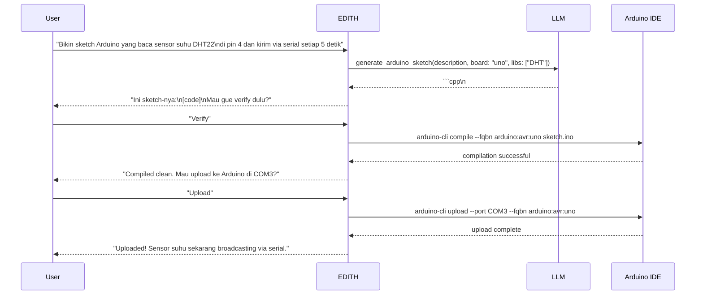

# Phase 23 — Hardware & Physical World Bridge

> "Tony bangun suit dari besi dan kabel di gua. EDITH juga harus bisa sentuh dunia fisik."

**Prioritas:** 🟢 MEDIUM — Niche tapi powerful: maker community + smart desk setup
**Depends on:** Phase 4 (IoT smart home), Phase 7 (computer use), Phase 20 (HUD for dashboard)
**Status:** ❌ Not started

---

## 1. Tujuan

Expand Phase 4 IoT ke **direct hardware communication**: Arduino, Raspberry Pi, ESP32,
USB devices, monitor control, LED strips, 3D printers. EDITH bukan hanya software
companion — EDITH bisa kontrol **dunia fisik** di sekitar user.

Bedanya dengan Phase 4:
- Phase 4 = smart home APIs (Philips Hue, Tuya, Home Assistant)
- Phase 23 = **serial communication, GPIO, BLE, USB, DDC/CI** — direct hardware



---

## 2. Research References

| # | Paper / Project | ID | Kontribusi ke EDITH |
|---|-----------------|-----|---------------------|
| 1 | Firmata Protocol (open standard) | firmata.org | Standard protocol for Arduino communication — stable, well-tested |
| 2 | Web Bluetooth API (W3C) | w3.org/community/web-bluetooth | BLE device discovery and control from browser/Electron |
| 3 | Serialport (Node.js) | github.com/serialport/node-serialport | Cross-platform serial communication library |
| 4 | MQTT.js | github.com/mqttjs/MQTT.js | MQTT client for Node.js — lightweight IoT messaging protocol |
| 5 | DDC/CI Protocol (VESA standard) | VESA MCCS 3.0 | Monitor control: brightness, contrast, input source via I2C |
| 6 | OctoPrint REST API | docs.octoprint.org/en/master/api | 3D printer control: upload, start, monitor, cancel prints |
| 7 | Matter Protocol (CSA) | buildwithmatter.com | Unified IoT standard — bridge Phase 4 and Phase 23 devices |
| 8 | Home Assistant + ESPHome | esphome.io | ESP32 firmware generator — EDITH bisa flash custom firmware |
| 9 | NaturalLanguage → Arduino (MIT Media Lab) | doi:10.1145/3491102.3517620 | NL intent → hardware action mapping — basis parser design |

---

## 3. Arsitektur

### 3.1 Kontrak Arsitektur

```
Rule 1: ALL hardware actions gated behind permissions.
        User must explicitly enable each device category.
        Default = all hardware OFF.

Rule 2: Device registry as single source of truth.
        Every connected device registered with capabilities.
        No command sent to unknown device.

Rule 3: Hardware errors are SOFT failures.
        Device offline → log warning, continue.
        NEVER crash EDITH because a USB device disconnected.
        Retry with backoff: 3s, 10s, 30s.

Rule 4: Physical safety first.
        Relay/motor commands have confirmation for first use.
        "EDITH, nyalain relay" → "Confirm: power on relay at COM3?"
        After first confirmation, same device auto-confirmed (opt-in).
```

### 3.2 System Architecture



### 3.3 Cross-Device Hardware Control



---

## 4. Sub-Phase Breakdown



---

### Phase 23A — Device Discovery & Registry

**Goal:** Auto-detect connected hardware, maintain device registry.



```typescript
interface HardwareDevice {
  id: string;                    // unique device ID
  name: string;                  // user-friendly name
  type: 'arduino' | 'esp32' | 'rpi' | 'monitor' | 'led' | 'printer' | 'sensor' | 'relay';
  protocol: 'serial' | 'mqtt' | 'ble' | 'ddc' | 'http' | 'gpio';
  address: string;               // COM3, mqtt://..., BLE UUID, etc.
  capabilities: string[];        // ['digital_write', 'analog_read', 'pwm']
  status: 'online' | 'offline' | 'error';
  lastSeen: number;
  firmwareVersion?: string;
  metadata?: Record<string, unknown>;
}
```

**Files:**
| File | Action | Lines |
|------|--------|-------|
| `EDITH-ts/src/os-agent/hardware/device-registry.ts` | CREATE | ~120 |
| `EDITH-ts/src/os-agent/hardware/device-scanner.ts` | CREATE | ~100 |
| `EDITH-ts/src/os-agent/hardware/types.ts` | CREATE | ~50 |

---

### Phase 23B — Serial Protocol (Arduino/ESP32)

**Goal:** Communicate dengan Arduino/ESP32 via serial (Firmata protocol).



```typescript
// DECISION: Use Firmata protocol, not raw AT commands
// WHY: Firmata is standardized, battle-tested, supports all Arduino boards
// ALTERNATIVES: Raw serial (fragile), johnny-five (too much abstraction)
// REVISIT: If custom protocol needed for performance-critical MCU

import { Board, Led, Sensor } from 'firmata.js';

class ArduinoDriver {
  private board: Board;
  
  async connect(port: string): Promise<void> {
    this.board = new Board(port);
    return new Promise((resolve) => this.board.on('ready', resolve));
  }
  
  async digitalWrite(pin: number, value: 0 | 1): Promise<void> {
    this.board.pinMode(pin, this.board.MODES.OUTPUT);
    this.board.digitalWrite(pin, value);
  }
  
  async analogRead(pin: number): Promise<number> {
    this.board.pinMode(pin, this.board.MODES.ANALOG);
    return new Promise((resolve) => {
      this.board.analogRead(pin, (value) => resolve(value));
    });
  }
}
```

**Files:**
| File | Action | Lines |
|------|--------|-------|
| `EDITH-ts/src/os-agent/hardware/drivers/serial-driver.ts` | CREATE | ~120 |
| `EDITH-ts/src/os-agent/hardware/drivers/firmata-adapter.ts` | CREATE | ~80 |

---

### Phase 23C — Desk Environment Control

**Goal:** Control monitor (brightness, input), LED strip, USB relay.



**LED Strip ↔ EDITH Status Sync:**
```
EDITH idle       → soft blue breathing
EDITH listening  → bright blue solid
EDITH thinking   → amber chase effect
EDITH speaking   → green pulse
EDITH error      → red flash
Mission running  → purple rotation
```

```typescript
// DECISION: LED status sync is an opt-in novelty feature
// WHY: Cool "arc reactor" vibes, but not essential
// ALTERNATIVES: No LED integration (boring)
// REVISIT: If users actually want this (track adoption)

interface DeskConfig {
  monitor?: {
    enabled: boolean;
    ddcBus: number;           // 0 for auto-detect
    presets: Record<string, { brightness: number; input: string }>;
  };
  led?: {
    enabled: boolean;
    type: 'ws2812b' | 'sk6812' | 'addressable_rgb';
    pin: number;              // GPIO pin (RPi) or serial address
    count: number;            // number of LEDs
    syncWithStatus: boolean;
  };
  relay?: {
    enabled: boolean;
    ports: { name: string; address: string }[];
  };
}
```

**Files:**
| File | Action | Lines |
|------|--------|-------|
| `EDITH-ts/src/os-agent/hardware/drivers/ddc-driver.ts` | CREATE | ~100 |
| `EDITH-ts/src/os-agent/hardware/drivers/led-driver.ts` | CREATE | ~80 |
| `EDITH-ts/src/os-agent/hardware/drivers/relay-driver.ts` | CREATE | ~60 |
| `EDITH-ts/src/os-agent/hardware/desk-controller.ts` | CREATE | ~100 |

---

### Phase 23D — Sensor Dashboard

**Goal:** Read sensor data, display in HUD, trigger automations.



**Automation Examples:**
```
IF temperature > 30°C AND relay_fan.status == OFF:
  → "Suhu kamar 32°C. Mau gue nyalain kipas via relay?"

IF motion_detected AND time > 22:00 AND user.status == away:
  → "Motion detected di ruang kerja jam 10 malam. Lu udah pulang kan?"

IF humidity < 30%:
  → "Kelembaban rendah (28%). Pertimbangkan humidifier."
```

**Files:**
| File | Action | Lines |
|------|--------|-------|
| `EDITH-ts/src/os-agent/hardware/sensor-reader.ts` | CREATE | ~100 |
| `EDITH-ts/src/os-agent/hardware/sensor-automation.ts` | CREATE | ~80 |

---

### Phase 23E — 3D Print Manager

**Goal:** Monitor dan kontrol 3D printer via OctoPrint / Bambu Lab API.



**Files:**
| File | Action | Lines |
|------|--------|-------|
| `EDITH-ts/src/os-agent/hardware/drivers/octoprint-driver.ts` | CREATE | ~100 |
| `EDITH-ts/src/os-agent/hardware/print-manager.ts` | CREATE | ~80 |

---

### Phase 23F — Arduino Code Generator

**Goal:** EDITH bisa generate Arduino sketch dari natural language.



**Files:**
| File | Action | Lines |
|------|--------|-------|
| `EDITH-ts/src/os-agent/hardware/arduino-codegen.ts` | CREATE | ~80 |

---

## 5. Acceptance Gates

```
□ Device discovery detects Arduino, ESP32, BLE sensor automatically
□ Serial communication works: digital write, analog read, PWM
□ Monitor brightness/input changeable via voice command
□ LED strip syncs with EDITH status (idle=blue, thinking=amber)
□ Sensor data displayed in HUD card (Phase 20)
□ Temperature threshold triggers proactive suggestion (Phase 6)
□ 3D print job start, monitor, complete/fail notification
□ Arduino sketch generated from NL description + compiled + uploaded
□ All hardware features default OFF, require explicit enable
□ Device offline → graceful degradation, no EDITH crash
□ Remote hardware control from phone via gateway
```

---

## 6. Koneksi ke Phase Lain

| Phase | Koneksi | Data Flow |
|-------|---------|-----------|
| Phase 4 (IoT) | Share device registry + Matter bridge | hardware_device → matter_bridge |
| Phase 6 (Proactive) | Sensor thresholds trigger proactive | sensor_data → proactive_trigger |
| Phase 7 (Computer Use) | Hardware tools registered as computer tools | tool_call → hardware_bridge |
| Phase 20 (HUD) | Sensor dashboard card, LED status sync | sensor → hud_card, status → led |
| Phase 22 (Mission) | Missions can include hardware tasks | mission_task → hardware_command |
| Phase 25 (Simulation) | Simulate hardware command before execute | command → sandbox_simulate |
| Phase 27 (Cross-Device) | Control desk hardware from phone | phone → gateway → hardware |

---

## 7. File Changes Summary

| File | Action | Lines |
|------|--------|-------|
| `EDITH-ts/src/os-agent/hardware/device-registry.ts` | CREATE | ~120 |
| `EDITH-ts/src/os-agent/hardware/device-scanner.ts` | CREATE | ~100 |
| `EDITH-ts/src/os-agent/hardware/types.ts` | CREATE | ~50 |
| `EDITH-ts/src/os-agent/hardware/drivers/serial-driver.ts` | CREATE | ~120 |
| `EDITH-ts/src/os-agent/hardware/drivers/firmata-adapter.ts` | CREATE | ~80 |
| `EDITH-ts/src/os-agent/hardware/drivers/ddc-driver.ts` | CREATE | ~100 |
| `EDITH-ts/src/os-agent/hardware/drivers/led-driver.ts` | CREATE | ~80 |
| `EDITH-ts/src/os-agent/hardware/drivers/relay-driver.ts` | CREATE | ~60 |
| `EDITH-ts/src/os-agent/hardware/drivers/octoprint-driver.ts` | CREATE | ~100 |
| `EDITH-ts/src/os-agent/hardware/desk-controller.ts` | CREATE | ~100 |
| `EDITH-ts/src/os-agent/hardware/sensor-reader.ts` | CREATE | ~100 |
| `EDITH-ts/src/os-agent/hardware/sensor-automation.ts` | CREATE | ~80 |
| `EDITH-ts/src/os-agent/hardware/print-manager.ts` | CREATE | ~80 |
| `EDITH-ts/src/os-agent/hardware/arduino-codegen.ts` | CREATE | ~80 |
| **Total** | | **~1250** |

**New dependencies:** `serialport`, `firmata.js`, `mqtt`, `web-bluetooth` (Electron), `arduino-cli` (external)
