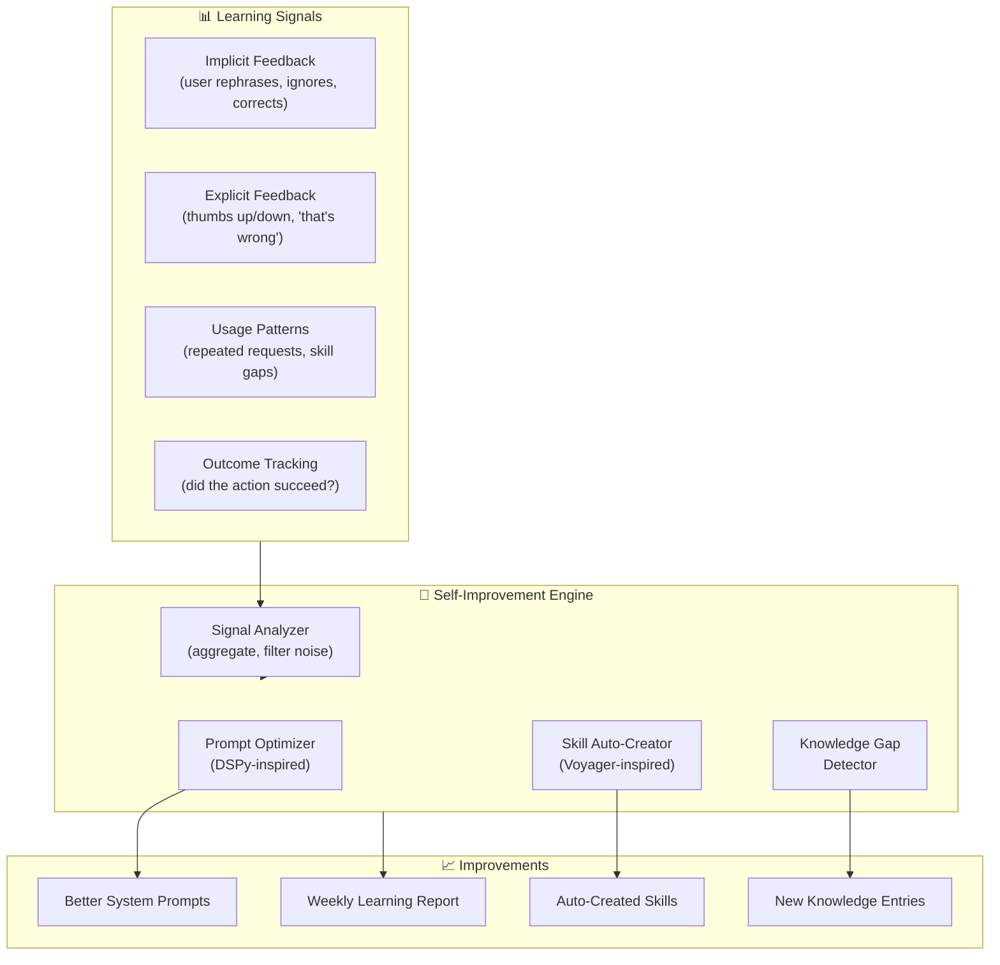
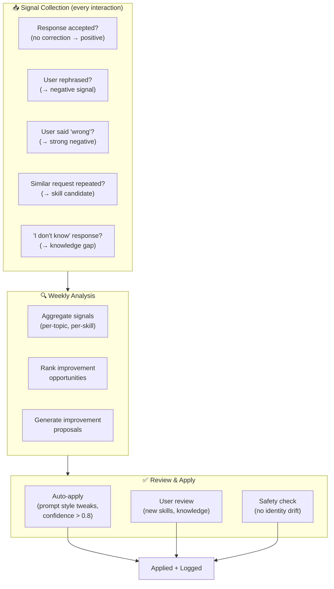
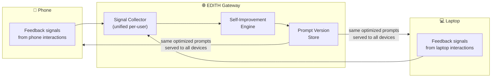
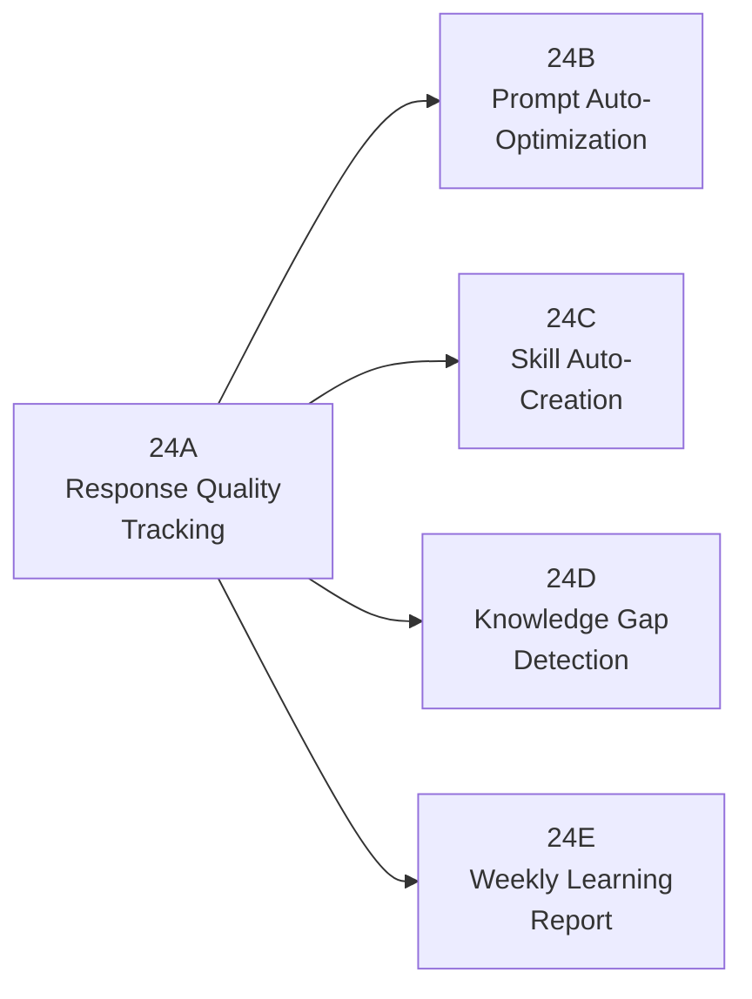
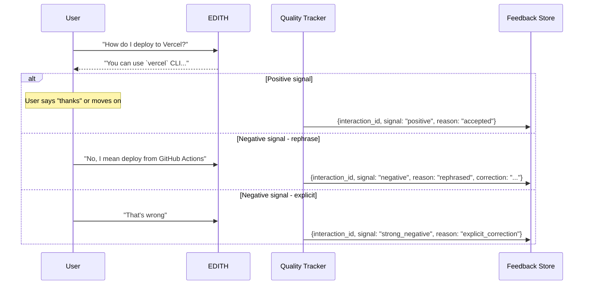
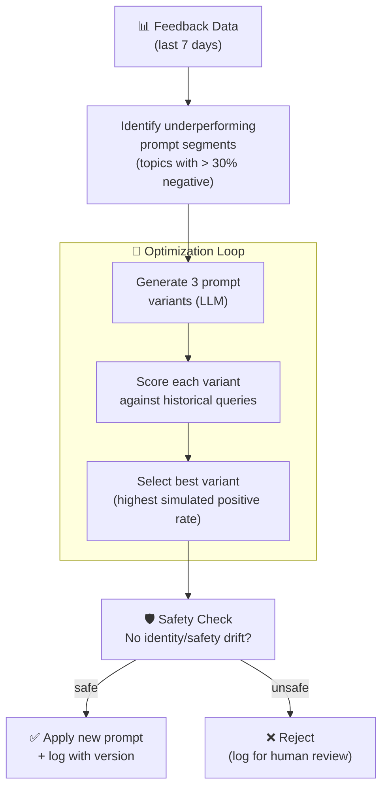
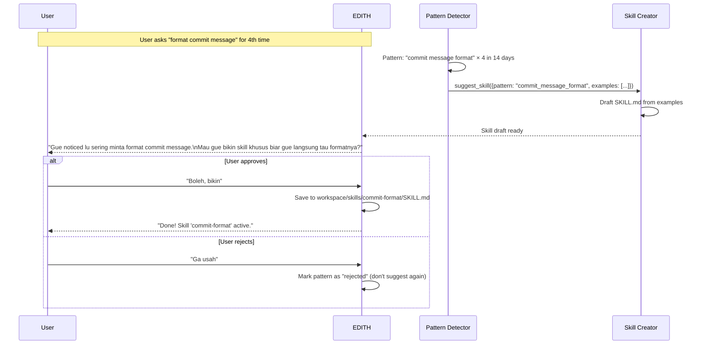
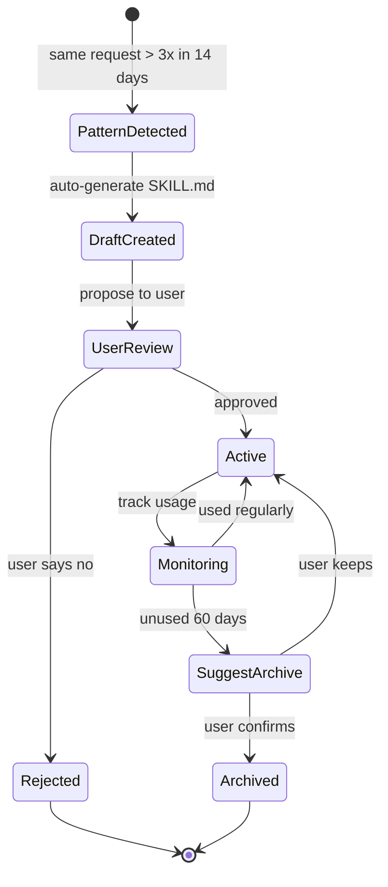
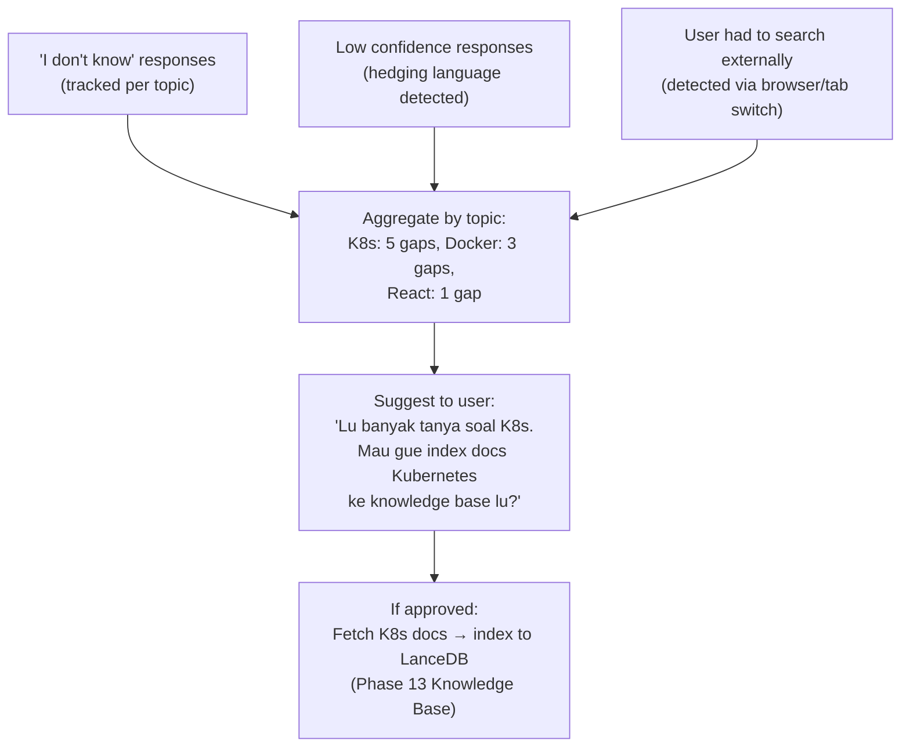

# Phase 24 — Self-Improvement & Meta-Learning

> "Mark I → Mark L. Setiap iterasi lebih baik dari sebelumnya. EDITH harus evolve sendiri."

**Prioritas:** 🟢 LOW-MEDIUM — Long-term compounding value, tapi low effort per iteration
**Depends on:** Phase 10 (personalization), Phase 13 (knowledge base), Phase 6 (proactive)
**Status:** ❌ Not started

---

## 1. Tujuan

EDITH belajar dari setiap interaksi dan jadi lebih baik **secara otomatis**:
- Prompt optimization dari implicit feedback
- Auto-create skills dari pola berulang
- Knowledge gap detection → auto-fill
- Response quality tracking → continuous improvement

Ini **bukan** fine-tuning model. Ini **system-level** self-improvement:
prompt tuning, skill creation, knowledge management, dan behavior optimization
yang terjadi di atas model.



---

## 2. Research References

| # | Paper | ID | Kontribusi ke EDITH |
|---|-------|-----|---------------------|
| 1 | DSPy: Compiling Declarative Language Model Calls | arXiv:2310.03714 | Programmatic prompt optimization without manual tuning — auto-improve prompts |
| 2 | Voyager: An Open-Ended Embodied Agent with LLMs | arXiv:2305.16291 | Lifelong learning: discover skills, build skill library, reuse across tasks |
| 3 | Self-Refine: Iterative Refinement with Self-Feedback | arXiv:2303.17651 | LLM reviews own output → improves without external feedback |
| 4 | ADAS: Automated Design of Agentic Systems | arXiv:2408.13231 | Self-improving agent architectures — meta-level system optimization |
| 5 | Constitutional AI: Harmlessness from AI Feedback | arXiv:2212.08073 | Safety guardrails for self-modifying systems — identity preservation |
| 6 | TextGrad: Automatic Differentiation via Text | arXiv:2406.07496 | Gradient-like optimization for text prompts → measurable improvement |
| 7 | LEMA: Learning from Mistakes (Microsoft) | arXiv:2310.20689 | Error analysis → targeted improvement — learn from failures not just successes |
| 8 | EvoPrompt: Language Models for Code-Level Prompt Optimization | arXiv:2309.08532 | Evolutionary prompt optimization — mutate + select best prompts |

---

## 3. Arsitektur

### 3.1 Kontrak Arsitektur

```
Rule 1: Identity sections NEVER auto-modified.
        System prompt has frozen zones: identity, safety, permissions.
        Self-improvement can only modify "behavior" and "style" zones.
        All other changes require user approval.

Rule 2: All prompt changes versioned and rollback-able.
        Every auto-optimization → git-like version (sha + timestamp).
        User: "EDITH, rollback prompt ke kemarin" → works.
        Max 30 prompt versions retained.

Rule 3: Skill auto-creation requires user approval.
        EDITH drafts skill → shows to user → user approves/rejects.
        Auto-approved skills marked with "auto" tag for tracking.
        Skills unused 60 days → suggest archive (not auto-delete).

Rule 4: No self-modification without explainability.
        Every change comes with: WHAT changed, WHY, EVIDENCE (data).
        User can inspect any optimization decision.
```

### 3.2 Self-Improvement Pipeline



### 3.3 Cross-Device Learning



---

## 4. Sub-Phase Breakdown



---

### Phase 24A — Response Quality Tracking

**Goal:** Track implicit + explicit feedback per interaction.



**Implicit Feedback Signals:**
```
POSITIVE:
  - User says "thanks", "ok", "cool" after response
  - User performs the suggested action (tracked via computer use)
  - User doesn't rephrase (moves to next topic)
  - Response accepted without edit (for drafts)

NEGATIVE:
  - User immediately rephrases the same question
  - User says "no", "that's wrong", "not what I meant"
  - User abandons conversation after response
  - User manually does what EDITH should have done

NEUTRAL (excluded from analysis):
  - Follow-up questions (clarification ≠ failure)
  - Topic change (doesn't mean previous response was bad)
```

```typescript
interface FeedbackSignal {
  interactionId: string;
  timestamp: number;
  signal: 'positive' | 'negative' | 'strong_negative';
  reason: string;
  topic: string;                 // extracted topic/category
  skillUsed?: string;            // which skill handled this
  promptVersion: string;         // which prompt version was active
}
```

**Files:**
| File | Action | Lines |
|------|--------|-------|
| `EDITH-ts/src/core/self-improve/quality-tracker.ts` | CREATE | ~120 |
| `EDITH-ts/src/core/self-improve/feedback-store.ts` | CREATE | ~80 |
| `EDITH-ts/src/core/self-improve/types.ts` | CREATE | ~50 |

---

### Phase 24B — Prompt Auto-Optimization (DSPy-inspired)

**Goal:** Automatically improve system prompt segments based on feedback data.



**Frozen Prompt Zones (NEVER auto-modified):**
```typescript
const FROZEN_ZONES = [
  'identity',          // Who EDITH is
  'safety',            // Content policies
  'permissions',       // What EDITH is allowed to do
  'user_preferences',  // User-set preferences (manual only)
];

const MUTABLE_ZONES = [
  'response_style',    // How EDITH phrases things
  'tool_selection',    // Which tool to prefer for which task
  'context_weighting', // How much context to include
  'proactive_phrasing',// How proactive suggestions are worded
];
```

**Version Control:**
```typescript
interface PromptVersion {
  id: string;           // "pv_2026-03-08_001"
  timestamp: number;
  zone: string;         // which zone was modified
  oldContent: string;
  newContent: string;
  reason: string;       // why this change was made
  evidence: {
    sampleSize: number;
    negativeRate: number;
    improvementEstimate: number;
  };
  rollbackTarget?: string;  // previous version ID
}
```

**Files:**
| File | Action | Lines |
|------|--------|-------|
| `EDITH-ts/src/core/self-improve/prompt-optimizer.ts` | CREATE | ~150 |
| `EDITH-ts/src/core/self-improve/prompt-versioning.ts` | CREATE | ~100 |
| `EDITH-ts/src/core/self-improve/__tests__/prompt-optimizer.test.ts` | CREATE | ~80 |

---

### Phase 24C — Skill Auto-Creation (Voyager-inspired)

**Goal:** Detect repeated patterns → auto-draft new skills.



**Auto-Skill Lifecycle:**


**Files:**
| File | Action | Lines |
|------|--------|-------|
| `EDITH-ts/src/core/self-improve/pattern-detector.ts` | CREATE | ~100 |
| `EDITH-ts/src/core/self-improve/skill-creator.ts` | CREATE | ~120 |

---

### Phase 24D — Knowledge Gap Detection

**Goal:** Track apa yang EDITH ga bisa jawab, suggest knowledge base additions.



**Files:**
| File | Action | Lines |
|------|--------|-------|
| `EDITH-ts/src/core/self-improve/gap-detector.ts` | CREATE | ~100 |

---

### Phase 24E — Weekly Learning Report

**Goal:** Summary mingguan tentang apa yang EDITH pelajari dan improve.

```markdown
# EDITH Learning Report — Week of March 2-8, 2026

## 📊 Response Quality
- Total interactions: 342
- Positive signals: 289 (84.5%)  ↑ from 81.2% last week
- Negative signals: 53 (15.5%)  ↓ improved!

## 🔧 Prompt Improvements
- Auto-optimized: "response_style" zone
  - Change: More concise default responses
  - Evidence: 23% less rephrasing after change
  - Version: pv_2026-03-05_001

## 🛠️ New Skills
- Auto-created: "git-commit-format" (approved by user)
- Suggested but rejected: "meeting-notes-template"

## 📚 Knowledge Gaps Detected
- Top gap: Kubernetes (5 "I don't know" responses)
- Suggested: Index K8s docs → Pending user approval
- Closed gap: Docker Compose (added to KB on March 4)

## 📈 Top 3 Improvement Opportunities
1. Coding responses: 22% negative rate → needs better code context
2. Calendar queries: 18% negative → needs Phase 14 integration
3. Email drafts: 15% negative → needs more user writing samples
```

**Files:**
| File | Action | Lines |
|------|--------|-------|
| `EDITH-ts/src/core/self-improve/learning-report.ts` | CREATE | ~100 |

---

## 5. Acceptance Gates

```
□ Feedback tracking distinguishes positive/negative/rephrase signals
□ At least 1 prompt optimization cycle runs successfully (measurable improvement)
□ Skill auto-creation: detect pattern → draft → user approve → active
□ Knowledge gap: track "I don't know" → suggest KB addition
□ Weekly report generated with real data
□ Frozen zones (identity, safety) NEVER modified by auto-optimizer
□ All prompt changes versioned with rollback capability
□ "EDITH rollback prompt" → works within 3 seconds
□ Rejected skills not re-suggested
□ Cross-device: feedback from phone + laptop aggregated correctly
```

---

## 6. Koneksi ke Phase Lain

| Phase | Koneksi | Data Flow |
|-------|---------|-----------|
| Phase 6 (Proactive) | Proactive suggestion quality tracked | proactive_feedback → quality_tracker |
| Phase 10 (Personalization) | User preferences inform baseline | user_profile → improvement_baseline |
| Phase 13 (Knowledge) | Gap detection → auto-index suggestions | gap → knowledge_ingest |
| Phase 19 (Dev Mode) | Coding response quality specifically tracked | dev_feedback → quality_tracker |
| Phase 21 (Emotional) | Mood-aware improvement (don't suggest when stressed) | mood → suggestion_timing |
| Phase 27 (Cross-Device) | Feedback aggregated from all devices | device_feedback → central_store |

---

## 7. File Changes Summary

| File | Action | Lines |
|------|--------|-------|
| `EDITH-ts/src/core/self-improve/quality-tracker.ts` | CREATE | ~120 |
| `EDITH-ts/src/core/self-improve/feedback-store.ts` | CREATE | ~80 |
| `EDITH-ts/src/core/self-improve/prompt-optimizer.ts` | CREATE | ~150 |
| `EDITH-ts/src/core/self-improve/prompt-versioning.ts` | CREATE | ~100 |
| `EDITH-ts/src/core/self-improve/pattern-detector.ts` | CREATE | ~100 |
| `EDITH-ts/src/core/self-improve/skill-creator.ts` | CREATE | ~120 |
| `EDITH-ts/src/core/self-improve/gap-detector.ts` | CREATE | ~100 |
| `EDITH-ts/src/core/self-improve/learning-report.ts` | CREATE | ~100 |
| `EDITH-ts/src/core/self-improve/types.ts` | CREATE | ~50 |
| `EDITH-ts/src/core/self-improve/__tests__/prompt-optimizer.test.ts` | CREATE | ~80 |
| **Total** | | **~1000** |

**New dependencies:** None (uses existing LLM engines + LanceDB)
