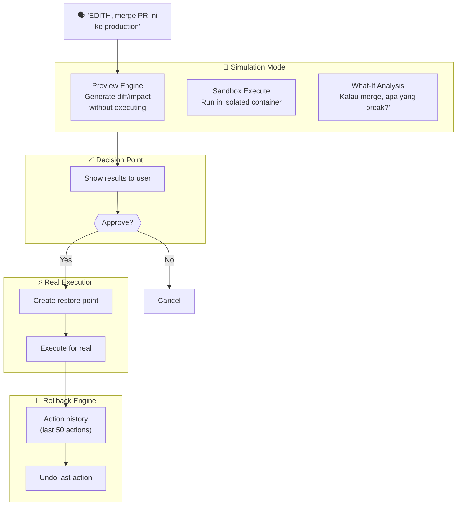
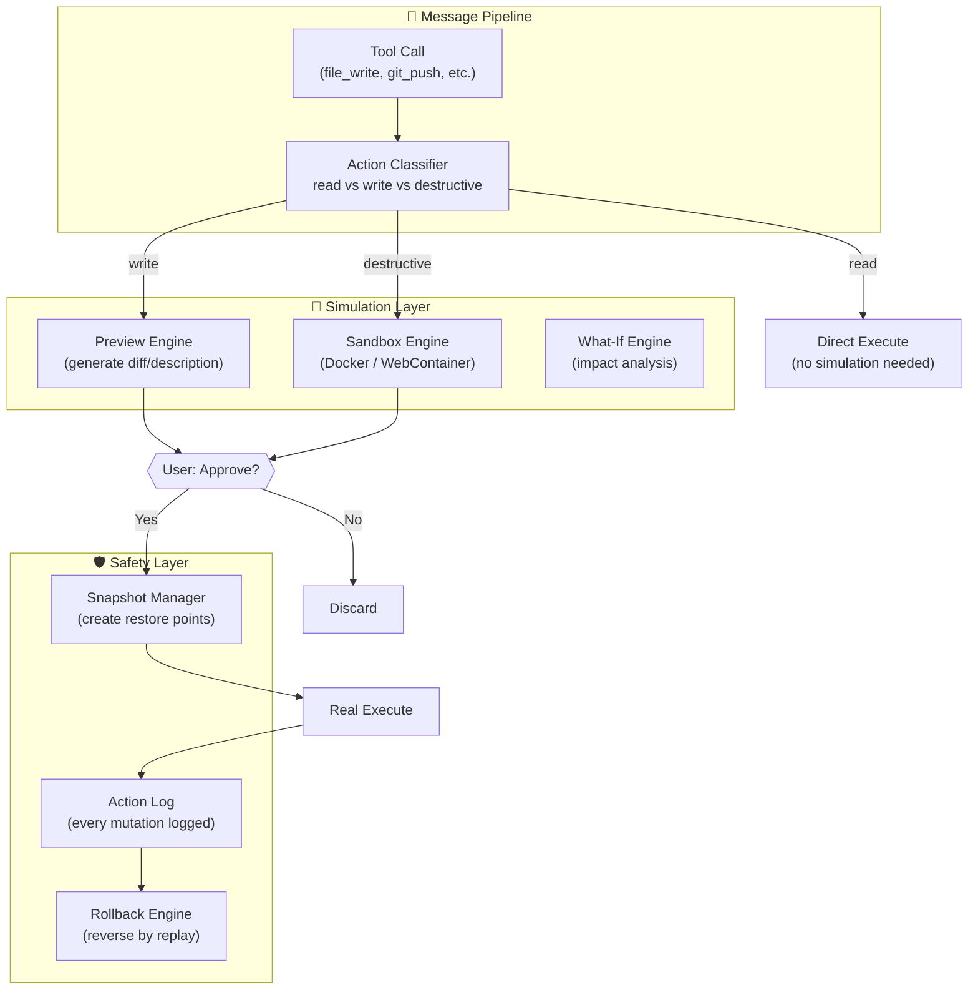
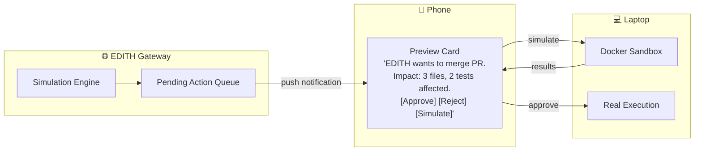
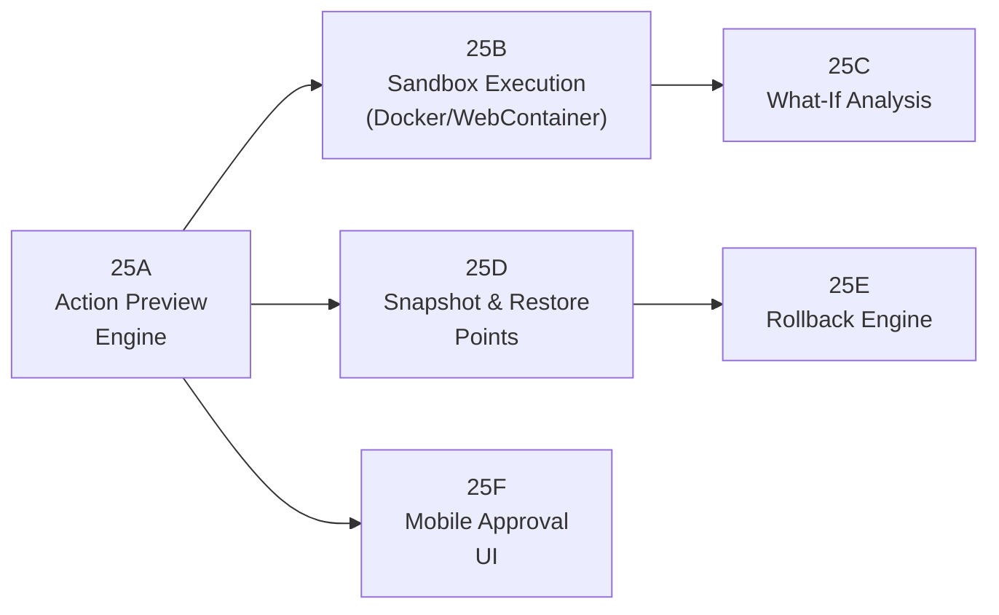
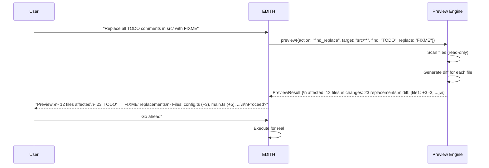
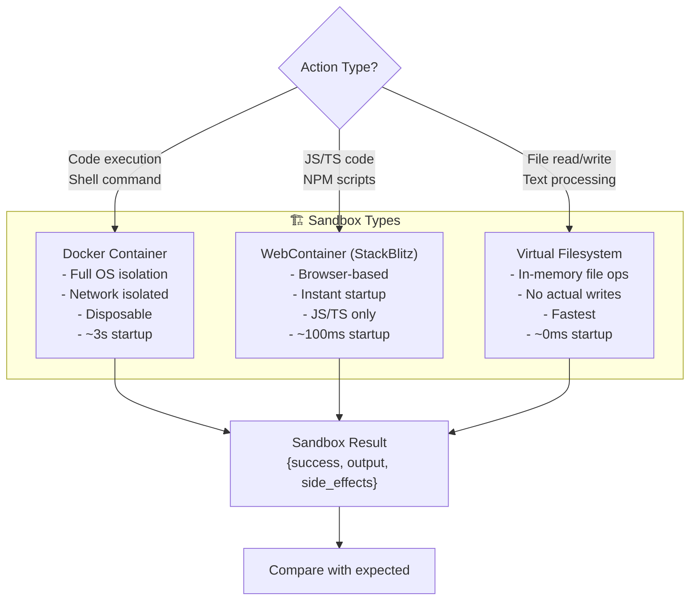
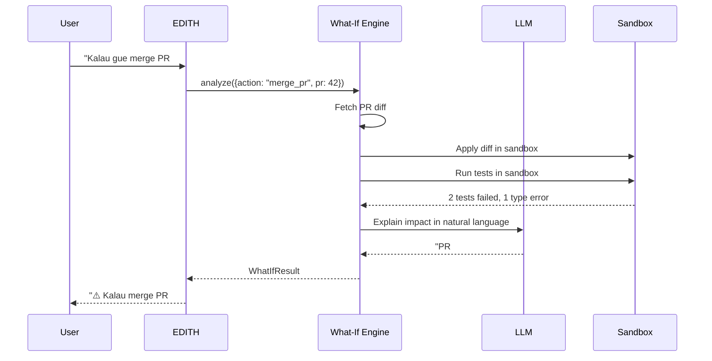
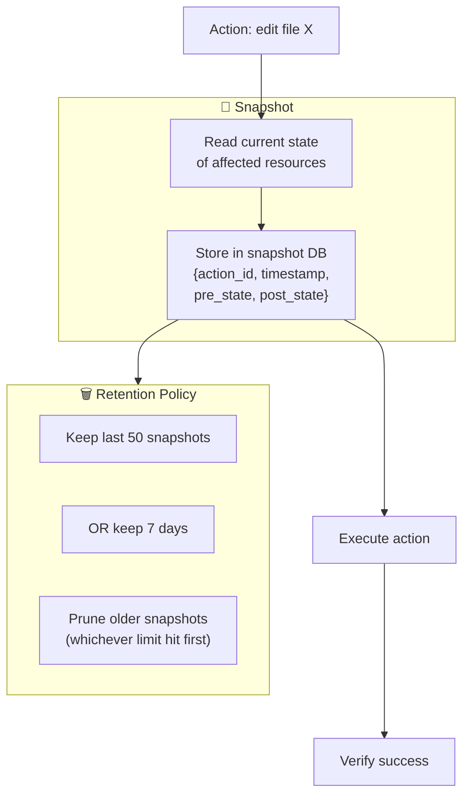
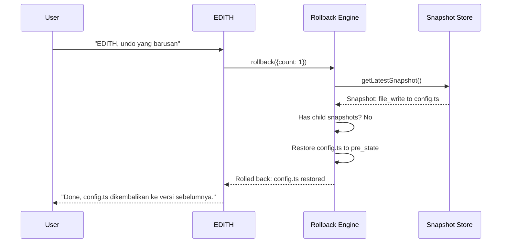
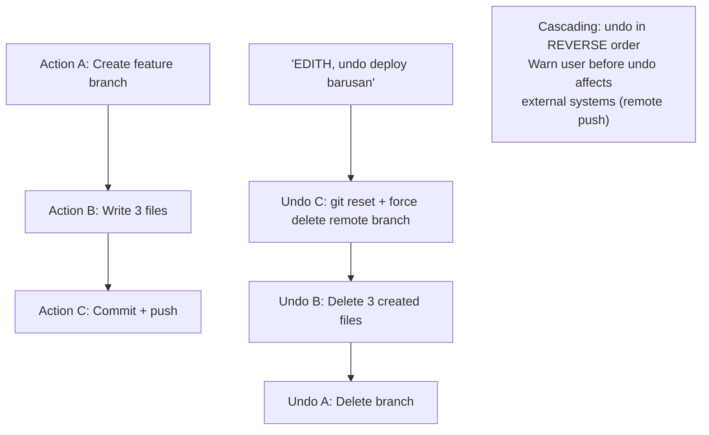

# Phase 25 — Digital Twin & Simulation Mode

> "Tony simulasi suit di hologram sebelum build. EDITH simulasi aksi sebelum execute."

**Prioritas:** 🟢 LOW-MEDIUM — Safety net yang mencegah mistakes mahal
**Depends on:** Phase 7 (computer use), Phase 17 (privacy vault), Phase 11 (multi-agent)
**Status:** ❌ Not started

---

## 1. Tujuan

Sebelum menjalankan aksi yang berisiko (deploy code, kirim email massal, edit file penting),
EDITH bisa **simulate** hasilnya di sandbox. User review preview → approve → execute.
Plus: full undo/rollback engine untuk setiap aksi EDITH.

Ini "simulation chamber" Tony Stark — test di virtual dulu, baru execute di real world.



---

## 2. Research References

| # | Paper / Project | ID | Kontribusi ke EDITH |
|---|-----------------|-----|---------------------|
| 1 | SWE-agent: Agent-Computer Interfaces for SE | arXiv:2405.15793 | Agent sandbox execution pattern — isolated env untuk code changes |
| 2 | E2B (open source) | e2b.dev | Cloud sandboxes for AI agents — disposable execution environments |
| 3 | Docker Container Sandboxing for CI | doi:10.1109/ICSME.2016.58 | Isolation patterns for safe code execution |
| 4 | Undo/Redo Architecture (Command Pattern) | GoF Design Patterns | Command pattern → every action is reversible object |
| 5 | Speculative Execution in Databases | doi:10.1145/2723372.2723713 | Preview query results without committing — basis preview engine |
| 6 | CodeSandbox / StackBlitz (WebContainers) | codesandbox.io | Browser-based isolated execution — lightweight alternative to Docker |
| 7 | Shadow Testing (LaunchDarkly pattern) | launchdarkly.com | Run new code path in shadow mode, compare with production |
| 8 | Safepoint: A System for Consistent Rollback | arXiv:2312.04529 | Consistent snapshot + rollback for distributed systems |

---

## 3. Arsitektur

### 3.1 Kontrak Arsitektur

```
Rule 1: Simulation NEVER affects real state.
        Sandbox is fully isolated: separate filesystem, network, DB.
        No sandbox action can leak to production.

Rule 2: Preview mode is the DEFAULT for destructive actions.
        File delete, git push, email send → auto-preview first.
        User can skip preview with "EDITH, just do it" (opt-in skip).

Rule 3: Restore points are automatic.
        Every non-read action → snapshot before execution.
        Snapshots retained: last 50 or 7 days, whichever is less.

Rule 4: Rollback is cascading.
        Undo action A that triggered B and C → undo C, B, then A.
        If cascade would affect external systems → warn user first.
```

### 3.2 System Architecture



### 3.3 Cross-Device Simulation



---

## 4. Sub-Phase Breakdown



---

### Phase 25A — Action Preview Engine

**Goal:** Generate readable preview of what an action will do, before doing it.



**Preview Types:**
| Action Type | Preview Format |
|-------------|---------------|
| File edit | Unified diff (like `git diff`) |
| File delete | List files + sizes + last modified |
| Git push | Commits list + changed files + remote impact |
| Email send | Full draft + recipients + "sent as" |
| API call (write) | Request body + endpoint + expected response |
| Database query (write) | SQL + affected rows estimate |
| Shell command | Explain what command does + dry-run if possible |

```typescript
interface ActionPreview {
  actionId: string;
  type: string;
  description: string;            // human-readable: "Replace 23 TODOs with FIXME in 12 files"
  impact: 'low' | 'medium' | 'high' | 'critical';
  affectedResources: string[];    // file paths, URLs, DB tables
  diff?: string;                  // unified diff format
  reversible: boolean;            // can this be undone?
  estimatedDuration: number;      // ms
}
```

**Files:**
| File | Action | Lines |
|------|--------|-------|
| `EDITH-ts/src/core/simulation/preview-engine.ts` | CREATE | ~150 |
| `EDITH-ts/src/core/simulation/action-classifier.ts` | CREATE | ~80 |
| `EDITH-ts/src/core/simulation/types.ts` | CREATE | ~60 |

---

### Phase 25B — Sandbox Execution

**Goal:** Execute actions in isolated environment untuk verify hasil sebelum real execution.



```typescript
interface SandboxConfig {
  type: 'docker' | 'webcontainer' | 'virtual-fs';
  timeoutMs: number;              // max execution time
  memoryLimitMb: number;          // max memory
  networkAccess: boolean;         // allow internet in sandbox?
  mountPaths: string[];           // which host paths to copy into sandbox
}

// DECISION: Default to virtual-fs, escalate to Docker for shell commands
// WHY: Virtual-fs is instant (0ms), Docker takes 3s startup
// ALTERNATIVES: Always Docker (too slow), always virtual (can't run shell)
// REVISIT: When WebContainers mature beyond JS/TS
```

**Files:**
| File | Action | Lines |
|------|--------|-------|
| `EDITH-ts/src/core/simulation/sandbox-engine.ts` | CREATE | ~120 |
| `EDITH-ts/src/core/simulation/sandbox-docker.ts` | CREATE | ~100 |
| `EDITH-ts/src/core/simulation/sandbox-virtual-fs.ts` | CREATE | ~80 |

---

### Phase 25C — What-If Analysis

**Goal:** Answer "apa yang terjadi kalau..." questions.



**What-If Scenarios:**
```
"Kalau gue merge PR ini?"          → sandbox run tests + type check
"Kalau gue pake Groq instead OpenAI?" → cost + speed comparison estimate
"Kalau gue reschedule meeting?"    → check calendar conflicts for all attendees
"Kalau gue deploy versi ini?"      → sandbox run build + smoke tests
"Kalau gue delete file ini?"       → check imports, dependents, references
```

**Files:**
| File | Action | Lines |
|------|--------|-------|
| `EDITH-ts/src/core/simulation/what-if-engine.ts` | CREATE | ~120 |

---

### Phase 25D — Snapshot & Restore Points

**Goal:** Automatic restore point sebelum setiap mutation.



```typescript
interface ActionSnapshot {
  id: string;
  actionId: string;
  timestamp: number;
  type: string;                   // 'file_write', 'git_push', 'email_send'
  target: string;                 // file path, git remote, email address
  preState: Buffer | string;      // state before action
  postState?: Buffer | string;    // state after action (for verification)
  childSnapshots: string[];       // cascaded actions
  reversible: boolean;
}
```

**Files:**
| File | Action | Lines |
|------|--------|-------|
| `EDITH-ts/src/core/simulation/snapshot-manager.ts` | CREATE | ~120 |
| `EDITH-ts/src/core/simulation/snapshot-store.ts` | CREATE | ~80 |

---

### Phase 25E — Rollback Engine

**Goal:** "EDITH, undo yang barusan" → reverse last action(s).



**Cascading Undo:**


**Files:**
| File | Action | Lines |
|------|--------|-------|
| `EDITH-ts/src/core/simulation/rollback-engine.ts` | CREATE | ~120 |
| `EDITH-ts/src/core/simulation/__tests__/rollback-engine.test.ts` | CREATE | ~100 |

---

### Phase 25F — Mobile Approval UI

**Goal:** Approve/reject previewed actions dari HP.

```
Mobile Approval Card:
  ┌─ Action Preview ──────────────────┐
  │ 📝 Replace TODO → FIXME           │
  │                                   │
  │ Impact: 12 files, 23 changes     │
  │ Risk: 🟢 LOW                     │
  │                                   │
  │ config.ts:                        │
  │ - // TODO: implement cache        │
  │ + // FIXME: implement cache       │
  │                                   │
  │ [Approve] [Reject] [Simulate]    │
  └───────────────────────────────────┘
```

**Files:**
| File | Action | Lines |
|------|--------|-------|
| `apps/mobile/components/ActionPreviewCard.tsx` | CREATE | ~80 |
| `apps/mobile/screens/ApprovalScreen.tsx` | CREATE | ~100 |

---

## 5. Acceptance Gates

```
□ File edit shows diff preview before execution
□ Git push shows commits + affected files before pushing
□ Docker sandbox runs code without affecting host filesystem
□ Virtual-fs preview generates correct diff in <100ms
□ What-if: "merge PR" runs tests in sandbox + reports failures
□ Snapshot created automatically before every write action
□ "EDITH undo" reverses last action correctly
□ Cascading undo works for multi-step actions
□ Snapshot retention: max 50 or 7 days, auto-prune older
□ Mobile: approve/reject previews from phone
□ "EDITH just do it" skips preview (opt-in bypass)
□ Rollback of external actions (git push) warns before executing
```

---

## 6. Koneksi ke Phase Lain

| Phase | Koneksi | Data Flow |
|-------|---------|-----------|
| Phase 7 (Computer Use) | All computer actions get preview | tool_call → preview_engine |
| Phase 11 (Multi-Agent) | Agent actions previewed before execute | agent_action → simulation |
| Phase 17 (Privacy) | Preview hides sensitive data in diff display | preview → privacy_filter |
| Phase 22 (Mission) | Mission tasks previewed (batch approve) | mission_task → preview_queue |
| Phase 23 (Hardware) | Hardware commands get safety preview | hw_command → preview |
| Phase 27 (Cross-Device) | Approve from phone, execute on laptop | approval → device_sync |

---

## 7. File Changes Summary

| File | Action | Lines |
|------|--------|-------|
| `EDITH-ts/src/core/simulation/preview-engine.ts` | CREATE | ~150 |
| `EDITH-ts/src/core/simulation/action-classifier.ts` | CREATE | ~80 |
| `EDITH-ts/src/core/simulation/sandbox-engine.ts` | CREATE | ~120 |
| `EDITH-ts/src/core/simulation/sandbox-docker.ts` | CREATE | ~100 |
| `EDITH-ts/src/core/simulation/sandbox-virtual-fs.ts` | CREATE | ~80 |
| `EDITH-ts/src/core/simulation/what-if-engine.ts` | CREATE | ~120 |
| `EDITH-ts/src/core/simulation/snapshot-manager.ts` | CREATE | ~120 |
| `EDITH-ts/src/core/simulation/snapshot-store.ts` | CREATE | ~80 |
| `EDITH-ts/src/core/simulation/rollback-engine.ts` | CREATE | ~120 |
| `EDITH-ts/src/core/simulation/types.ts` | CREATE | ~60 |
| `EDITH-ts/src/core/simulation/__tests__/rollback-engine.test.ts` | CREATE | ~100 |
| `apps/mobile/components/ActionPreviewCard.tsx` | CREATE | ~80 |
| `apps/mobile/screens/ApprovalScreen.tsx` | CREATE | ~100 |
| **Total** | | **~1310** |

**New dependencies:** `dockerode` (Docker API), `memfs` (in-memory filesystem)
