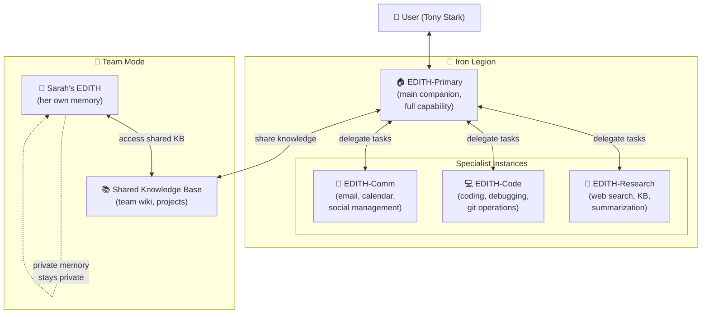
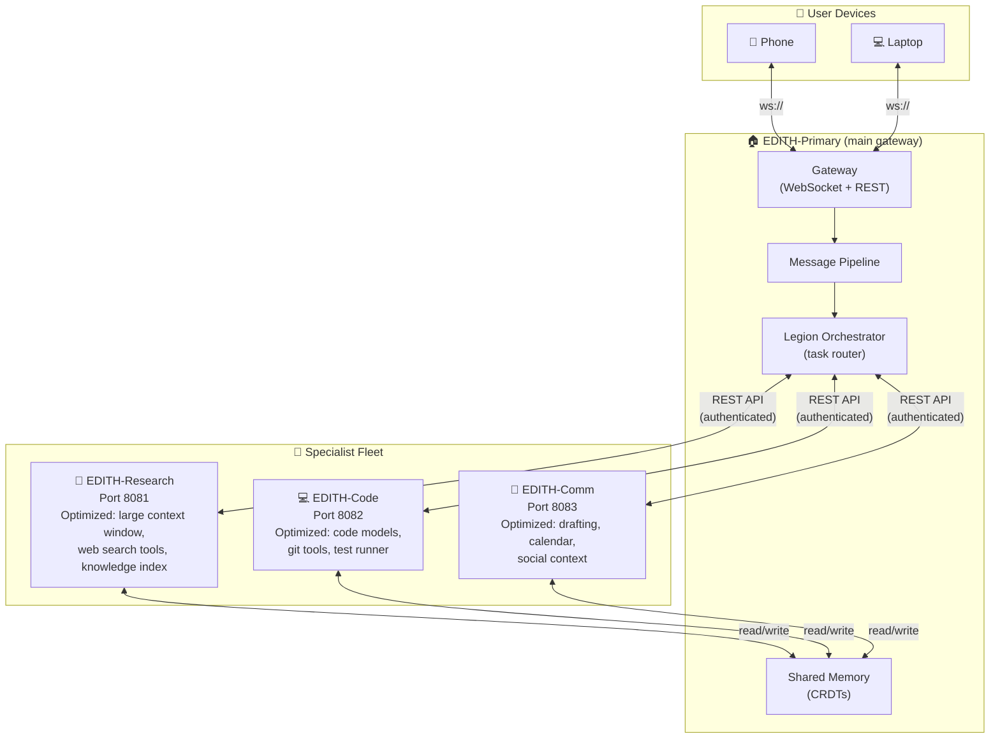
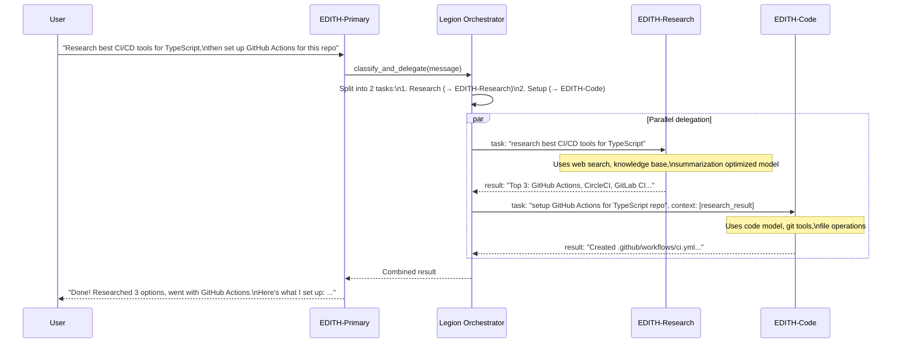
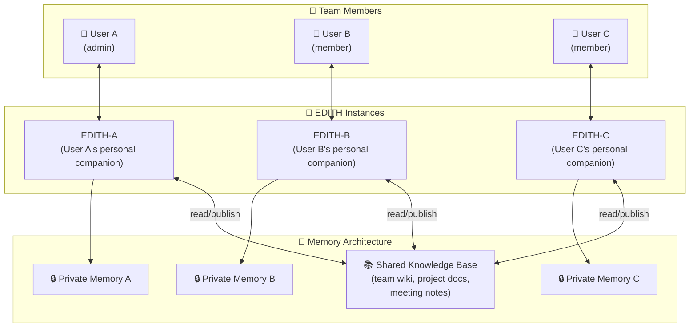
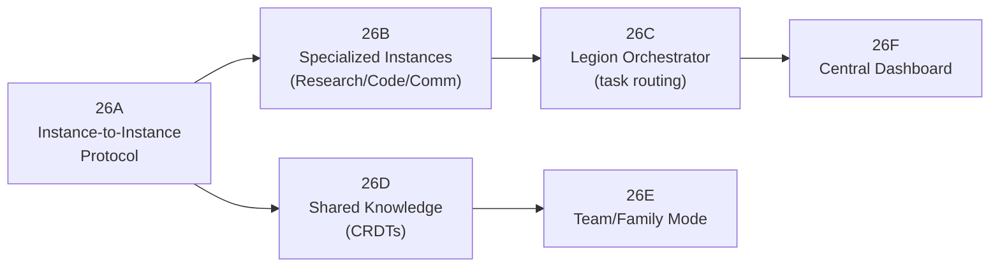
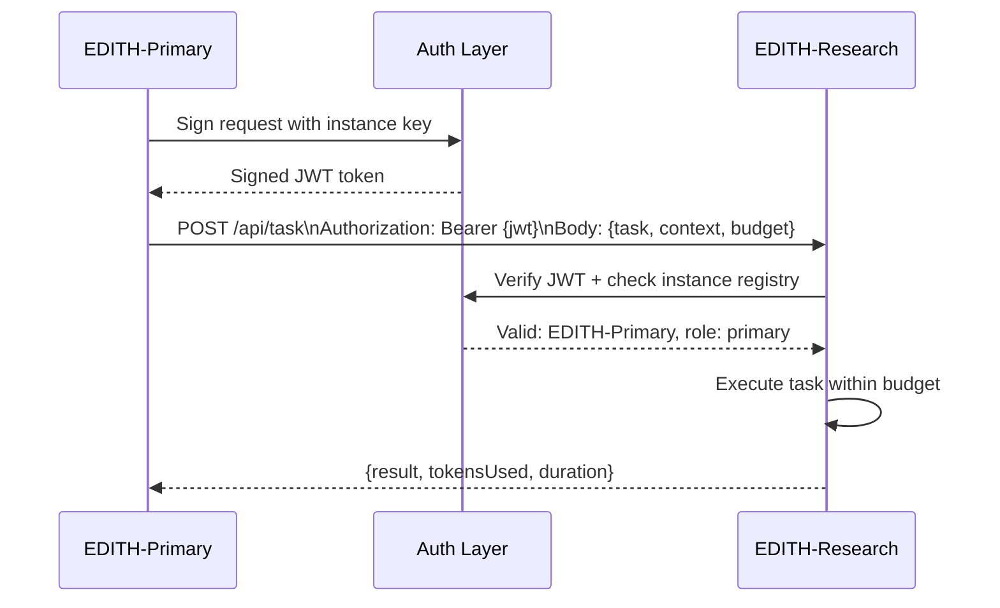
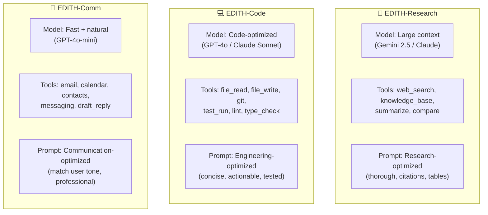
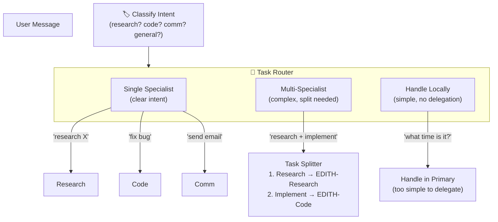
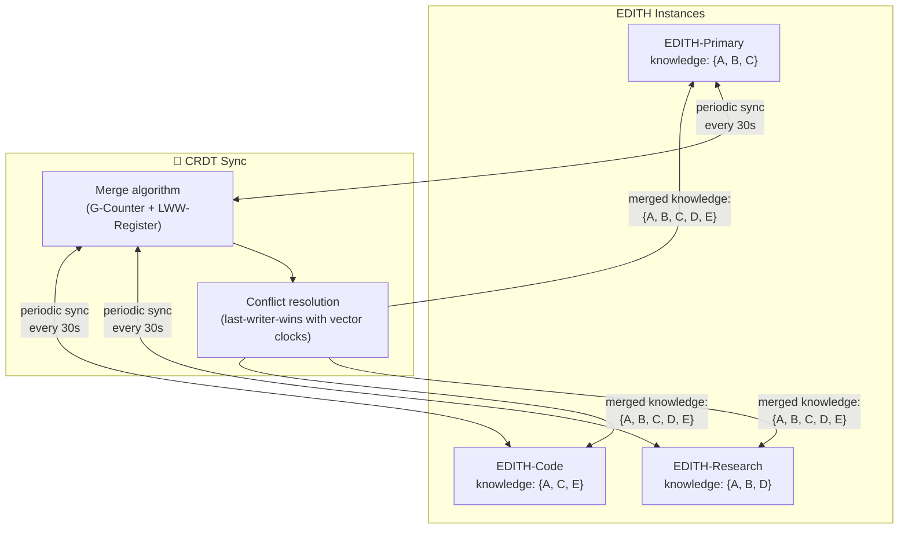
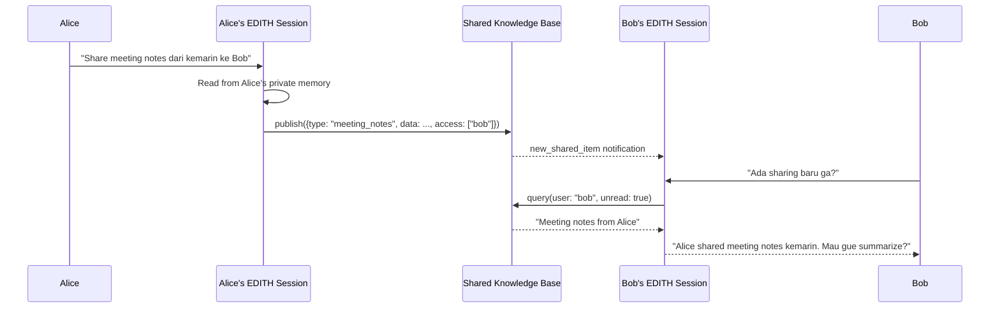

# Phase 26 — Collaborative EDITH (Iron Legion)

> "Tony punya Iron Legion. Kalau EDITH bisa kloning — masing-masing punya spesialisasi."

**Prioritas:** 🟢 LOW — Endgame feature, tapi archirecturally important
**Depends on:** Phase 11 (multi-agent), Phase 17 (privacy vault), Phase 12 (distribution)
**Status:** ❌ Not started

---

## 1. Tujuan

Multiple EDITH instances yang saling berkolaborasi:
- **Specialized instances:** EDITH-Research, EDITH-Code, EDITH-Comm
- **Team/family shared EDITH:** Multiple users, shared knowledge, private memory
- **Central orchestration:** User sebagai "Tony" yang manage fleet

Bedanya dari Phase 11 (Multi-Agent):
- Phase 11 = internal sub-agents di dalam 1 EDITH (satu process)
- Phase 26 = external **multiple EDITH processes** yang running independently, komunikasi via API



---

## 2. Research References

| # | Paper / Project | ID | Kontribusi ke EDITH |
|---|-----------------|-----|---------------------|
| 1 | AutoGen: Enabling Next-Gen LLM Applications | arXiv:2308.08155 | Multi-agent collaboration patterns + group chat protocols |
| 2 | MetaGPT: Multi-Agent for Software Engineering | arXiv:2308.00352 | Specialized roles (PM, architect, engineer) → specialized EDITH instances |
| 3 | CrewAI Framework | github.com/joaomdmoura/crewAI | Production multi-agent orchestration — role + goal + backstory |
| 4 | MemGPT: Towards LLMs as Operating Systems | arXiv:2310.08560 | Shared + private memory hierarchies — basis team memory model |
| 5 | Multi-Agent Communication Protocols (FIPA ACL) | fipa.org/specs | Standardized agent-to-agent messaging protocol |
| 6 | Federated Learning: Privacy-Preserving Collaboration | arXiv:1602.05629 | Collaboration without sharing raw data — team knowledge pattern |
| 7 | Kubernetes Pod Orchestration | kubernetes.io/docs | Container orchestration patterns → EDITH instance management |
| 8 | CRDTs: Conflict-free Replicated Data Types | arXiv:1805.06358 | Eventually consistent shared state across instances |

---

## 3. Arsitektur

### 3.1 Kontrak Arsitektur

```
Rule 1: Primary instance is the SINGLE point of user interaction.
        User talks to Primary. Primary delegates to specialists.
        User can override and talk to specialist directly (opt-in).

Rule 2: Private memory is NEVER shared between instances.
        Each instance has its own memory partition.
        Shared knowledge requires explicit "publish to shared" action.
        Team members: personal memory is per-user, never cross-accessed.

Rule 3: Instance communication is authenticated and encrypted.
        EDITH-to-EDITH API uses mutual TLS or signed tokens.
        No instance can impersonate another.
        Messages are logged for audit.

Rule 4: Instances are stateless between tasks.
        Specialist receives task context → executes → returns result.
        Specialist does NOT retain user conversation state.
        Only Primary maintains conversation history.
```

### 3.2 System Architecture



### 3.3 Task Delegation Flow



### 3.4 Team/Family Shared EDITH



---

## 4. Sub-Phase Breakdown



---

### Phase 26A — Instance-to-Instance Protocol

**Goal:** Authenticated, encrypted communication between EDITH instances.



**Protocol Specification:**
```typescript
// EDITH Legion Protocol (ELP) v1
interface LegionMessage {
  version: '1.0';
  from: string;                   // instance ID
  to: string;                     // target instance ID
  type: 'task_assign' | 'task_result' | 'memory_sync' | 'heartbeat' | 'status';
  payload: unknown;
  signature: string;              // HMAC-SHA256 signed payload
  timestamp: number;
  ttl: number;                    // message expires after TTL
}

interface TaskAssignment {
  taskId: string;
  description: string;
  context: Record<string, unknown>;   // relevant context from primary
  tools: string[];                    // which tools the specialist can use
  budget: {
    maxTokens: number;
    maxDurationMs: number;
    maxApiCalls: number;
  };
  priority: 'low' | 'normal' | 'high' | 'critical';
}
```

**Files:**
| File | Action | Lines |
|------|--------|-------|
| `EDITH-ts/src/agents/legion/protocol.ts` | CREATE | ~100 |
| `EDITH-ts/src/agents/legion/instance-auth.ts` | CREATE | ~80 |
| `EDITH-ts/src/agents/legion/types.ts` | CREATE | ~60 |

---

### Phase 26B — Specialized Instances

**Goal:** Pre-configured EDITH instances optimized for specific domains.



**Instance Configuration:**
```typescript
interface InstanceSpecialization {
  name: string;
  role: 'research' | 'code' | 'communication' | 'general';
  engine: {
    provider: string;            // 'openai', 'anthropic', 'google'
    model: string;               // specific model optimized for role
    temperature: number;         // lower for code, higher for creative
    maxTokens: number;
  };
  tools: string[];               // subset of all available tools
  systemPromptOverrides: string; // role-specific instructions
  resourceLimits: {
    maxConcurrentTasks: number;
    maxDailyTokens: number;
  };
}
```

**Files:**
| File | Action | Lines |
|------|--------|-------|
| `EDITH-ts/src/agents/legion/specializations.ts` | CREATE | ~150 |
| `EDITH-ts/src/agents/legion/instance-config.ts` | CREATE | ~80 |

---

### Phase 26C — Legion Orchestrator

**Goal:** Route tasks to appropriate specialist, manage delegation.



**Delegation Decision Tree:**
```
Is this a simple query? → Handle locally (no delegation overhead)
Is this clearly one domain? → Route to specialist
Is this multi-domain? → Split into sub-tasks, delegate each
Is specialist offline? → Fallback to Primary (degrade gracefully)
Is budget sufficient? → Check remaining tokens before delegating
```

**Files:**
| File | Action | Lines |
|------|--------|-------|
| `EDITH-ts/src/agents/legion/orchestrator.ts` | CREATE | ~150 |
| `EDITH-ts/src/agents/legion/task-router.ts` | CREATE | ~100 |

---

### Phase 26D — Shared Knowledge (CRDTs)

**Goal:** Eventually consistent shared knowledge base across instances.



```typescript
// DECISION: Use CRDTs for shared knowledge, not centralized DB
// WHY: Instances may be on different machines, need offline resilience
// ALTERNATIVES: Central DB (single point of failure), Raft consensus (complex)
// REVISIT: If instances always colocated (could simplify to shared SQLite)
```

**Files:**
| File | Action | Lines |
|------|--------|-------|
| `EDITH-ts/src/agents/legion/shared-knowledge.ts` | CREATE | ~120 |
| `EDITH-ts/src/agents/legion/crdt-store.ts` | CREATE | ~100 |

---

### Phase 26E — Team/Family Mode

**Goal:** Multiple users share one EDITH deployment with private memory.



**Access Control:**
```
admin  → manage users, see all shared, configure instance
member → read/write shared KB, private memory isolated
guest  → read-only shared KB, no private memory
```

**Files:**
| File | Action | Lines |
|------|--------|-------|
| `EDITH-ts/src/agents/legion/team-mode.ts` | CREATE | ~100 |
| `EDITH-ts/src/agents/legion/access-control.ts` | CREATE | ~80 |

---

### Phase 26F — Central Dashboard

**Goal:** Web UI to manage all EDITH instances.

```
Dashboard Layout:
┌──────────────────────────────────────────────────────┐
│ 🦾 EDITH Legion Dashboard                           │
├──────────┬───────────────────────────────────────────┤
│          │ Instance Status                           │
│ Fleet    │ ┌─────────┬─────────┬─────────┐          │
│ Overview │ │Primary  │Research │Code     │          │
│          │ │🟢 Online│🟢 Online│🟡 Busy  │          │
│ Instances│ │CPU: 12% │CPU: 45% │CPU: 78% │          │
│          │ │Tasks: 0 │Tasks: 2 │Tasks: 1 │          │
│ Tasks    │ └─────────┴─────────┴─────────┘          │
│          │                                           │
│ Costs    │ Today's Usage:                            │
│          │ Tokens: 125,000 / 500,000                │
│ Settings │ API calls: 42 / 200                      │
│          │ Cost estimate: $0.85                      │
│          │                                           │
│ Users    │ Active Tasks:                             │
│          │ 1. [Research] "CI/CD comparison" - 45%   │
│          │ 2. [Code] "Setup GHA workflow" - pending  │
└──────────┴───────────────────────────────────────────┘
```

**Files:**
| File | Action | Lines |
|------|--------|-------|
| `EDITH-ts/src/gateway/legion-dashboard.ts` | CREATE | ~100 |
| `apps/desktop/renderer/legion/Dashboard.tsx` | CREATE | ~200 |
| `apps/desktop/renderer/legion/InstanceCard.tsx` | CREATE | ~80 |

---

## 5. Acceptance Gates

```
□ Primary can delegate task to specialist and receive result
□ Instance-to-instance auth: JWT signed + verified
□ Specialist overrides: Research uses large context model, Code uses code model
□ Task routing: "research X" → EDITH-Research, "fix bug" → EDITH-Code
□ Multi-domain task split into sub-tasks delegated to different specialists
□ Specialist offline → graceful fallback to Primary
□ Shared knowledge syncs across instances (CRDT merge)
□ Team mode: User A's private memory invisible to User B
□ Team mode: Shared KB accessible by all team members
□ Dashboard shows all instance status, tasks, costs
□ Kill switch: admin can stop any instance from dashboard
□ Budget tracking: per-instance token usage tracked
```

---

## 6. Koneksi ke Phase Lain

| Phase | Koneksi | Data Flow |
|-------|---------|-----------|
| Phase 11 (Multi-Agent) | Legion = external version of internal agents | task → external_agent (vs internal) |
| Phase 12 (Distribution) | Instance deployment uses distribution infra | docker_compose → instance_fleet |
| Phase 13 (Knowledge) | Shared knowledge base powered by LanceDB | knowledge → crdt_sync |
| Phase 17 (Privacy) | Private memory isolation + team access control | privacy_policy → access_control |
| Phase 22 (Mission) | Missions delegated across specialized instances | mission_task → specialist |
| Phase 24 (Self-Improve) | Learning shared across instances | feedback → shared_improvement |
| Phase 27 (Cross-Device) | Dashboard accessible from any device | dashboard → cross_device |

---

## 7. File Changes Summary

| File | Action | Lines |
|------|--------|-------|
| `EDITH-ts/src/agents/legion/protocol.ts` | CREATE | ~100 |
| `EDITH-ts/src/agents/legion/instance-auth.ts` | CREATE | ~80 |
| `EDITH-ts/src/agents/legion/types.ts` | CREATE | ~60 |
| `EDITH-ts/src/agents/legion/specializations.ts` | CREATE | ~150 |
| `EDITH-ts/src/agents/legion/instance-config.ts` | CREATE | ~80 |
| `EDITH-ts/src/agents/legion/orchestrator.ts` | CREATE | ~150 |
| `EDITH-ts/src/agents/legion/task-router.ts` | CREATE | ~100 |
| `EDITH-ts/src/agents/legion/shared-knowledge.ts` | CREATE | ~120 |
| `EDITH-ts/src/agents/legion/crdt-store.ts` | CREATE | ~100 |
| `EDITH-ts/src/agents/legion/team-mode.ts` | CREATE | ~100 |
| `EDITH-ts/src/agents/legion/access-control.ts` | CREATE | ~80 |
| `EDITH-ts/src/gateway/legion-dashboard.ts` | CREATE | ~100 |
| `apps/desktop/renderer/legion/Dashboard.tsx` | CREATE | ~200 |
| `apps/desktop/renderer/legion/InstanceCard.tsx` | CREATE | ~80 |
| **Total** | | **~1500** |

**New dependencies:** `yjs` (CRDT library), `jose` (JWT signing/verification)
