# Phase 27 — Cross-Device Mesh & Unified Gateway

> "Tony pakai suit di mana aja — lab, udara, bawah laut — JARVIS selalu connected. EDITH harus sama."

**Prioritas:** 🔴 HIGH — Ini lem yang menyatukan semua phase di HP dan laptop
**Depends on:** Phase 1 (voice), Phase 8 (channels), Phase 12 (desktop + mobile apps)
**Status:** ❌ Not started

---

## 1. Tujuan

EDITH harus jalan **seamless** di HP dan laptop — bahkan ketika keduanya di **network berbeda
dan gateway berbeda**. User mulai ngobrol di laptop, lanjut di HP sambil jalan, balik ke
laptop — tanpa kehilangan konteks.

Ini bukan sekedar sync. Ini **device mesh**: setiap device jadi node, gateway jadi hub,
dan user experience tetap satu EDITH yang sama di mana-mana.

### Problem Statement

```
Skenario saat ini (BROKEN tanpa Phase 27):

  Laptop ──ws://─→ Gateway A (localhost:3000)
  Phone  ──ws://─→ Gateway B (cloud.edith.ai:443)

  ❌ Conversation di laptop ga muncul di HP
  ❌ Memory di HP ga ke-sync ke laptop
  ❌ Voice session di HP ga bisa hand-off ke laptop
  ❌ Proactive trigger di laptop ga kirim notif ke HP
  ❌ HUD state beda-beda per device
```

```
Target (SETELAH Phase 27):

  Laptop ──ws://─→ Gateway A (localhost:3000) ──sync──→ Sync Layer
  Phone  ──ws://─→ Gateway B (cloud.edith.ai:443) ──sync──→ Sync Layer

  ✅ Satu conversation, multi-device
  ✅ Memory terpusat, semua device baca yang sama
  ✅ Voice hand-off: mulai di HP, lanjut di laptop
  ✅ Notifications follow the user, not the device
  ✅ HUD state synced across devices
```

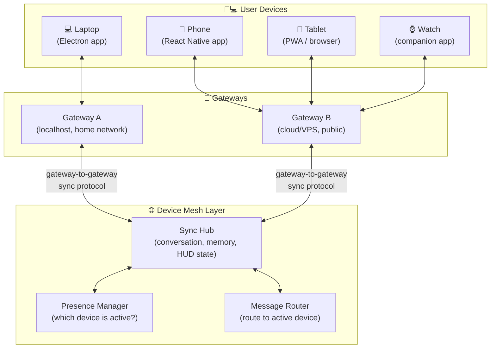

---

## 2. Research References

| # | Paper / Project | ID | Kontribusi ke EDITH |
|---|-----------------|-----|---------------------|
| 1 | CRDTs: Conflict-free Replicated Data Types | arXiv:1805.06358 | Eventually consistent sync tanpa central authority — handles network partitions |
| 2 | Yjs: Shared Editing Framework | github.com/yjs/yjs | Production CRDT implementation for real-time sync — basis shared state |
| 3 | Matrix Protocol (Element) | spec.matrix.org | Decentralized communication protocol — room-based message sync across servers |
| 4 | WebRTC for Direct Device Communication | webrtc.org | P2P connection between devices on same network — lowest latency sync |
| 5 | Handoff (Apple Continuity) | developer.apple.com/handoff | Device-to-device task handoff UX patterns — "start here, continue there" |
| 6 | Android Nearby Connections | developers.google.com/nearby | Cross-device discovery + connection on local network |
| 7 | MQTT with QoS Levels | mqtt.org/mqtt-specification | Reliable IoT messaging: QoS 0 (fire-forget), 1 (at-least-once), 2 (exactly-once) |
| 8 | Raft Consensus Algorithm | raft.github.io | Leader election for gateway-to-gateway sync coordination |
| 9 | WireGuard VPN | wireguard.com | Lightweight VPN tunnel — connect gateways across different networks |

---

## 3. Arsitektur

### 3.1 Kontrak Arsitektur

```
Rule 1: ONE user identity, many devices.
        User authenticates once per device (pairing flow).
        All devices share same user_id, different device_id.
        Auth token = {user_id, device_id, gateway_id}.

Rule 2: Conversation is device-agnostic.
        Messages belong to user, not device.
        Any device can see full conversation history.
        Active device = where user is typing/speaking RIGHT NOW.

Rule 3: Gateway-to-gateway sync via CRDT.
        No "master" gateway. Both gateways hold full state.
        Sync happens asynchronously (eventual consistency).
        Network partition → both continue working → merge when reconnected.

Rule 4: Notification follows the active device.
        If user is on phone → notifications go to phone.
        If user is on laptop → notifications go to laptop.
        If user inactive everywhere → push to all devices.

Rule 5: Sensitive data transit is end-to-end encrypted.
        Gateway-to-gateway sync encrypted with user's key.
        Even if sync layer is cloud-hosted, it cannot read content.
```

### 3.2 Three Architecture Modes

EDITH supports 3 deployment modes for cross-device:

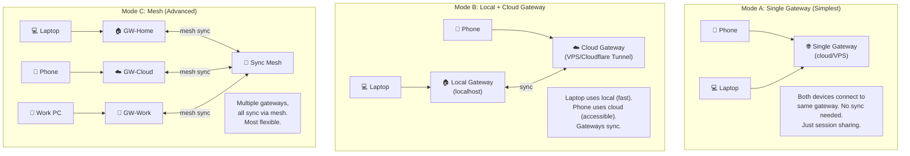

### 3.3 Gateway-to-Gateway Sync Protocol

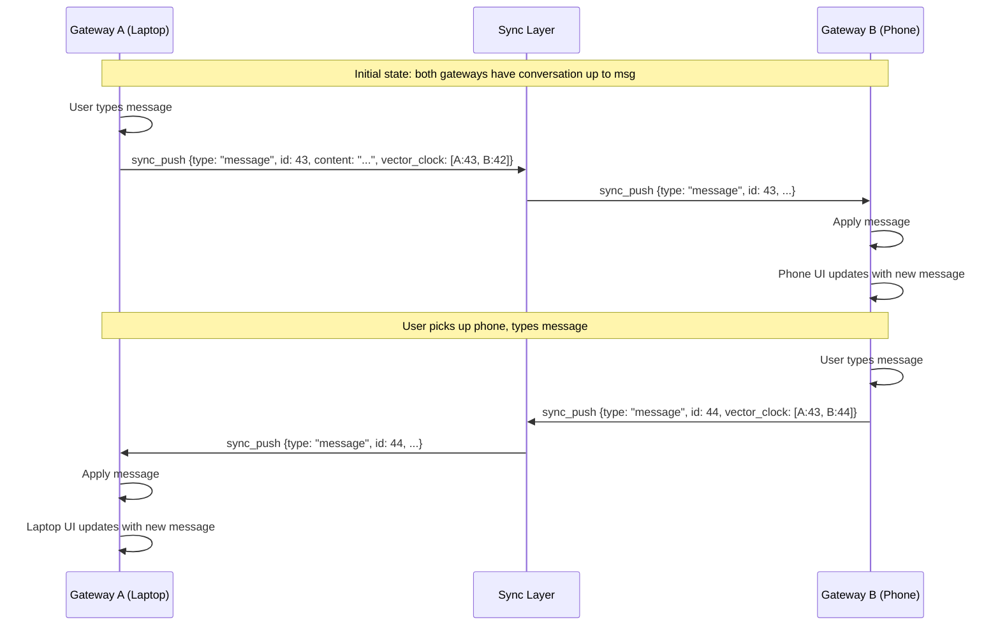

### 3.4 Detailed Data Sync Model

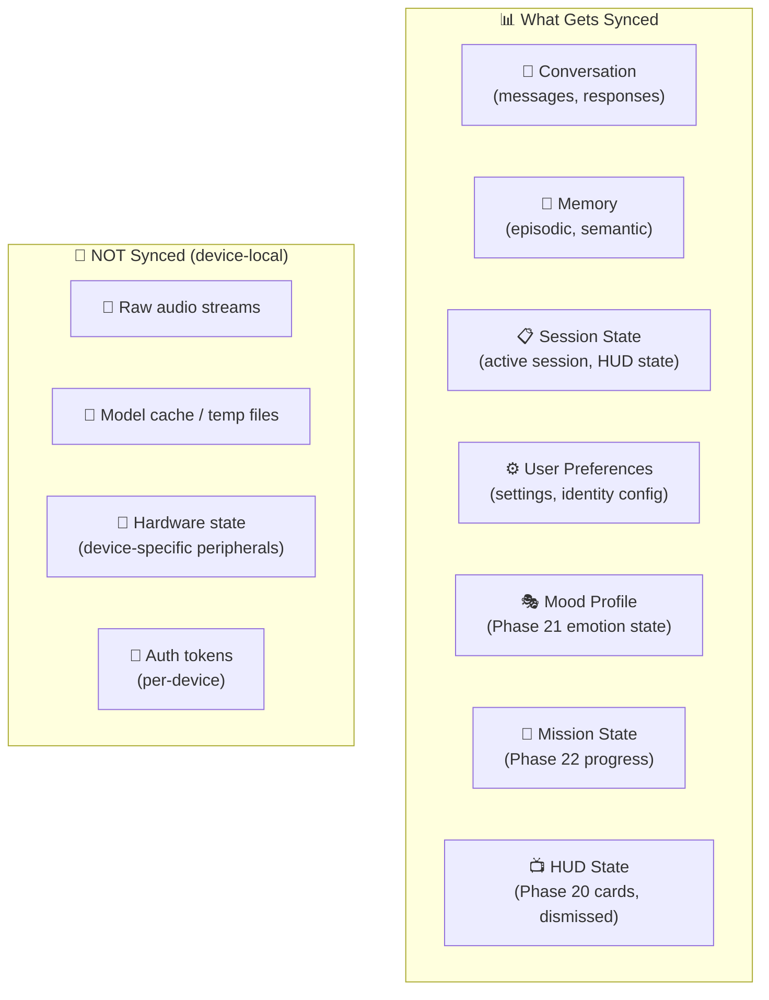

### 3.5 Network Topology Options

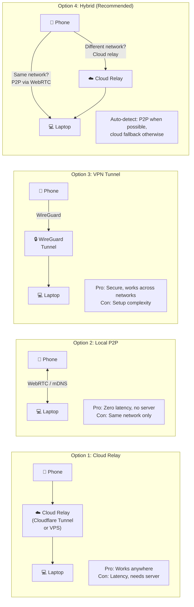

---

## 4. Sub-Phase Breakdown

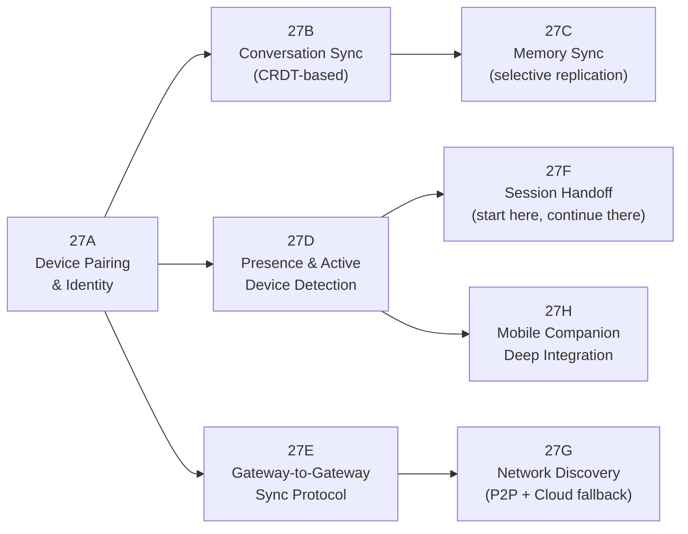

---

### Phase 27A — Device Pairing & Identity

**Goal:** One user, many devices — secure pairing flow.

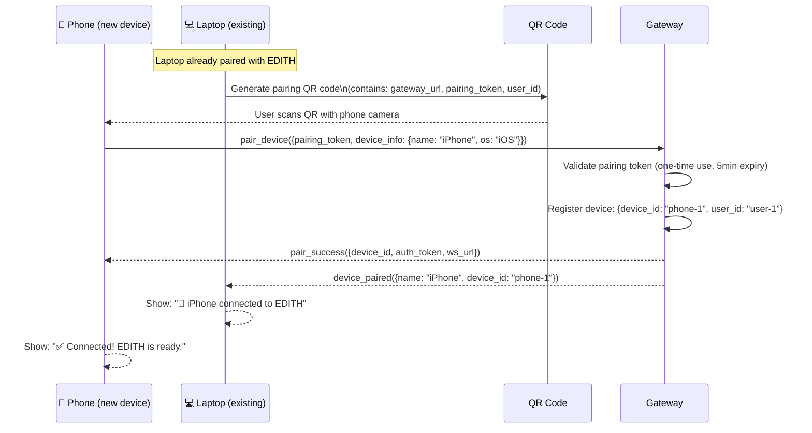

```typescript
interface DeviceRegistration {
  deviceId: string;           // UUID generated at pairing
  userId: string;             // owner
  name: string;               // "iPhone 15", "Work Laptop"
  os: 'ios' | 'android' | 'windows' | 'macos' | 'linux' | 'web';
  type: 'phone' | 'laptop' | 'tablet' | 'watch' | 'browser';
  gatewayId: string;          // which gateway this device connects to
  capabilities: string[];     // ['voice', 'camera', 'notifications', 'overlay']
  lastSeen: number;
  paired: number;             // when paired
  authToken: string;          // device-specific auth token (hashed)
}
```

**Files:**
| File | Action | Lines |
|------|--------|-------|
| `EDITH-ts/src/pairing/device-pairing.ts` | MODIFY | +100 |
| `EDITH-ts/src/pairing/device-registry.ts` | CREATE | ~80 |
| `EDITH-ts/src/pairing/qr-generator.ts` | CREATE | ~60 |
| `apps/mobile/screens/PairScreen.tsx` | CREATE | ~80 |

---

### Phase 27B — Conversation Sync (CRDT-based)

**Goal:** Conversations stay in sync across devices in real-time.

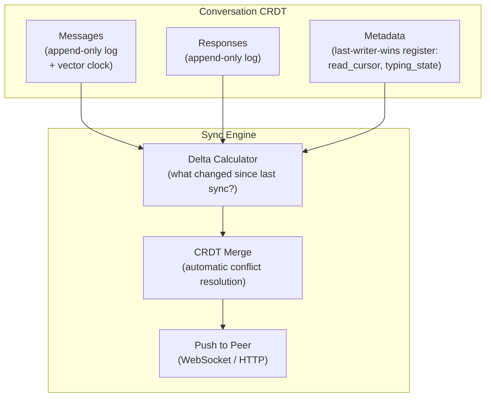

**How sync works:**
```
1. User types message on laptop → append to local CRDT log
2. CRDT generates delta (just the new message)
3. Delta pushed to connected peer gateways
4. Peer applies delta to its CRDT (automatic merge, no conflicts possible)
5. Peer's connected devices receive update via WebSocket
6. UI updates on phone showing new message
```

**Vector Clock Example:**
```
Laptop sends: "hello"     → vector_clock: {laptop: 1, phone: 0}
Phone sends: "hi there"   → vector_clock: {laptop: 0, phone: 1}

After sync merge:
Both have: ["hello", "hi there"] → vector_clock: {laptop: 1, phone: 1}
Order determined by timestamp (LWW) or causal order (vector clock)
```

**Implementation:**
```typescript
import * as Y from 'yjs';

class ConversationSync {
  private doc: Y.Doc;
  private messages: Y.Array<ConversationMessage>;
  
  constructor(userId: string) {
    this.doc = new Y.Doc();
    this.messages = this.doc.getArray('messages');
    
    // Listen for remote changes
    this.doc.on('update', (update: Uint8Array) => {
      // Broadcast to connected devices
      this.broadcastToDevices(update);
    });
  }
  
  addMessage(msg: ConversationMessage): void {
    this.messages.push([msg]);
    // CRDT automatically generates delta for sync
  }
  
  applyRemoteUpdate(update: Uint8Array): void {
    Y.applyUpdate(this.doc, update);
    // Automatic merge — no conflicts possible with Yjs
  }
}
```

**Files:**
| File | Action | Lines |
|------|--------|-------|
| `EDITH-ts/src/sessions/conversation-sync.ts` | CREATE | ~120 |
| `EDITH-ts/src/sessions/crdt-adapter.ts` | CREATE | ~80 |
| `EDITH-ts/src/sessions/__tests__/conversation-sync.test.ts` | CREATE | ~100 |

---

### Phase 27C — Memory Sync (Selective Replication)

**Goal:** User's memory consistent across gateways, with selective sync.

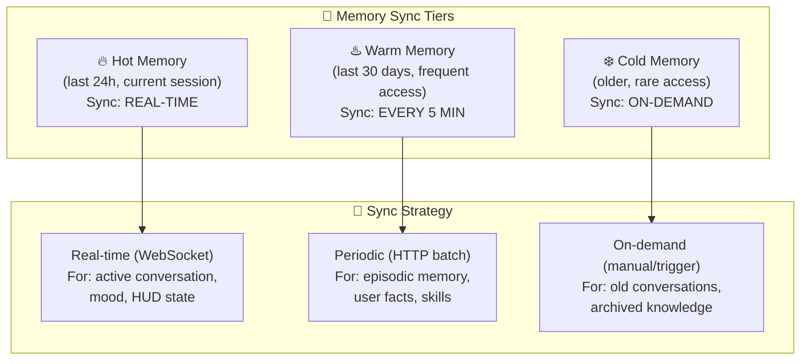

```typescript
// DECISION: Tiered sync instead of full replication
// WHY: Full memory sync is too heavy (could be GBs of vectors)
// ALTERNATIVES: Full sync (bandwidth), no sync (bad UX)
// REVISIT: If memory size stays small (<100MB) → could full-sync

interface MemorySyncPolicy {
  tier: 'hot' | 'warm' | 'cold';
  syncMethod: 'realtime' | 'periodic' | 'on-demand';
  interval?: number;         // ms (for periodic)
  maxPayloadSize: number;    // bytes per sync batch
  conflictResolution: 'lww' | 'merge' | 'ask-user';
}
```

**Files:**
| File | Action | Lines |
|------|--------|-------|
| `EDITH-ts/src/memory/memory-sync.ts` | CREATE | ~120 |
| `EDITH-ts/src/memory/sync-tiers.ts` | CREATE | ~80 |

---

### Phase 27D — Presence & Active Device Detection

**Goal:** Know which device the user is currently using → route interactions correctly.

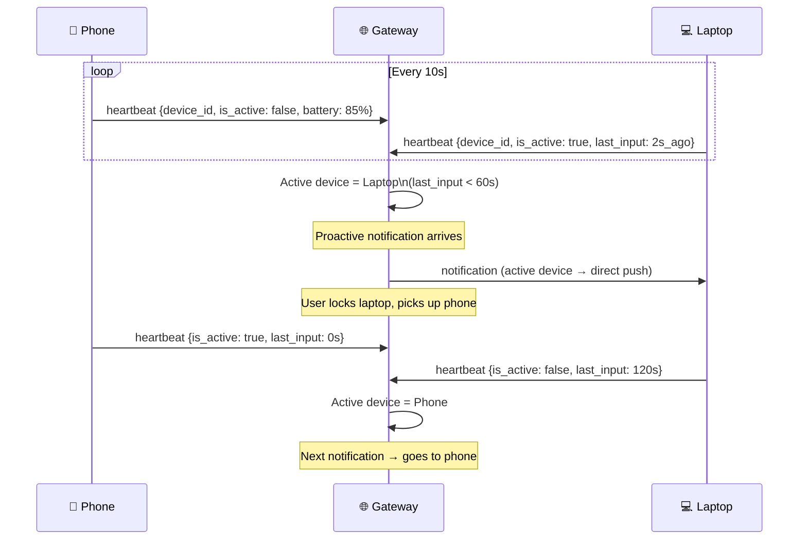

**Presence States:**
```
active       — user interacting right now (typing, speaking, tapping)
idle         — device on, no input for 60s
background   — app in background (phone in pocket)
offline      — no heartbeat for 30s
dnd          — user set do-not-disturb
```

**Routing Logic:**
```typescript
function getTargetDevice(devices: DevicePresence[]): string | 'all' {
  const active = devices.filter(d => d.state === 'active');
  
  if (active.length === 1) return active[0].deviceId;      // Clear winner
  if (active.length > 1) return mostRecentInput(active);    // Most recent input
  
  const idle = devices.filter(d => d.state === 'idle');
  if (idle.length > 0) return idle[0].deviceId;             // Idle but awake
  
  return 'all';  // Everyone offline → push to all, someone will see it
}
```

**Files:**
| File | Action | Lines |
|------|--------|-------|
| `EDITH-ts/src/sessions/presence-manager.ts` | CREATE | ~100 |
| `EDITH-ts/src/sessions/device-router.ts` | CREATE | ~80 |

---

### Phase 27E — Gateway-to-Gateway Sync Protocol

**Goal:** Two separate EDITH gateways (local + cloud) stay synchronized.

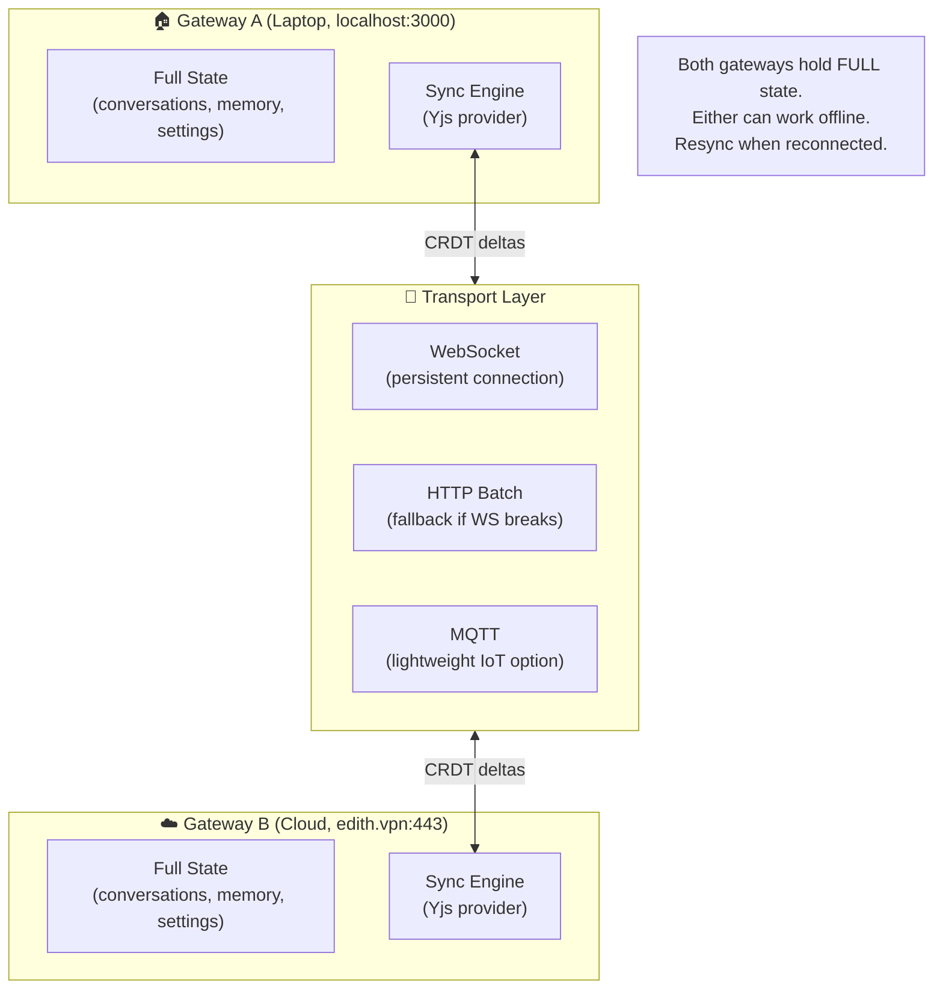

**Gateway Discovery:**
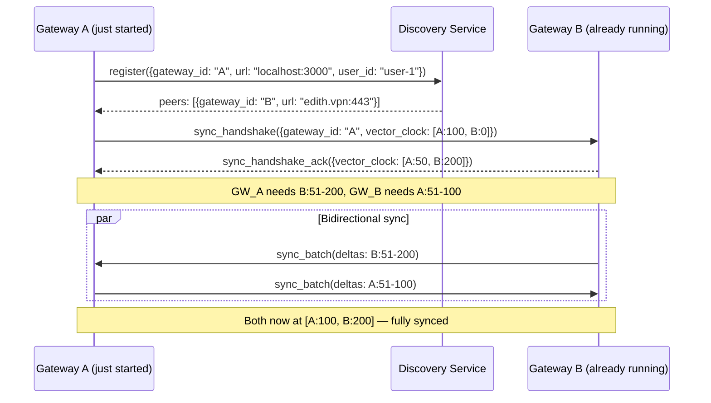

**Config:**
```json
{
  "crossDevice": {
    "enabled": true,
    "mode": "hybrid",
    "gateways": [
      {
        "id": "local",
        "url": "ws://localhost:3000",
        "role": "primary",
        "network": "home"
      },
      {
        "id": "cloud",
        "url": "wss://edith.myserver.com",
        "role": "replica",
        "network": "public"
      }
    ],
    "syncInterval": 5000,
    "encryption": "aes-256-gcm",
    "discovery": "mdns+cloud"
  }
}
```

**Files:**
| File | Action | Lines |
|------|--------|-------|
| `EDITH-ts/src/gateway/gateway-sync.ts` | CREATE | ~150 |
| `EDITH-ts/src/gateway/sync-transport.ts` | CREATE | ~100 |
| `EDITH-ts/src/gateway/gateway-discovery.ts` | CREATE | ~80 |
| `EDITH-ts/src/gateway/__tests__/gateway-sync.test.ts` | CREATE | ~100 |

---

### Phase 27F — Session Handoff

**Goal:** Start conversation on one device, continue seamlessly on another.

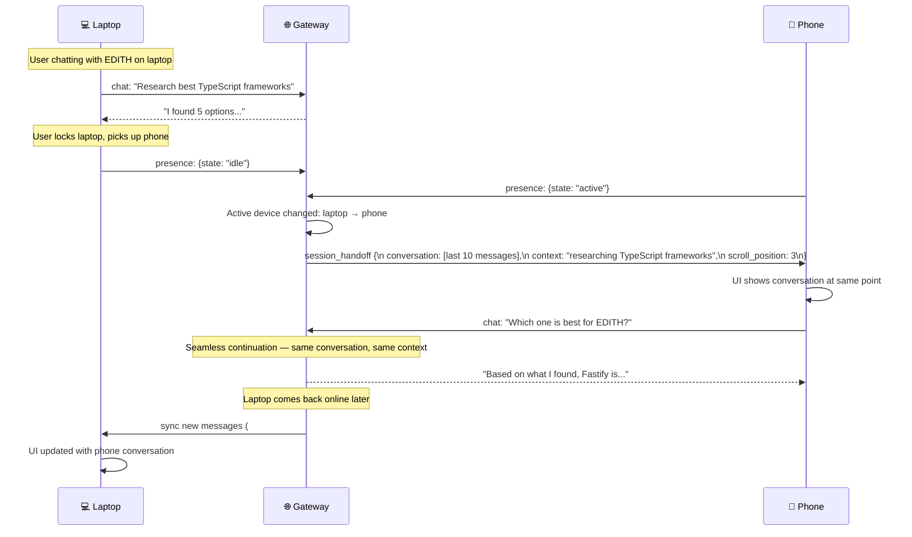

**Voice Handoff (advanced):**
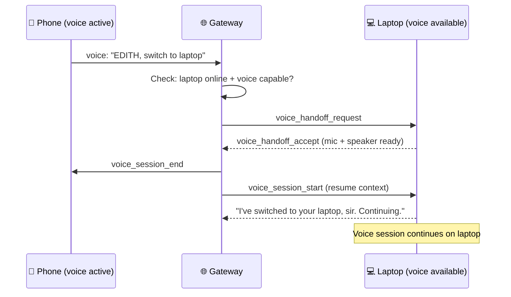

**Files:**
| File | Action | Lines |
|------|--------|-------|
| `EDITH-ts/src/sessions/session-handoff.ts` | CREATE | ~120 |
| `EDITH-ts/src/voice/voice-handoff.ts` | CREATE | ~80 |

---

### Phase 27G — Network Discovery (P2P + Cloud Fallback)

**Goal:** Auto-detect best connection: direct P2P (fast) or cloud relay (always works).

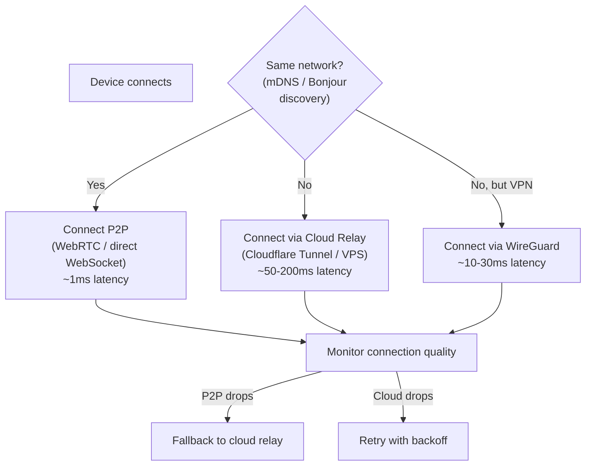

**mDNS Discovery (same network only):**
```typescript
// DECISION: Use mDNS for local network discovery, cloud registry for remote
// WHY: mDNS is zero-config, instant, works offline
// ALTERNATIVES: Manual IP entry (bad UX), always cloud (unnecessary latency)
// REVISIT: If mDNS blocked by corporate networks → fallback to cloud only

import { Bonjour } from 'bonjour-service';

class LocalDiscovery {
  private bonjour = new Bonjour();
  
  advertise(port: number): void {
    this.bonjour.publish({
      name: 'edith-gateway',
      type: 'edith-sync',
      port,
      txt: { userId: 'user-1', gatewayId: 'gw-local' }
    });
  }
  
  discover(): Promise<GatewayPeer[]> {
    return new Promise((resolve) => {
      const peers: GatewayPeer[] = [];
      const browser = this.bonjour.find({ type: 'edith-sync' });
      browser.on('up', (service) => peers.push(serviceToGateway(service)));
      setTimeout(() => { browser.stop(); resolve(peers); }, 3000);
    });
  }
}
```

**Files:**
| File | Action | Lines |
|------|--------|-------|
| `EDITH-ts/src/gateway/network-discovery.ts` | CREATE | ~100 |
| `EDITH-ts/src/gateway/p2p-connector.ts` | CREATE | ~80 |
| `EDITH-ts/src/gateway/cloud-relay.ts` | CREATE | ~80 |

---

### Phase 27H — Mobile Companion Deep Integration

**Goal:** Phone app sebagai full companion, bukan sekedar remote.

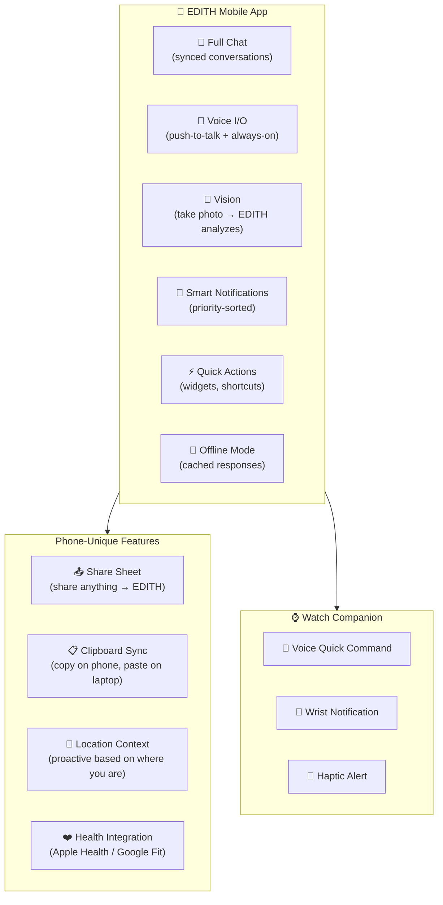

**Share Sheet Integration:**
```
User shares URL from Chrome → EDITH: "Summarize this article"
User shares photo from Gallery → EDITH: "What's in this image?"
User shares text from Notes → EDITH: "Remember this for later"
```

**Clipboard Sync:**
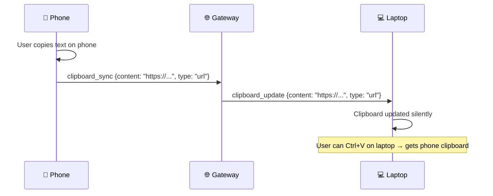

**Files:**
| File | Action | Lines |
|------|--------|-------|
| `apps/mobile/services/ShareExtension.ts` | CREATE | ~80 |
| `apps/mobile/services/ClipboardSync.ts` | CREATE | ~60 |
| `apps/mobile/services/LocationContext.ts` | CREATE | ~60 |
| `apps/mobile/services/HealthIntegration.ts` | CREATE | ~60 |
| `apps/mobile/screens/OfflineScreen.tsx` | CREATE | ~80 |

---

## 5. Acceptance Gates

```
□ Device pairing via QR code works (laptop → phone)
□ Conversation appears on both devices simultaneously
□ Type on laptop → phone shows message within 2 seconds
□ Switch active device (laptop → phone) → conversation continues seamlessly
□ Voice handoff: "EDITH, switch to laptop" → voice session moves
□ Two gateways (local + cloud) sync conversations bidirectionally
□ Network partition → both gateways continue working → resync on reconnect
□ Gateway discovery via mDNS (same network) works
□ Cloud relay works when devices are on different networks
□ Memory sync: fact learned on phone → available on laptop
□ Notification routes to active device only
□ Clipboard sync: copy on phone → paste on laptop
□ Share sheet: share URL from phone → EDITH summarizes
□ Offline mode: phone works with cached data when disconnected
□ All cross-device data encrypted in transit
```

---

## 6. Koneksi ke Phase Lain (MASTER INTEGRATION TABLE)

Phase 27 is the **glue** connecting all other phases across devices.

| Phase | What Syncs Across Devices | Protocol |
|-------|---------------------------|----------|
| Phase 1 (Voice) | Voice session handoff (phone ↔ laptop) | voice_handoff event |
| Phase 6 (Proactive) | Proactive triggers route to active device | presence → notification_router |
| Phase 8 (Channels) | Channel notifications follow user | channel_msg → device_router |
| Phase 10 (Personalization) | User preferences sync | prefs → crdt_sync |
| Phase 13 (Knowledge) | Knowledge base accessible from any device | knowledge_query → gateway |
| Phase 14 (Calendar) | Calendar alerts go to active device | calendar_alert → device_router |
| Phase 20 (HUD) | HUD state sync (dismiss on laptop → dismissed on phone) | hud_state → crdt_sync |
| Phase 21 (Emotional) | Mood profile follows user across devices | mood_update → session_sync |
| Phase 22 (Mission) | Start mission on laptop, monitor from phone | mission_state → gateway_sync |
| Phase 23 (Hardware) | Control desk hardware from phone | hw_command → gateway → hardware |
| Phase 24 (Self-Improve) | Feedback aggregated from all devices | feedback → central_store |
| Phase 25 (Simulation) | Approve simulated actions from phone | preview → approval_queue |
| Phase 26 (Legion) | Dashboard accessible from any device | dashboard → cross_device |

---

## 7. File Changes Summary

| File | Action | Lines |
|------|--------|-------|
| `EDITH-ts/src/pairing/device-pairing.ts` | MODIFY | +100 |
| `EDITH-ts/src/pairing/device-registry.ts` | CREATE | ~80 |
| `EDITH-ts/src/pairing/qr-generator.ts` | CREATE | ~60 |
| `EDITH-ts/src/sessions/conversation-sync.ts` | CREATE | ~120 |
| `EDITH-ts/src/sessions/crdt-adapter.ts` | CREATE | ~80 |
| `EDITH-ts/src/sessions/presence-manager.ts` | CREATE | ~100 |
| `EDITH-ts/src/sessions/device-router.ts` | CREATE | ~80 |
| `EDITH-ts/src/sessions/session-handoff.ts` | CREATE | ~120 |
| `EDITH-ts/src/voice/voice-handoff.ts` | CREATE | ~80 |
| `EDITH-ts/src/memory/memory-sync.ts` | CREATE | ~120 |
| `EDITH-ts/src/memory/sync-tiers.ts` | CREATE | ~80 |
| `EDITH-ts/src/gateway/gateway-sync.ts` | CREATE | ~150 |
| `EDITH-ts/src/gateway/sync-transport.ts` | CREATE | ~100 |
| `EDITH-ts/src/gateway/gateway-discovery.ts` | CREATE | ~80 |
| `EDITH-ts/src/gateway/network-discovery.ts` | CREATE | ~100 |
| `EDITH-ts/src/gateway/p2p-connector.ts` | CREATE | ~80 |
| `EDITH-ts/src/gateway/cloud-relay.ts` | CREATE | ~80 |
| `EDITH-ts/src/sessions/__tests__/conversation-sync.test.ts` | CREATE | ~100 |
| `EDITH-ts/src/gateway/__tests__/gateway-sync.test.ts` | CREATE | ~100 |
| `apps/mobile/screens/PairScreen.tsx` | CREATE | ~80 |
| `apps/mobile/screens/OfflineScreen.tsx` | CREATE | ~80 |
| `apps/mobile/services/ShareExtension.ts` | CREATE | ~80 |
| `apps/mobile/services/ClipboardSync.ts` | CREATE | ~60 |
| `apps/mobile/services/LocationContext.ts` | CREATE | ~60 |
| `apps/mobile/services/HealthIntegration.ts` | CREATE | ~60 |
| **Total** | | **~2430** |

**New dependencies:** `yjs` (CRDT), `y-websocket` (Yjs WebSocket provider), `bonjour-service` (mDNS), `wrtc` (WebRTC for Node)
