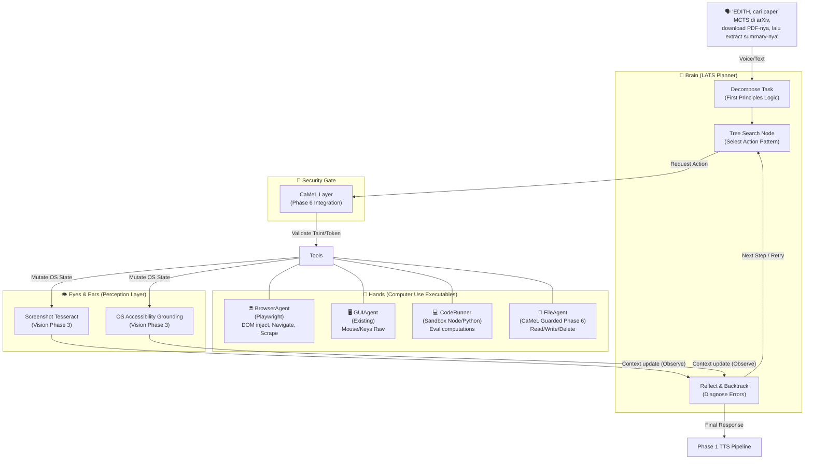

> **CRITICAL REQUIREMENT:** Agent harus selalu membuat clean code, terdokumentasi, dan juga ada komentar. Selalu commit dan push.

# Phase 7 — Agentic Computer Use (Deep GUI Automation)

> "JARVIS, just drop the needle. I don't want to click through 5 menus to play AC/DC."
> — Tony Stark, Iron Man

**Durasi Estimasi:** 2–3 minggu  
**Prioritas:** 🟠 HIGH — Ini yang membedakan EDITH dari assistant biasa, menjadi autonomous agent yang sejati.  
**Depends on:** Phase 1 (Voice), Phase 3 (Vision), Phase 6 (Macro/Proactive)  
**Status Saat Ini:** GUIAgent screenshots + mouse/keyboard ✅ | Browser agent ❌ | Code execution sandbox ❌ | Task planning loop ❌  

---

## 🧠 BAGIAN 0 — FIRST PRINCIPLES THINKING (Elon Musk & Tony Stark Mode)

Tony Stark tidak akan pernah membuat UI dengan 10 tombol tambahan jika AI bisa menguasai mouse dan keyboard-nya langsung dengan efisien. Di sisi lain, Elon Musk akan mem-breakdown "Computer Use" ke tingkat dasar fisikanya (*First Principles*):

**First Principles breakdown:**

```text
MASALAH FUNDAMENTAL:
  Komputer adalah sekumpulan State Machine.
  UI (User Interface) didesain untuk mata dan tangan manusia, bukan untuk dibaca lewat API.
  Membuat integrasi API spesifik untuk setiap aplikasi di desktop itu mustahil (Cost ∞).

SOLUSI YANG OBVIOUS (Elon's Approach):
  Kurangi abstraction layer.
  Agent harus bisa menggunakan antarmuka yang sama persis dengan manusia.
  Agent butuh Sistem Visual (Screen Parsing) dan aktuator mekanik (Mouse/Keyboard emulation).
  Agent butuh loop deterministik: Observe State → Reason → Execute Action.

TONY STARK'S COROLLARY:
  Jangan membuat sistem yang bloatware!
  Eksekusi harus instan, real-time feedback (HUD style), transparan.
  Graceful degradation: jika AI bingung, dia mengembalikan kontrol ke user, bukan asal klik (CaMeL guard).
```

### Kesimpulan Arsitektur Phase 7
Kita tidak membangun automasi statis (Script). Kita membangun **Virtual Hands and Eyes** yang bisa mengoperasikan GUI atau Browser secara heuristis. Karena berkesinambungan dengan fase EDITH sebelumnya:
`User Voice (Phase 1) -> Plan (LATS Phase 7) -> Execute (CodeAct Phase 7) -> Observe (Vision Phase 3) -> Reflect (Self-Healing)`

---

## 📚 BAGIAN 1 — RESEARCH PAPERS: ISI LENGKAP, RUMUS, DIAGRAM

> Arsitektur agent didasari oleh riset paper SOTA (State of the Art) agar kita tidak mengulang kesalahan riset bertahun-tahun dunia akademik.

### 1.1 OSWorld — arXiv:2404.07972 (NeurIPS 2024)
**Formalisasi POMDP (Partially Observable Markov Decision Process)**

Tugas di OS didefinisikan secara matematis:
`Task = (S, O, A, T, R)`
- **S** = *State space* (Kondisi RAM, direktori, layar saat ini, clipboard) 
- **O** = *Observation* (Screenshot dari Vision Phase 3, A11y tree, System state)
- **A** = *Action* (Click(x,y), Type(string), drag(), run_command())
- **T** = *Transition* (Perubahan S setelah agen melakukan A)
- **R** = *Reward* (1 jika goal task tercapai, 0 jika timebound habis)

*Implikasi ke EDITH:*
Agen tidak pernah bisa menyerap memori sistem operasi **S** secara keseluruhan, ia hanya memproses **O** (Observation). Oleh karena itu, *VisionCortex* (Phase 3) dan A11y adalah fondasi pengamatan. Agent tidak boleh berasumsi *state* berubah sampai dia menangkap obsevasi sukses dari layar.

### 1.2 WebArena & Browser-Use (arXiv:2307.13854)
**Functional Correctness vs Surface-Form Matching**

```text
RUMUS SUCCESS RATE EVALUATION:
SR = |{tasks completed functionally}| / |total_tasks|
```
*Inti paper:* Menggantungkan tindakan agen pada *exact layout match* (contoh: "klik X=452, Y=112") memicu *brittle systems*. Gunakan injeksi Set-of-Mark (DOM elements disorot dengan Label ID), agen memilih Label ID untuk diklik. `Playwright` akan mengambil alih aksi klik yang akurat. Jika struktur DOM kabur (Kanvas/Flash/Obfuscated), maka *Fallback* langsung ke Tesseract OCR (Phase 3).

### 1.3 CodeAct — arXiv:2402.01030 (ICML 2024)
**Executable Code Actions vs JSON Outputs**

```text
HASIL EKSPERIMEN CODEACT:
Action Space menggunakan Blok Kode (Python/JS run) → Success Rate 45%
Action Space menggunakan text/JSON parser murni     → Success Rate 25%
```
*Implikasi ke EDITH:* LLM Agent bekerja jauh lebih efisien ketika mereka bisa melakukan *reasoning* dengan format bahasa pemrograman. Jadi, eksekusi aksi agen disalurkan lewat format skrip *(CodeRunner)* yang dieksekusi di *Sandbox Environment*.

### 1.4 LATS (Language Agent Tree Search) — arXiv:2310.04406
**Perancangan Pengambilan Keputusan**

Dengan mengadopsi algoritma pencarian mirip MCTS (Monte Carlo Tree Search), jika langkah saat mengeksekusi komputer berujung Dead End (contoh: "Saya klik ikon VSCode, tapi ternyata tidak ada"), agen melakukan "Backtrack" evaluatif dan mencoba path logis lainnya. Ini adalah konsep *Self-Healing*.

---

## 🏗️ BAGIAN 2 — BLUEPRINT ARSITEKTUR KOMPUTER (The Stark Diagram)

Bagaimana komponen EDITH dari Fase 1-6 terhubung langsung untuk menjembatani Computer Use yang Agentic.



---

## ⚙️ BAGIAN 3 — MODUL & KOMPONEN YANG DIIMPLEMENTASIKAN

### 3A. BrowserAgent (Playwright + Set-of-Mark)
Menjadikan peramban (browser) entitas yang fully-programmable bagi LLM, bebas dari masalah elemen yang dinamis.
- **Tugas:** Injeksi atribut data-agent-id ke seluruh Node interaktif.
- **Tools List:** `browserNavigate(url)`, `browserClick(selector_id)`, `browserType(selector_id, text)`, `browserScrape(selector)`.
- **Integrasi P3:** Menghemat token dengan Accessibility Grounding. OCR murni digunakan jika terdeteksi Shadow DOM kompleks.

### 3B. FileAgent & CodeRunner (Sandboxing)
Agen memerlukan *workspace* sementara. Saat Task Planner butuh menghitung data / memanipulasi log untuk dianalisis, jalankan skrip kecil yang *sandboxed*.
- **Batasan Memori (Hardware Phase 6 constraint):** 1 GB RAM Host minimum, jadi *runner* dieksekusi via `node:vm` container minimal atau Deno/Python raw tanpa VM boot berlapis.
- **Integrasi P6 (Security CaMeL):** Jika script yang di *generate* mengandung prompt jahat (Tainted), CaMeL akan *trap* eksekusi tersebut; User harus Setuju (Affordance Check).

### 3C. LATS Execution Loop (Self-Healing Evaluator)
Penggabungan semua logika:
1. `Plan`: Membongkar *NL Instruction* ke sub-tugas independen.
2. `Act`: Jalankan modul *Tools* terdekat.
3. `Observe`: Pakai *VisionCortex* menelaah `stdout` terminal atau Screen Change State.
4. `Reflect`: Validasi fungsional (Bukan bentuk String matching!). Jika Error? *Retry* maksimum 3 variasi. Kalau masih Error, Trigger *Voice Prompt* interupsi "Sir, halamannya butuh manual CAPTCHA, I am standing by".

---

## 🏁 BAGIAN 4 — IMPLEMENTATION ROADMAP & ACCEPTANCE GATES

### Setup Contract
Semua konfigurasi Agentic Computer Use wajib diatur via **Onboarding/Settings UI** yang menyimpan persisten ke `edith.json` (Phase 3 & Phase 6 standar), bukan *hardcoded*.

```json
{
  "computerUse": {
    "enabled": true,
    "browser": {
      "engine": "playwright",
      "headless": false,
      "maxWaitMs": 15000
    },
    "sandbox": {
      "memoryLimitMb": 256,
      "executionTimeoutMs": 30000
    },
    "maxTaskRetries": 3
  }
}
```

### Definition of Done (Acceptance Gates)
Sebuah prasyarat di mana fase Computer Use dinyatakan sukses jika:
- [ ] Implementasi agen mengikuti > **CRITICAL REQUIREMENT:** Agent selalu membuat clean code, terdokumentasi, dan ada komentar, selalu komit, dan push ke repo.
- [ ] BrowserAgent dapat login ke web dummy form dengan Playwright Set-of-Mark tanpa error deteksi elemen.
- [ ] FileAgent/CodeRunner memicu penolakan *CaMeL Guard (Phase 6)* jika disuruh menghapus folder kritis atau data *Tainted*.
- [ ] Sistem *Self-Healing (LATS Loop)* berhasil mencoba `Retry` logika jika selector berubah minimal 1 kali tanpa crash.
- [ ] Workflow keseluruhan tersambung dengan mulus ke Notification System P6 dan Voice Pipeline P1.

### Target Spesifikasi File (Referensi Pembangunan)
- `src/agents/tools/browser-agent.ts` [NEW] — (~300 baris) Playwright Wrapper.
- `src/agents/tools/code-runner.ts` [NEW] — (~150 baris) Sandboxed VM.
- `src/agents/tools/file-agent.ts` [NEW] — (~180 baris) Controlled FS.
- `src/agents/lats-planner.ts` [MODIFIED] — (~250 baris) MCTS State Manager & Reflector.
- `edith.json` Schema definition support config `computerUse`.
