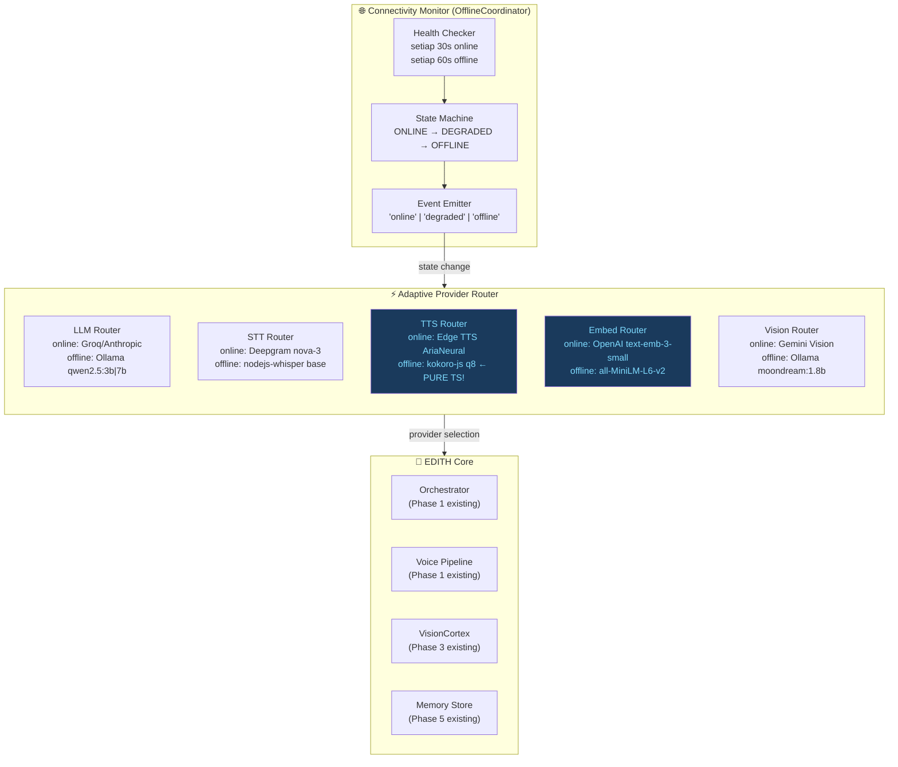
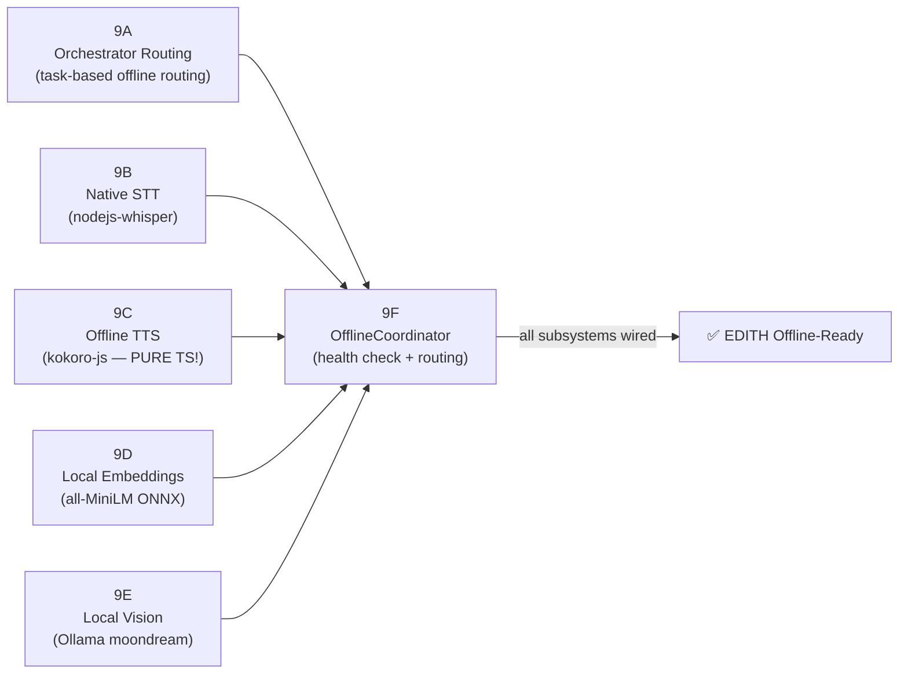
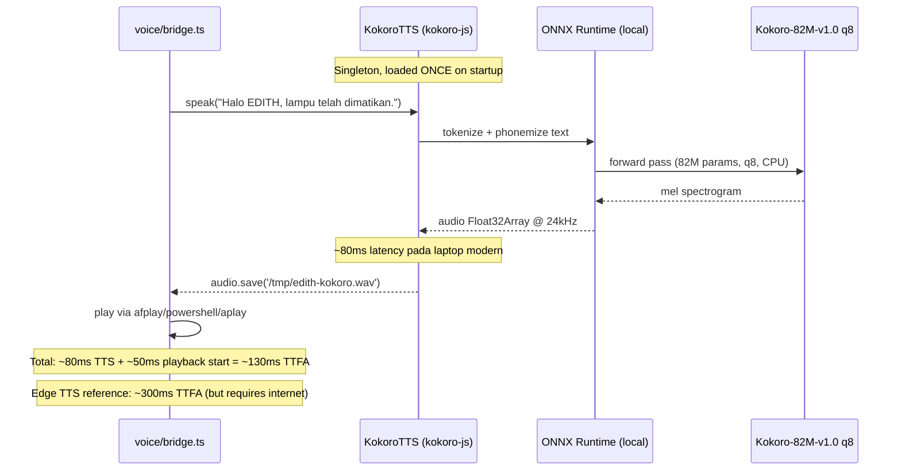
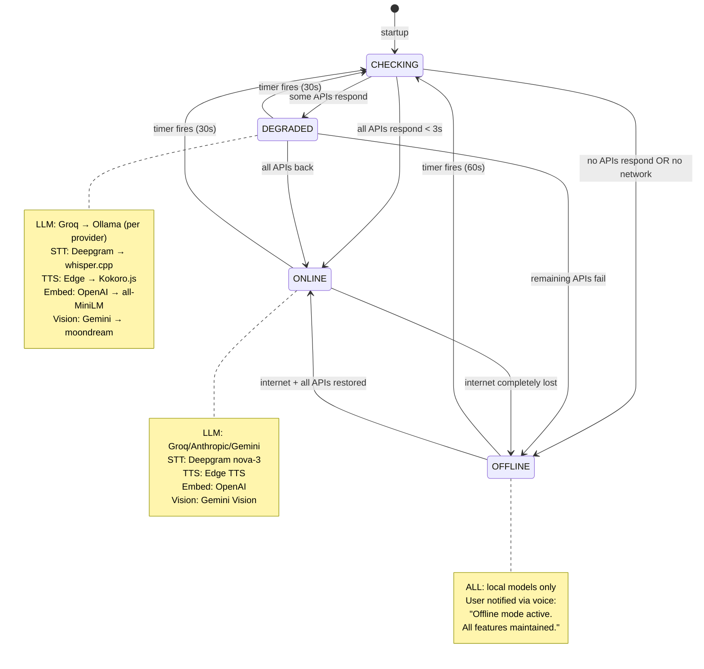
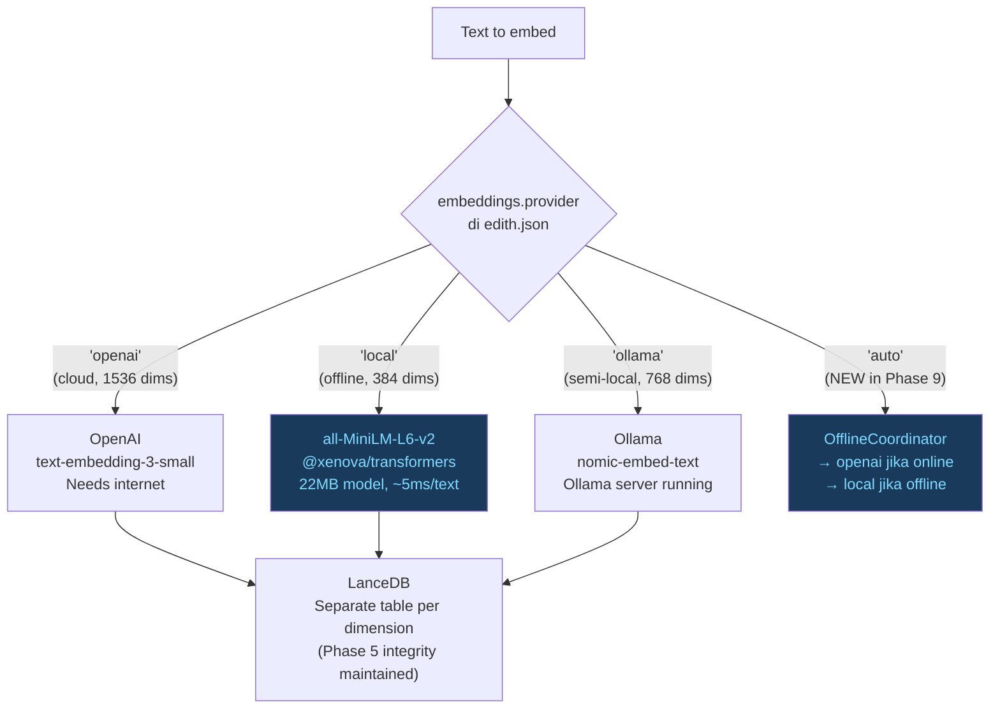

> **⚠️ CRITICAL REQUIREMENT — BERLAKU UNTUK SEMUA KODING DI PHASE 9:**
> Agent SELALU membuat clean code, terdokumentasi, dengan komentar JSDoc di setiap class, method, dan constant.
> SETIAP file baru atau perubahan signifikan HARUS di-commit dan di-push ke remote dengan pesan commit Conventional Commits.
> Zero tolerance untuk kode tanpa komentar, tanpa type annotation, atau tanpa test.

# Phase 9 — Full Offline / Self-Hosted Mode (Zero-Cloud)

> *"JARVIS, apakah sistem masih bisa berjalan kalau semua server Stark Industries down?"*
> *"All critical subsystems remain operational, sir. Switching to local protocols."*
> — Tony Stark, Iron Man 3

**Prioritas:** 🔴 HIGH — Core survivability goal  
**Depends on:** Phase 1 (Voice), Phase 3 (Vision), Phase 5 (Memory integrity), Phase 8 (Channels)  
**Status Saat Ini:** 100% cloud-dependent | Ollama ✅ ada tapi cuma fallback pasif | Zero-cloud mode ❌

---

## 🧠 BAGIAN 0 — FIRST PRINCIPLES THINKING (Tony Stark × Elon Musk Mode)

### 0.1 Elon Musk: Buang Semua Asumsi

```
ASUMSI YANG HARUS DIBUANG:

  "Offline mode = fitur sekunder, main flow tetap cloud"
  → SALAH. Cloud adalah BONUS. Local adalah default yg seharusnya.
  → Setiap Grok API call yang berhasil = untung. Bukan sebaliknya.

  "Offline TTS butuh Python + kokoro library"
  → SALAH. Ada kokoro-js (npm i kokoro-js) — 82M params, pure JavaScript,
    ONNX runtime, jalan di Node.js tanpa Python sama sekali.

  "Offline STT = kompleks, butuh native compilation"
  → SALAH. nodejs-whisper adalah whisper.cpp binding yang mature dan documented.
    Satu pnpm add + model download. Selesai.

  "Local embeddings pasti jelek"
  → SALAH. all-MiniLM-L6-v2 (22MB, 384 dims) punya benchmark yang
    sangat layak untuk memory retrieval. Jauh lebih baik dari hash fallback
    yang kita buang di Phase 5.

PERTANYAAN FUNDAMENTAL (ala Elon):

  Q1: Apa yang sebenarnya harus terjadi saat internet mati?
    A: EDITH continues responding to voice. Memory search continues working.
       Vision still analyzes screen. IoT commands still execute locally.
       Hanya kualitas yang sedikit turun. Fungsi tidak hilang.

  Q2: Kenapa kita 100% cloud-dependent saat ini?
    A: Bukan karena local tidak mungkin. Karena kita belum pernah
       design connectivity checkpoint. Gap ini yang ditutup Phase 9.

  Q3: Apa minimum viable offline EDITH?
    A: LLM (Ollama) + STT (whisper.cpp) + TTS (Kokoro.js) = complete voice loop.
       Semua bisa jalan di CPU. Zero GPU required.

  Q4: Berapa cost memory untuk full offline stack?
    A: LLM (qwen2.5:3b) ~2GB | STT base ~400MB | TTS q8 ~70MB |
       Embeddings MiniLM ~40MB | Vision moondream ~1.1GB
       Total worst case: ~4GB RAM. Di laptop modern = completely fine.
```

### 0.2 Tony Stark Engineering Corollary

Tony tidak pernah membuat suit yang mati kalau WiFi Stark Tower down.
Arc reactor di dada dia adalah **local power source** — cloud adalah uplink opsional.

```
STARK RULES UNTUK PHASE 9:

  Rule 1: LOCAL IS THE ARMOR, CLOUD IS THE UPGRADE
    Setiap component HARUS bisa berfungsi tanpa internet.
    Cloud API = performance upgrade, bukan dependency critical.

  Rule 2: GRACEFUL DEGRADATION, NOT SILENT FAILURE
    Kalau Groq down → switch ke Ollama + beritahu user.
    Jangan diam, jangan error 500. Jarvis selalu kasih status report.

  Rule 3: PURE TYPESCRIPT PREFERRED OVER PYTHON SUBPROCESS
    kokoro-js = pure TS. all-MiniLM via @xenova/transformers = pure TS.
    Setiap kali ada pilihan TS-native vs Python subprocess → pilih TS.
    Less process spawning = less latency = better offline experience.

  Rule 4: ONE COORDINATOR TO RULE THEM ALL
    OfflineCoordinator adalah single source of truth untuk connectivity state.
    Tidak ada komponen lain yang boleh check internet sendiri-sendiri.
    Centralized health check = predictable behavior.

  Rule 5: NEVER DOWNGRADE WITHOUT TELLING THE USER
    "Sir, Groq API is unreachable. I've switched to local Ollama (qwen2.5:3b).
     Response quality may differ slightly."
    Transparency = trust.
```

### 0.3 Kesinambungan dengan Phase 1–8

```
DEPENDENCY MAP PHASE 9:

  Phase 1 (Voice Pipeline)
    └→ Phase 9 adds: whisperCpp provider ke providers.ts
    └→ Phase 9 adds: KokoroTTS engine ke bridge.ts (bukan Python lagi!)
    └→ Phase 9 replaces: Python subprocess Whisper → nodejs-whisper (TS native)
    └→ Phase 9 extends: voice.stt.engine: 'auto' | 'deepgram' | 'whisper-cpp'
    └→ Phase 9 extends: voice.tts.engine: 'edge' | 'kokoro' (NEW!)

  Phase 3 (Vision)
    └→ Phase 9 adds: Ollama multimodal option ke VisionCortex.describeImage()
    └→ Phase 9 adds: vision.provider: 'gemini' | 'openai' | 'ollama' (NEW!)
    └→ Existing Phase 3 VisionCortex sudah ada stub, kita implement provider routing

  Phase 5 (Memory Integrity)
    └→ Phase 9 adds: LocalEmbedder (all-MiniLM via @xenova/transformers)
    └→ Phase 5 menghapus hash fallback, Phase 9 MENGGANTIKAN dengan real local embedding
    └→ LocalEmbedder integrate ke memory/store.ts sebagai 'local' provider
    └→ Dimensi berbeda (384 vs 1536) ditangani via embeddings.dimension di config

  Phase 6 (CaMeL + Security)
    └→ OfflineCoordinator TETAP menghormati CaMeL gate di semua tool calls
    └→ Offline mode tidak melemahkan security — sama ketatnya
    └→ NotificationDispatcher: "offline mode aktif" → send ke semua channel

  Phase 7 (LATS Computer Use)
    └→ Browser agent: offline = degrade gracefully (can't browse web)
    └→ Code runner: TIDAK terpengaruh (lokal sudah)
    └→ File agent: TIDAK terpengaruh (lokal sudah)
    └→ OfflineCoordinator: block browser tool saat offline, suggest alternatives

  Phase 8 (Channels — Email/Calendar/SMS/Phone)
    └→ Email/Calendar: offline = queue outbound, notify user, resume when online
    └→ SMS via ADB: TIDAK terpengaruh (lokal sudah)
    └→ Twilio calls: offline = block, suggest SMS via ADB as alternative
```

---

## 📚 BAGIAN 1 — RESEARCH + TOOL ANALYSIS

> *Riset aktual. Bukan assumption. Setiap tool dicek versi terbaru dan API-nya.*

### 1.1 nodejs-whisper — Whisper.cpp TS Bindings (Rekomendasi Utama)

**Package:** `nodejs-whisper` by ChetanXpro  
**npm:** `pnpm add nodejs-whisper` (v0.2.9, MIT, 9 months ago)  
**Status:** Stable, production-ready, most downloaded whisper.cpp TS binding

```typescript
// API dari nodejs-whisper:
import { nodewhisper } from 'nodejs-whisper'

const result = await nodewhisper(audioFilePath, {
  modelName: 'base',              // tiny | base | small | medium | large
  autoDownloadModelName: 'base',  // auto-download jika belum ada
  whisperOptions: {
    language: 'auto',             // 'id' untuk Indonesia, 'auto' untuk auto-detect
    outputInText: true,           // return sebagai plain text
    wordTimestamps: false,        // disable timestamps untuk speed
  }
})
// result = "halo edith apa kabar"
```

**Alternatif: `smart-whisper`** — native .node addon, load model ONCE, multiple inferences
- Lebih efisien untuk always-on scenarios (bukan subprocess per request)
- Tapi lebih kompleks setup, butuh compilation
- Recommendation: **nodejs-whisper untuk Phase 9**, smart-whisper untuk Phase 9B+

**Model size comparison:**

| Model | Disk | RAM | CPU Latency (5s audio) | Indonesia Accuracy |
|-------|------|-----|------------------------|-------------------|
| tiny | 75 MB | 273 MB | ~0.3s | Fair (~75%) |
| base | 142 MB | 388 MB | ~0.5s ← **recommended** | Good (~85%) |
| small | 466 MB | 852 MB | ~1.2s | Better (~90%) |

---

### 1.2 kokoro-js — Pure TypeScript TTS (GAME CHANGER!)

**Package:** `kokoro-js` (npm i kokoro-js)  
**Model:** `onnx-community/Kokoro-82M-v1.0-ONNX` (Hugging Face, Apache 2.0)  
**Status:** Released Jan 16, 2025 oleh Xenova × Hexgrad. **100% pure JavaScript.**  
**Key difference dari original plan:** Ini BUKAN Python! Ini TS-native ONNX.

```typescript
// 🚀 TIDAK PERLU PYTHON. Ini murni TypeScript.
import { KokoroTTS } from 'kokoro-js'

// Initialize ONCE, reuse multiple times (tidak seperti Python subprocess!)
const tts = await KokoroTTS.from_pretrained(
  'onnx-community/Kokoro-82M-v1.0-ONNX',
  {
    dtype: 'q8',        // fp32 | fp16 | q8 | q4 | q4f16 — q8 best balance
    device: 'cpu',      // 'cpu' untuk Node.js (bukan 'wasm' yang untuk browser)
  }
)

// Standard generate
const audio = await tts.generate('Halo, EDITH siap membantu.', {
  voice: 'af_heart',    // af_heart, af_sky, af_bella, af_nicole...
  speed: 1.0,
})
audio.save('/tmp/edith-response.wav')

// STREAMING (untuk lower TTFA — first audio byte latency)
const splitter = new TextSplitterStream()
const stream = tts.stream(splitter)
for await (const { audio } of stream) {
  // play chunk via afplay/powershell/aplay
}
```

**Memory budget kokoro-js:**

| dtype | Size | RAM | Quality |
|-------|------|-----|---------|
| fp32 | ~320MB | ~400MB | Best |
| fp16 | ~160MB | ~200MB | Very good |
| q8 | ~80MB | ~100MB | ← **Recommended** Good |
| q4 | ~40MB | ~60MB | OK |

**Kenapa ini mengubah arsitektur Phase 9:**
- Original plan: `pip install kokoro soundfile` + Python subprocess → 200ms overhead
- Kokoro-js: `pnpm add kokoro-js` + load once → ~80ms latency, shared Node.js process
- Tidak ada Python dependency baru untuk offline TTS!

---

### 1.3 @xenova/transformers — Local Embeddings

**Package:** `@xenova/transformers` (v2.17.2, MIT)  
**Note:** Juga bisa pakai `@huggingface/transformers` yang merupakan successor resminya  
**Model:** `Xenova/all-MiniLM-L6-v2` — 22MB download, 384 dims, MIT license

```typescript
import { pipeline, env } from '@xenova/transformers'

// Konfigurasi untuk offline mode
env.allowRemoteModels = false          // disable HF hub download saat offline
env.localModelPath = './models/embeddings/' // path model local

const extractor = await pipeline(
  'feature-extraction',
  'Xenova/all-MiniLM-L6-v2'
)

const output = await extractor(
  ['Halo EDITH, matikan lampu kamar'],
  { pooling: 'mean', normalize: true }
)

const embedding: number[] = Array.from(output.data) // 384 floats
```

**Integration dengan Phase 5 Memory Store:**
- Phase 5 menghapus hash-vector fallback (EmbeddingUnavailableError)
- Phase 9 menambah 'local' provider yang TIDAK throw error → real embedding
- Dimensi berbeda: local=384, openai=1536 → perlu separate LanceDB table
- Config: `embeddings.provider: 'openai' | 'local' | 'ollama'`

---

### 1.4 Ollama — Local LLM + Vision

**Package:** Already in codebase (`src/engines/ollama.ts`) ✅  
**Phase 9 Focus:** Extend routing untuk model selection berdasarkan task type  
**Key models untuk EDITH:**

```
VOICE (low latency target: TTFT <300ms):
  qwen2.5:3b     → 2.0 GB RAM, ~250ms TTFT CPU
  llama3.2:3b    → 2.0 GB RAM, ~280ms TTFT CPU
  gemma3:1b      → 0.8 GB RAM, ~150ms TTFT CPU ← ultra-low spec

THINK (quality mode):
  qwen2.5:7b     → 4.7 GB RAM, ~600ms TTFT CPU
  llama3.1:8b    → 5.0 GB RAM, ~700ms TTFT CPU

CODE:
  phi4-mini:3.8b → 2.5 GB RAM, best code quality per param count

VISION (offline):
  moondream:1.8b → 1.1 GB RAM ← recommended untuk low-spec
  llava:7b       → 4.7 GB RAM, 6GB VRAM ideal
  minicpm-v:8b   → 5.5 GB RAM ← best quality
```

**Perubahan di orchestrator.ts:**
- Tambah task types: `'voice'` dan `'local'` (sudah ada) + `'vision-local'`
- Routing: kalau offline → force ollama, skip cloud engines
- Model selection per type: voiceModel, thinkModel, codeModel dari edith.json

---

### 1.5 OfflineCoordinator — Design Pattern (New dari CaMeL + AIOS papers)

Terinspirasi dari:
- **MemGPT OS analogy** (arXiv:2310.08560) — OS-level resource management
- **AIOS** (arXiv:2403.16971) — service health monitoring for agent OS
- **CaMeL** (arXiv:2503.18813) — state-based security decisions

```
CONNECTIVITY STATE MACHINE:

  ONLINE ─────────────────────────────────────────────────────────┐
    All cloud APIs active. Best quality.                           │
    Health check setiap 30 detik.                                 │
           │                                                       │
           │ partial API failure                                   │ APIs restored
           ▼                                                       │
  DEGRADED ──────────────────────────────────────────────────────┘
    Some cloud APIs unreachable. Mix local + cloud.
    Selective fallback per component.
           │
           │ all internet lost
           ▼
  OFFLINE
    All local models. Full functionality maintained at lower quality.
    Emit "offline mode active" notification.
    Health check setiap 60 detik (reduced frequency untuk save resources).
```

**Health Check Matrix:**

| Service | Timeout | Endpoint | Fallback |
|---------|---------|----------|---------|
| Groq API | 3s | `POST /chat/completions` 1-token probe | Ollama |
| Deepgram | 3s | `GET /v1/projects` | whisper.cpp |
| Edge TTS | 3s | `HEAD /` | Kokoro.js |
| OpenAI Embeddings | 3s | `POST /embeddings` 1-token probe | all-MiniLM |
| Gemini Vision | 3s | `HEAD /` | Ollama moondream |

---

## 🏗️ BAGIAN 2 — ARSITEKTUR DAN DIAGRAM

### 2.1 Grand Architecture — Phase 9 Offline Mode



### 2.2 Sub-Phase Breakdown (Revised)



### 2.3 LLM Model Selection Matrix

```mermaid
quadrantChart
    title Local Model Selection (Speed vs Quality) — 2025 Data
    x-axis Low Quality --> High Quality
    y-axis Slow --> Fast
    quadrant-1 "Best for voice calls"
    quadrant-2 "Too slow for voice"
    quadrant-3 "Not good enough"
    quadrant-4 "Best balance"
    gemma3:1b: [0.45, 0.97]
    llama3.2:3b: [0.55, 0.90]
    qwen2.5:3b: [0.62, 0.88]
    gemma3:4b: [0.63, 0.82]
    phi4-mini:3.8b: [0.68, 0.78]
    qwen2.5:7b: [0.78, 0.62]
    llama3.1:8b: [0.74, 0.58]
    deepseek-r1:7b: [0.82, 0.44]
    mistral:7b: [0.70, 0.60]
```

### 2.4 Phase 9C — Offline TTS Pipeline (kokoro-js)



### 2.5 Phase 9F — OfflineCoordinator State Machine



### 2.6 Memory Routing — Phase 5 Integration (Embedding Provider Switch)



### 2.7 Rekomendasi Diagram Tools

Untuk dokumentasi arsitektur yang lebih visual:

| Tool | Use Case | Harga | Desktop? |
|------|----------|-------|---------|
| **Mermaid** (sudah dipakai) | In-code, auto-render di GitHub/docs | Free | Via VS Code extension |
| **draw.io / diagrams.net** | Complex architecture, export SVG/PNG | Free | ✅ Desktop app available |
| **Excalidraw** | Hand-drawn style, whiteboarding | Free | ✅ Desktop via Electron |
| **Whimsical** | Clean flowcharts, collaborative | Freemium | Browser only |
| **Structurizr** | C4 Model diagrams (code ↔ architecture) | Free OSS | Via Docker |

**Rekomendasi untuk EDITH project:**
1. **Mermaid** → in-code docs (sudah OK, terus pakai)
2. **draw.io** → complex multi-layer architecture overview (Phase diagrams)
3. **Excalidraw** → quick whiteboard untuk brainstorming

---

## ⚙️ BAGIAN 3 — SPESIFIKASI FILE DAN AGENT INSTRUCTIONS

### 3.1 edith.json Schema Extension

```json
{
  "llm": {
    "provider": "auto",
    "model": "groq/llama-3.3-70b-versatile",
    "voiceModel": "ollama/qwen2.5:3b",
    "thinkModel": "ollama/qwen2.5:7b",
    "codeModel": "ollama/phi4-mini:3.8b",
    "offlineMode": false,
    "ollama": {
      "baseUrl": "http://localhost:11434",
      "keepAlive": "10m",
      "numCtx": 4096
    }
  },
  "offline": {
    "enabled": true,
    "healthCheckIntervalMs": 30000,
    "offlineHealthCheckIntervalMs": 60000,
    "apiTimeoutMs": 3000,
    "notifyOnSwitch": true,
    "preferLocalAlways": false,
    "services": {
      "llm": { "fallback": "ollama", "model": "qwen2.5:3b" },
      "stt": { "fallback": "whisper-cpp", "model": "base" },
      "tts": { "fallback": "kokoro", "voice": "af_heart", "dtype": "q8" },
      "embeddings": { "fallback": "local", "model": "Xenova/all-MiniLM-L6-v2" },
      "vision": { "fallback": "ollama", "model": "moondream:1.8b" }
    }
  },
  "embeddings": {
    "provider": "auto",
    "dimension": 1536,
    "localDimension": 384,
    "localModel": "Xenova/all-MiniLM-L6-v2"
  }
}
```

---

### 3.2 Agent Instructions: offline-coordinator.ts (Atom 0 — Foundation)

```
TASK: Buat src/core/offline-coordinator.ts

FILE-LEVEL REQUIREMENTS:
  - JSDoc di setiap class, interface, method, constant
  - Referensi ke MemGPT (arXiv:2310.08560) dan AIOS (arXiv:2403.16971)
  - Export singleton: offlineCoordinator
  - EventEmitter untuk state changes

INTERFACES:
  type ConnectivityState = 'online' | 'degraded' | 'offline' | 'checking'

  interface ServiceHealth {
    llm: boolean         // Groq/Anthropic reachable
    stt: boolean         // Deepgram reachable
    tts: boolean         // Edge TTS reachable
    embeddings: boolean  // OpenAI embeddings reachable
    vision: boolean      // Gemini Vision reachable
  }

  interface ProviderConfig {
    llm: string          // 'groq' | 'ollama' | ...
    sttEngine: string    // 'deepgram' | 'whisper-cpp'
    ttsEngine: string    // 'edge' | 'kokoro'
    embedProvider: string // 'openai' | 'local' | 'ollama'
    visionProvider: string // 'gemini' | 'ollama'
  }

CLASS: OfflineCoordinator extends EventEmitter

  CONSTANTS:
    /** Interval ms untuk health check saat ONLINE */
    private static readonly HEALTH_CHECK_INTERVAL_ONLINE_MS = 30_000
    /** Interval ms saat OFFLINE (reduced frequency) */
    private static readonly HEALTH_CHECK_INTERVAL_OFFLINE_MS = 60_000
    /** Timeout per API probe request */
    private static readonly API_PROBE_TIMEOUT_MS = 3_000

  METHODS:

    /**
     * Initializes coordinator, runs first health check, starts periodic timer.
     * Called from src/core/startup.ts.
     * @returns void
     */
    async initialize(): Promise<void>

    /**
     * Returns the current connectivity state.
     * Callers should prefer getProvider() over checking state directly.
     */
    getState(): ConnectivityState

    /**
     * Returns the health status of each cloud service.
     */
    getServiceHealth(): Readonly<ServiceHealth>

    /**
     * Returns the recommended provider for a given service type.
     * This is the MAIN interface for all other modules to check offline routing.
     *
     * @param service - 'llm' | 'stt' | 'tts' | 'embeddings' | 'vision'
     * @returns Provider string (e.g., 'groq', 'ollama', 'whisper-cpp', 'kokoro')
     *
     * @example
     * const sttEngine = offlineCoordinator.getProvider('stt')
     * // Returns 'deepgram' when online, 'whisper-cpp' when offline
     */
    getProvider(service: 'llm' | 'stt' | 'tts' | 'embeddings' | 'vision'): string

    /**
     * Force-runs a health check immediately (e.g., after manual reconnect).
     * Returns the new state.
     */
    async forceCheck(): Promise<ConnectivityState>

    /**
     * Emits notification when connectivity state changes.
     * Uses NotificationDispatcher from Phase 6.
     * @param newState - The new connectivity state
     * @param oldState - The previous state
     */
    private async notifyStateChange(
      newState: ConnectivityState,
      oldState: ConnectivityState
    ): Promise<void>

    /**
     * Runs all 5 health checks concurrently.
     * Uses Promise.allSettled — one failure does not crash others.
     * @returns ServiceHealth object
     */
    private async runHealthChecks(): Promise<ServiceHealth>

    /** Probes Groq API with a minimal 1-token request */
    private async pingGroq(): Promise<boolean>

    /** Probes Deepgram API with a GET to /v1/projects */
    private async pingDeepgram(): Promise<boolean>

    /** Probes Edge TTS server with HEAD request */
    private async pingEdgeTTS(): Promise<boolean>

    /** Probes OpenAI embeddings with a 1-token embedding request */
    private async pingOpenAIEmbeddings(): Promise<boolean>

    /** Probes Gemini Vision API with a lightweight request */
    private async pingGeminiVision(): Promise<boolean>

    /**
     * Computes new state from ServiceHealth.
     * online: all 5 services healthy
     * degraded: 1-4 services healthy
     * offline: 0 services healthy
     */
    private computeState(health: ServiceHealth): ConnectivityState

    /**
     * Schedules next health check based on current state.
     * Offline → longer interval (save resources).
     */
    private scheduleNextCheck(): void

EVENTS EMITTED:
  'state:change'  → (newState: ConnectivityState, oldState: ConnectivityState)
  'service:down'  → (service: keyof ServiceHealth)
  'service:up'    → (service: keyof ServiceHealth)

COMMIT:
  git add src/core/offline-coordinator.ts
  git commit -m "feat(core): add OfflineCoordinator with health checks and provider routing

  - ConnectivityState machine: online → degraded → offline
  - 5 concurrent health probes: groq, deepgram, edge-tts, openai-embed, gemini
  - getProvider() — central routing interface for all modules
  - EventEmitter: state:change, service:down, service:up
  - NotificationDispatcher integration (Phase 6) for user alerts
  - Promise.allSettled: partial failure handled gracefully

  Paper basis: MemGPT arXiv:2310.08560, AIOS arXiv:2403.16971"
  git push origin design
```

---

### 3.3 Agent Instructions: kokoro-tts.ts (Atom 1 — Pure TS Offline TTS)

```
TASK: Buat src/voice/kokoro-tts.ts

PURPOSE: Pure TypeScript Kokoro TTS engine. Tidak butuh Python.
         Menggunakan kokoro-js yang merupakan ONNX runtime langsung di Node.js.

FILE-LEVEL JSDoc WAJIB:
/**
 * @file kokoro-tts.ts
 * @description Kokoro TTS engine — pure TypeScript offline text-to-speech.
 *
 * ARCHITECTURE:
 *   Model: Kokoro-82M-v1.0-ONNX (Apache 2.0, 82M params)
 *   Runtime: @onnxruntime-node via kokoro-js (no Python required!)
 *   Latency: ~80ms CPU generation (vs ~300ms Edge TTS + network)
 *   Memory: ~100MB RAM (q8 quantization)
 *
 * SINGLETON PATTERN:
 *   Model loaded ONCE via KokoroTTS.from_pretrained() on first use.
 *   Subsequent calls reuse the loaded model (no subprocess spawn overhead).
 *
 * INTEGRATION:
 *   - Called from src/voice/bridge.ts when voice.tts.engine = 'kokoro'
 *   - OR when OfflineCoordinator.getProvider('tts') = 'kokoro'
 *   - Writes output to /tmp/edith-kokoro-{timestamp}.wav
 *   - Returns path for playback by bridge.ts
 *
 * PAPER BASIS:
 *   - Kokoro TTS: hexgrad/kokoro (Apache 2.0, Jan 2025)
 *   - arXiv:2508.04721 (Low-Latency Voice Agents): streaming TTS for lower TTFA
 */

CONSTANTS:
  /** Model ID from Hugging Face ONNX community */
  const KOKORO_MODEL_ID = 'onnx-community/Kokoro-82M-v1.0-ONNX' as const

  /**
   * Quantization dtype untuk balance size/quality.
   * q8 = ~80MB model, good quality, fast CPU inference.
   * Lihat kokoro-js README untuk perbandingan fp32/fp16/q8/q4.
   */
  const KOKORO_DEFAULT_DTYPE = 'q8' as const

  /**
   * Default voice untuk EDITH (Aria-style, female, clear accent).
   * Gunakan `tts.list_voices()` untuk lihat semua tersedia.
   */
  const KOKORO_DEFAULT_VOICE = 'af_heart' as const

  /** Audio output directory untuk temp files */
  const KOKORO_TEMP_DIR = os.tmpdir()

INTERFACES:
  interface KokoroSpeakOptions {
    voice?: string         // default: af_heart
    speed?: number         // default: 1.0
    dtype?: 'fp32' | 'fp16' | 'q8' | 'q4'
  }

  interface KokoroSpeakResult {
    success: boolean
    filePath?: string      // path ke .wav file yang dihasilkan
    durationMs?: number    // waktu generate dalam ms
    fileSizeBytes?: number
    error?: string
  }

CLASS: KokoroPipeline (singleton)

  private static instance: KokoroPipeline | null = null
  private tts: KokoroTTS | null = null
  private initialized = false

  /** Factory method — lazy init, singleton */
  static async getInstance(): Promise<KokoroPipeline>

  /**
   * Initializes Kokoro model. Called ONCE.
   * Downloads model to HF cache on first call (~80MB for q8).
   * Subsequent startups load from cache (<2s).
   */
  async initialize(dtype = KOKORO_DEFAULT_DTYPE): Promise<void>

  /**
   * Generates speech from text and saves to temp .wav file.
   * Returns path to generated audio file.
   *
   * @param text - Text to synthesize (max ~500 chars per call for low latency)
   * @param options - Voice, speed, dtype overrides
   * @returns KokoroSpeakResult with file path and metadata
   */
  async speak(text: string, options?: KokoroSpeakOptions): Promise<KokoroSpeakResult>

  /**
   * Streams TTS generation for lower TTFA (First Audio Byte).
   * Returns an AsyncIterator of audio chunks.
   * Use when text is being generated by LLM simultaneously.
   *
   * Architecture: arXiv:2508.04721 — streaming TTS pipeline
   */
  async *speakStream(
    text: string,
    options?: KokoroSpeakOptions
  ): AsyncGenerator<Buffer>

  /**
   * Checks if Kokoro model is loaded and ready.
   * Returns false if not yet initialized or if kokoro-js not installed.
   */
  isReady(): boolean

  /**
   * Returns list of available voices for current model.
   * Delegate to kokoro-js tts.list_voices().
   */
  listVoices(): string[]

  /** Clean up temp audio files older than 5 minutes */
  private async cleanupOldTempFiles(): Promise<void>

INTEGRATION IN bridge.ts:
  In VoiceBridge.speak() method:
    const ttsEngine = offlineCoordinator.getProvider('tts')
    if (ttsEngine === 'kokoro') {
      const kokoro = await KokoroPipeline.getInstance()
      const result = await kokoro.speak(text, { voice: voiceProfile })
      if (result.success && result.filePath) {
        await playAudioFile(result.filePath)
      }
      return
    }
    // ... existing Edge TTS path

COMMIT:
  git add src/voice/kokoro-tts.ts
  git commit -m "feat(voice): add KokoroPipeline — pure TypeScript offline TTS

  - kokoro-js (npm): no Python dependency, ONNX runtime in Node.js
  - Singleton pattern: model loaded once, reused across calls
  - q8 quantization: ~80MB model, ~100MB RAM, ~80ms latency
  - Streaming support via speakStream() for arXiv:2508.04721 pipeline
  - Temp file management + auto-cleanup

  Model: onnx-community/Kokoro-82M-v1.0-ONNX (Apache 2.0)
  Dependency: pnpm add kokoro-js"
  git push origin design
```

---

### 3.4 Agent Instructions: local-embedder.ts (Atom 2)

```
TASK: Buat src/memory/local-embedder.ts

PURPOSE: Local embedding provider menggunakan all-MiniLM-L6-v2 via @xenova/transformers.
         Menggantikan hash-fallback yang dihapus di Phase 5 dengan real embeddings.

FILE-LEVEL JSDoc WAJIB:
/**
 * @file local-embedder.ts
 * @description Local embedding provider — all-MiniLM-L6-v2 via @xenova/transformers.
 *
 * INTEGRATION WITH PHASE 5:
 *   Phase 5 menghapus hash-vector fallback (EmbeddingUnavailableError).
 *   Phase 9 menambah 'local' provider yang memberikan REAL embeddings
 *   tanpa internet menggunakan all-MiniLM-L6-v2 (22MB ONNX model).
 *
 * DIMENSION MISMATCH HANDLING:
 *   OpenAI text-embedding-3-small: 1536 dims
 *   all-MiniLM-L6-v2:              384 dims
 *   → Separate LanceDB tables per provider (tidak bisa mix dimensions)
 *   → Config: embeddings.dimension = 1536 (online), embeddings.localDimension = 384
 *
 * SINGLETON:
 *   Extractor pipeline loaded ONCE. Subsequent calls reuse loaded model.
 *
 * MODEL: Xenova/all-MiniLM-L6-v2 (MIT, ~22MB download, 384 dims)
 * PERFORMANCE: ~5ms per text on laptop CPU
 */

CLASS: LocalEmbedder (singleton)

  CONSTANTS:
    /** HF model identifier for local ONNX embedding */
    private static readonly MODEL_ID = 'Xenova/all-MiniLM-L6-v2' as const
    /** Output dimensions for this model */
    static readonly DIMENSIONS = 384 as const
    /** Max tokens this model handles well (per paper recommendation) */
    private static readonly MAX_TOKENS = 256 as const

  METHODS:

    /**
     * Returns singleton instance, initializing on first call.
     * Model download: ~22MB on first run, cached to HF_HOME after.
     */
    static async getInstance(): Promise<LocalEmbedder>

    /**
     * Embeds a single text string.
     * Returns normalized 384-dim float array.
     *
     * @param text - Text to embed (max ~512 chars for best quality)
     * @returns Float32Array of 384 dimensions
     * @throws LocalEmbedderError if model not loaded or text is empty
     */
    async embed(text: string): Promise<Float32Array>

    /**
     * Embeds multiple texts in a single batch pass.
     * More efficient than calling embed() in a loop.
     *
     * @param texts - Array of texts to embed
     * @returns Array of Float32Array (384 dims each)
     */
    async embedBatch(texts: string[]): Promise<Float32Array[]>

    /**
     * Checks if model is loaded and ready.
     * Returns false if @xenova/transformers not installed.
     */
    isReady(): boolean

INTEGRATION IN memory/store.ts:
  In embed() method (Phase 5 existing):
    const provider = offlineCoordinator.getProvider('embeddings')
    if (provider === 'local') {
      const embedder = await LocalEmbedder.getInstance()
      const vec = await embedder.embed(text)
      return Array.from(vec) // LocalEmbedder.DIMENSIONS = 384
    }
    // ... existing OpenAI/Ollama paths

COMMIT:
  git add src/memory/local-embedder.ts
  git commit -m "feat(memory): add LocalEmbedder — all-MiniLM-L6-v2 ONNX offline embeddings

  - Replaces Phase 5 hash-fallback with real 384-dim embeddings
  - @xenova/transformers pipeline: feature-extraction, pooling=mean, normalize
  - Singleton: model loaded once, ~5ms per text on CPU
  - embedBatch() for efficient multi-text processing
  - Separate LanceDB table dimension config for 384 vs 1536 dims

  Model: Xenova/all-MiniLM-L6-v2 (MIT, 22MB, 384 dims)
  Dependency: pnpm add @xenova/transformers"
  git push origin design
```

---

### 3.5 Agent Instructions: whisper-cpp-provider.ts (Atom 3)

```
TASK: Buat src/voice/whisper-cpp-provider.ts

PURPOSE: Offline STT menggunakan nodejs-whisper (whisper.cpp TS binding).
         Menggantikan Python subprocess untuk speech recognition saat offline.

FILE-LEVEL JSDoc WAJIB:
/**
 * @file whisper-cpp-provider.ts
 * @description Offline STT provider using nodejs-whisper (whisper.cpp bindings).
 *
 * REPLACES:
 *   VoiceBridge.transcribe() yang spawn Python subprocess untuk Whisper.
 *   Phase 9 replaces this dengan nodejs-whisper yang langsung call whisper.cpp
 *   tanpa Python process overhead (~200ms subprocess spawn saved).
 *
 * MODEL: ggml-base.bin (142MB, 388MB RAM, ~0.5s for 5s audio on CPU)
 * LANGUAGE: 'auto' untuk auto-detect, 'id' untuk force Indonesian
 *
 * INTEGRATION:
 *   Called from voice/bridge.ts when stt.engine = 'whisper-cpp'
 *   OR when OfflineCoordinator.getProvider('stt') = 'whisper-cpp'
 */

CLASS: WhisperCppProvider

  CONSTANTS:
    /** Recommended model for EDITH voice: balance of accuracy and speed */
    private static readonly DEFAULT_MODEL = 'base' as const
    /** Model download directory */
    private static readonly MODELS_DIR = path.join(process.cwd(), 'models', 'whisper')

  METHODS:

    /**
     * Transcribes audio file to text using whisper.cpp.
     * Audio is automatically converted to 16kHz WAV if needed.
     *
     * @param audioPath - Path to audio file (wav, mp3, m4a supported)
     * @param language - Language code ('auto', 'en', 'id', etc.)
     * @returns Transcribed text string
     */
    async transcribe(audioPath: string, language = 'auto'): Promise<string>

    /**
     * Checks if whisper.cpp model is available locally.
     * Returns false if nodejs-whisper not installed or model not downloaded.
     */
    async isReady(): Promise<boolean>

    /**
     * Pre-downloads and caches the base model.
     * Called during setup/onboarding, not on every transcription.
     * Uses nodejs-whisper's built-in autoDownloadModelName.
     */
    async ensureModelDownloaded(modelName = 'base'): Promise<void>

INTEGRATION IN bridge.ts:
  In VoiceBridge.transcribe() method:
    const sttEngine = offlineCoordinator.getProvider('stt')
    if (sttEngine === 'whisper-cpp') {
      const whisperCpp = new WhisperCppProvider()
      return await whisperCpp.transcribe(audioSource, config.VOICE_LANGUAGE || 'auto')
    }
    // ... existing Python whisper path

COMMIT:
  git add src/voice/whisper-cpp-provider.ts
  git commit -m "feat(voice): add WhisperCppProvider — offline STT via nodejs-whisper

  - nodejs-whisper: whisper.cpp TypeScript bindings (no Python subprocess)
  - Default model: base (142MB, 388MB RAM, ~0.5s/5s audio)
  - Auto-detect language (language='auto') including Indonesian
  - isReady() check for graceful fallback if model not downloaded
  - ensureModelDownloaded() for onboarding flow

  Model: ggml-base.bin (openai/whisper base)
  Dependency: pnpm add nodejs-whisper"
  git push origin design
```

---

### 3.6 Agent Instructions: offline-vision.ts (Atom 4)

```
TASK: Buat src/vision/offline-vision.ts

PURPOSE: Offline vision provider menggunakan Ollama multimodal models.
         Implements describeImage() yang masih stub di vision-cortex.ts (Phase 3).

METHODS:

  /**
   * Describes an image using local Ollama multimodal model.
   * Provider routing: moondream:1.8b (low-spec) or minicpm-v:8b (high-quality).
   *
   * @param imageBuffer - Raw image buffer (PNG/JPEG)
   * @param prompt - Optional specific question about the image
   * @returns Text description of the image
   */
  async describeImage(imageBuffer: Buffer, prompt?: string): Promise<string>

  /**
   * Returns the configured offline vision model.
   * Reads from edith.json offline.services.vision.model
   */
  getModel(): string

  /**
   * Checks if Ollama is running and has a multimodal model available.
   */
  async isReady(): Promise<boolean>

INTEGRATION IN vision-cortex.ts:
  In VisionCortex.describeImage() (currently stub):
    const visionProvider = offlineCoordinator.getProvider('vision')
    if (visionProvider === 'ollama') {
      const offlineVision = new OfflineVision()
      return await offlineVision.describeImage(imageBuffer, prompt)
    }
    // ... existing Gemini/OpenAI paths (Phase 3)

COMMIT:
  git add src/vision/offline-vision.ts
  git commit -m "feat(vision): add OfflineVision — Ollama multimodal describeImage()

  - Implements VisionCortex.describeImage() stub from Phase 3
  - Supports moondream:1.8b (1.1GB, CPU-only) and minicpm-v:8b (5.5GB)
  - Base64 image encoding for Ollama /api/chat vision endpoint
  - Graceful fallback if model not available (returns empty description)"
  git push origin design
```

---

### 3.7 Agent Instructions: Orchestrator Extension (Atom 5)

```
TASK: Update src/engines/orchestrator.ts

CHANGES (tidak break existing):
  1. Tambah method: setOfflineMode(forced: boolean) — untuk override routing
  2. Tambah method: buildOfflineGeneratePlan() — semua candidates = ollama
  3. Dalam buildGeneratePlan(): check offlineCoordinator.getProvider('llm')
     → jika 'ollama', force ollamaEngine ke top of candidates
  4. Tambah TASK_TYPE constants untuk voice/think/code differentiation

VOICE MODEL ROUTING di orchestrator:
  // Task 'voice' → gunakan voiceModel dari config (fast, low-latency)
  // Task 'reasoning' → gunakan thinkModel (quality)
  // Task 'code' → gunakan codeModel
  const OFFLINE_PRIORITY_MAP: Record<TaskType, string[]> = {
    voice:     ['ollama'],  // qwen2.5:3b via voiceModel config
    fast:      ['ollama'],
    reasoning: ['ollama'],  // qwen2.5:7b via thinkModel config
    code:      ['ollama'],  // phi4-mini via codeModel config
    multimodal:['ollama'],
    local:     ['ollama'],
  }

COMMIT:
  git add src/engines/orchestrator.ts
  git commit -m "feat(engines): extend Orchestrator with offline routing

  - setOfflineMode(): force all requests to Ollama
  - buildOfflineGeneratePlan(): ollama-only candidate list
  - Voice/think/code task differentiation in model selection
  - Reads voiceModel/thinkModel/codeModel from edith.json llm config"
  git push origin design
```

---

### 3.8 Agent Instructions: Tests (Atom 6)

```
TASK: Buat src/__tests__/offline-coordinator.test.ts

PAPER BASIS: MemGPT OS lifecycle, OSWorld POMDP termination conditions

MOCKS:
  vi.stubGlobal('fetch', vi.fn())
  vi.useFakeTimers()

12 TEST CASES:
  [State Machine]
  1. "initial state is 'checking' before first health check"
  2. "transitions to 'online' when all 5 services respond"
  3. "transitions to 'degraded' when 1-4 services down"
  4. "transitions to 'offline' when all 5 services down"
  5. "emits state:change event on transition"

  [Health Checks]
  6. "pingGroq() returns false on network error"
  7. "pingDeepgram() returns false on timeout"
  8. "runHealthChecks() uses Promise.allSettled (partial failure OK)"

  [Provider Routing]
  9. "getProvider('stt') returns 'deepgram' when online"
  10. "getProvider('stt') returns 'whisper-cpp' when offline"
  11. "getProvider('tts') returns 'edge' when online"
  12. "getProvider('tts') returns 'kokoro' when offline"

COMMIT:
  git add src/__tests__/offline-coordinator.test.ts
  git commit -m "test(core): add OfflineCoordinator test suite — 12 tests

  - State machine: checking → online/degraded/offline
  - Health check probes: groq, deepgram, edge-tts
  - Provider routing: correct fallback per service type
  - Promise.allSettled: partial failure does not crash coordinator"
  git push origin design
```

---

## 🏃 BAGIAN 4 — IMPLEMENTATION ROADMAP

### Week 1: Foundation

| Hari | Atom | File | Est. Lines |
|------|------|------|-----------|
| 1 | 0 | `offline-coordinator.ts` | +200 |
| 1 | 0 | `edith.json` schema + config.ts | +30 |
| 2 | 1 | `kokoro-tts.ts` | +180 |
| 2 | 1 | `bridge.ts` kokoro integration | +40 |
| 3 | 2 | `local-embedder.ts` | +130 |
| 3 | 2 | `memory/store.ts` local provider | +30 |
| 4 | 3 | `whisper-cpp-provider.ts` | +100 |
| 4 | 3 | `bridge.ts` whisper-cpp integration | +30 |
| 5 | 4 | `offline-vision.ts` | +100 |
| 5 | 4 | `vision-cortex.ts` provider routing | +30 |

### Week 2: Orchestrator + Tests + Integration

| Hari | Task | File | Est. Lines |
|------|------|------|-----------|
| 6 | Atom 5 | `orchestrator.ts` offline extension | +80 |
| 6 | Atom 5 | `startup.ts` init OfflineCoordinator | +20 |
| 7 | Atom 6 | `offline-coordinator.test.ts` | +200 |
| 7 | Atom 6 | `kokoro-tts.test.ts` | +100 |
| 8 | Atom 6 | `local-embedder.test.ts` | +100 |
| 9 | Integration | End-to-end: offline voice loop | verify |
| 10 | Final | `pnpm typecheck` green | fix types |

---

## 📦 BAGIAN 5 — DEPENDENCIES

```bash
# Offline TTS — Pure TypeScript, no Python!
pnpm add kokoro-js

# Offline STT — nodejs-whisper (whisper.cpp bindings)
pnpm add nodejs-whisper

# Local Embeddings — ONNX model via Transformers.js
pnpm add @xenova/transformers

# NOTE: Tidak perlu tambah Python packages baru!
# Kokoro Python (pip install kokoro) sudah TIDAK DIPERLUKAN
# karena kita pakai kokoro-js yang pure TypeScript.
```

---

## 📊 BAGIAN 6 — MEMORY BUDGET (1GB RAM Constraint)

```
EDITH Full Offline Stack Memory Budget:
┌──────────────────────────────────────────────────────────────┐
│  EDITH Node.js process baseline               ~100 MB        │
│                                                              │
│  OFFLINE LLM (Ollama qwen2.5:3b, via API)    ~2000 MB       │
│    Note: Ollama runs sebagai separate process                │
│                                                              │
│  OFFLINE TTS (kokoro-js q8, in-process)        ~100 MB       │
│                                                              │
│  OFFLINE STT (nodejs-whisper base model)        ~388 MB       │
│    Note: loaded when transcribing, unloaded after           │
│                                                              │
│  LOCAL EMBEDDINGS (all-MiniLM ONNX, in-proc)    ~40 MB       │
│                                                              │
│  OFFLINE VISION (Ollama moondream:1.8b, via API)~1100 MB     │
│    Note: loaded via Ollama, dapat di-unload                  │
│                                             ──────────       │
│  Total (Ollama + Node.js + TTS + Embed):      ~2240 MB       │
│  Total (+ vision model loaded):               ~3340 MB       │
│                                                              │
│  ✅ Laptop 8GB RAM: comfortable                              │
│  ⚠️  Laptop 4GB RAM: skip vision model, use text-only       │
│  ❌ Laptop 2GB RAM: tidak bisa jalan full offline            │
└──────────────────────────────────────────────────────────────┘
```

---

## ✅ BAGIAN 7 — ACCEPTANCE GATES (Definition of Done)

```
GATE 1 — OfflineCoordinator:
  [ ] State machine: online → degraded → offline transitions benar
  [ ] getProvider('stt') returns 'whisper-cpp' saat Deepgram unreachable
  [ ] getProvider('tts') returns 'kokoro' saat Edge TTS unreachable
  [ ] User mendapat voice notification saat state berubah
  [ ] Tests: 12/12 pass di offline-coordinator.test.ts

GATE 2 — Kokoro TTS (PURE TYPESCRIPT):
  [ ] pnpm add kokoro-js berhasil, tidak butuh Python
  [ ] KokoroPipeline.getInstance() load model dari HF cache
  [ ] speak("hello") → .wav file tersimpan di /tmp
  [ ] bridge.ts menggunakan Kokoro saat offline
  [ ] Tests: kokoro-tts.test.ts green

GATE 3 — Whisper.cpp STT:
  [ ] pnpm add nodejs-whisper berhasil
  [ ] Transcribe audio 5 detik → teks dalam <1 detik
  [ ] Language auto-detect bekerja (ID + EN)
  [ ] bridge.ts menggunakan whisper-cpp saat offline

GATE 4 — Local Embeddings:
  [ ] pnpm add @xenova/transformers berhasil
  [ ] LocalEmbedder.embed("teks") → Float32Array[384]
  [ ] memory/store.ts menggunakan local provider saat offline
  [ ] Separate LanceDB table untuk 384 vs 1536 dims (Phase 5 integrity maintained)

GATE 5 — Vision Offline:
  [ ] OfflineVision.describeImage(buffer) → text description via Ollama
  [ ] vision-cortex.ts describeImage() tidak lagi stub saat offline provider
  [ ] moondream:1.8b working dengan Ollama

GATE 6 — End-to-End Offline:
  [ ] Matikan internet
  [ ] EDITH menerima voice input (whisper.cpp STT)
  [ ] EDITH memproses dengan Ollama LLM
  [ ] EDITH menjawab via suara (Kokoro TTS)
  [ ] Memory search bekerja (local embeddings)
  [ ] Total voice round-trip < 3 detik (offline)

GATE 7 — Code Quality:
  [ ] pnpm typecheck → zero new errors dari Phase 9 files
  [ ] Semua class + method punya JSDoc
  [ ] Semua files di-commit dengan Conventional Commits
  [ ] Semua commits di-push ke remote (design branch)
```

---

## 📖 BAGIAN 8 — REFERENCES

| # | Reference | Kontribusi ke EDITH Phase 9 |
|---|-----------|------------------------------|
| 1 | kokoro-js (hexgrad + Xenova) | Pure TS offline TTS, 82M params, Apache 2.0, npm i kokoro-js |
| 2 | nodejs-whisper (ChetanXpro) | TS whisper.cpp bindings, stable v0.2.9, auto model download |
| 3 | @xenova/transformers | ONNX local embeddings, all-MiniLM-L6-v2, 384 dims, 22MB |
| 4 | MemGPT arXiv:2310.08560 | OS-level memory management → OfflineCoordinator design |
| 5 | AIOS arXiv:2403.16971 | Service health monitoring for agent OS |
| 6 | arXiv:2508.04721 | Low-latency voice agents — streaming TTS integration |
| 7 | CaMeL arXiv:2503.18813 | Security maintained in offline mode |
| 8 | Phase 5 (existing) | Memory integrity — LocalEmbedder replaces hash fallback |
| 9 | Ollama (existing) | LLM + Vision local inference via existing engine |

---

## 📁 BAGIAN 9 — FILE CHANGES SUMMARY

| File | Action | Est. Lines |
|------|--------|-----------|
| `src/core/offline-coordinator.ts` | **NEW** | ~200 |
| `src/voice/kokoro-tts.ts` | **NEW** | ~180 |
| `src/voice/whisper-cpp-provider.ts` | **NEW** | ~100 |
| `src/memory/local-embedder.ts` | **NEW** | ~130 |
| `src/vision/offline-vision.ts` | **NEW** | ~100 |
| `src/voice/bridge.ts` | **EXTEND** | +60 |
| `src/memory/store.ts` | **EXTEND** | +30 |
| `src/vision/vision-cortex.ts` OR `src/os-agent/vision-cortex.ts` | **EXTEND** | +30 |
| `src/engines/orchestrator.ts` | **EXTEND** | +80 |
| `src/core/startup.ts` | **EXTEND** | +20 |
| `src/config.ts` | **EXTEND** | +10 |
| `edith.json` | **EXTEND** | +30 |
| `src/__tests__/offline-coordinator.test.ts` | **NEW** | ~200 |
| `src/voice/__tests__/kokoro-tts.test.ts` | **NEW** | ~100 |
| `src/memory/__tests__/local-embedder.test.ts` | **NEW** | ~100 |
| **Total** | | **~1,370 lines** |

**New npm dependencies:**
```bash
pnpm add kokoro-js              # Pure TS TTS, no Python
pnpm add nodejs-whisper         # whisper.cpp TS native STT
pnpm add @xenova/transformers   # local ONNX embeddings
# Total new dep size: ~120MB npm + ~250MB model downloads
```

---

> *"The best Friday night I ever had was when all the Stark servers went down
> and JARVIS kept running without skipping a beat."*
> — Tony Stark (kalau dia punya EDITH)

*Dokumen ini adalah living document. Update setiap ada dependency version bump yang significant.*
*Last updated: Phase 9 rewrite dengan deep research, March 2026.*